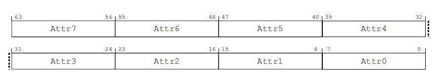
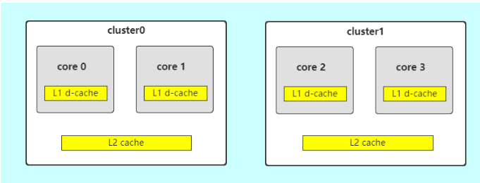
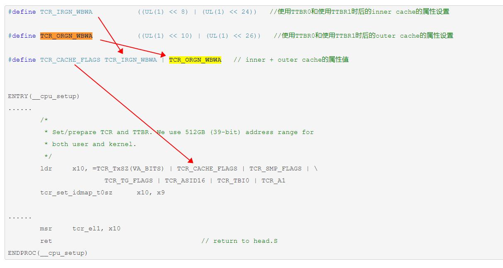
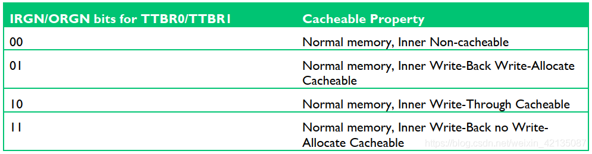
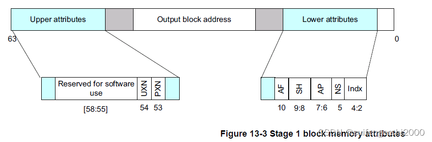

#  内存属性存放位置
MAIR_EL1, Memory Attribute Indirection Register

这个寄存器里面，可以放 8 个内存属性。

 
 
## 内存属性使用

然后 页表描述符  的  AttrIndx[2:0], bits[4:2]  来 做 index， 索引 使用 MAIR_EL1 中配置的内存属性。

内存属性 - 即描述一块内存的属性。

设备IO内存还是普通内存？


## 设备IO内存

对于device type，其总是**non cacheable的，而且是outer shareable**，因此它的attribute不多，主要有下面几种附加的特性：

（1）Gathering 或者non Gathering (G or nG)。这个特性表示对多个memory的访问是否可以合并，如果是nG，表示处理器必须严格按照代码中内存访问来进行，不能把两次访问合并成一次。例如：代码中有2次对同样的一个地址的读访问，那么处理器必须严格进行两次read transaction。

（2）Re-ordering (R or nR)。这个特性用来表示是否允许处理器对内存访问指令进行重排。nR表示必须严格执行program order。

（3）Early Write Acknowledgement (E or nE)。PE访问memory是有问有答的（更专业的术语叫做transaction），对于write而言，PE需要write ack操作以便确定完成一个write transaction。为了加快写的速度，系统的中间环节可能会设定一些write buffer。nE表示写操作的ack必须来自最终的目的地而不是中间的write buffer

## 普通内存属性

1) Non-shareable - 不共享。 core 0 的和 Core 1 的缓存都不共享。

2) Inner-shareable - 只在一个 cluster 内共享。 

3) outer-shareable - 可以在不同的cluster 之间共享

 
 

#  cpu_setup
// mm/proc.S

```
/* PTWs cacheable, inner/outer WBWA */
#define TCR_CACHE_FLAGS TCR_IRGN_WBWA | TCR_ORGN_WBWA
```

```
ENTRY(__cpu_setup)
        tlbi    vmalle1                         // Invalidate local TLB
        dsb     nsh

        mov     x0, #3 << 20
        msr     cpacr_el1, x0                   // Enable FP/ASIMD
        mov     x0, #1 << 12                    // Reset mdscr_el1 and disable
        msr     mdscr_el1, x0                   // access to the DCC from EL0
        isb                                     // Unmask debug exceptions now,
        enable_dbg                              // since this is per-cpu
        reset_pmuserenr_el0 x0                  // Disable PMU access from EL0
        /*
         * Memory region attributes for LPAE:
         *
         *   n = AttrIndx[2:0]
         *                      n       MAIR
         *   DEVICE_nGnRnE      000     00000000
         *   DEVICE_nGnRE       001     00000100
         *   DEVICE_GRE         010     00001100
         *   NORMAL_NC          011     01000100
         *   NORMAL             100     11111111
         *   NORMAL_WT          101     10111011
         */
        ldr     x5, =MAIR(0x00, MT_DEVICE_nGnRnE) | \
                     MAIR(0x04, MT_DEVICE_nGnRE) | \
                     MAIR(0x0c, MT_DEVICE_GRE) | \
                     MAIR(0x44, MT_NORMAL_NC) | \
                     MAIR(0xff, MT_NORMAL) | \
                     MAIR(0xbb, MT_NORMAL_WT)
        msr     mair_el1, x5
        /*
         * Prepare SCTLR
         */
        adr     x5, crval
        ldp     w5, w6, [x5]
        mrs     x0, sctlr_el1
        bic     x0, x0, x5                      // clear bits
        orr     x0, x0, x6                      // set bits
        /*
         * Set/prepare TCR and TTBR. We use 512GB (39-bit) address range for
         * both user and kernel.
         */
        ldr     x10, =TCR_TxSZ(VA_BITS) | TCR_CACHE_FLAGS | TCR_SMP_FLAGS | \
                        TCR_TG_FLAGS | TCR_ASID16 | TCR_TBI0 | TCR_A1
        tcr_set_idmap_t0sz      x10, x9

        /*
         * Read the PARange bits from ID_AA64MMFR0_EL1 and set the IPS bits in
         * TCR_EL1.
         */
        mrs     x9, ID_AA64MMFR0_EL1
        bfi     x10, x9, #32, #3
#ifdef CONFIG_ARM64_HW_AFDBM
        /*
         * Hardware update of the Access and Dirty bits.
         */
        mrs     x9, ID_AA64MMFR1_EL1
        and     x9, x9, #0xf
        cbz     x9, 2f
        cmp     x9, #2
        b.lt    1f
#ifdef CONFIG_ARM64_ERRATUM_1024718
        /* Disable hardware DBM on Cortex-A55 r0p0, r0p1 & r1p0 */
        cpu_midr_match MIDR_CORTEX_A55, MIDR_CPU_VAR_REV(0, 0), MIDR_CPU_VAR_REV(1, 0), x1, x2, x3, x4
        cbnz    x1, 1f
#endif
        orr     x10, x10, #TCR_HD               // hardware Dirty flag update
1:      orr     x10, x10, #TCR_HA               // hardware Access flag update
2:
#endif  /* CONFIG_ARM64_HW_AFDBM */
        msr     tcr_el1, x10
        ret                                     // return to head.S
ENDPROC(__cpu_setup)
```

1、设置inner/outer cache的属性(只写模式/回写模式/write allocate/No-write allocate)

如下代码所示，设置
 
 
 
 
 属性设置了1，也就是回写模式、write allocate模式
 
 
  
  
# ioremap

ARM64 cpu可以通过页表中设置的页表属性配置，决定其内存或寄存器访问行为（DEVICE_nGnRE/nGnRE/GRE、NORMAL_NC/WT/NORMAL）。

```

#define ioremap(addr, size)     __ioremap((addr), (size), __pgprot(PROT_DEVICE_nGnRE))
 
#define ioremap_nocache(addr, size)  __ioremap((addr), (size), __pgprot(PROT_DEVICE_nGnRE))
 
#define ioremap_wc(addr, size)  __ioremap((addr), (size), __pgprot(PROT_NORMAL_NC))
 
#define ioremap_wt(addr, size)  __ioremap((addr), (size), __pgprot(PROT_DEVICE_nGnRE))
 
 
#define PROT_DEVICE_nGnRnE  (PROT_DEFAULT | PTE_PXN | PTE_UXN | PTE_DIRTY | PTE_WRITE | PTE_ATTRIDX(MT_DEVICE_nGnRnE))
 
#define PROT_DEVICE_nGnRE  (PROT_DEFAULT | PTE_PXN | PTE_UXN | PTE_DIRTY | PTE_WRITE | PTE_ATTRIDX(MT_DEVICE_nGnRE))
 
#define PROT_NORMAL_NC  (PROT_DEFAULT | PTE_PXN | PTE_UXN | PTE_DIRTY | PTE_WRITE | PTE_ATTRIDX(MT_NORMAL_NC))
 
#define PROT_NORMAL_WT  (PROT_DEFAULT | PTE_PXN | PTE_UXN | PTE_DIRTY | PTE_WRITE | PTE_ATTRIDX(MT_NORMAL_WT))
 
#define PROT_NORMAL  (PROT_DEFAULT | PTE_PXN | PTE_UXN | PTE_DIRTY | PTE_WRITE | PTE_ATTRIDX(MT_NORMAL))
 
 
#define PTE_ATTRINDX(t)   (_AT(pteval_t, (t)) << 2
————————————————
 
```

```
/*
 * Mark the prot value as uncacheable and unbufferable.
 */
#define pgprot_noncached(prot) \
    __pgprot_modify(prot, PTE_ATTRINDX_MASK, PTE_ATTRINDX(MT_DEVICE_nGnRnE) | PTE_PXN | PTE_UXN)
#define pgprot_writecombine(prot) \
    __pgprot_modify(prot, PTE_ATTRINDX_MASK, PTE_ATTRINDX(MT_NORMAL_NC) | PTE_PXN | PTE_UXN)
#define pgprot_device(prot) \
    __pgprot_modify(prot, PTE_ATTRINDX_MASK, PTE_ATTRINDX(MT_DEVICE_nGnRE) | PTE_PXN | PTE_UXN
	
#define __pgprot_modify(prot,mask,bits) \
    __pgprot((pgprot_val(prot) & ~(mask)) | (bits))
```
  
  pgprot_noncached()是一个宏，它实际上禁止了相关页的cache和写缓冲(write buffer),另外一个稍微少的一些限制的宏是：
```
  #define pgprot_writecombine(prot)  __pgprot(pgprot_val (prot) & –L_PTE_CACHEABLE);    它则没有禁止写缓冲
```

PTE_ATTRINDX在页表中的位置 bit[4:2]

  
  
***关于使用页表的场景***：

1、内核代码中使用alloc_pages从伙伴系统内存中申请

2、设备驱动代码使用device-tree预留内存地址建立页表映射访问（内存或寄存器，使用ioremap较多）

```
    ioremap() / ioremap_wc()
 
    pci_iomap() ==> pci_iomap_range() ==> ioremap()
 
    pci_iomap_wc() ==> pci_iomap_wc_range() ==> ioremap_wc()
	
```

```
  arch/arm64/mm/dma-mapping.c  swiotlb_dma_ops
 
   __dma_alloc(dev, size, dma_handle, flags, attrs)
 
   prot = __get_dma_pgprot(attr, PAGE_KERNEL, false); PAGE_KERNEL = __pgprot(PROT_NORMAL)    
   coherent=false，prot最终修改为 PTE_ATTRINDX(MT_NORMAL_NC)
 
  ptr = __dma_alloc_coherent(dev, size, dma_handle, flags, attrs);
 
  coherent_ptr = dma_common_contiguous_remap(page, size, VM_USERMAP, prot, NULL)
 
       dma_common_pages_remap(pages, size, VM_USERMAP, prot, NULL); 建立NORMAL页
 ```


 
 # references
 
 [从0开始写一个微内核操作系统》5-页表映射](https://zhuanlan.zhihu.com/p/580154692)
 
 [如何设置MMU访问页表的属性](https://aijishu.com/a/1060000000361792)
 
 [聊聊SOC启动（十一） 内核初始化](https://zhuanlan.zhihu.com/p/522991248)
 
 [ARMv8(aarch64)页表建立过程详细分析](https://blog.csdn.net/qianlong4526888/article/details/9058221)
 
 [Linux paging_init解析](https://www.cnblogs.com/LoyenWang/p/11483948.html)
 
 [内核启动时为什么要做线性映射?](https://cloud.tencent.com/developer/article/2083623)
 
 [从零开始学内核: 虚拟内存映射](https://zhuanlan.zhihu.com/p/526359672)
 