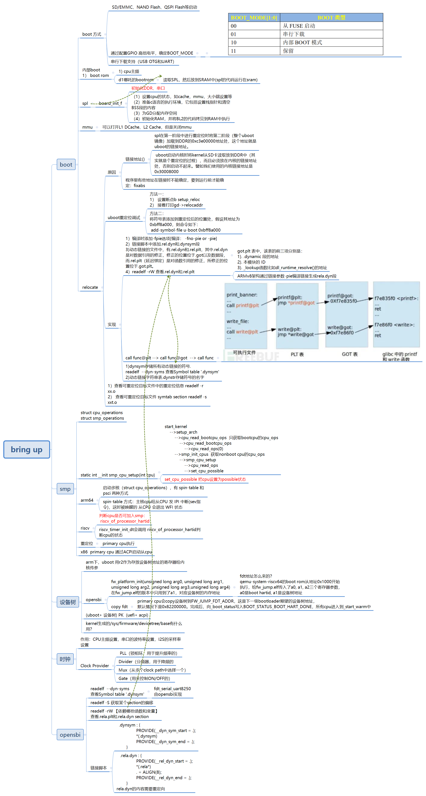

# bring up

在 Linux系统中,对于多核的ARM芯片而言,在Biotron代码中,每个CPU都会识别自身ID,如果ID是0,则引导Bootloader和 Linux内核执行,如果ID不是0,则Biotron一般在上电时将自身置于WFI或者WFE状态,并等待CPU0给其发CPU核间中断或事件(一般通过SEV指令)以唤醒它。
一个典型的多核 Linux启动过程如图所示。

# opensbi

opensbi-0.9/firmware/fw_base.S汇编文件正是opensbi的启动所在，.entry段_start符号即为链接脚本中第一个代码段，
上级loader程序加载完成后自然跳转到该地址指令执行。首先启动代码进行判断非boot核心跳转_wait_for_boot_hart等待，
boot核心先进行一次代码_relocate，可以发现如果opensbi如果不在自己的链接地址内运行，
则会实现自身代码的拷贝到目标ram上运行，**因此可以以类似spl的方式从flash中启动**。

当然我们因为已经使用了自己编写的loader程序，这段_relocate不会执行，之后的流程是.bss段的清零和SP指针的初始化。
接下来就是调用fw_platform_init函数，**注意此时传入参数a0——hart id，a1——fdt地址，a2，a3，a4均为上级loader程序的传入参数**，
这个函数由platform来实现如果不使用则该函数由弱定义空函数来代替，platform函数具体内容我们后面实现时再来看，此处暂时跳过。
接下来就是_scratch_init函数，scratch你可以认为就是另一个sp指针的东西，定义了一片内存用来存放一些数据，
同栈一样，先进后出。_**scratch_init其实是按顺序写入了sbi下一级程序的地址参数等信息，由工程内的预定于宏指定**，
其实这里对我们作用不大，因为我们使用设备树文件提供给opensbi来解析得到下一级启动地址等信息。在向下就是_fdt_reloc，
和代码reloc类似，对fdt进行，我们的设计不会执行到这个，最后来到了_start_warm，此时boot核心将标志释放，
其余等待在_wait_for_boot_hart的核心也将要跳转到_start_warm。_start_warm针对每一个核心复位寄存器建立自己的栈空间，
配置trap异常等完成后调用sbi_init离开汇编代码的世界，后面代码将使用容易理解的c代码进行编写了。到此启动文件也就分析完成，
先给出一个简单的流程图。
 
 
 

#  refercence

[SMP多核启动](https://www.cnblogs.com/linhaostudy/p/9371562.html)

[ARM WFI和WFE指令](http://www.wowotech.net/armv8a_arch/wfe_wfi.html)