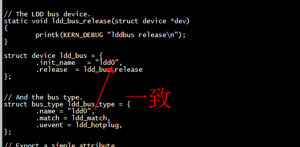
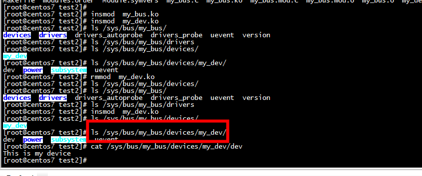
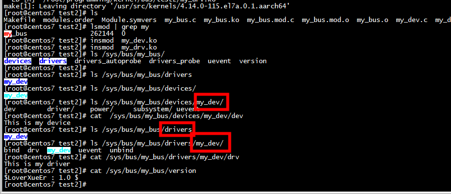
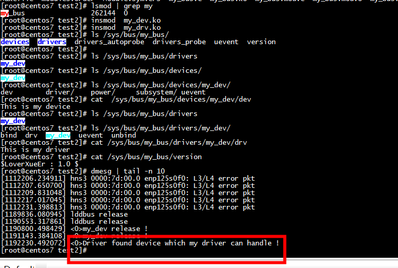

#  test1

```

// And the bus type.
struct bus_type ldd_bus_type = {
        .name = "ldd",
        .match = ldd_match,
        .uevent = ldd_hotplug,
};
```


```
[root@centos7 bus]# ls /sys/bus/ldd
devices  drivers  drivers_autoprobe  drivers_probe  uevent  version
[root@centos7 bus]# ls /sys/bus/ldd/drivers
[root@centos7 bus]# ls /sys/bus/ldd/devices/
[root@centos7 bus]# 
```

# test2



```
struct device ldd_bus = {
        .init_name   = "ldd0",
        .release  = ldd_bus_release
};


// And the bus type.
struct bus_type ldd_bus_type = {
        .name = "ldd0",
        .match = ldd_match,
        .uevent = ldd_hotplug,
};
```

```
[root@centos7 bus]# ls /sys/bus/ldd0/
devices  drivers  drivers_autoprobe  drivers_probe  uevent  version
[root@centos7 bus]# ls /sys/bus/ldd0/devices/
[root@centos7 bus]# ls /sys/bus/ldd0/drivers
[root@centos7 bus]# 
```


# test3

```
[root@centos7 test2]# cat /sys/bus/my_bus/version 
$LoverXueEr : 1.0 $
[root@centos7 test2]# 
```



```
[root@centos7 test2]# 
[root@centos7 test2]# insmod  my_bus.ko 
[root@centos7 test2]# insmod  my_dev.ko 
[root@centos7 test2]# ls /sys/bus/my_bus/
devices  drivers  drivers_autoprobe  drivers_probe  uevent  version
[root@centos7 test2]# ls /sys/bus/my_bus/drivers
[root@centos7 test2]# ls /sys/bus/my_bus/devices/
my_dev
[root@centos7 test2]# ls /sys/bus/my_bus/devices/my_dev/
dev  power  subsystem  uevent
[root@centos7 test2]# rmmod  my_dev.ko 
[root@centos7 test2]# ls /sys/bus/my_bus/devices/
[root@centos7 test2]# 
```





