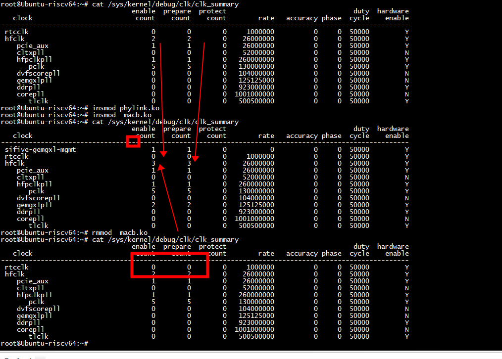

#  /sys/kernel/debug/clk/clk_summary
```
root@Ubuntu-riscv64:~# cat /sys/kernel/debug/clk/clk_summary
                                 enable  prepare  protect                                duty  hardware
   clock                          count    count    count        rate   accuracy phase  cycle    enable
-------------------------------------------------------------------------------------------------------
 rtcclk                               0        0        0     1000000          0     0  50000         Y
 hfclk                                2        2        0    26000000          0     0  50000         Y
    pcie_aux                          1        1        0    26000000          0     0  50000         Y
    cltxpll                           0        0        0    52000000          0     0  50000         N
    hfpclkpll                         1        1        0   260000000          0     0  50000         Y
       pclk                           5        5        0   130000000          0     0  50000         Y
    dvfscorepll                       0        0        0   104000000          0     0  50000         N
    gemgxlpll                         0        0        0   125125000          0     0  50000         N
    ddrpll                            0        0        0   923000000          0     0  50000         Y
    corepll                           0        0        0  1001000000          0     0  50000         N
       tlclk                          0        0        0   500500000          0     0  50000         Y
root@Ubuntu-riscv64:~# 
```

```
root@Ubuntu-riscv64:~# cat /sys/kernel/debug/clk/clk_summary
                                 enable  prepare  protect                                duty  hardware
   clock                          count    count    count        rate   accuracy phase  cycle    enable
-------------------------------------------------------------------------------------------------------
 rtcclk                               0        0        0     1000000          0     0  50000         Y
 hfclk                                2        2        0    26000000          0     0  50000         Y
    pcie_aux                          1        1        0    26000000          0     0  50000         Y
    cltxpll                           0        0        0    52000000          0     0  50000         N
    hfpclkpll                         1        1        0   260000000          0     0  50000         Y
       pclk                           5        5        0   130000000          0     0  50000         Y
    dvfscorepll                       0        0        0   104000000          0     0  50000         N
    gemgxlpll                         0        0        0   125125000          0     0  50000         N
    ddrpll                            0        0        0   923000000          0     0  50000         Y
    corepll                           0        0        0  1001000000          0     0  50000         N
       tlclk                          0        0        0   500500000          0     0  50000         Y
root@Ubuntu-riscv64:~# insmod phylink.ko 
root@Ubuntu-riscv64:~# insmod  macb.ko 
root@Ubuntu-riscv64:~# cat /sys/kernel/debug/clk/clk_summary
                                 enable  prepare  protect                                duty  hardware
   clock                          count    count    count        rate   accuracy phase  cycle    enable
-------------------------------------------------------------------------------------------------------
 sifive-gemgxl-mgmt                   1        1        0           0          0     0  50000         Y
 rtcclk                               0        0        0     1000000          0     0  50000         Y
 hfclk                                3        3        0    26000000          0     0  50000         Y  
    pcie_aux                          1        1        0    26000000          0     0  50000         Y
    cltxpll                           0        0        0    52000000          0     0  50000         N
    hfpclkpll                         1        1        0   260000000          0     0  50000         Y
       pclk                           5        5        0   130000000          0     0  50000         Y
    dvfscorepll                       0        0        0   104000000          0     0  50000         N
    gemgxlpll                         2        2        0   125125000          0     0  50000         Y
    ddrpll                            0        0        0   923000000          0     0  50000         Y
    corepll                           0        0        0  1001000000          0     0  50000         N
       tlclk                          0        0        0   500500000          0     0  50000         Y
root@Ubuntu-riscv64:~# rmmod  macb.ko                         
root@Ubuntu-riscv64:~# cat /sys/kernel/debug/clk/clk_summary
                                 enable  prepare  protect                                duty  hardware
   clock                          count    count    count        rate   accuracy phase  cycle    enable
-------------------------------------------------------------------------------------------------------
 rtcclk                               0        0        0     1000000          0     0  50000         Y
 hfclk                                2        2        0    26000000          0     0  50000         Y
    pcie_aux                          1        1        0    26000000          0     0  50000         Y
    cltxpll                           0        0        0    52000000          0     0  50000         N
    hfpclkpll                         1        1        0   260000000          0     0  50000         Y
       pclk                           5        5        0   130000000          0     0  50000         Y
    dvfscorepll                       0        0        0   104000000          0     0  50000         N
    gemgxlpll                         0        0        0   125125000          0     0  50000         N
    ddrpll                            0        0        0   923000000          0     0  50000         Y
    corepll                           0        0        0  1001000000          0     0  50000         N
       tlclk                          0        0        0   500500000          0     0  50000         Y
```





hifive-unmatched-a00.dts
   #define RTCCLK_FREQ               1000000

```
root@Ubuntu-riscv64:~# 
root@Ubuntu-riscv64:~# cat /sys/firmware/devicetree/base/soc/ethernet@10090000/clock-names
pclkhclk
root@Ubuntu-riscv64:~# ethtool eth0 | grep Speed
        Speed: 1000Mb/s
root@Ubuntu-riscv64:~# 

```

### 更改网速
```
root@Ubuntu-riscv64:~# ethtool eth0 | grep Speed
        Speed: 1000Mb/s
root@Ubuntu-riscv64:~# ethtool -s eth0 speed 10 duplex full autoneg off
root@Ubuntu-riscv64:~# ethtool eth0 | grep Speed
        Speed: 10Mb/s
root@Ubuntu-riscv64:~# cat /sys/firmware/devicetree/base/soc/ethernet@10090000/clock-names
pclkhclkroot@Ubuntu-riscv64:~# cat /sys/kernel/debug/clk/clk_summary
                                 enable  prepare  protect                                duty  hardware
   clock                          count    count    count        rate   accuracy phase  cycle    enable
-------------------------------------------------------------------------------------------------------
 sifive-gemgxl-mgmt                   1        1        0     2500000          0     0  50000         Y
 rtcclk                               0        0        0     1000000          0     0  50000         Y
 hfclk                                3        3        0    26000000          0     0  50000         Y
    pcie_aux                          1        1        0    26000000          0     0  50000         Y
    cltxpll                           0        0        0    52000000          0     0  50000         N
    hfpclkpll                         1        1        0   260000000          0     0  50000         Y
       pclk                           5        5        0   130000000          0     0  50000         Y
    dvfscorepll                       0        0        0   104000000          0     0  50000         N
    gemgxlpll                         2        2        0   125125000          0     0  50000         Y
    ddrpll                            0        0        0   923000000          0     0  50000         Y
    corepll                           0        0        0  1001000000          0     0  50000         N
       tlclk                          0        0        0   500500000          0     0  50000         Y
root@Ubuntu-riscv64:~# 
```


# clock

```
macb_init_hw 
  config = macb_mdc_clk_div(bp)
macb_mac_link_up
   macb_set_tx_clk
       clk_set_rate
```