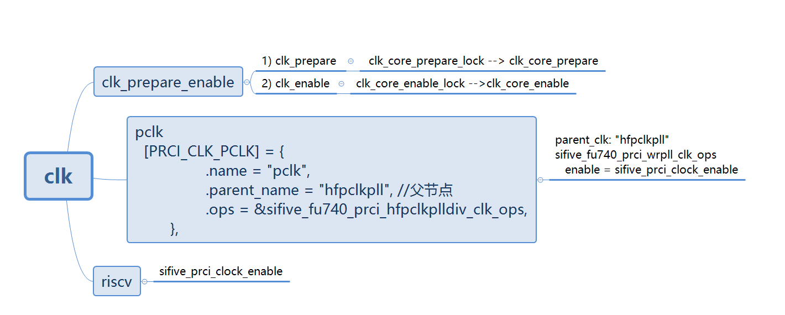

# coredump 

调试macb 驱动，读写寄存器的代码如下


系统挂掉了，原来读写gmac的寄存器依赖于pclk和***sifive-gemgxl-mgmt***,需要对mgmt的时钟进行初始化
 

```
4690         err = clk_init(pdev, &pclk, &hclk, &tx_clk, &rx_clk, &tsu_clk);
4691         if (err)
4692                 return err;
```

# 时钟树


```
root@Ubuntu-riscv64:~# cat /sys/kernel/debug/clk/clk_summary
                                 enable  prepare  protect                                duty  hardware
   clock                          count    count    count        rate   accuracy phase  cycle    enable
-------------------------------------------------------------------------------------------------------
 sifive-gemgxl-mgmt                   1        1        0           0          0     0  50000         Y
 rtcclk                               0        0        0     1000000          0     0  50000         Y
 hfclk                                3        3        0    26000000          0     0  50000         Y
    pcie_aux                          1        1        0    26000000          0     0  50000         Y
    cltxpll                           0        0        0    52000000          0     0  50000         N
    hfpclkpll                         1        1        0   260000000          0     0  50000         Y
       pclk                           5        5        0   130000000          0     0  50000         Y
    dvfscorepll                       0        0        0   104000000          0     0  50000         N
    gemgxlpll                         2        2        0   125125000          0     0  50000         Y
    ddrpll                            0        0        0   923000000          0     0  50000         Y
    corepll                           0        0        0  1001000000          0     0  50000         N
       tlclk                          0        0        0   500500000          0     0  50000         Y
```

## 设备树

```

        hfclk: hfclk {
                #clock-cells = <0>;
                compatible = "fixed-clock";
                clock-frequency = <26000000>;
                clock-output-names = "hfclk";
        };

        rtcclk: rtcclk {
                #clock-cells = <0>;
                compatible = "fixed-clock";
                clock-frequency = <RTCCLK_FREQ>;
                clock-output-names = "rtcclk";
        };
```

```
&eth0 {
        status = "okay";
        phy-mode = "gmii";
        phy-handle = <&phy0>;
        phy0: ethernet-phy@0 {
                reg = <0>;
        };
};
```

***clock controller 节点***
```

                prci: clock-controller@10000000 {
                        compatible = "sifive,fu740-c000-prci";
                        reg = <0x0 0x10000000 0x0 0x1000>;
                        clocks = <&hfclk>, <&rtcclk>;
                        #clock-cells = <1>;
                        #reset-cells = <1>;
                };
```



## 内核实现

```
static int clk_core_prepare(struct clk_core *core)
{
	int ret = 0;
 
	if (!core)
		return 0;
 
	if (core->prepare_count == 0) {
		ret = clk_core_prepare(core->parent);   //递归prepare父时钟，父时钟如果还有父时钟，逐个往上追溯
		if (ret)
			return ret;
 
		if (core->ops->prepare)
			ret = core->ops->prepare(core->hw); //prepare自己
 
		if (ret) {
			clk_core_unprepare(core->parent);
			return ret;
		}
	}
 
	core->prepare_count++;
 
	return 0;

```


```
static int clk_core_enable(struct clk_core *core)
{
	int ret = 0;
 
	if (!core)
		return 0;
 
	if (core->enable_count == 0) {
		ret = clk_core_enable(core->parent);       //递归使能父时钟，父时钟如果还有父时钟，逐个往上追溯
 
		if (ret)
			return ret;
 
		if (core->ops->enable)
			ret = core->ops->enable(core->hw);    //最后使能自己的时钟
 
		if (ret) {
			clk_core_disable(core->parent);
			return ret;
		}
	}
 
	core->enable_count++;
	return 0;

```


```
int sifive_prci_clock_enable(struct clk_hw *hw)
{
        struct __prci_clock *pc = clk_hw_to_prci_clock(hw);
        struct __prci_wrpll_data *pwd = pc->pwd;
        struct __prci_data *pd = pc->pd;
        pr_err("%s  clk %s of parent %s  \n",__func__, pc->name, pc->parent_name);
        if (sifive_clk_is_enabled(hw))
                return 0;

        __prci_wrpll_write_cfg1(pd, pwd, PRCI_COREPLLCFG1_CKE_MASK);

        if (pwd->disable_bypass)
                pwd->disable_bypass(pd);

        return 0;
}
```
重启之后的时钟树


加载macb模块之后的时钟树


insmod macb之前pclk的count 等于5, insmod macb之后pclk仍然等于5，pclk没有变化

***但是注册了sifive-gemgxl-mgmt***


# mgmt


****总结****

1、clk_prepare_enable函数最终分别调用了core->ops->prepare( )、core->ops->enable( )，core->ops 是在 clk_register 函数里初始化的。

2、内核使用 Common Clk Framework （CCF）框架，其作用是构建了一个时钟树结构，根时钟下有子时钟，子时钟可以再有子时钟。驱动使用统一的接口去使能一个时钟时，会先递归使能父时钟，然后再使能自己，最终效果是从根时钟开始使能直到叶子时钟使能结束。


