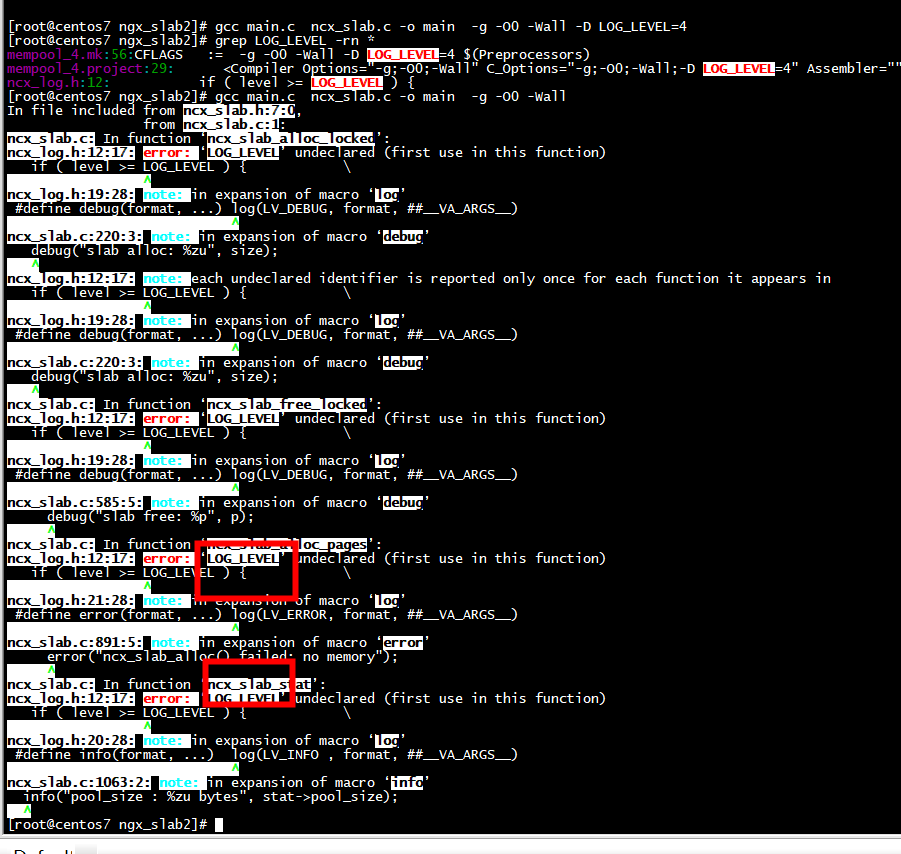

# make 定义macro变量

```
[root@centos7 ngx_slab2]# gcc main.c  ncx_slab.c -o main  -g -O0 -Wall -D LOG_LEVEL=4
[root@centos7 ngx_slab2]# grep LOG_LEVEL -rn *
ncx_log.h:12:           if ( level >= LOG_LEVEL ) {                                                                                             \
[root@centos7 ngx_slab2]# 
```

***没有加上-D LOG_LEVEL=4***

