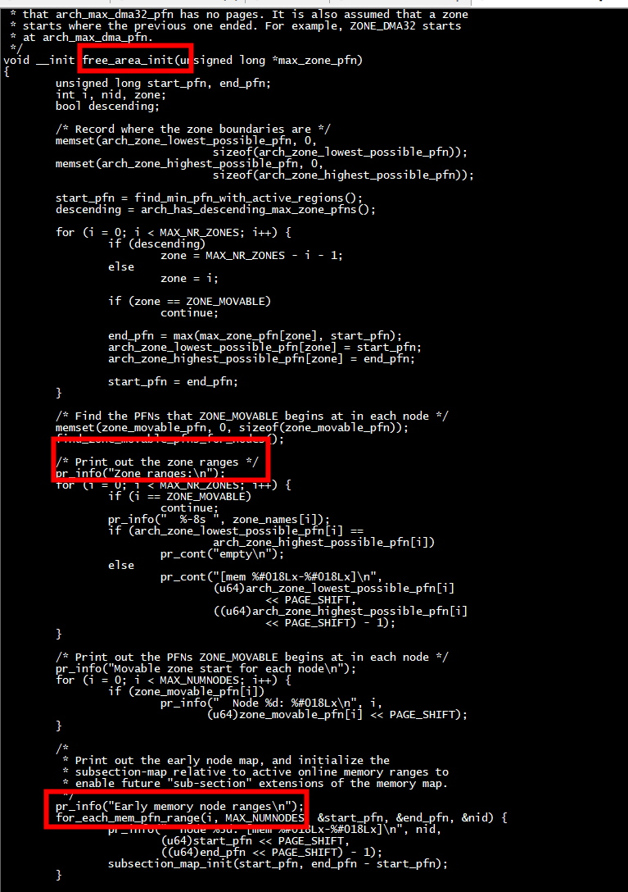
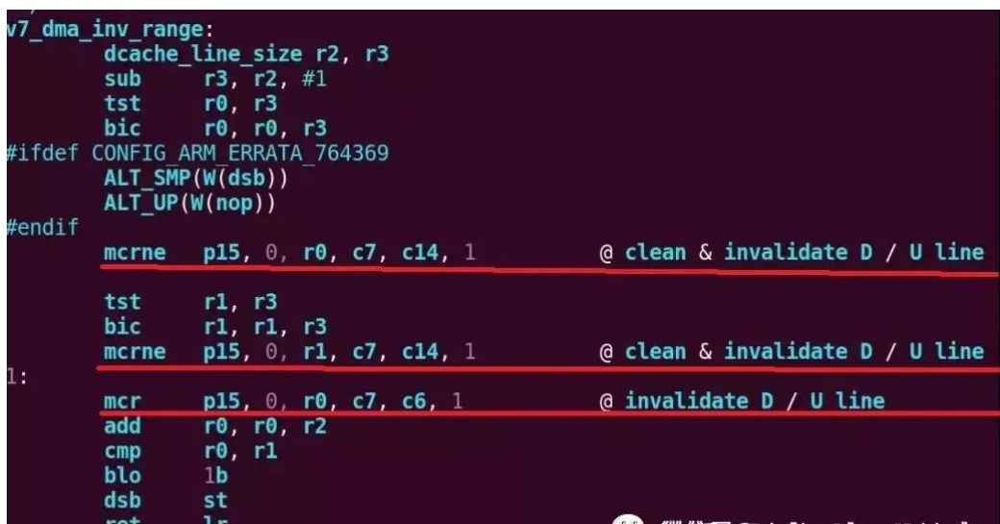

# CONFIG_ZONE_DMA32

```
grep CONFIG_ZONE_DMA32 .config
CONFIG_ZONE_DMA32=y
```

# free_area_init

```
[    0.000000][    T0] Zone ranges:
[    0.000000][    T0]   DMA32    [mem 0x0000000080200000-0x00000000ffffffff]
[    0.000000][    T0]   Normal   [mem 0x0000000100000000-0x000000027fffffff]
[    0.000000][    T0] Movable zone start for each node
[    0.000000][    T0] Early memory node ranges
[    0.000000][    T0]   node   0: [mem 0x0000000080200000-0x000000027fffffff]
[    0.000000][    T0] Initmem setup node 0 [mem 0x0000000080200000-0x000000027fffffff]
[    0.000000][    T0] On node 0, zone DMA32: 512 pages in unavailable ranges
```

DMA32    [mem 0x0000000080200000-0x00000000ffffffff]内存在dts配置1G、2G、8G内存的情况下都是一样的



# dma cache一致性

dma_map_single() -> (ops->map_page) ->arm_dma_map_page() -> __dma_page_cpu_to_dev() ->outer_inv_range() -> v7_dma_inv_range

```
ma_cache_maint_page会对映射地址空间调用dmac_map_area，该函数最终会调用到arch/arm/mm/cache-v7.S中v7处理器的cache处理函数v7_dma_map_area，如下：
/*
* dma_map_area(start, size, dir)
* - start - kernel virtual start address
* - size - size of region
* - dir - DMA direction
*/
ENTRY(v7_dma_map_area)
add r1, r1, r0
teq r2, #DMA_FROM_DEVICE
beq v7_dma_inv_range
b v7_dma_clean_range
ENDPROC(v7_dma_map_area)
```

指定方向为DMA_FROM_DEVICE，则v7_dma_inv_range无效掉该段地址cache。方向为DMA_TO_DEVICE，则v7_dma_clean_range写回该段地址cache。保证了cache数据一致性。
之后在___dma_page_cpu_to_dev中还对外部cache进行了刷新。


****C7主要是做cache****

```
[<c0017026>] (v7_dma_inv_range) from [<c0013e75>] (dma_cache_maint_page+0x6d/0xf0)
[<c0013e75>] (dma_cache_maint_page) from [<c0013f3b>] (arm_dma_map_page+0x43/0x50)
[<c0013f3b>] (arm_dma_map_page) from [<c001413b>] (arm_dma_map_sg+0x57/0xa0)
[<c001413b>] (arm_dma_map_sg) from [<c018fb3d>] (sun6i_spi_transfer_one+0x1dd/0x31c)
[<c018fb3d>] (sun6i_spi_transfer_one) from [<c018dab7>] (spi_transfer_one_message+0x47/0x13c)
[<c018dab7>] (spi_transfer_one_message) from [<c018d9b5>] (spi_pump_messages+0x20d/0x2c8)
[<c018d9b5>] (spi_pump_messages) from [<c00285a7>] (kthread_worker_fn+0x67/0xa0)
[<c00285a7>] (kthread_worker_fn) from [<c0028105>] (kthread+0x89/0xa0)
[<c0028105>] (kthread) from [<c000cddd>] (ret_from_fork+0x11/0x34)
```

