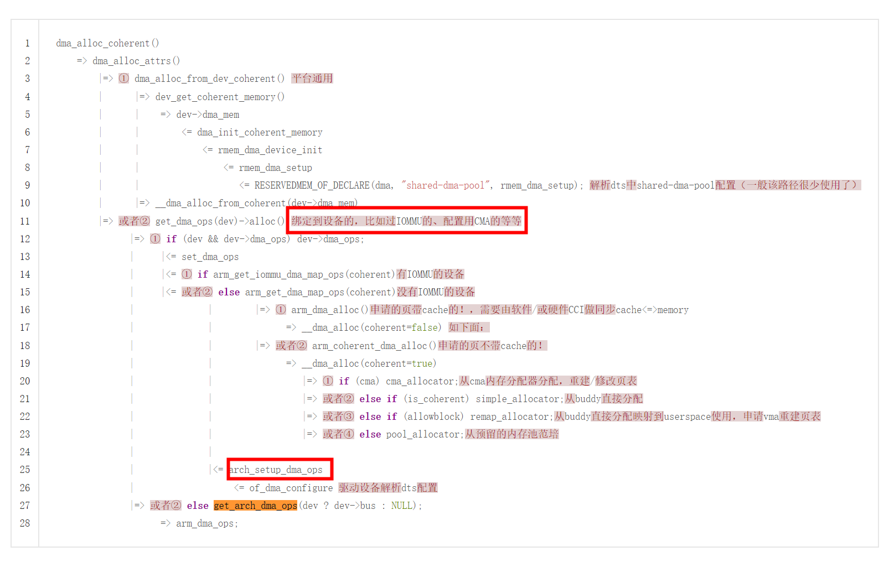
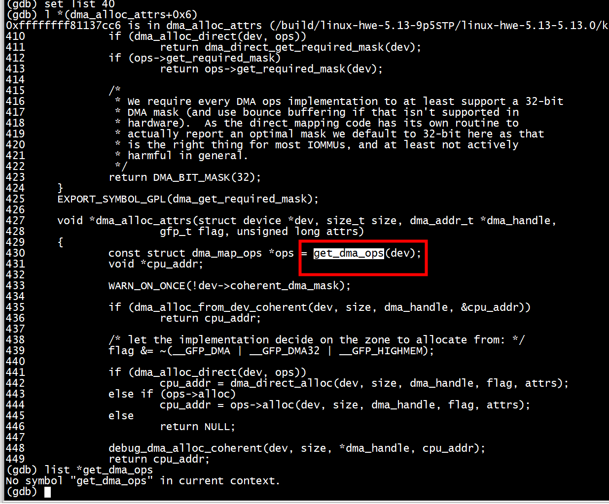
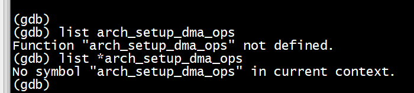
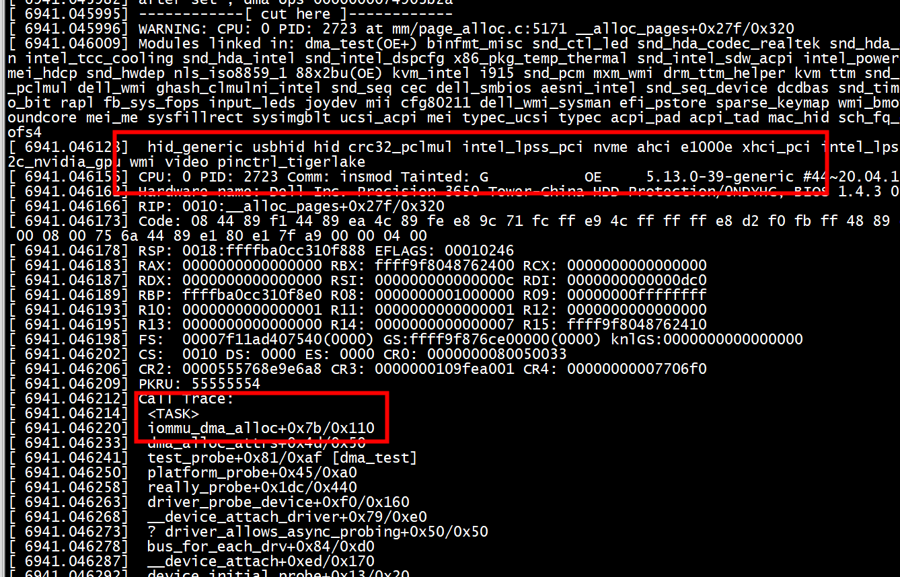

# os

```
uname -a
Linux ubuntux86 5.13.0-39-generic #44~20.04.1-Ubuntu SMP Thu Mar 24 16:43:35 UTC 2022 x86_64 x86_64 x86_64 GNU/Linux
```

# DMA

DMA在对内存的操作上与CPU是对等的  

早些时候DMA是通过物理地址直接访问连续的物理内存（DMA ZONE / CMA）  
有了IOMMU后DMA可以通过访问IOMMU转化的虚拟地址来使用不连续物理内存  
Cache Coherent（缓存一致性）  
dma cache的一致性有两个方向：  
① 指CPU从cache读到的内容是旧的，而memory内容的是新被DMA改写的。即，memory更新而cache没有invalid。  
② 指CPU写到cache的内容是新的，而DMA读到外设的memory内容是旧的。即，cache更新而没有flush到memory。  
#  DMA API
dma cache一致性解决主要靠两类API：  
① 一致性DMA缓冲区API：Coherent DMA buffers  
原理是：驱动自己申请memory，然后映射成uncached的，***即将PageTable中对应的页表项配置/修改成uncached属性***。  
dma_alloc_coherent() 它返回给CPU使用的内存虚拟地址，它申请的dma内存会被映射到vmalloc映射区。（与vmalloc/ioremap类似）  



***dma_mem一致性内存可以有2种方式提供***
##   从dts中memory-region索引的reserved-memory分配

***1) 创建***

      of_reserved_mem_device_init （要求reserved内存shared-dma-pool）  

      rmem_dma_ops.device_init() = rmem_dma_device_init 将reserved-memory内存一致性建页表（memremap(MEMREMAP_WC))并绑定到dev->dma_mem中。  

***2）分配 ***

      dma_alloc_coherent ==> dma_alloc_from_coherent即可从上述映射的一致性内存分配。  

过程如下：  

1、从系统内存分配物理地址和虚拟地址  

dma_alloc_coherent(dev, GFP_KERNEL | GFP_DMA) 可被中断  

dma_alloc_coherent(dev, GFP_ATOMIC) = pci_alloc_consistent 从预留的cma_pool分配，不可被中断  
  
上述直接调用方式只能从Iinux管理系统内存中动态分配  


### dts

```
 aaa_pgtable_reserved {
 
compatible = "shared-dma-pool";
 
reg = <0x1 0x10000000 0 0x200000>;
 
no-map;
 
};
 
 
bbb {
 
compatible = "xxxx"
 
reg = ...;
 
interrupts = ...;
 
interrupt-parent = ...;
 
memory_region = <&aaa_pgtable_reserved>;
 
}
```

***memory_region = <&aaa_pgtable_reserved>;***


### driver


```

...
#include <linux/of_reserved_mem.h>
...
 
static int xxx_dev_probe(struct device *dev, ...)
{
...
    dma_set_mask_and_coherent(dev, DMA_BIT_MASK(64));
    ret = of_reserved_mem_device_init(dev);
...
 
```

## 从dma-ranges中分配


dma-ranges = <0x02 0x0 0x0 0x0 0x0 0x40000000>;

初始化：
```

    of_dma_configure ==>

          of_dma_get_range

          arch_setup_dma_ops ==>

                  dev->archdata.dma_ops = &swiotlb_dma_ops;
```

分配一致性内存：
```
     dma_alloc_coherent ==>

        dma_alloc_attrs ==> 

             ops = get_dma_ops()    即swiotlb_dma_ops

             cpu_addr = ops->alloc()

                      __dma_alloc   ==>

                             __dma_alloc_coherent   ==>

                                    swiotlb_alloc_coherent ==>

                                         __get_free_pages() 
										 
```

##  dma_alloc_attrs


```
void *dma_alloc_attrs(struct device *dev, size_t size, dma_addr_t *dma_handle,
                gfp_t flag, unsigned long attrs)
{
        const struct dma_map_ops *ops = get_dma_ops(dev);
        void *cpu_addr;

        WARN_ON_ONCE(!dev->coherent_dma_mask);

        if (dma_alloc_from_dev_coherent(dev, size, dma_handle, &cpu_addr))
                return cpu_addr;

        /* let the implementation decide on the zone to allocate from: */
        flag &= ~(__GFP_DMA | __GFP_DMA32 | __GFP_HIGHMEM);

        if (dma_alloc_direct(dev, ops))
                cpu_addr = dma_direct_alloc(dev, size, dma_handle, flag, attrs);
        else if (ops->alloc)
                cpu_addr = ops->alloc(dev, size, dma_handle, flag, attrs);
        else
                return NULL;

        debug_dma_alloc_coherent(dev, size, *dma_handle, cpu_addr);
        return cpu_addr;
}
```



## dma_alloc_from_dev_coherent  设备一致性内存
```
int dma_alloc_from_dev_coherent(struct device *dev, ssize_t size,
		dma_addr_t *dma_handle, void **ret)
{
	struct dma_coherent_mem *mem = dev_get_coherent_memory(dev);

	if (!mem)
		return 0;

	*ret = __dma_alloc_from_coherent(dev, mem, size, dma_handle);
	return 1;
}
```
编译出错  
```
/work/kernel_learn/pla_sysfs/dma_test.c:154:24: error: ‘struct device’ has no member named ‘dma_mem’
  154 |          if (dev && dev->dma_mem)
      |                        ^~
/work/kernel_learn/pla_sysfs/dma_test.c:155:30: error: ‘struct device’ has no member named ‘dma_mem’
  155 |                    return dev->dma_mem;
```

```
struct device {
#ifdef CONFIG_DMA_DECLARE_COHERENT
        struct dma_coherent_mem *dma_mem; /* internal for coherent mem
                                             override */
#endif
#ifdef CONFIG_DMA_CMA
        struct cma *cma_area;           /* contiguous memory area for dma
                                           allocations */
#endif
        /* arch specific additions */
        struct dev_archdata     archdata
}
```


没有配置CONFIG_DMA_DECLARE_COHERENT   
```
root@ubuntux86:/work/linux-5.13# grep CONFIG_DMA_DECLARE_COHERENT  /boot/config-5.13.0-39-generic 
root@ubuntux86:/work/linux-5.13# 
```
没有配置CONFIG_DMA_DECLARE_COHERENT,dma_alloc_from_dev_coherent什么都不做   

```
#ifdef CONFIG_DMA_DECLARE_COHERENT
int dma_declare_coherent_memory(struct device *dev, phys_addr_t phys_addr,
                dma_addr_t device_addr, size_t size);
int dma_alloc_from_dev_coherent(struct device *dev, ssize_t size,
                dma_addr_t *dma_handle, void **ret);
int dma_release_from_dev_coherent(struct device *dev, int order, void *vaddr);
int dma_mmap_from_dev_coherent(struct device *dev, struct vm_area_struct *vma,
                void *cpu_addr, size_t size, int *ret);

void *dma_alloc_from_global_coherent(struct device *dev, ssize_t size,
                dma_addr_t *dma_handle);
int dma_release_from_global_coherent(int order, void *vaddr);
int dma_mmap_from_global_coherent(struct vm_area_struct *vma, void *cpu_addr,
                size_t size, int *ret);

#else
static inline int dma_declare_coherent_memory(struct device *dev,
                phys_addr_t phys_addr, dma_addr_t device_addr, size_t size)
{
        return -ENOSYS;
}
#define dma_alloc_from_dev_coherent(dev, size, handle, ret) (0)
#define dma_release_from_dev_coherent(dev, order, vaddr) (0)
#define dma_mmap_from_dev_coherent(dev, vma, vaddr, order, ret) (0)

static inline void *dma_alloc_from_global_coherent(struct device *dev,
                ssize_t size, dma_addr_t *dma_handle)
{
        return NULL;
}
static inline int dma_release_from_global_coherent(int order, void *vaddr)
{
        return 0;
}
static inline int dma_mmap_from_global_coherent(struct vm_area_struct *vma,
                void *cpu_addr, size_t size, int *ret)
{
        return 0;
}
#endif /* CONFIG_DMA_DECLARE_COHERENT */
```


## get_arch_dma_ops

```
arch/x86/include/asm/dma-mapping.h
#include <linux/scatterlist.h>
#include <asm/io.h>
#include <asm/swiotlb.h>

extern int iommu_merge;
extern int panic_on_overflow;

extern const struct dma_map_ops *dma_ops;

static inline const struct dma_map_ops *get_arch_dma_ops(struct bus_type *bus)
{
        return dma_ops;
}

#endif
```

# 不设置dma_ops 测试

```
static inline const struct dma_map_ops *test_get_dma_ops(struct device *dev)
{
                if (dev->dma_ops)
                                        return dev->dma_ops;
                        return get_arch_dma_ops(dev->bus);
}


static int test_probe(struct platform_device *pdev)
{
        printk("************* %s enter.\n", __func__);
        /* Force */
        pdev->dev.dma_ops = NULL;
        printk("dma ops %p \n", test_get_dma_ops(&pdev->dev));

        /* CMA Memory Allocate */
        bdev.cma_buffer = dma_alloc_coherent(&pdev->dev,
                                CMA_BUF_SIZE, &bdev.cma_addr, GFP_KERNEL);
        if (!bdev.cma_buffer) {
                printk("System Error: DMA Memory Allocate.\n");
                return -ENOMEM;
        }
        /* MISC */
        return misc_register(&test_dev);
}

```
结果
```
[10025.811219] ************* test_probe enter.
[10025.811226] dma ops 0000000000000000 
[10025.811240] System Error: DMA Memory Allocate.
```

# arch_setup_dma_ops

x86没有这个



arm64配置arch_setup_dma_ops
   
```
void of_dma_configure(struct device *dev, struct device_node *np)
{
	arch_setup_dma_ops(dev, dma_addr, size, iommu, coherent);
}
```

# x86 dma_ops
```
root@ubuntux86:/work/linux-5.13# cat /proc/kallsyms  | grep dma_ops
ffffffffa0985b90 T iommu_setup_dma_ops
ffffffffa0dcf13b t iommu_setup_dma_ops.cold
ffffffffa140d2c0 r gart_dma_ops
ffffffffa14ba0c0 R xen_swiotlb_dma_ops
ffffffffa14c8c60 r iommu_dma_ops
ffffffffa1906d7c r __ksymtab_dma_ops
ffffffffa1931655 r __kstrtab_dma_ops
ffffffffa1938823 r __kstrtabns_dma_ops
ffffffffa2673e80 B dma_ops
```

##  设置  iommu_dma_ops

```
 cat /proc/kallsyms  | grep iommu_dma_ops
ffffffffaf8c8c60 r iommu_dma_ops
```


