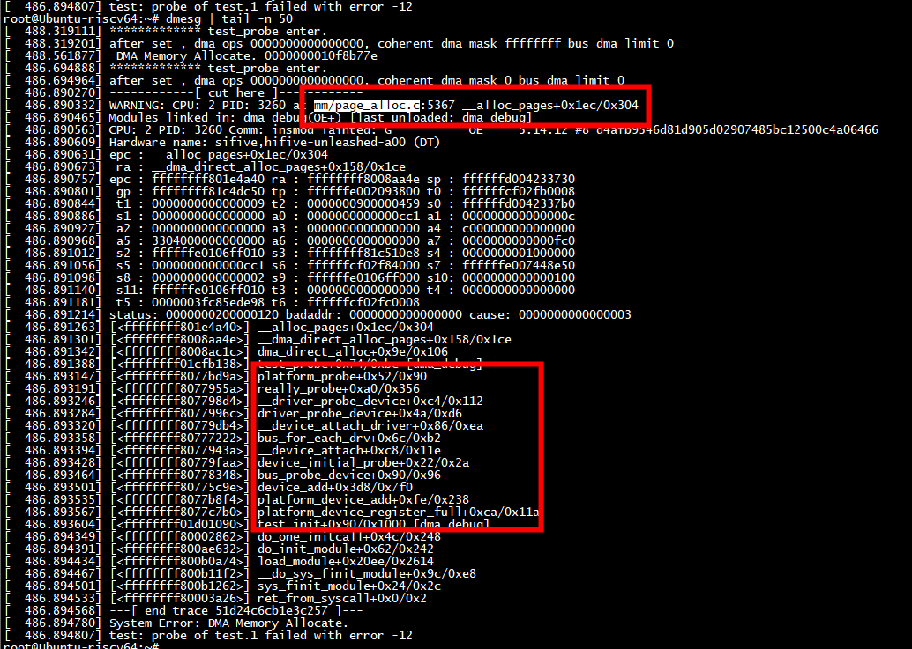

# os

```
root@Ubuntu-riscv64:~# uname -a
Linux Ubuntu-riscv64 5.14.12 #8 SMP PREEMPT Wed Mar 1 11:14:06 CST 2023 riscv64 riscv64 riscv64 GNU/Linux
root@Ubuntu-riscv64:~# 
```
# run

```
[  488.319111] ************* test_probe enter.
[  488.319201] after set , dma ops 0000000000000000, coherent_dma_mask ffffffff bus_dma_limit 0 
[  488.561877]  DMA Memory Allocate. 0000000010f8b77e
```

***coherent_dma_mask ffffffff***

# dma_direct_alloc的地址

```
root@Ubuntu-riscv64:~# cat /proc/kallsyms  | grep dma_direct_alloc
ffffffff8008a8f6 t __dma_direct_alloc_pages
ffffffff8008ab7e T dma_direct_alloc
ffffffff8008ad1a T dma_direct_alloc_pages
root@Ubuntu-riscv64:~# cat /proc/kallsyms  | grep  kallsyms_lookup_name
ffffffff800b167a T module_kallsyms_lookup_name
ffffffff800b22e0 T kallsyms_lookup_name
```

#  dma_go_direct


dma_go_direct 返回true

```
static bool dma_go_direct(struct device *dev, dma_addr_t mask,
		const struct dma_map_ops *ops)
{
	if (likely(!ops))
		return true;
#ifdef CONFIG_DMA_OPS_BYPASS
	if (dev->dma_ops_bypass)
		return min_not_zero(mask, dev->bus_dma_limit) >=
			    dma_direct_get_required_mask(dev);
#endif
	return false;
}


/*
 * Check if the devices uses a direct mapping for streaming DMA operations.
 * This allows IOMMU drivers to set a bypass mode if the DMA mask is large
 * enough.
 */
static inline bool dma_alloc_direct(struct device *dev,
		const struct dma_map_ops *ops)
{
	return dma_go_direct(dev, dev->coherent_dma_mask, ops);
}
```

# dma_coherent_ok

```
static bool dma_coherent_ok(struct device *dev, phys_addr_t phys, size_t size)
{
	dma_addr_t dma_addr = phys_to_dma_direct(dev, phys);
	if (dma_addr == DMA_MAPPING_ERROR)
		return false;
	return dma_addr + size - 1 <=
		min_not_zero(dev->coherent_dma_mask, dev->bus_dma_limit);
}
```

## mask = 0

```
         pdev->dev.coherent_dma_mask = 0;
        ops = test_get_dma_ops(&pdev->dev);
        printk("after set , dma ops %p, coherent_dma_mask %llx bus_dma_limit %llx \n", ops, pdev->dev.coherent_dma_mask, pdev->dev.bus_dma_limit);
```




## mask = 0xffff

```
printk("************* %s enter.\n", __func__);
         pdev->dev.coherent_dma_mask = 0xffff;
        ops = test_get_dma_ops(&pdev->dev);
        printk("after set , dma ops %p, coherent_dma_mask %llx bus_dma_limit %llx \n", ops, pdev->dev.coherent_dma_mask, pdev->dev.bus_dma_limit);
```

```
[  524.389349] ************* test_probe enter.
[  524.389445] after set , dma ops 0000000000000000, coherent_dma_mask ffff bus_dma_limit 0 
[  524.446698] System Error: DMA Memory Allocate.
[  524.446777] test: probe of test.1 failed with error -12
```
分配内存失败