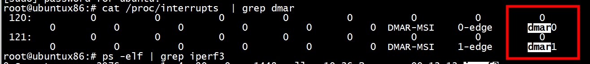

#  request_irq



drivers/iommu/intel/dmar.c

```C
int dmar_set_interrupt(struct intel_iommu *iommu)
{
        int irq, ret;

        /*
         * Check if the fault interrupt is already initialized.
         */
        if (iommu->irq)
                return 0;

        irq = dmar_alloc_hwirq(iommu->seq_id, iommu->node, iommu);
        if (irq > 0) {
                iommu->irq = irq;
        } else {
                pr_err("No free IRQ vectors\n");
                return -EINVAL;
        }

        ret = request_irq(irq, dmar_fault, IRQF_NO_THREAD, iommu->name, iommu);
        if (ret)
                pr_err("Can't request irq\n");
        return ret;
}
```