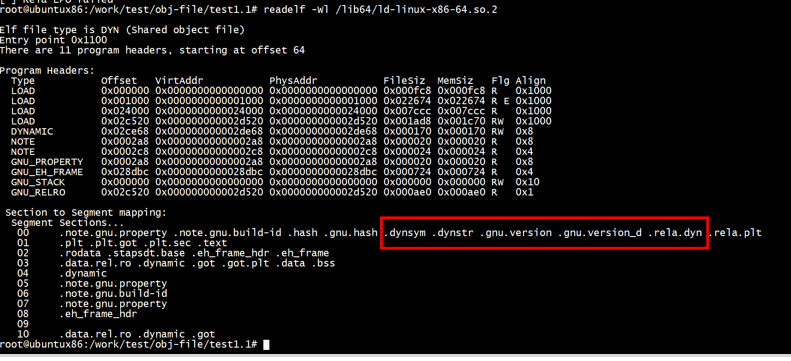
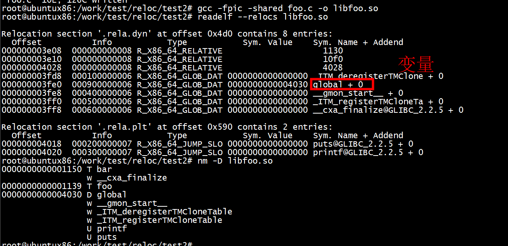
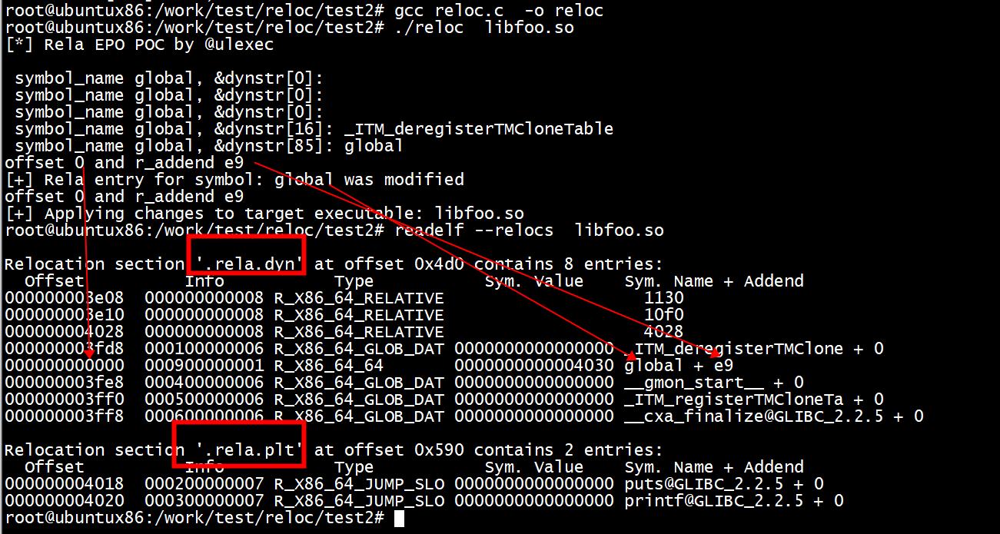
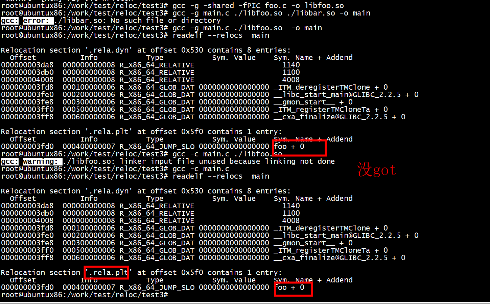
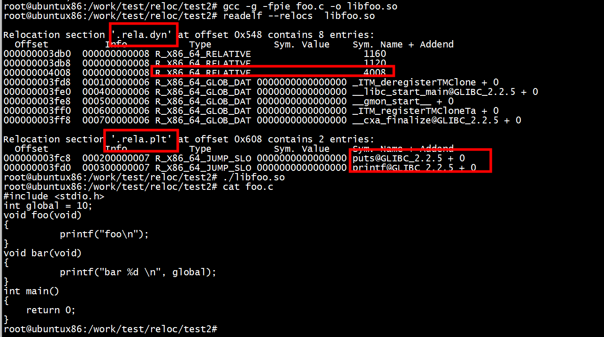
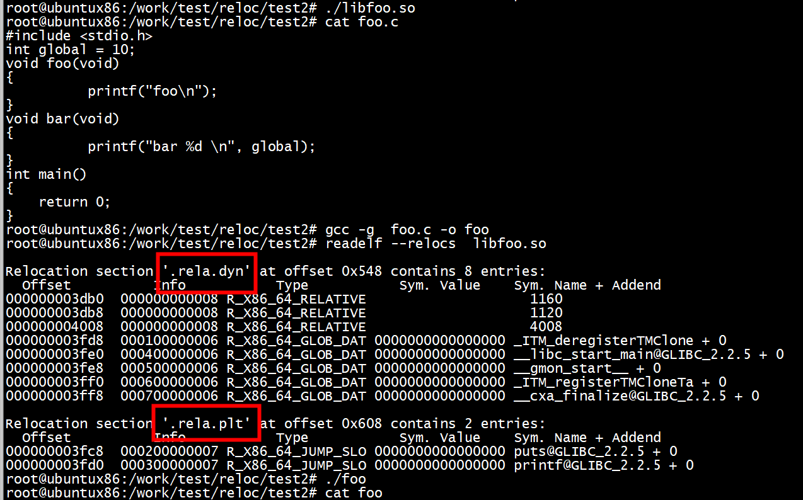

# 动态链接库

 gcc -fpic -shared foo.c -o libfoo.so



## libfoo
``` 

readelf --relocs libfoo.so 

Relocation section '.rela.dyn' at offset 0x4d0 contains 8 entries:
  Offset          Info           Type           Sym. Value    Sym. Name + Addend
000000003e08  000000000008 R_X86_64_RELATIVE                    1130
000000003e10  000000000008 R_X86_64_RELATIVE                    10f0
000000004028  000000000008 R_X86_64_RELATIVE                    4028
000000003fd8  000100000006 R_X86_64_GLOB_DAT 0000000000000000 _ITM_deregisterTMClone + 0
000000003fe0  000900000006 R_X86_64_GLOB_DAT 0000000000004030 global + 0
000000003fe8  000400000006 R_X86_64_GLOB_DAT 0000000000000000 __gmon_start__ + 0
000000003ff0  000500000006 R_X86_64_GLOB_DAT 0000000000000000 _ITM_registerTMCloneTa + 0
000000003ff8  000600000006 R_X86_64_GLOB_DAT 0000000000000000 __cxa_finalize@GLIBC_2.2.5 + 0

Relocation section '.rela.plt' at offset 0x590 contains 2 entries:
  Offset          Info           Type           Sym. Value    Sym. Name + Addend
000000004018  000200000007 R_X86_64_JUMP_SLO 0000000000000000 puts@GLIBC_2.2.5 + 0
000000004020  000300000007 R_X86_64_JUMP_SLO 0000000000000000 printf@GLIBC_2.2.5 + 0
```
***看不到foo 和bar***



```
root@ubuntux86:/work/test/obj-file/test1.1# readelf -S libfoo.so 
There are 30 section headers, starting at offset 0x37e0:

Section Headers:
  [Nr] Name              Type             Address           Offset
       Size              EntSize          Flags  Link  Info  Align
  [ 0]                   NULL             0000000000000000  00000000
       0000000000000000  0000000000000000           0     0     0
  [ 1] .note.gnu.propert NOTE             00000000000002a8  000002a8
       0000000000000020  0000000000000000   A       0     0     8
  [ 2] .note.gnu.build-i NOTE             00000000000002c8  000002c8
       0000000000000024  0000000000000000   A       0     0     4
  [ 3] .gnu.hash         GNU_HASH         00000000000002f0  000002f0
       0000000000000028  0000000000000000   A       4     0     8
  [ 4] .dynsym           DYNSYM           0000000000000318  00000318
       00000000000000c0  0000000000000018   A       5     1     8
  [ 5] .dynstr           STRTAB           00000000000003d8  000003d8
       0000000000000078  0000000000000000   A       0     0     1
  [ 6] .gnu.version      VERSYM           0000000000000450  00000450
       0000000000000010  0000000000000002   A       4     0     2
  [ 7] .gnu.version_r    VERNEED          0000000000000460  00000460
       0000000000000020  0000000000000000   A       5     1     8
  [ 8] .rela.dyn         RELA             0000000000000480  00000480
       00000000000000a8  0000000000000018   A       4     0     8
  [ 9] .rela.plt         RELA             0000000000000528  00000528
       0000000000000018  0000000000000018  AI       4    23     8
  [10] .init             PROGBITS         0000000000001000  00001000
       000000000000001b  0000000000000000  AX       0     0     4
  [11] .plt              PROGBITS         0000000000001020  00001020
       0000000000000020  0000000000000010  AX       0     0     16
  [12] .plt.got          PROGBITS         0000000000001040  00001040
       0000000000000010  0000000000000010  AX       0     0     16
  [13] .plt.sec          PROGBITS         0000000000001050  00001050
       0000000000000010  0000000000000010  AX       0     0     16
  [14] .text             PROGBITS         0000000000001060  00001060
       00000000000000e7  0000000000000000  AX       0     0     16
  [15] .fini             PROGBITS         0000000000001148  00001148
       000000000000000d  0000000000000000  AX       0     0     4
  [16] .rodata           PROGBITS         0000000000002000  00002000
       0000000000000008  0000000000000000   A       0     0     1
  [17] .eh_frame_hdr     PROGBITS         0000000000002008  00002008
       0000000000000034  0000000000000000   A       0     0     4
  [18] .eh_frame         PROGBITS         0000000000002040  00002040
       00000000000000b4  0000000000000000   A       0     0     8
  [19] .init_array       INIT_ARRAY       0000000000003e10  00002e10
       0000000000000008  0000000000000008  WA       0     0     8
  [20] .fini_array       FINI_ARRAY       0000000000003e18  00002e18
       0000000000000008  0000000000000008  WA       0     0     8
  [21] .dynamic          DYNAMIC          0000000000003e20  00002e20
       00000000000001c0  0000000000000010  WA       5     0     8
  [22] .got              PROGBITS         0000000000003fe0  00002fe0
       0000000000000020  0000000000000008  WA       0     0     8
  [23] .got.plt          PROGBITS         0000000000004000  00003000
       0000000000000020  0000000000000008  WA       0     0     8
  [24] .data             PROGBITS         0000000000004020  00003020
       0000000000000008  0000000000000000  WA       0     0     8
  [25] .bss              NOBITS           0000000000004028  00003028
       0000000000000008  0000000000000000  WA       0     0     1
  [26] .comment          PROGBITS         0000000000000000  00003028
       000000000000002b  0000000000000001  MS       0     0     1
  [27] .symtab           SYMTAB           0000000000000000  00003058
       00000000000004f8  0000000000000018          28    46     8
  [28] .strtab           STRTAB           0000000000000000  00003550
       000000000000017e  0000000000000000           0     0     1
  [29] .shstrtab         STRTAB           0000000000000000  000036ce
       000000000000010d  0000000000000000           0     0     1
Key to Flags:
  W (write), A (alloc), X (execute), M (merge), S (strings), I (info),
  L (link order), O (extra OS processing required), G (group), T (TLS),
  C (compressed), x (unknown), o (OS specific), E (exclude),
  l (large), p (processor specific)
```


### nm -D

```
nm -D libfoo.so 
0000000000001150 T bar
                 w __cxa_finalize
0000000000001139 T foo
0000000000004030 D global
                 w __gmon_start__
                 w _ITM_deregisterTMCloneTable
                 w _ITM_registerTMCloneTable
                 U printf
                 U puts
```

# ./reloc  libfoo.so 



# test2

gcc -g -shared -fPIC foo.c -o libfoo.so
gcc -g main.c ./libfoo.so  -o main





# gcc -g -fpie foo.c -o libfoo.so


```
#include <stdio.h>
int global = 10;
void foo(void)
{
          printf("foo\n");
}
void bar(void)
{
          printf("bar %d \n", global);
}
```

```
 gcc -g -fpie foo.c -o libfoo.so
/usr/bin/ld: /usr/lib/gcc/x86_64-linux-gnu/9/../../../x86_64-linux-gnu/Scrt1.o: in function `_start':
(.text+0x24): undefined reference to `main'
collect2: error: ld returned 1 exit status
```
```
#include <stdio.h>
int global = 10;
void foo(void)
{
          printf("foo\n");
}
void bar(void)
{
          printf("bar %d \n", global);
}
int main()
{
    return 0;
}
```




# refercens

[Dynamic Linking Relocation](http://www.cjwind.io/Dynamic-Linking-Relocation/)