# Example on how to import code from an object file without linking

1. Compile, but not link `obj.c`:

```bash
$ gcc -c obj.c
```

2. Compile and link `loader.c`:

```bash
$ gcc -o loader loader.c
```

3. Execute `loader` (`obj.o` has to be present in the same directory):

```bash
$ ./loader 
Executing add5...
add5(42) = 47
Executing add10...
add10(42) = 52
```

# ELF segments and sections

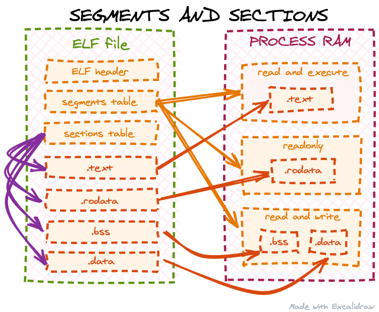

## Object file segments
Furthermore, object files do not contain any segments at all: an object file is not meant to be directly loaded by the OS. Instead, it is assumed it will be linked with some other code, so ELF segments are usually generated by the linker, not the compiler. We can check this by using the readelf command:


```
readelf --segments obj.o

There are no program headers in this file.
```
## Object file sections

The same readelf command can be used to get all the sections from our object file:

```
readelf --sections obj.o
There are 11 section headers, starting at offset 0x2a8:

Section Headers:
  [Nr] Name              Type             Address           Offset
       Size              EntSize          Flags  Link  Info  Align
  [ 0]                   NULL             0000000000000000  00000000
       0000000000000000  0000000000000000           0     0     0
  [ 1] .text             PROGBITS         0000000000000000  00000040
       0000000000000030  0000000000000000  AX       0     0     4
  [ 2] .data             PROGBITS         0000000000000000  00000070
       0000000000000000  0000000000000000  WA       0     0     1
  [ 3] .bss              NOBITS           0000000000000000  00000070
       0000000000000000  0000000000000000  WA       0     0     1
  [ 4] .comment          PROGBITS         0000000000000000  00000070
       000000000000002e  0000000000000001  MS       0     0     1
  [ 5] .note.GNU-stack   PROGBITS         0000000000000000  0000009e
       0000000000000000  0000000000000000           0     0     1
  [ 6] .eh_frame         PROGBITS         0000000000000000  000000a0
       0000000000000048  0000000000000000   A       0     0     8
  [ 7] .rela.eh_frame    RELA             0000000000000000  00000220
       0000000000000030  0000000000000018   I       8     6     8
  [ 8] .symtab           SYMTAB           0000000000000000  000000e8
       0000000000000120  0000000000000018           9    10     8
  [ 9] .strtab           STRTAB           0000000000000000  00000208
       0000000000000018  0000000000000000           0     0     1
  [10] .shstrtab         STRTAB           0000000000000000  00000250
       0000000000000054  0000000000000000           0     0     1
Key to Flags:
  W (write), A (alloc), X (execute), M (merge), S (strings), I (info),
  L (link order), O (extra OS processing required), G (group), T (TLS),
  C (compressed), x (unknown), o (OS specific), E (exclude),
  p (processor specific)
```

## reloc section
```
readelf --relocs obj.o

Relocation section '.rela.eh_frame' at offset 0x220 contains 2 entries:
  Offset          Info           Type           Sym. Value    Sym. Name + Addend
00000000001c  000200000105 R_AARCH64_PREL32  0000000000000000 .text + 0
000000000034  000200000105 R_AARCH64_PREL32  0000000000000000 .text + 18
```

## .symtab section

```
readelf --symbols obj.o

Symbol table '.symtab' contains 12 entries:
   Num:    Value          Size Type    Bind   Vis      Ndx Name
     0: 0000000000000000     0 NOTYPE  LOCAL  DEFAULT  UND 
     1: 0000000000000000     0 FILE    LOCAL  DEFAULT  ABS obj.c
     2: 0000000000000000     0 SECTION LOCAL  DEFAULT    1 
     3: 0000000000000000     0 SECTION LOCAL  DEFAULT    2 
     4: 0000000000000000     0 SECTION LOCAL  DEFAULT    3 
     5: 0000000000000000     0 NOTYPE  LOCAL  DEFAULT    1 $x
     6: 0000000000000000     0 SECTION LOCAL  DEFAULT    5 
     7: 0000000000000014     0 NOTYPE  LOCAL  DEFAULT    6 $d
     8: 0000000000000000     0 SECTION LOCAL  DEFAULT    6 
     9: 0000000000000000     0 SECTION LOCAL  DEFAULT    4 
    10: 0000000000000000    24 FUNC    GLOBAL DEFAULT    1 add5
    11: 0000000000000018    24 FUNC    GLOBAL DEFAULT    1 add10
```

##  relocs  section

```
root@ubuntux86:/work/test/obj-file/1#  readelf --relocs obj.o

Relocation section '.rela.eh_frame' at offset 0x230 contains 2 entries:
  Offset          Info           Type           Sym. Value    Sym. Name + Addend
000000000020  000200000002 R_X86_64_PC32     0000000000000000 .text + 0
000000000040  000200000002 R_X86_64_PC32     0000000000000000 .text + 13
root@ubuntux86:/work/test/obj-file/1# 
```

# Finding and executing a function from an object file
Given what we have learned so far, let’s define a plan on how to proceed to import and execute a function from an object file:

1) Find the ELF sections table and .shstrtab section (we need .shstrtab later to lookup sections in the section table by name).

2) Find the .symtab and .strtab sections (we need .strtab to lookup symbols by name in .symtab).

3) Find the .text section and copy it into RAM with executable permissions.

4) Find add5 and add10 function offsets from the .symtab.

5) Execute add5 and add10 functions.

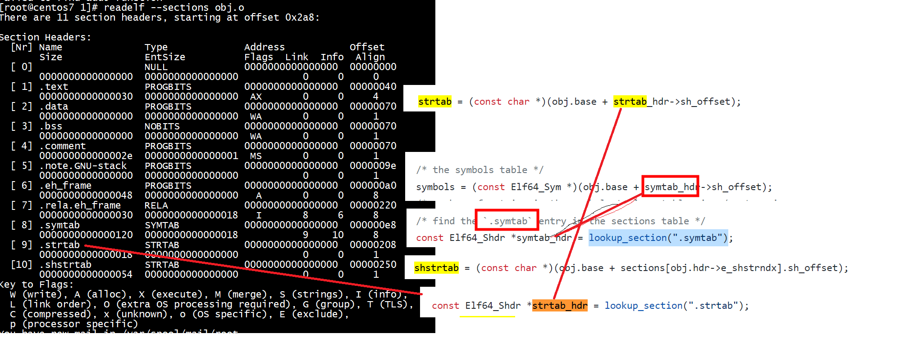

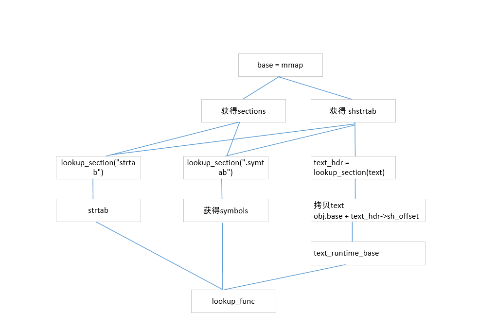


# test2

```
 cat obj.c
 
int add5(int num)
{
            return num + 5;
}
 
int add10(int num)
{
    num = add5(num);
    return add5(num);
}
```


```
root@ubuntux86:/work/test/obj-file/1# gcc loader.c  -o loader
root@ubuntux86:/work/test/obj-file/1# ./loader 
Executing add5...
add5(42) = 47
Executing add10...
add10(42) = 42
```

***为什么add10(42) = 42而不是52***

##  relocs  section
```
root@ubuntux86:/work/test/obj-file/test1.1#  readelf --relocs obj.o

Relocation section '.rela.text' at offset 0x240 contains 2 entries:
  Offset          Info           Type           Sym. Value    Sym. Name + Addend
000000000028  000900000004 R_X86_64_PLT32    0000000000000000 add5 - 4
000000000035  000900000004 R_X86_64_PLT32    0000000000000000 add5 - 4

Relocation section '.rela.eh_frame' at offset 0x270 contains 2 entries:
  Offset          Info           Type           Sym. Value    Sym. Name + Addend
000000000020  000200000002 R_X86_64_PC32     0000000000000000 .text + 0
000000000040  000200000002 R_X86_64_PC32     0000000000000000 .text + 13
root@ubuntux86:/work/test/obj-file/test1.1# 
```
***多了个rela.text,而且add5出现了两次***


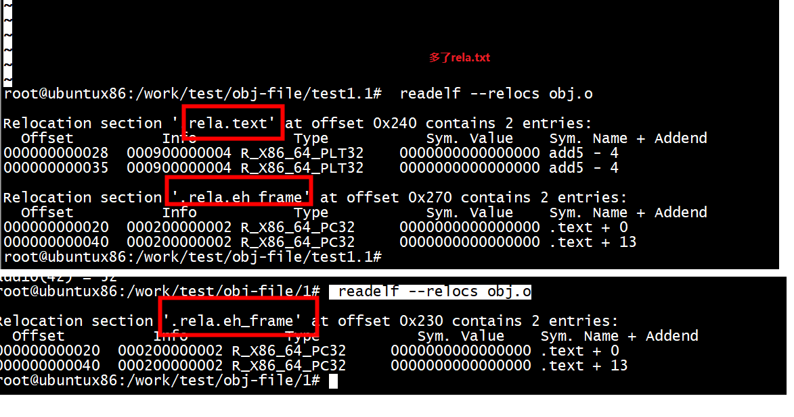

```
root@ubuntux86:/work/test/obj-file/1# cat obj.c 
int add5(int num)
{
            return num + 5;
}
 
int add10(int num)
{
    num = add5(num);
    return add5(num);
}
root@ubuntux86:/work/test/obj-file/1# gcc -c obj.c  
root@ubuntux86:/work/test/obj-file/1#  objdump --disassemble --section=.text obj.o

obj.o:     file format elf64-x86-64


Disassembly of section .text:

0000000000000000 <add5>:
   0:   f3 0f 1e fa             endbr64 
   4:   55                      push   %rbp
   5:   48 89 e5                mov    %rsp,%rbp
   8:   89 7d fc                mov    %edi,-0x4(%rbp)
   b:   8b 45 fc                mov    -0x4(%rbp),%eax
   e:   83 c0 05                add    $0x5,%eax
  11:   5d                      pop    %rbp
  12:   c3                      retq   

0000000000000013 <add10>:
  13:   f3 0f 1e fa             endbr64 
  17:   55                      push   %rbp
  18:   48 89 e5                mov    %rsp,%rbp
  1b:   48 83 ec 08             sub    $0x8,%rsp
  1f:   89 7d fc                mov    %edi,-0x4(%rbp)
  22:   8b 45 fc                mov    -0x4(%rbp),%eax
  25:   89 c7                   mov    %eax,%edi
  27:   e8 00 00 00 00          callq  2c <add10+0x19>
  2c:   89 45 fc                mov    %eax,-0x4(%rbp)
  2f:   8b 45 fc                mov    -0x4(%rbp),%eax
  32:   89 c7                   mov    %eax,%edi
  34:   e8 00 00 00 00          callq  39 <add10+0x26>
  39:   c9                      leaveq 
```

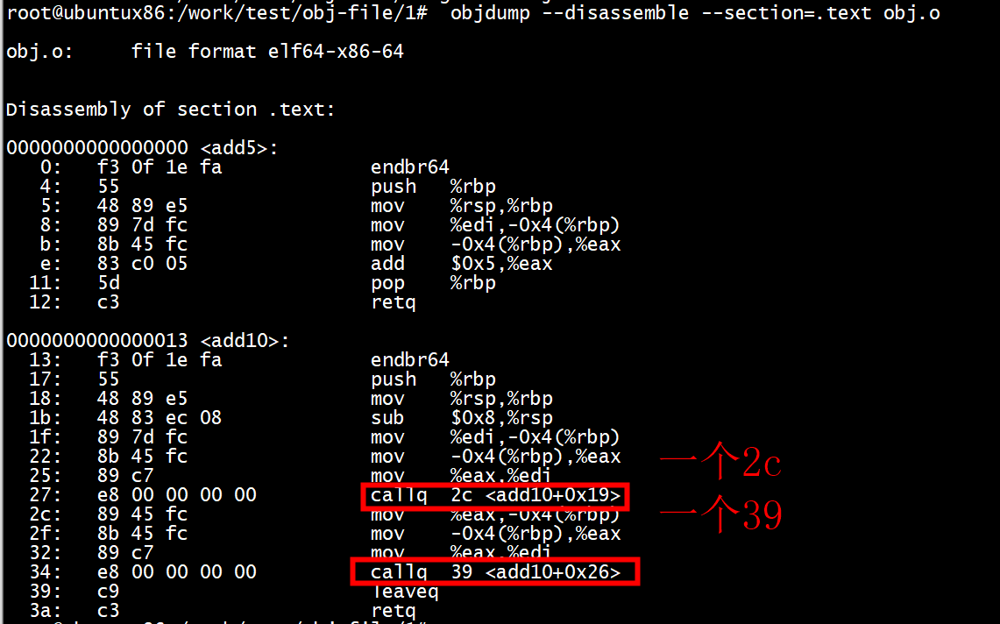

### 解决方法1

```
>>> a=0
>>> b=0x2c
>>> print('0x%x'%(a-b))
0x-2c
>>> def hex2(a):
...     return a>0 and hex(a) or hex(a&0xffffffff)
... 
>>> hex2(a-b)
'0xffffffd4'
>>> b=0x39
>>> hex2(a-b)
'0xffffffc7'
>>> 
```
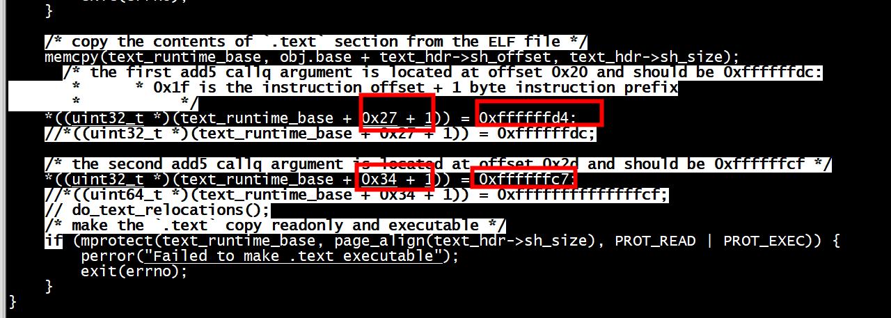

```
root@ubuntux86:/work/test/obj-file/test1.1# gcc loader.c  -o loader
root@ubuntux86:/work/test/obj-file/test1.1# ./loader 
Executing add5...
add5(42) = 47
Executing add10...
add10(42) = 52
```

### 解决方法2

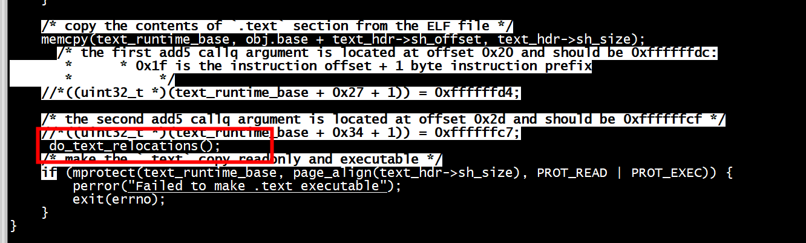

```
root@ubuntux86:/work/test/obj-file/test1.1# gcc loader.c  -o loader
root@ubuntux86:/work/test/obj-file/test1.1# ./loader 
Executing add5...
add5(42) = 47
Executing add10...
add10(42) = 52
root@ubuntux86:
```

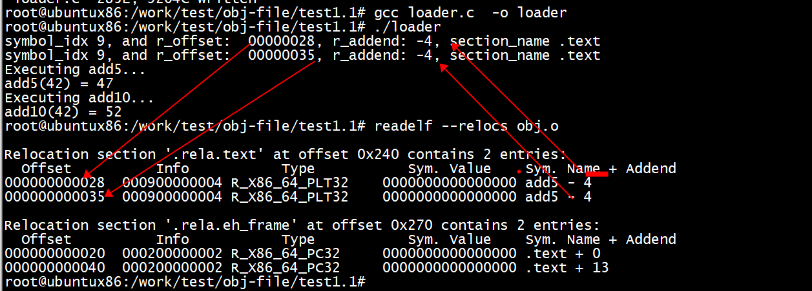


添加patch_offset输出
```
root@ubuntux86:/work/test/obj-file/test1.1# vim loader.c 
static void do_text_relocations(void)
{
        switch (type)
        {
        case R_X86_64_PC32:
            /* S + A - P, 32 bit output, S == L here */
        case R_X86_64_PLT32:
            /* L + A - P, 32 bit output */
            *((uint32_t *)patch_offset) = symbol_address + relocations[i].r_addend - patch_offset;
            printf("Calculated relocation: 0x%08x\n", *((uint32_t *)patch_offset));
            break;
        }
    }
}
```
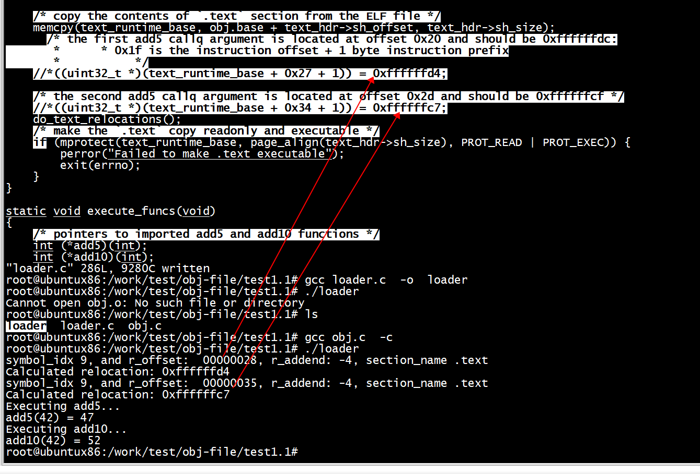

### gcc obj.c -c -fno-pie

```
root@ubuntux86:/work/test/obj-file/test1.1# gcc obj.c -c -fno-pie
root@ubuntux86:/work/test/obj-file/test1.1# readelf --relocs obj.o

Relocation section '.rela.text' at offset 0x240 contains 2 entries:
  Offset          Info           Type           Sym. Value    Sym. Name + Addend
000000000028  000900000004 R_X86_64_PLT32    0000000000000000 add5 - 4
000000000035  000900000004 R_X86_64_PLT32    0000000000000000 add5 - 4

Relocation section '.rela.eh_frame' at offset 0x270 contains 2 entries:
  Offset          Info           Type           Sym. Value    Sym. Name + Addend
000000000020  000200000002 R_X86_64_PC32     0000000000000000 .text + 0
000000000040  000200000002 R_X86_64_PC32     0000000000000000 .text + 13
```

```
root@ubuntux86:/work/test/obj-file/test1.1# gcc loader.c  -o loader
root@ubuntux86:/work/test/obj-file/test1.1# ./loader 
Executing add5...
add5(42) = 47
Executing add10...
add10(42) = 42
```
***gcc obj.c -c -fno-pie没有用***


### 解决方法3

函数加上static

```
/* int add5(int num) */
static int add5(int num)
```

```
root@ubuntux86:/work/test/obj-file/test1.2# gcc loader.c  -o loader
root@ubuntux86:/work/test/obj-file/test1.2# gcc obj.c -c 
root@ubuntux86:/work/test/obj-file/test1.2# ./loader 
Executing add5...
add5(42) = 47
Executing add10...
add10(42) = 52
```

```
objdump --disassemble --section=.text obj.o

obj.o:     file format elf64-x86-64


Disassembly of section .text:

0000000000000000 <add5>:
   0:   f3 0f 1e fa             endbr64 
   4:   55                      push   %rbp
   5:   48 89 e5                mov    %rsp,%rbp
   8:   89 7d fc                mov    %edi,-0x4(%rbp)
   b:   8b 45 fc                mov    -0x4(%rbp),%eax
   e:   83 c0 05                add    $0x5,%eax
  11:   5d                      pop    %rbp
  12:   c3                      retq   

0000000000000013 <add10>:
  13:   f3 0f 1e fa             endbr64 
  17:   55                      push   %rbp
  18:   48 89 e5                mov    %rsp,%rbp
  1b:   48 83 ec 08             sub    $0x8,%rsp
  1f:   89 7d fc                mov    %edi,-0x4(%rbp)
  22:   8b 45 fc                mov    -0x4(%rbp),%eax
  25:   89 c7                   mov    %eax,%edi
  27:   e8 d4 ff ff ff          callq  0 <add5>
  2c:   89 45 fc                mov    %eax,-0x4(%rbp)
  2f:   8b 45 fc                mov    -0x4(%rbp),%eax
  32:   89 c7                   mov    %eax,%edi
  34:   e8 c7 ff ff ff          callq  0 <add5>
  39:   c9                      leaveq 
```

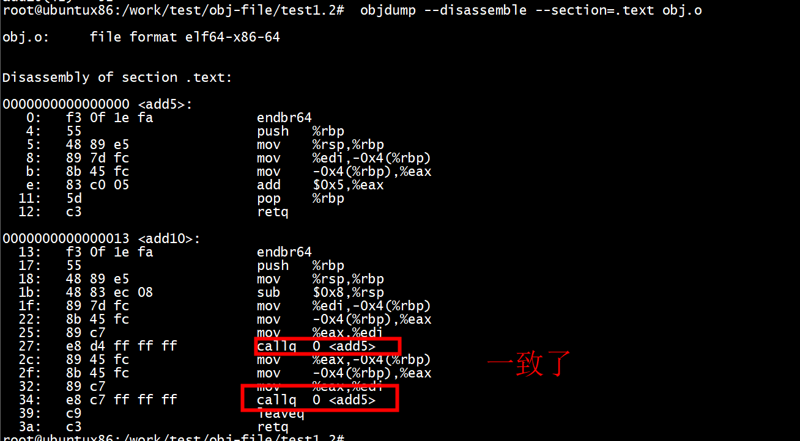

```
 readelf --relocs obj.o

Relocation section '.rela.eh_frame' at offset 0x240 contains 2 entries:
  Offset          Info           Type           Sym. Value    Sym. Name + Addend
000000000020  000200000002 R_X86_64_PC32     0000000000000000 .text + 0
000000000040  000200000002 R_X86_64_PC32     0000000000000000 .text + 13
```

***没有了rela.text***

# relocation sections比较

## arm64 

```
[root@centos7 2]#  readelf --relocs obj.o

Relocation section '.rela.text' at offset 0x390 contains 8 entries:
  Offset          Info           Type           Sym. Value    Sym. Name + Addend
000000000028  000e0000011b R_AARCH64_CALL26  0000000000000000 add5 + 0
000000000034  000e0000011b R_AARCH64_CALL26  0000000000000000 add5 + 0
000000000040  000600000113 R_AARCH64_ADR_PRE 0000000000000000 .rodata + 0
000000000044  000600000115 R_AARCH64_ADD_ABS 0000000000000000 .rodata + 0
00000000004c  000300000113 R_AARCH64_ADR_PRE 0000000000000000 .data + 0
000000000050  000300000115 R_AARCH64_ADD_ABS 0000000000000000 .data + 0
000000000064  000300000113 R_AARCH64_ADR_PRE 0000000000000000 .data + 0
000000000068  000300000115 R_AARCH64_ADD_ABS 0000000000000000 .data + 0

Relocation section '.rela.eh_frame' at offset 0x450 contains 5 entries:
  Offset          Info           Type           Sym. Value    Sym. Name + Addend
00000000001c  000200000105 R_AARCH64_PREL32  0000000000000000 .text + 0
000000000034  000200000105 R_AARCH64_PREL32  0000000000000000 .text + 18
000000000058  000200000105 R_AARCH64_PREL32  0000000000000000 .text + 40
00000000006c  000200000105 R_AARCH64_PREL32  0000000000000000 .text + 4c
000000000080  000200000105 R_AARCH64_PREL32  0000000000000000 .text + 5c
[root@centos7 2]# uname -a
Linux centos7 4.14.0-115.el7a.0.1.aarch64 #1 SMP Sun Nov 25 20:54:21 UTC 2018 aarch64 aarch64 aarch64 GNU/Linux
[root@centos7 2]# 
```
***'.rela.text'***

##  riscv

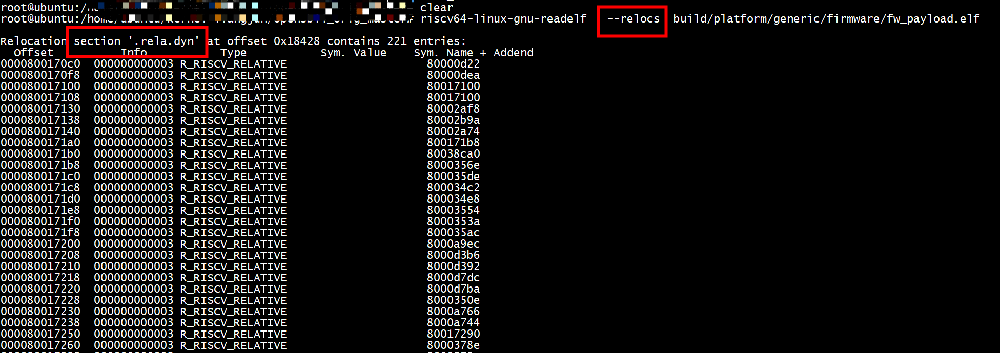

# references

[How to execute an object file: Part 2](https://blog.cloudflare.com/how-to-execute-an-object-file-part-2/)

[HOW TO EXECUTE AN OBJECT FILE: PART 1](https://noise.getoto.net/2021/03/02/how-to-execute-an-object-file-part-1/)

[多个section合并](https://github.com/chenpengcong/blog/issues/11)
