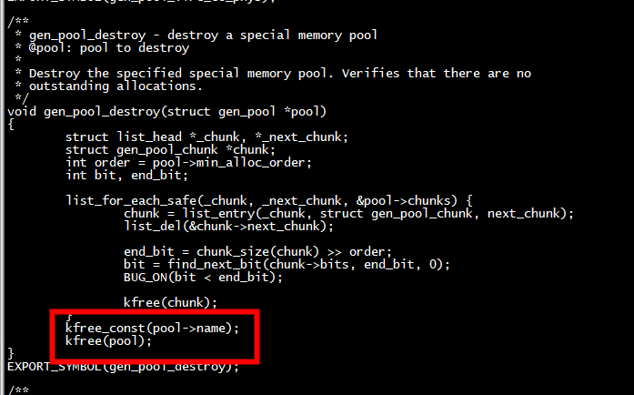

#  of_gen_pool_get

```
sram_pool = of_gen_pool_get(np, "pm-sram", 0);
```
#  gen_pool_destroy coredump



 gen_pool_destroy 会调用kfree_const(pool->name);，但是gen_pool_create将 pool->name = NULL
 
 
 
```
/**
 * kfree_const - conditionally free memory
 * @x: pointer to the memory
 *
 * Function calls kfree only if @x is not in .rodata section.
 */
void kfree_const(const void *x)
{
        if (!is_kernel_rodata((unsigned long)x))
                kfree(x);
}
EXPORT_SYMBOL(kfree_const);
```

# run

```
[root@centos7 genalloc_test]# uname -a
Linux centos7 4.14.0-115.el7a.0.1.aarch64 #1 SMP Sun Nov 25 20:54:21 UTC 2018 aarch64 aarch64 aarch64 GNU/Linux
[root@centos7 genalloc_test]# 
```

```
[root@centos7 genalloc_test]# dmesg | tail -n 20
[ 3596.124202] chunk->end_addr 0xffff803f8b0dffff -- chunk->start_addr 0xffff803f8b0d0000 
[ 3596.132170] chunk + 1 addr ffffa05fcb98e830 and chunk->bits ffffa05fcb98e830 
[ 3596.139276] gen pool alloc addr ffff803f8b0d0000 
[ 3596.143958] __free_pages ok! 
[ 8043.381680] genalloc test begin >>>>>>>>>>>>>>>>>  
[ 8043.386538] alloc_pages Successfully! 
[ 8043.390270] page_address(pages) = 0xffff803fcfe50000
[ 8043.395218] min alloc order 4 ,nbits  4096 and BITS_TO_LONGS(nbits) 64 
[ 8043.401804] nbytes 560 and sizeof(struct gen_pool_chunk) 48,sizeof(long) 8, BITS_TO_LONGS* sizeof(long) 512 
[ 8043.411587] chunk->bits equals chunk + sizeof(struct gen_pool_chunk) 
[ 8043.417997] num of long  4096 
[ 8043.421038] chunk->end_addr 0xffff803fcfe5ffff -- chunk->start_addr 0xffff803fcfe50000 
[ 8043.429008] chunk + 1 addr ffff803fca7a7830 and chunk->bits ffff803fca7a7830 
[ 8043.436112] size 64, avail  65536 , bits addr ffff803fca7a7830 and val 0 
[ 8043.442872] start_bit 0, end_bit 4096, nbits 4 
[ 8043.447381] find chunk 
[ 8043.449817] chunk->end_addr 0xffff803fcfe5ffff -- chunk->start_addr 0xffff803fcfe50000 
[ 8043.457786] chunk + 1 addr ffff803fca7a7830 and chunk->bits ffff803fca7a7830 
[ 8043.464890] gen pool alloc addr ffff803fcfe50000 
[ 8043.469571] __free_pages ok! 

```

# api

该API在以下内核代码中:

lib/genalloc.c

使用gen_pool_alloc_algo()进行的分配指定了一种用于选择要分配的内存的算法；默认算法可以用gen_pool_set_algo()来设置。数据值被传递给算法；大多数算法会忽略它，但偶尔也会需 要它。当然，人们可以写一个特殊用途的算法，但是已经有一套公平的算法可用了:  

gen_pool_first_fit是一个简单的初配分配器；如果没有指定其他算法，这是默认算法。  
gen_pool_first_fit_align强迫分配有一个特定的对齐方式（通过genpool_data_align结 构中的数据传递）。  
gen_pool_first_fit_order_align 按照大小的顺序排列分配。例如，一个60字节的分配将 以64字节对齐。  
gen_pool_best_fit，正如人们所期望的，是一个简单的最佳匹配分配器。  
gen_pool_fixed_alloc在池中的一个特定偏移量（通过数据参数在genpool_data_fixed结   构中传递）进行分配。如果指定的内存不可用，则分配失败。  

# gen_pool_create
gen_pool创建：gen_pool_create()函数
gen_pool看起来还挺简单，它通过chunk来管理不同内存块，min_alloc_order表示bitmap中一个bit代表多大内存，比如我们这里是PAGE_SHIFT=12，那么就是4K
algo是分配算法，其实就是bitmap的查找算法，其实就是调用bitmap_find_next_zero_area()函数
data目前没什么用，可能用来存放私有数据
```
struct gen_pool {
	spinlock_t lock;
	struct list_head chunks;	/* list of chunks in this pool */
	int min_alloc_order;		/* minimum allocation order */

	genpool_algo_t algo;		/* allocation function */
	void *data;

	const char *name;
};
```
chunk直译就是大块，其实就表示内存块
avail当前内存块的可用内存大小，按字节算
phys_addr按理说应该是跟start_addr一样，但从代码中被设置为-1
start_addr表示起始物理地址
end_addr结束物理地址
bit[0] 表示bitmap


```
/*
 *  General purpose special memory pool chunk descriptor.
 */
struct gen_pool_chunk {
	struct list_head next_chunk;	/* next chunk in pool */
	atomic_t avail;
	phys_addr_t phys_addr;		/* physical starting address of memory chunk */
	unsigned long start_addr;	/* start address of memory chunk */
	unsigned long end_addr;		/* end address of memory chunk (inclusive) */
	unsigned long bits[0];		/* bitmap for allocating memory chunk */
};
```
gen_pool创建
struct gen_pool *gen_pool_create(int min_alloc_order, int nid)
{
	struct gen_pool *pool;

	pool = kmalloc_node(sizeof(struct gen_pool), GFP_KERNEL, nid);
	if (pool != NULL) {
		spin_lock_init(&pool->lock);
		INIT_LIST_HEAD(&pool->chunks);
		pool->min_alloc_order = min_alloc_order;
		pool->algo = gen_pool_first_fit; //初始化查找算法，起始就是bitmap的查找
		pool->data = NULL;
		pool->name = NULL;
	}
	return pool;
}

##  gen_pool_add_virt
将内存加入到gen_pool中，中间会创建chunk来存放和管理该内存
gen_pool_add()->gen_pool_add_virt()函数：
```
int gen_pool_add_virt(struct gen_pool *pool, unsigned long virt, phys_addr_t phys,
		 size_t size, int nid)
{
	struct gen_pool_chunk *chunk;
    //根据一个bit代表多大内存，计算出当前内存需要多少个bit
	int nbits = size >> pool->min_alloc_order;
    //计算chunk结构体大小+需要表示内存大小的bit位数转换成long型变量，总共需要多少内存
	int nbytes = sizeof(struct gen_pool_chunk) +
				BITS_TO_LONGS(nbits) * sizeof(long);

    //申请chunk对象，使用nbytes
	chunk = kzalloc_node(nbytes, GFP_KERNEL, nid);
	if (unlikely(chunk == NULL))
		return -ENOMEM;

    //初始化chunk中的内存信息，包括内存起始地址，结束地址，avail可用内存大小（size是字节）
	chunk->phys_addr = phys;
	chunk->start_addr = virt;
	chunk->end_addr = virt + size - 1;
	atomic_set(&chunk->avail, size);

	spin_lock(&pool->lock);
    //最后将当前chunk加入到gen_pool链表中
	list_add_rcu(&chunk->next_chunk, &pool->chunks);
	spin_unlock(&pool->lock);

	return 0;
}
```

#  gen_pool_alloc_algo

```
unsigned long gen_pool_alloc_algo(struct gen_pool *pool, size_t size,
		genpool_algo_t algo, void *data)
{
	struct gen_pool_chunk *chunk;
	unsigned long addr = 0;
	int order = pool->min_alloc_order;
	int nbits, start_bit, end_bit, remain;

#ifndef CONFIG_ARCH_HAVE_NMI_SAFE_CMPXCHG
	BUG_ON(in_nmi());
#endif

	if (size == 0)
		return 0;

    //假如一个bit代表4K的内存（当前是4K），总共需要多少个bit才能表示用户申请的内存size
	nbits = (size + (1UL << order) - 1) >> order;
	rcu_read_lock();
    //遍历当前gen_pool中所有的chunk内存块（一般ION都只创建一块），找到bitmap中连续nbits个bit为0的位
	list_for_each_entry_rcu(chunk, &pool->chunks, next_chunk) {
		if (size > atomic_read(&chunk->avail))
			continue;

		start_bit = 0;
        //计算当前chunk中末位bit的下标
		end_bit = chunk_size(chunk) >> order;
retry:
        //开始查找，algo算法实际在创建gen_pool时已经指定，其实就是在bits中查找满足要求的位
		start_bit = algo(chunk->bits, end_bit, start_bit,
				 nbits, data, pool);
		if (start_bit >= end_bit)
			continue;
        //对找到的满足要求的bits位置1，表示分配出去
		remain = bitmap_set_ll(chunk->bits, start_bit, nbits);
		if (remain) {
			remain = bitmap_clear_ll(chunk->bits, start_bit,
						 nbits - remain);
			BUG_ON(remain);
			goto retry;
		}
        //然后计算出分配到的内存实际的起始物理地址，start_addr+偏移地址
		addr = chunk->start_addr + ((unsigned long)start_bit << order);
		size = nbits << order;
        //更新当前chunk中可用的物理内存大小
		atomic_sub(size, &chunk->avail);
		break;
	}
	rcu_read_unlock();
    //返回申请到的内存起始物理地址
	return addr;
}
```

# gen_pool_free

```
void gen_pool_free(struct gen_pool *pool, unsigned long addr, size_t size)
{
	struct gen_pool_chunk *chunk;
	int order = pool->min_alloc_order;
	int start_bit, nbits, remain;

#ifndef CONFIG_ARCH_HAVE_NMI_SAFE_CMPXCHG
	BUG_ON(in_nmi());
#endif

    //计算出需要释放的内存大小转换成bit代表的内存，总共需要多少个bit来表示
    //比如释放5K内存，由于order是4K，那么转换出来就是2个bit，也就是8K
    //不过，由于在分配时已经按order对齐，所以一般传递进来的内存应该也是order对齐的
	nbits = (size + (1UL << order) - 1) >> order;
	rcu_read_lock();
	list_for_each_entry_rcu(chunk, &pool->chunks, next_chunk) {
        //遍历所有的chunk，找到当前要释放的内存物理地址所属的chunk
        //通过物理地址范围确定所属chunk
		if (addr >= chunk->start_addr && addr <= chunk->end_addr) {
            //开始释放
			BUG_ON(addr + size - 1 > chunk->end_addr);
            //计算释放内存的地址对应的bitmap的起始bit
			start_bit = (addr - chunk->start_addr) >> order;
            //从起始bit的连续nbits个位置0，表示释放
			remain = bitmap_clear_ll(chunk->bits, start_bit, nbits);
			BUG_ON(remain);
            //计算释放的内存，并更新chunk中的avail可用内存大小
			size = nbits << order;
			atomic_add(size, &chunk->avail);
			rcu_read_unlock();
			return;
		}
	}
	rcu_read_unlock();
	BUG();
}
```


# references

[Linux Kernel编程 --- genalloc原理](https://blog.csdn.net/u010961173/article/details/104598191)  
[genalloc — 通用内存分配器](https://adtxl.com/index.php/archives/465.html)  
[什么是carveout heap](https://www.cnblogs.com/yibuyibu/p/14806858.html)