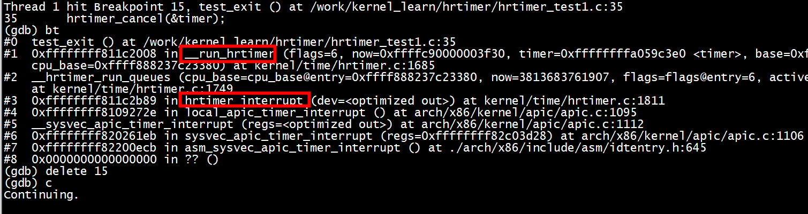
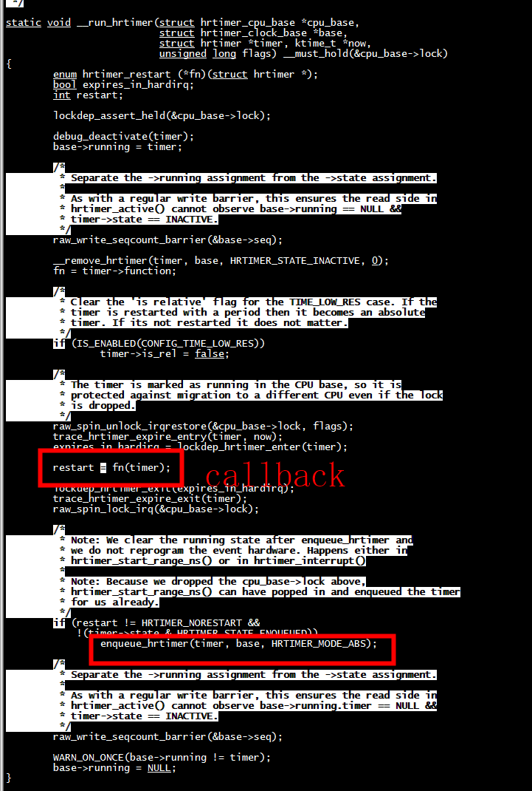

#  hrtimer_interrupt

hrtimer_interrupt --> __hrtimer_run_queues

```
(gdb) bt
#0  __hrtimer_run_queues (cpu_base=cpu_base@entry=0xffff888237c23380, now=2358938282822, flags=flags@entry=6, active_mask=active_mask@entry=15)
    at kernel/time/hrtimer.c:1719
#1  0xffffffff811c2b89 in hrtimer_interrupt (dev=<optimized out>) at kernel/time/hrtimer.c:1811
#2  0xffffffff8109272e in local_apic_timer_interrupt () at arch/x86/kernel/apic/apic.c:1095
#3  __sysvec_apic_timer_interrupt (regs=<optimized out>) at arch/x86/kernel/apic/apic.c:1112
#4  0xffffffff820261eb in sysvec_apic_timer_interrupt (regs=0xffffffff82c03d28) at arch/x86/kernel/apic/apic.c:1106
#5  0xffffffff82200ecb in asm_sysvec_apic_timer_interrupt () at ./arch/x86/include/asm/idtentry.h:645
#6  0x0000000000000000 in ?? ()
```





# 软中断 HRTIMER_SOFTIRQ

```
open_softirq(HRTIMER_SOFTIRQ, hrtimer_run_softirq)
```

```
raise_softirq_irqoff(HRTIMER_SOFTIRQ)
```


#  base


```
static inline ktime_t hrtimer_update_base(struct hrtimer_cpu_base *base)
{
        ktime_t *offs_real = &base->clock_base[HRTIMER_BASE_REALTIME].offset;
        ktime_t *offs_boot = &base->clock_base[HRTIMER_BASE_BOOTTIME].offset;
        ktime_t *offs_tai = &base->clock_base[HRTIMER_BASE_TAI].offset;

        ktime_t now = ktime_get_update_offsets_now(&base->clock_was_set_seq,
                                            offs_real, offs_boot, offs_tai);

        base->clock_base[HRTIMER_BASE_REALTIME_SOFT].offset = *offs_real;
        base->clock_base[HRTIMER_BASE_BOOTTIME_SOFT].offset = *offs_boot;
        base->clock_base[HRTIMER_BASE_TAI_SOFT].offset = *offs_tai;

        return now;
}
```

```
static void
print_base(struct seq_file *m, struct hrtimer_clock_base *base, u64 now)
{
        SEQ_printf(m, "  .base:       %pK\n", base);
        SEQ_printf(m, "  .index:      %d\n", base->index);

        SEQ_printf(m, "  .resolution: %u nsecs\n", hrtimer_resolution);

        SEQ_printf(m,   "  .get_time:   %ps\n", base->get_time);
#ifdef CONFIG_HIGH_RES_TIMERS
        SEQ_printf(m, "  .offset:     %Lu nsecs\n",
                   (unsigned long long) ktime_to_ns(base->offset));
#endif
        SEQ_printf(m,   "active timers:\n");
        print_active_timers(m, base, now + ktime_to_ns(base->offset));
}

```