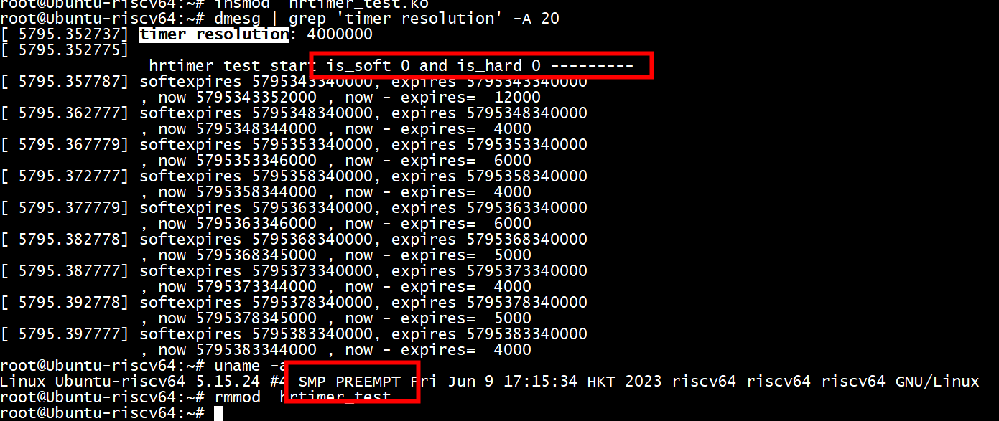

hrtimer的结构体里面有一个_softexpires，同时，它的成员变量node里，也有一个叫做expires的变量。  
```
struct timerqueue_node {
 struct rb_node node;
 ktime_t expires;
};
 
 struct hrtimer {
 struct timerqueue_node  node;
 ktime_t    _softexpires;
 enum hrtimer_restart  (*function)(struct hrtimer *);
 struct hrtimer_clock_base *base;
 u8    state;
 u8    is_rel;
 u8    is_soft;
 u8    is_hard;
};
```

这是hrtimer为了增加调度的效率所做的一些妥协。它表示，我们的任务，可以在_softexpires和expires之间的任何时刻到期。expires被称作硬到期时间，是任务到期的后时间。有了这样的设计，就可以避免进程被hrtimer频繁的唤醒，减少contextswitch。  
我们可以从perf得到的hrtimer_set_expires_range_ns函数中窥探到这两个时间点的设定。这本质上也是一种对时间齐功能。  
```
static inline void hrtimer_set_expires_range_ns(struct hrtimer *timer, ktime_t time, u64 delta)
{
 timer->_softexpires = time;
 timer->node.expires = ktime_add_safe(time, ns_to_ktime(delta));
}
```


```
void hrtimer_run_queues(void)
{
        struct hrtimer_cpu_base *cpu_base = this_cpu_ptr(&hrtimer_bases);
        unsigned long flags;
        ktime_t now;

        if (__hrtimer_hres_active(cpu_base))
                return;

        /*
         * This _is_ ugly: We have to check periodically, whether we
         * can switch to highres and / or nohz mode. The clocksource
         * switch happens with xtime_lock held. Notification from
         * there only sets the check bit in the tick_oneshot code,
         * otherwise we might deadlock vs. xtime_lock.
         */
        if (tick_check_oneshot_change(!hrtimer_is_hres_enabled())) {
                hrtimer_switch_to_hres();
                return;
        }

        raw_spin_lock_irqsave(&cpu_base->lock, flags);
        now = hrtimer_update_base(cpu_base);

        if (!ktime_before(now, cpu_base->softirq_expires_next)) {
                cpu_base->softirq_expires_next = KTIME_MAX;
                cpu_base->softirq_activated = 1;
                raise_softirq_irqoff(HRTIMER_SOFTIRQ);
        }

        __hrtimer_run_queues(cpu_base, now, flags, HRTIMER_ACTIVE_HARD);
        raw_spin_unlock_irqrestore(&cpu_base->lock, flags);
}
```

#  ktime_get  pk ktime_get_update_offsets_now

```
static inline ktime_t hrtimer_update_base(struct hrtimer_cpu_base *base)
{
        ktime_t *offs_real = &base->clock_base[HRTIMER_BASE_REALTIME].offset;
        ktime_t *offs_boot = &base->clock_base[HRTIMER_BASE_BOOTTIME].offset;
        ktime_t *offs_tai = &base->clock_base[HRTIMER_BASE_TAI].offset;
        ktime_t now = ktime_get_update_offsets_now(&base->clock_was_set_seq,
                                            offs_real, offs_boot, offs_tai);

        base->clock_base[HRTIMER_BASE_REALTIME_SOFT].offset = *offs_real;
        base->clock_base[HRTIMER_BASE_BOOTTIME_SOFT].offset = *offs_boot;
        base->clock_base[HRTIMER_BASE_TAI_SOFT].offset = *offs_tai;
        return now;
}
```
```
static inline s64 timekeeping_get_ns(struct tk_read_base *tkr)
{
   u64 delta;

   delta = timekeeping_get_delta(tkr);//caq:上次读取与本次读取之间的差值
   return timekeeping_delta_to_ns(tkr, delta);//caq:差值转换为ns
}
```
delta的来源是：
```

static inline u64 timekeeping_get_delta(struct tk_read_base *tkr)
{
   u64 cycle_now, delta;
   struct clocksource *clock;

   /* read clocksource: */
   clock = tkr->clock;
   cycle_now = tkr->clock->read(clock);//当前值是通过读取来的

   /* calculate the delta since the last update_wall_time */
   delta = clocksource_delta(cycle_now, clock->cycle_last, clock->mask);//计算差值

   return delta;
}
```
原来，delta的获取是线读取当前clocksource的cycle值，然后通过clocksource_delta计算对应的差值


# hrtimer 和  CONFIG_PREEMPT_RT


```
struct hrtimer {
        struct timerqueue_node          node;
        ktime_t                         _softexpires;
        enum hrtimer_restart            (*function)(struct hrtimer *);
        struct hrtimer_clock_base       *base;
        u8                              state;
        u8                              is_rel;
        u8                              is_soft;
        u8                              is_hard;
};

struct hrtimer_cpu_base {
#ifdef CONFIG_PREEMPT_RT
        spinlock_t                      softirq_expiry_lock;
        atomic_t                        timer_waiters;
#endif
  
} ____cacheline_aligned;
```

```
static void __hrtimer_init(struct hrtimer *timer, clockid_t clock_id,
                           enum hrtimer_mode mode)
{
        bool softtimer = !!(mode & HRTIMER_MODE_SOFT);
        /*
         * On PREEMPT_RT enabled kernels hrtimers which are not explicitly
         * marked for hard interrupt expiry mode are moved into soft
         * interrupt context for latency reasons and because the callbacks
         * can invoke functions which might sleep on RT, e.g. spin_lock().
         */
        if (IS_ENABLED(CONFIG_PREEMPT_RT) && !(mode & HRTIMER_MODE_HARD))
                softtimer = true;
        timer->is_soft = softtimer;
        timer->is_hard = !!(mode & HRTIMER_MODE_HARD);
        timer->base = &cpu_base->clock_base[base];
        timerqueue_init(&timer->node);
}
```

```
void hrtimer_start_range_ns(struct hrtimer *timer, ktime_t tim,
                            u64 delta_ns, const enum hrtimer_mode mode)
{
        struct hrtimer_clock_base *base;
        unsigned long flags;

        /*
         * Check whether the HRTIMER_MODE_SOFT bit and hrtimer.is_soft
         * match on CONFIG_PREEMPT_RT = n. With PREEMPT_RT check the hard
         * expiry mode because unmarked timers are moved to softirq expiry.
         */
        if (!IS_ENABLED(CONFIG_PREEMPT_RT))
                WARN_ON_ONCE(!(mode & HRTIMER_MODE_SOFT) ^ !timer->is_soft);
        else
                WARN_ON_ONCE(!(mode & HRTIMER_MODE_HARD) ^ !timer->is_hard);

        base = lock_hrtimer_base(timer, &flags);

        if (__hrtimer_start_range_ns(timer, tim, delta_ns, mode, base))
                hrtimer_reprogram(timer, true);

        unlock_hrtimer_base(timer, &flags);
}
```


## task_is_realtime(current)
```
static void __hrtimer_init_sleeper(struct hrtimer_sleeper *sl,
                                   clockid_t clock_id, enum hrtimer_mode mode)
{
        /*
         * On PREEMPT_RT enabled kernels hrtimers which are not explicitly
         * marked for hard interrupt expiry mode are moved into soft
         * interrupt context either for latency reasons or because the
         * hrtimer callback takes regular spinlocks or invokes other
         * functions which are not suitable for hard interrupt context on
         * PREEMPT_RT.
         *
         * The hrtimer_sleeper callback is RT compatible in hard interrupt
         * context, but there is a latency concern: Untrusted userspace can
         * spawn many threads which arm timers for the same expiry time on
         * the same CPU. That causes a latency spike due to the wakeup of
         * a gazillion threads.
         *
         * OTOH, privileged real-time user space applications rely on the
         * low latency of hard interrupt wakeups. If the current task is in
         * a real-time scheduling class, mark the mode for hard interrupt
         * expiry.
         */
        if (IS_ENABLED(CONFIG_PREEMPT_RT)) {
                if (task_is_realtime(current) && !(mode & HRTIMER_MODE_SOFT))
                        mode |= HRTIMER_MODE_HARD;
        }

        __hrtimer_init(&sl->timer, clock_id, mode);
        sl->timer.function = hrtimer_wakeup;
        sl->task = current;
}

```

##  clock_nanosleep

clock_nanosleep --> …… -->  _hrtimer_init_sleeper   
```

kernel/time/posix-timers.c
 
SYSCALL_DEFINE4(clock_nanosleep
->const struct k_clock *kc = clockid_to_kclock(which_clock);  //根据时钟类型得到内核时钟结构
    return kc->nsleep(which_clock, flags, &t); //调用内核时钟结构的nsleep回调
我们传递过来的时钟类型为CLOCK_REALTIME，则调用链为：

kc->nsleep(CLOCK_REALTIME, flags, &t)
->clock_realtime.nsleep
    ->common_nsleep
        ->hrtimer_nanosleep  //kernel/time/hrtimer.c
            ->hrtimer_init_sleeper_on_stack
                    ->__hrtimer_init_sleeper
                        ->__hrtimer_init(&sl->timer, clock_id, mode); //初始化高精度定时器
                            sl->timer.function = hrtimer_wakeup;  //设置超时回调函数
                            sl->task = current;.//设置超时时要唤醒的任务
                     ->do_nanosleep  //睡眠操作

```

# riscv

```
lscpu
Architecture:        riscv64
Byte Order:          Little Endian
CPU(s):              4
On-line CPU(s) list: 0-3
Thread(s) per core:  4
Core(s) per socket:  1
Socket(s):           1
L1d cache:           32 KiB
L1i cache:           32 KiB
L2 cache:            2 MiB
```
***抖动***   
```
 kt = ktime_set(0, 5000000); /* 1 sec, 10 nsec */
 hrtimer_init(&timer, CLOCK_MONOTONIC, HRTIMER_MODE_REL);
 //hrtimer_set_expires(&timer, kt);
 hrtimer_start(&timer, kt, HRTIMER_MODE_REL);//中断触发周期为:5ms
```
```
root@Ubuntu-riscv64:~# dmesg | grep 'timer resolution' -A 20
[ 7356.556765] timer resolution: 4000000
[ 7356.556801] 
                hrtimer test start is_soft 0 and is_hard 0 ---------
[ 7356.561812] softexpires 7356547367000, expires 7356547367000
               , now 7356547376000 , now - expires=  9000
[ 7356.566804] softexpires 7356552367000, expires 7356552367000
               , now 7356552370000 , now - expires=  3000
[ 7356.571805] softexpires 7356557367000, expires 7356557367000
               , now 7356557372000 , now - expires=  5000
[ 7356.576804] softexpires 7356562367000, expires 7356562367000
               , now 7356562371000 , now - expires=  4000
[ 7356.581805] softexpires 7356567367000, expires 7356567367000
               , now 7356567372000 , now - expires=  5000
[ 7356.586804] softexpires 7356572367000, expires 7356572367000
               , now 7356572371000 , now - expires=  4000
[ 7356.591804] softexpires 7356577367000, expires 7356577367000
               , now 7356577371000 , now - expires=  4000
[ 7356.596803] softexpires 7356582367000, expires 7356582367000
               , now 7356582370000 , now - expires=  3000
[ 7356.601803] softexpires 7356587367000, expires 7356587367000
               , now 7356587370000 , now - expires=  3000
```