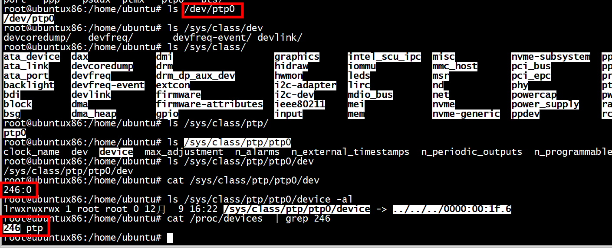

# device



# tsn


#  gPTP网络的时钟校准过程
以下图网络拓扑为例，介绍gPTP网络的时钟同步过程 ：


***1.*** 每个slave端口将周期性地发送Pdelay_Req，完成各自链路的传播延迟测量和频率同步；

***2.*** Grandmaster周期性地发送Sync报文，在Follow_UP报文中，PreciseOriginTimestamp字段将会填充Sycn报文离开Grandmaster的时刻t1，Correction字段添加对t1时间的修正，对于Grandmaster来说，Correction的数值为t1不足ns的小数部分。因为PreciseOriginTimestamp精度是ns，Correction的精度是2的（-16）次方ns。
 
***3.*** Bridge收到sync报文后，需要在一定时间内转发Sycn报文；Bridge在t2时刻收到报文，t3时刻转发报文，注意t2/t3是bridge自身时基的度量值。

***4.*** Bridge在发送Follow_UP报文时，PreciseOriginTimestamp值不变，Correction字段值要重新计算，它的值为：New Correction=Old Correction+Pdelayi+residence_time；Pdelayi为Grandmaster到Bridge的传播延迟，residence_time为Sync报文在Bridge中驻留的时间。注意Pdelayi、residence_time都要转化为相对主时钟时基的度量值，具体计算过程请参看802.1AS标准。同时，Follow_UP报文中还包含RateRatio字段，它是主时钟频率和Bridge时钟频率的比值。

***5.*** Endpointi+1节点在t4时刻收到Sync报文，Endpointi+1节点的任意本地时刻t，对应的主时钟时间(GlobalTime(t)，即同步时间)，可以根据以下公式计算：
 
 

# e1000 ptp

```
#CONFIG_E1000E_HWTS
```


```
static void e1000e_systim_to_hwtstamp(struct e1000_adapter *adapter,
                                      struct skb_shared_hwtstamps *hwtstamps,
                                      u64 systim)
{
        u64 ns;
        unsigned long flags;

        spin_lock_irqsave(&adapter->systim_lock, flags);
        ns = timecounter_cyc2time(&adapter->tc, systim);
        spin_unlock_irqrestore(&adapter->systim_lock, flags);

        memset(hwtstamps, 0, sizeof(*hwtstamps));
        hwtstamps->hwtstamp = ns_to_ktime(ns);
}
```


```
int peak_usb_netif_rx_64(struct sk_buff *skb, u32 ts_low, u32 ts_high)
{
	struct skb_shared_hwtstamps *hwts = skb_hwtstamps(skb);
	u64 ns_ts;

	ns_ts = (u64)ts_high << 32 | ts_low;
	ns_ts *= NSEC_PER_USEC;
	hwts->hwtstamp = ns_to_ktime(ns_ts);

	return netif_rx(skb);
}
```
#  struct ptp_clock_info e1000e_ptp_clock_info

```
static const struct ptp_clock_info e1000e_ptp_clock_info = {
        .owner          = THIS_MODULE,
        .n_alarm        = 0,
        .n_ext_ts       = 0,
        .n_per_out      = 0,
        .n_pins         = 0,
        .pps            = 0,
        .adjfreq        = e1000e_phc_adjfreq,
        .adjtime        = e1000e_phc_adjtime,
        .gettimex64     = e1000e_phc_gettimex,
        .settime64      = e1000e_phc_settime,
        .enable         = e1000e_phc_enable,
};
```


## e1000e_phc_gettimex

```
static int e1000e_phc_gettimex(struct ptp_clock_info *ptp,
                               struct timespec64 *ts,
                               struct ptp_system_timestamp *sts)
{
        struct e1000_adapter *adapter = container_of(ptp, struct e1000_adapter,
                                                     ptp_clock_info);
        unsigned long flags;
        u64 cycles, ns;

        spin_lock_irqsave(&adapter->systim_lock, flags);

        /* NOTE: Non-monotonic SYSTIM readings may be returned */
        cycles = e1000e_read_systim(adapter, sts);
        ns = timecounter_cyc2time(&adapter->tc, cycles);

        spin_unlock_irqrestore(&adapter->systim_lock, flags);

        *ts = ns_to_timespec64(ns);

        return 0;
}

u64 e1000e_read_systim(struct e1000_adapter *adapter,
                       struct ptp_system_timestamp *sts)
{
        struct e1000_hw *hw = &adapter->hw;
        u32 systimel, systimel_2, systimeh;
        u64 systim;
        /* SYSTIMH latching upon SYSTIML read does not work well.
         * This means that if SYSTIML overflows after we read it but before
         * we read SYSTIMH, the value of SYSTIMH has been incremented and we
         * will experience a huge non linear increment in the systime value
         * to fix that we test for overflow and if true, we re-read systime.
         */
        ptp_read_system_prets(sts);
        systimel = er32(SYSTIML);
        ptp_read_system_postts(sts);
        systimeh = er32(SYSTIMH);
        /* Is systimel is so large that overflow is possible? */
        if (systimel >= (u32)0xffffffff - E1000_TIMINCA_INCVALUE_MASK) {
                ptp_read_system_prets(sts);
                systimel_2 = er32(SYSTIML);
                ptp_read_system_postts(sts);
                if (systimel > systimel_2) {
                        /* There was an overflow, read again SYSTIMH, and use
                         * systimel_2
                         */
                        systimeh = er32(SYSTIMH);
                        systimel = systimel_2;
                }
        }
        systim = (u64)systimel;
        systim |= (u64)systimeh << 32;

        if (adapter->flags2 & FLAG2_CHECK_SYSTIM_OVERFLOW)
                systim = e1000e_sanitize_systim(hw, systim, sts);

        return systim;
}
```

## e1000e_phc_adjfreq

```
# static int e1000e_phc_adjfreq(struct ptp_clock_info *ptp, s32 delta)
{
	struct e1000_adapter *adapter = container_of(ptp, struct e1000_adapter,
						     ptp_clock_info);
	struct e1000_hw *hw = &adapter->hw;
	bool neg_adj = false;
	unsigned long flags;
	u64 adjustment;
	u32 timinca, incvalue;
	s32 ret_val;

	if ((delta > ptp->max_adj) || (delta <= -1000000000))
		return -EINVAL;

	if (delta < 0) {
		neg_adj = true;
		delta = -delta;
	}

	/* Get the System Time Register SYSTIM base frequency */
	ret_val = e1000e_get_base_timinca(adapter, &timinca);
	if (ret_val)
		return ret_val;

	spin_lock_irqsave(&adapter->systim_lock, flags);

	incvalue = timinca & E1000_TIMINCA_INCVALUE_MASK;

	adjustment = incvalue;
	adjustment *= delta;
	adjustment = div_u64(adjustment, 1000000000);

	incvalue = neg_adj ? (incvalue - adjustment) : (incvalue + adjustment);

	timinca &= ~E1000_TIMINCA_INCVALUE_MASK;
	timinca |= incvalue;

	ew32(TIMINCA, timinca);

	adapter->ptp_delta = delta;

	spin_unlock_irqrestore(&adapter->systim_lock, flags);

	return 0;
}
```

***ew32(TIMINCA, timinca)***

```
 \#define ew32(reg, val)	__ew32(hw, E1000_##reg, (val))
 void __ew32(struct e1000_hw *hw, unsigned long reg, u32 val)
{
        if (hw->adapter->flags2 & FLAG2_PCIM2PCI_ARBITER_WA)
                __ew32_prepare(hw);

        writel(val, hw->hw_addr + reg);
}
```

## e1000e_phc_adjtime


adapter->tc 用来计算timestamp  

```
        ns = timecounter_cyc2time(&adapter->tc, systim);
        spin_unlock_irqrestore(&adapter->systim_lock, flags);

        memset(hwtstamps, 0, sizeof(*hwtstamps));
        hwtstamps->hwtstamp = ns_to_ktime(ns);
```

#  Timestamp Processing in Open Source


```
•A shared time stamp structure – struct skb_shared_hwtstamps.

       struct  skb_shared_hwtstamps {

                            ktime_t hwtstamp;

                            ktime_t syststamp;    

       };

•Time stamps for received packets was stored in the skb. Get a pointer to the shared time stamp structure by calling skb_hwtstamps(). Then set the time stamps in the structure skb_shared_hwtstamps.

•For outgoing packets, skb_hwtstamp_tx() clones the original skb and adds the timestamp to structure skb_shared_hwtstamps. The cloned skb with the send timestamp attached is looped back to the socket's error queue.

•PTPd get the RX timestamp by calling recvmsg() and the TX timestamp by calling recvmsg(flags=MSG_ERRQUEUE).
```


# phy dp83640


## CONFIG_NETWORK_PHY_TIMESTAMPING
 

These are devices that typically fulfill a Layer 1 role in the network stack,
hence they do not have a representation in terms of a network interface as DSA
switches do. However, PHYs may be able to detect and timestamp PTP packets, for
performance reasons: timestamps taken as close as possible to the wire have the
potential to yield a more stable and precise synchronization.

A PHY driver that supports PTP timestamping must create a ``struct
mii_timestamper`` and add a pointer to it in ``phydev->mii_ts``. The presence
of this pointer will be checked by the networking stack.

Since PHYs do not have network interface representations, the timestamping and
ethtool ioctl operations for them need to be mediated by their respective MAC
driver.  Therefore, as opposed to DSA switches, modifications need to be done
to each individual MAC driver for PHY timestamping support. This entails:

- Checking, in ``.ndo_eth_ioctl``, whether ``phy_has_hwtstamp(netdev->phydev)``
  is true or not. If it is, then the MAC driver should not process this request
  but instead pass it on to the PHY using ``phy_mii_ioctl()``.

- On RX, special intervention may or may not be needed, depending on the
  function used to deliver skb's up the network stack. In the case of plain
  ``netif_rx()`` and similar, MAC drivers must check whether
  ``skb_defer_rx_timestamp(skb)`` is necessary or not - and if it is, don't
  call ``netif_rx()`` at all.  If ``CONFIG_NETWORK_PHY_TIMESTAMPING`` is
  enabled, and ``skb->dev->phydev->mii_ts`` exists, its ``.rxtstamp()`` hook
  will be called now, to determine, using logic very similar to DSA, whether
  deferral for RX timestamping is necessary.  Again like DSA, it becomes the
  responsibility of the PHY driver to send the packet up the stack when the
  timestamp is available.

  For other skb receive functions, such as ``napi_gro_receive`` and
  ``netif_receive_skb``, the stack automatically checks whether
  ``skb_defer_rx_timestamp()`` is necessary, so this check is not needed inside
  the driver.

- On TX, again, special intervention might or might not be needed.  The
  function that calls the ``mii_ts->txtstamp()`` hook is named
  ``skb_clone_tx_timestamp()``. This function can either be called directly
  (case in which explicit MAC driver support is indeed needed), but the
  function also piggybacks from the ``skb_tx_timestamp()`` call, which many MAC
  drivers already perform for software timestamping purposes. Therefore, if a
  MAC supports software timestamping, it does not need to do anything further
  at this stage.


# drivers/ptp/ptp_ines.c


## ines_ptp_probe_channel

```

static struct mii_timestamper *ines_ptp_probe_channel(struct device *device,
                                                      unsigned int index)
{
        struct device_node *node = device->of_node;
        struct ines_port *port;

        if (index > INES_N_PORTS - 1) {
                dev_err(device, "bad port index %u\n", index);
                return ERR_PTR(-EINVAL);
        }
        port = ines_find_port(node, index);
        if (!port) {
                dev_err(device, "missing port index %u\n", index);
                return ERR_PTR(-ENODEV);
        }
        port->mii_ts.rxtstamp = ines_rxtstamp;
        port->mii_ts.txtstamp = ines_txtstamp;
        port->mii_ts.hwtstamp = ines_hwtstamp;
        port->mii_ts.link_state = ines_link_state;
        port->mii_ts.ts_info = ines_ts_info;

        return &port->mii_ts;
}
```

## ines_rxtstamp

```
static bool ines_rxtstamp(struct mii_timestamper *mii_ts,
                          struct sk_buff *skb, int type)
{
        struct ines_port *port = container_of(mii_ts, struct ines_port, mii_ts);
        struct skb_shared_hwtstamps *ssh;
        u64 ns;

        if (!port->rxts_enabled)
                return false;

        ns = ines_find_rxts(port, skb, type);
        if (!ns)
                return false;

        ssh = skb_hwtstamps(skb);
        ssh->hwtstamp = ns_to_ktime(ns);
        netif_rx(skb);

        return true;
}

```

# linux-xlnx/tools/testing/selftests/net

```
root@ubuntux86:/work/tsn/hwtstamp_test# ls
stamp_recv.c  stamp_send.c
root@ubuntux86:/work/tsn/hwtstamp_test# gcc stamp_recv.c -o stamp_recv
root@ubuntux86:/work/tsn/hwtstamp_test# gcc stamp_send.c -o stamp_send
root@ubuntux86:/work/tsn/hwtstamp_test# ip a
1: lo: <LOOPBACK,UP,LOWER_UP> mtu 65536 qdisc noqueue state UNKNOWN group default qlen 1000
    link/loopback 00:00:00:00:00:00 brd 00:00:00:00:00:00
    inet 127.0.0.1/8 scope host lo
       valid_lft forever preferred_lft forever
    inet6 ::1/128 scope host 
       valid_lft forever preferred_lft forever
2: enp0s31f6: <BROADCAST,MULTICAST,UP,LOWER_UP> mtu 1500 qdisc fq_codel state UP group default qlen 1000
    link/ether 30:d0:42:fa:ae:11 brd ff:ff:ff:ff:ff:ff
    inet 10.11.11.82/24 brd 10.11.11.255 scope global noprefixroute enp0s31f6
       valid_lft forever preferred_lft forever
    inet 10.11.12.82/24 brd 10.11.12.255 scope global noprefixroute enp0s31f6
       valid_lft forever preferred_lft forever
    inet6 fe80::a222:d618:3432:22df/64 scope link noprefixroute 
       valid_lft forever preferred_lft forever
3: wlxe0e1a91deeb2: <BROADCAST,MULTICAST,UP,LOWER_UP> mtu 1500 qdisc mq state UP group default qlen 1000
    link/ether e0:e1:a9:1d:ee:b2 brd ff:ff:ff:ff:ff:ff
    inet 192.168.27.41/24 brd 192.168.27.255 scope global dynamic noprefixroute wlxe0e1a91deeb2
       valid_lft 22540sec preferred_lft 22540sec
    inet6 fe80::7fb9:8ccd:f13c:3736/64 scope link noprefixroute 
       valid_lft forever preferred_lft forever
root@ubuntux86:/work/tsn/hwtstamp_test# ./stamp_send enp0s31f6 10.11.11.80
source IP: 10.11.11.82
Test started.
Sent packet number (0/10) : hello world 0
HW: 1660135785 s, 73433020 ns
ts[1]: 0 s, 0 ns
SW: 0 s, 0 ns
Hardwave send timestamp: 1660135785 s, 73433020 ns
```

```
root@ubuntux86:/work/tsn/hwtstamp_test# ./stamp_recv
```

# ./ptp1 

```
ubuntu@ubuntux86:/work/tsn$ gcc ptp1.c -o ptp1
ubuntu@ubuntux86:/work/tsn$ ./ptp1 
Date: Thu Jan  1 08:00:00 1970
 
ubuntu@ubuntux86:/work/tsn$ 

ubuntu@ubuntux86:/work/tsn$ ./ptp1 
Date: Thu Jan  1 08:00:00 1970
 
ubuntu@ubuntux86:/work/tsn$ ./ptp1 
Date: Thu Jan  1 08:00:00 1970
 
ubuntu@ubuntux86:/work/tsn$ ./ptp1 
Date: Thu Jan  1 08:00:00 1970
 
ubuntu@ubuntux86:/work/tsn$ ./ptp1 
Date: Thu Jan  1 08:00:00 1970
 
ubuntu@ubuntux86:/work/tsn$ ./ptp1 
Date: Thu Jan  1 08:00:00 1970
 
ubuntu@ubuntux86:/work/tsn$ date
2022年 08月 11日 星期四 10:59:53 CST
ubuntu@ubuntux86:/work/tsn$ 
```


# ./ptp2
```
ubuntu@ubuntux86:/work/tsn$ gcc ptp2.c -o ptp2
ubuntu@ubuntux86:/work/tsn$ ./ptp2
ptp open failed
ptp time: sec: 0 ns: 126a3a
 ptp time: sec: 0 ns: 134602
 ptp time: sec: 0 ns: 144b1c
 ptp time: sec: 0 ns: 155965
 ptp time: sec: 0 ns: 16747a
 ptp time: sec: 0 ns: 17958a
 ptp time: sec: 0 ns: 18a8f8
 ptp time: sec: 0 ns: 19bbdc
 ptp time: sec: 0 ns: 1ac4c7
 ptp time: sec: 0 ns: 1bc993
 ptp time: sec: 0 ns: 1ccb0a
 ptp time: sec: 0 ns: 1dbbff
 ptp time: sec: 0 ns: 1eae3b
 ptp time: sec: 0 ns: 1fc65a
 ptp time: sec: 0 ns: 20e147
 ptp time: sec: 0 ns: 21ea2e
 ptp time: sec: 0 ns: 22b623
 ptp time: sec: 0 ns: 235dd1
 ptp time: sec: 0 ns: 24025b
 ptp time: sec: 0 ns: 2503a0
 ptp time: sec: 0 ns: 260f3a
 ptp time: sec: 0 ns: 2718af
 ptp time: sec: 0 ns: 281f0a
 ptp time: sec: 0 ns: 293023
 ptp time: sec: 0 ns: 2a3408
 ptp time: sec: 0 ns: 2b449c
 ptp time: sec: 0 ns: 2c603d
 ptp time: sec: 0 ns: 2d77ef
 ptp time: sec: 0 ns: 2e8ca9
 ptp time: sec: 0 ns: 2fb250
 ptp time: sec: 0 ns: 30d5db
 ptp time: sec: 0 ns: 31eab3
 ptp time: sec: 0 ns: 32fd71
^C
```
# ./ptp3
```
root@ubuntux86:/work/tsn# ./ptp3
current time is : Thu Aug 11 12:17:28 2022

root@ubuntux86:/work/tsn# ./ptp3
current time is : Thu Aug 11 12:17:30 2022

root@ubuntux86:/work/tsn# ./ptp3
current time is : Thu Aug 11 12:17:31 2022

root@ubuntux86:/work/tsn# ./ptp3
current time is : Thu Aug 11 12:17:32 2022

root@ubuntux86:/work/tsn# ./ptp3
current time is : Thu Aug 11 12:17:33 2022

root@ubuntux86:/work/tsn# ./ptp3
current time is : Thu Aug 11 12:17:33 2022

root@ubuntux86:/work/tsn# 
```


# ptp4l and   phc2sys

```
ptp4l: daemon that synchronizes the PTP Hardware Clock (PHC) from the NIC;
phc2sys: daemon that synchronizes the PHC and the System clock;
pmc: utility tool to configure ptp4l in run-time.

```


## Serving NTP Time with PTP

***Serving NTP Time with PTP***
NTP to PTP synchronization in the opposite direction is also possible. 
When ntpd is used to synchronize the system clock, ptp4l can be configured with the priority1 
option (or other clock options included in the best master clock algorithm)
 to be the grandmaster clock and distribute the time from the system clock via PTP:

```
~]\# cat /etc/ptp4l.conf
[global]
priority1 127
[em3]
\# ptp4l -f /etc/ptp4l.conf
```
With hardware time stamping, phc2sys needs to be used to synchronize the PTP hardware clock to the system clock:
 ```
 phc2sys -c em3 -s CLOCK_REALTIME -w
 ```
To prevent quick changes in the PTP clock's frequency, the synchronization to the system clock can be loosened by using smaller P (proportional) and I (integral) constants of the PI servo:
 ```
 phc2sys -c em3 -s CLOCK_REALTIME -w -P 0.01 -I 0.0001
 ```


## e1000e_read_systim

*phc2sys -c enp0s31f6 -s CLOCK_REALTIME -w*


```

/**
 * e1000e_read_systim - read SYSTIM register
 * @adapter: board private structure
 * @sts: structure which will contain system time before and after reading
 * SYSTIML, may be NULL
 **/
u64 e1000e_read_systim(struct e1000_adapter *adapter,
                       struct ptp_system_timestamp *sts)
{
        struct e1000_hw *hw = &adapter->hw;
        u32 systimel, systimel_2, systimeh;
        u64 systim;
        /* SYSTIMH latching upon SYSTIML read does not work well.
         * This means that if SYSTIML overflows after we read it but before
         * we read SYSTIMH, the value of SYSTIMH has been incremented and we
         * will experience a huge non linear increment in the systime value
         * to fix that we test for overflow and if true, we re-read systime.
         */
        ptp_read_system_prets(sts);
        systimel = er32(SYSTIML);
        ptp_read_system_postts(sts);
        systimeh = er32(SYSTIMH);
#if 1
        pr_info("systimel:  %u and systimeh : %u \n", systimel, systimeh);
#endif
```


```
clock_add()
	posix_clock_open//通过设备/dev/ptp*或者eth*,走下面不同的分支，返回clkid
		phc_open//返回clkid
			fd = open(phc,O_RDWR)//怎么对应上posix_clock_open
				posix_clock_open(struct inode *inode, struct file *fp)//这部分为驱动代码posix-clock.c,file结构体由内核在打开文件时创建,这是 posix_clock_file_operations 的成员函数
					clk->opt.open()//对应于ptp_clock_ops.open
						ptp_open()//return 0;
					fp->private_date = clk;//clk是posix_clock
			FD_TO_CLOCKID(fd)//由文件描述符得到clkid
			clock_gettime()------------------------以下为驱动代码
				SYSCALL_DEFINE2(clock_gettime...)//posix-timers.c，内核态执行该函数
					clockid_to_kclock()//clkid < 0 获取到clock_posix_dynamic
						kc->clock_get()//使用这组函数进行时钟获取
							pc_clock_gettime()
								cd.clk->ops.clock_gettime
									ptp_clock_gettime()
										ptp->info->gettime64()
											ptp_qoriq_caps.ptp_qoriq_gettime()
												tmr_cnt_read()//读取寄存器
			clock_adjtime(clkid,&tx)获取tx------------------------以下为驱动代码
				syscall(__NR_clock_adjtime,id,tx);//用户态执行系统调用，__NR_clock_adjtime是系统调用号，内核中有与系统调用号对应的系统调用表
					SYSCALL_DEFINE2(clock_adjtime, const clockid_t, which_clock, struct timex __user *, utx)//posix-timers.c，内核态执行该函数
						do_clock_adjtime()
							clockid_to_kclock()//clkid <0 (打印出来看就是负的) 获取到clock_posix_dynamic，选择了一组函数
							kc->clock_adj()//使用这组函数进行频率调整
								pc_clock_adjtime(id,tx)
									get_clock_desc(id,&cd)//根据id获得fd,根据fd获取posix_clock, posix_clock = fp->private_date
										fget(clockid_to_fd(id))//由fd获取到file结构体
										cd->clk = get_posix_clock(fp)
									cd.clk->ops.clock_adjtime//对应的就是 ptp_clock_ops.clock_adjtime = ptp_clock_adjtime
										ptp_clock_adjtime()//根据posix_clock得到ptp_clock
											ptp->info->adjtime()//info对应的是ptp_qoriq->caps
												ptp_qoriq_caps.ptp_qoriq_adjtime()//ptp_qoriq_caps 是全局变量
													tmr_cnt_write()写寄存器----最底层

```

***如果是系统时钟（CLOCK_REALTIME），则执行一下过程***

```
clock_add()
	posix_clock_open()//该函数返回clockid_t, 如果是CLOKC_REALTIME则直接返回CLOKC_REALTIME = 0
在使用clock_gettime(sysclk, &tdst1)时的调用栈
clock_gettime(sysclk, &tdst1)
	SYSCALL_DEFINE2(clock_gettime...)//posix-timers.c，内核态执行该函数
		clockid_to_kclock()//clkid = 0 获取到clock_realtime，选择了一组函数
			kc->clock_get()//使用这组函数进行时钟获取
				posix_get_realtime_get
					ktime_get_real_ts64//获取系统时间
```

[hw timestamp in tcpdump](http://martinbj2008.github.io/2016/01/29/2016-01-29-hw-timestamp-in-tcpdump/)

[timestamping](https://elixir.bootlin.com/linux/v5.4/source/tools/testing/selftests/networking/timestamping/timestamping.c)

[xilinx tsn](https://github.com/Xilinx/tsn-utils/blob/3747f273430b3801c06e17fdc58ffdfc88de78af/tsn-apps/ptptime_date/ptptime_date.c)


#  Linux dynamic posix clock

Linux下支持gPTP的网卡驱动会调用ptp_clock_register()创建一个gPTP类/sys/class/ptp和字符设备/dev/ptpN。
打开/dev/ptpN后使用宏FD_TO_CLOCKID(fd)将fd转换成clock id，然后就可以使用标准的posix clock API，
诸如clock_gettime()、clock_settime()和clock_adjtime()等。


 

[汽车网红技术之EAVB](https://blog.csdn.net/zoosenpin/article/details/103934187)


# /dev/ptp0


# references

【虹科云课堂】IEEE 802.1AS-2011 时间同步


