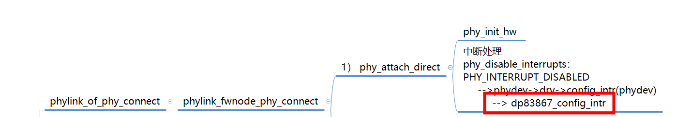
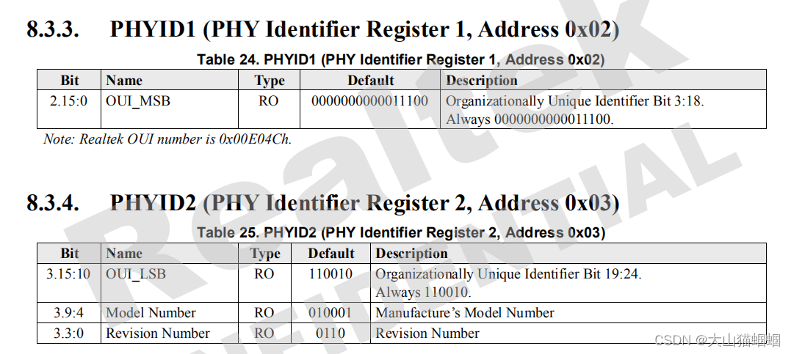
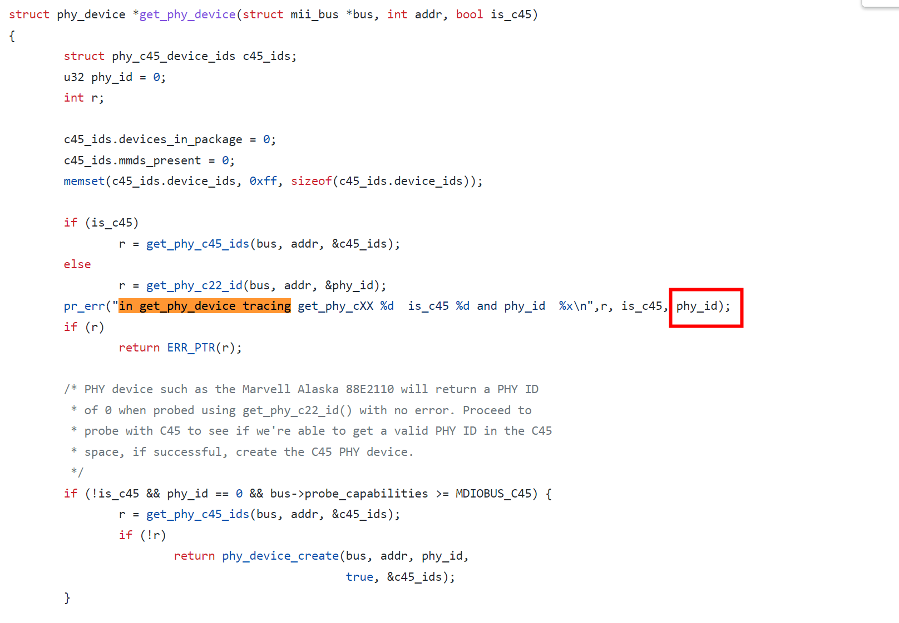
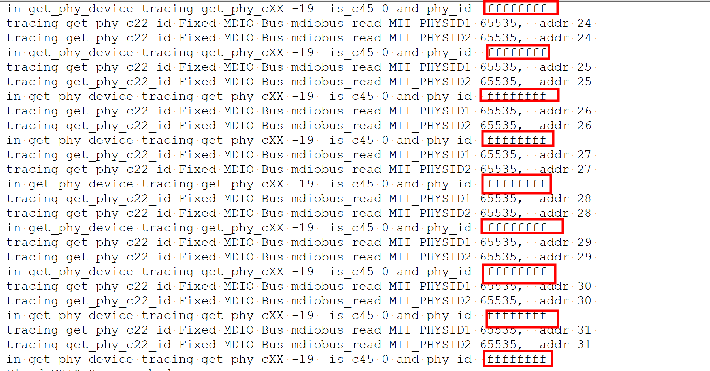
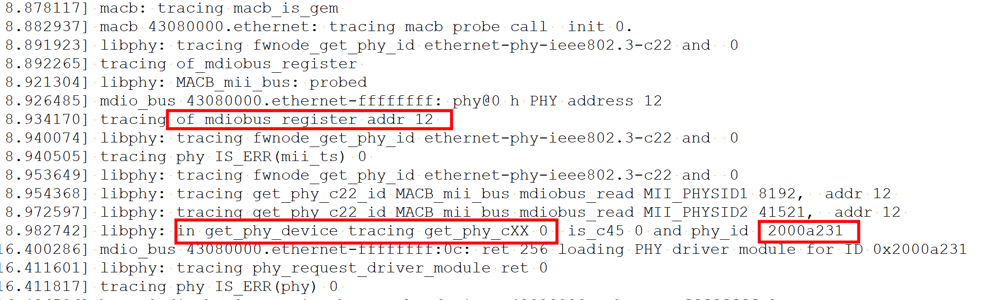
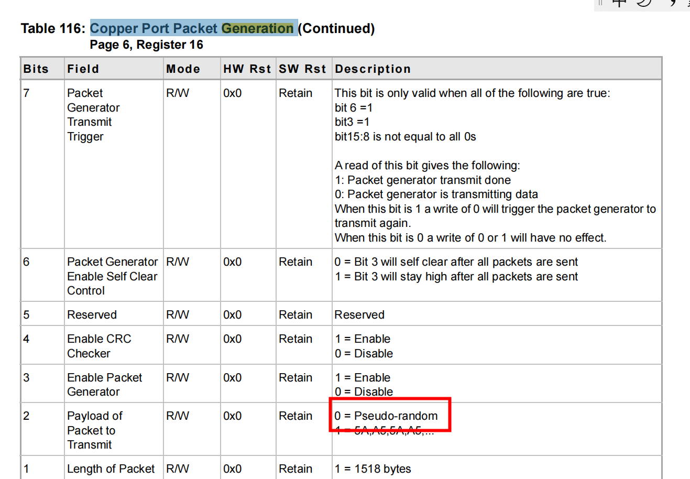
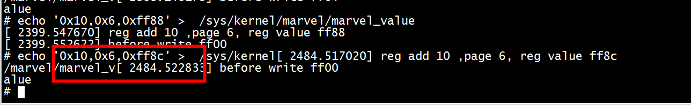
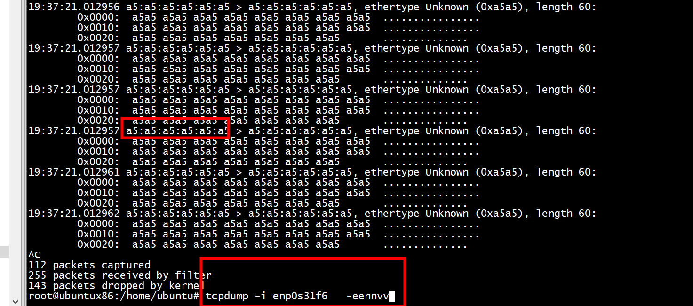

#  phylink_phy_change


```
[  140.008341] status: 0000000200000120 badaddr: 00000000000000e0 cause: 000000000000000d
[  140.016550] [<ffffffff8049ac30>] phylink_phy_change+0x44/0xcc
[  140.022671] [<ffffffff8049d5fc>] phy_check_link_status+0x80/0x8e
[  140.029047] [<ffffffff8049e274>] phy_state_machine+0x154/0x1c2
[  140.035249] [<ffffffff800226cc>] process_one_work+0x13c/0x27c
[  140.041411] [<ffffffff8002285c>] worker_thread+0x50/0x2e2
[  140.047206] [<ffffffff8002926c>] kthread+0xc6/0xdc
[  140.052369] [<ffffffff80003378>] ret_from_exception+0x0/0xc
[  140.061973] ---[ end trace 0000000000000000 ]---
```

```
static const struct phylink_mac_ops macb_phylink_ops = {
	.validate = macb_validate,
	.mac_prepare = macb_mac_prepare,
	.mac_config = macb_mac_config,
	.mac_link_down = macb_mac_link_down,
	.mac_link_up = macb_mac_link_up,
};
```


```
 INIT_WORK(&pl->resolve, phylink_resolve);
 static void phylink_resolve(struct work_struct *w)
{

        if (link_state.link != cur_link_state) {
                pl->old_link_state = link_state.link;
                if (!link_state.link)
                        phylink_link_down(pl);
                else
                        phylink_link_up(pl, link_state);
        }

}

static void phylink_link_up(struct phylink *pl,
                            struct phylink_link_state link_state)
{
        struct net_device *ndev = pl->netdev;

        pl->cur_interface = link_state.interface;

        if (pl->pcs_ops && pl->pcs_ops->pcs_link_up)
                pl->pcs_ops->pcs_link_up(pl->pcs, pl->cur_link_an_mode,
                                         pl->cur_interface,
                                         link_state.speed, link_state.duplex);
        //////////////////////
        pl->mac_ops->mac_link_up(pl->config, pl->phydev,
                                 pl->cur_link_an_mode, pl->cur_interface,
                                 link_state.speed, link_state.duplex,
                                 !!(link_state.pause & MLO_PAUSE_TX),
                                 !!(link_state.pause & MLO_PAUSE_RX));

        if (ndev)
                netif_carrier_on(ndev);

        phylink_info(pl,
                     "Link is Up - %s/%s - flow control %s\n",
                     phy_speed_to_str(link_state.speed),
                     phy_duplex_to_str(link_state.duplex),
                     phylink_pause_to_str(link_state.pause));
}

/**
 *      netif_carrier_on - set carrier
 *      @dev: network device
 *
 * Device has detected acquisition of carrier.
 */
void netif_carrier_on(struct net_device *dev)
{
        if (test_and_clear_bit(__LINK_STATE_NOCARRIER, &dev->state)) {
                if (dev->reg_state == NETREG_UNINITIALIZED)
                        return;
                atomic_inc(&dev->carrier_up_count);
                linkwatch_fire_event(dev);
                if (netif_running(dev))
                        __netdev_watchdog_up(dev);
        }
}
EXPORT_SYMBOL(netif_carrier_on);


```

#  macb_phylink_connect


```
    --> phy_connect_direct （传递handler，初始化 ***）
        --> phy_attach_direct ()
            --> d->driver = &genphy_driver[GENPHY_DRV_1G].driver;(通用驱动赋值，3.17支持1G和10G)
            --> d->driver->probe (这里就调用到Generic PHY的检测函数phy_probe)
            --> device_bind_driver (绑定驱动到设备)
            --> phydev->attached_dev = dev; (有函数使用到attached_dev指针)
            --> phydev->state = PHY_READY; （将PHY状态标记为PHY_READY）
            --> phy_init_hw (硬件级的初始化，最后会调用genphy_config_init)
        --> phy_prepare_link (赋值cpsw_adjust_link为adjust_link)
        --> phy_start_machine (启动PHY状态机 ***)
        --> phy_start_interrupts （经测了，但好像没调用到这里）
    --> phy_start(PHY_READY变成PHY_UP)
```


# phy interrupt



中断信息输出

```
[  820.883224][  T843] macb 43080000.ethernet eth0: PHY [43080000.ethernet-ffffffff:00] driver [Marvell 88E1510] (irq=POLL)
[ 2563.575552][  T862] macb 43090000.eth eth1: PHY [43090000.eth-ffffffff:05] driver [TI DP83867] (irq=POLL)
```

```
static int phylink_bringup_phy(struct phylink *pl, struct phy_device *phy,
                               phy_interface_t interface)
{
 
        phylink_info(pl,
                     "PHY [%s] driver [%s] (irq=%s)\n",
                     dev_name(&phy->mdio.dev), phy->drv->name, irq_str);
}
```

#  mdio
## 1. 概述
除了phy通信时得address外，每个phy出厂前还有厂家的唯一标识，因为phy都遵循国际802标准，所以寄存器PHYID1和PHYID2两个寄存器就负责存储该信息，以RTL8211F为例，如下图：
 



## 2. 扫描存在的phy并添加到mii_bus
mii_bus会自动扫描新添加的phy，其机制就是扫描PHYID寄存器，若有返回值，则说明PHY存在，将其ID添加到mii_bus总线上，具体源码实现如下：

源码路径：drivers\net\phy\mdio_bus.c

```
struct phy_device *mdiobus_scan(struct mii_bus *bus, int addr)
{

struct phy_device *phydev = ERR_PTR(-ENODEV);
int err;
switch (bus->probe_capabilities) {

case MDIOBUS_NO_CAP:
case MDIOBUS_C22:
phydev = get_phy_device(bus, addr, false);
break;
case MDIOBUS_C45:
phydev = get_phy_device(bus, addr, true);
break;
case MDIOBUS_C22_C45:
phydev = get_phy_device(bus, addr, false);
if (IS_ERR(phydev))
phydev = get_phy_device(bus, addr, true);
break;
}
if (IS_ERR(phydev))
return phydev;
/* * For DT, see if the auto-probed phy has a correspoding child * in the bus node, and set the of_node pointer in this case. */
of_mdiobus_link_mdiodev(bus, &phydev->mdio);
err = phy_device_register(phydev);
if (err) {

phy_device_free(phydev);
return ERR_PTR(-ENODEV);
}
return phydev;
}
EXPORT_SYMBOL(mdiobus_scan);
```
## 3. phy_device ID 获取
在mdiobus_scan函数扫描过程中，会调用get_phy_device函数对phy设备进行获取，其中，他就做了获取phy_id的操作

源码路径： drivers\net\phy\phy_device.c


```
/** * get_phy_device - reads the specified PHY device and returns its @phy_device * struct * @bus: the target MII bus * @addr: PHY address on the MII bus * @is_c45: If true the PHY uses the 802.3 clause 45 protocol * * Probe for a PHY at @addr on @bus. * * When probing for a clause 22 PHY, then read the ID registers. If we find * a valid ID, allocate and return a &struct phy_device. * * When probing for a clause 45 PHY, read the "devices in package" registers. * If the "devices in package" appears valid, read the ID registers for each * MMD, allocate and return a &struct phy_device. * * Returns an allocated &struct phy_device on success, %-ENODEV if there is * no PHY present, or %-EIO on bus access error. */
struct phy_device *get_phy_device(struct mii_bus *bus, int addr, bool is_c45)
{

struct phy_c45_device_ids c45_ids;
u32 phy_id = 0;
int r;
c45_ids.devices_in_package = 0;
c45_ids.mmds_present = 0;
memset(c45_ids.device_ids, 0xff, sizeof(c45_ids.device_ids));
if (is_c45)
r = get_phy_c45_ids(bus, addr, &c45_ids);
else
r = get_phy_c22_id(bus, addr, &phy_id);
if (r)
return ERR_PTR(r);
return phy_device_create(bus, addr, phy_id, is_c45, &c45_ids);
}
```







***日志显示分别用"MACB_mii_bus" 和"Fixed MDIO Bus" 进行了读取***

### "Fixed MDIO Bus"

```
static int __init fixed_mdio_bus_init(void)
{
        struct fixed_mdio_bus *fmb = &platform_fmb;
        int ret;

        pdev = platform_device_register_simple("Fixed MDIO bus", 0, NULL, 0);
        if (IS_ERR(pdev))
                return PTR_ERR(pdev);

        fmb->mii_bus = mdiobus_alloc();
        if (fmb->mii_bus == NULL) {
                ret = -ENOMEM;
                goto err_mdiobus_reg;
        }

        snprintf(fmb->mii_bus->id, MII_BUS_ID_SIZE, "fixed-0");
        fmb->mii_bus->name = "Fixed MDIO Bus";
        fmb->mii_bus->priv = fmb;
        fmb->mii_bus->parent = &pdev->dev;
        fmb->mii_bus->read = &fixed_mdio_read;
        fmb->mii_bus->write = &fixed_mdio_write;

        ret = mdiobus_register(fmb->mii_bus);
        if (ret)
                goto err_mdiobus_alloc;

        return 0;

err_mdiobus_alloc:
        mdiobus_free(fmb->mii_bus);
err_mdiobus_reg:
        platform_device_unregister(pdev);
        return ret;
}
```
### "MACB_mii_bus"
```
static int macb_mii_init(struct macb *bp)
{
        int err = -ENXIO;

        /* Enable management port */
        macb_writel(bp, NCR, MACB_BIT(MPE));

        bp->mii_bus = mdiobus_alloc();
        if (!bp->mii_bus) {
                err = -ENOMEM;
                goto err_out;
        }

        bp->mii_bus->name = "MACB_mii_bus";
        bp->mii_bus->read = &macb_mdio_read;
        bp->mii_bus->write = &macb_mdio_write;
        snprintf(bp->mii_bus->id, MII_BUS_ID_SIZE, "%s-%x",
                 bp->pdev->name, bp->pdev->id);
        bp->mii_bus->priv = bp;
        bp->mii_bus->parent = &bp->pdev->dev;

        dev_set_drvdata(&bp->dev->dev, bp->mii_bus);

        err = macb_mdiobus_register(bp);

        if (err)
                goto err_out_free_mdiobus;

        err = macb_mii_probe(bp->dev);
        if (err)
                goto err_out_unregister_bus;

        return 0;

err_out_unregister_bus:
        mdiobus_unregister(bp->mii_bus);
err_out_free_mdiobus:
        mdiobus_free(bp->mii_bus);
err_out:
        return err;
}
```

## static int get_phy_c22_id

可以看到，上述代码中，调用了get_phy_c45_ids和get_phy_c22_id函数，其不同的地方就是协议编码的格式不同，具体可以查看mdios前几章节，有提到过编码格式，任意打开一个函数查看如下，分别调用了mdiobus_read函数读取了MII_PHYSID1和MII_PHYSID2两个寄存器，其中这两个寄存器就是对应802标准中的PHYID1（0x2）和PHYID2 （0x3）号寄存器，就此，phy_id的获取流程就完毕了


```
static int get_phy_c22_id(struct mii_bus *bus, int addr, u32 *phy_id)
{

int phy_reg;
/* Grab the bits from PHYIR1, and put them in the upper half */
phy_reg = mdiobus_read(bus, addr, MII_PHYSID1);
if (phy_reg < 0) {

/* returning -ENODEV doesn't stop bus scanning */
return (phy_reg == -EIO || phy_reg == -ENODEV) ? -ENODEV : -EIO;
}
*phy_id = phy_reg << 16;
/* Grab the bits from PHYIR2, and put them in the lower half */
phy_reg = mdiobus_read(bus, addr, MII_PHYSID2);
if (phy_reg < 0) {

/* returning -ENODEV doesn't stop bus scanning */
return (phy_reg == -EIO || phy_reg == -ENODEV) ? -ENODEV : -EIO;
}
*phy_id |= phy_reg;
/* If the phy_id is mostly Fs, there is no device there */
if ((*phy_id & 0x1fffffff) == 0x1fffffff)
return -ENODEV;
return 0;
}
```
### phy 状态机
```
void phy_state_machine(struct work_struct *work)
{
        struct delayed_work *dwork = to_delayed_work(work);
        struct phy_device *phydev =
                        container_of(dwork, struct phy_device, state_queue);
        struct net_device *dev = phydev->attached_dev;
        bool needs_aneg = false, do_suspend = false;
        enum phy_state old_state;
        bool finished = false;
        int err = 0;

        mutex_lock(&phydev->lock);
        // tracing  phy_print_statu
        //phy_print_status(phydev); ///////////////////////
        old_state = phydev->state;

        switch (phydev->state) {
        case PHY_DOWN:
        case PHY_READY:
                break;
        case PHY_UP:
                needs_aneg = true;

                break;
        case PHY_NOLINK:
        case PHY_RUNNING:
                err = phy_check_link_status(phydev); ///////////////////////
                break;
}
static int phy_check_link_status(struct phy_device *phydev)
{
        int err;

        lockdep_assert_held(&phydev->lock);

        /* Keep previous state if loopback is enabled because some PHYs
         * report that Link is Down when loopback is enabled.
         */
        if (phydev->loopback_enabled)
                return 0;

        err = phy_read_status(phydev); ///phy_read_status
        if (err)
                return err;

        if (phydev->link && phydev->state != PHY_RUNNING) {
                phy_check_downshift(phydev);
                phydev->state = PHY_RUNNING;
                phy_link_up(phydev);
                //pr_err("traing phy_loopback enable \n");
                //phy_loopback(phydev, true);
        } else if (!phydev->link && phydev->state != PHY_NOLINK) {
                phydev->state = PHY_NOLINK;
                phy_link_down(phydev);
        }

        return 0;
}
  
```

```
marvell_read_status_page

int genphy_update_link(struct phy_device *phydev)
{
	int status;

	/* Do a fake read */
	status = phy_read(phydev, MII_BMSR);

	if (status < 0)
		return status;

	/* Read link and autonegotiation status */
	status = phy_read(phydev, MII_BMSR);

	if (status < 0)
		return status;

	if ((status & BMSR_LSTATUS) == 0)
		phydev->link = 0;
	else
		phydev->link = 1;

	return 0;
}
```
#### 状态机初始化

```
phy_device_create(
      INIT_DELAYED_WORK(&dev->state_queue, phy_state_machine);
```


## phy_restart_aneg

```
int phy_restart_aneg(struct phy_device *phydev)
{
        int ret;

        if (phydev->is_c45 && !(phydev->c45_ids.devices_in_package & BIT(0)))
                ret = genphy_c45_restart_aneg(phydev);
        else
                ret = genphy_restart_aneg(phydev);

        return ret;
}
```

# Copper Port Packet Generation

***echo '0x10,0x6,0xff8c'***





```
static ssize_t marvel_store(struct kobject *kobj, struct kobj_attribute *attr, const char *buf, size_t count)
{
    u32 reg_addr, page, reg_value;
    sscanf(buf, "%x,%x,%x", &reg_addr,&page, &reg_value);
    pr_err("reg add %x ,page %x, reg value %x\n",reg_addr,page, reg_value);
    pr_err("before write %x \n", phy_read_paged(g_phydev, page, reg_addr));
    phy_write_paged(g_phydev,page,reg_addr, reg_value);
    return count;

}
```




# mac报文


## FCS

以太网报文最后字段 FCS 与整个报文的数据都有关系，不管mac报文哪个数据发生变化，这个校验和 FCS 字段都需要重新进行计算。

# clock

```
macb_init_hw 
  config = macb_mdc_clk_div(bp)
macb_mac_link_up
   macb_set_tx_clk
       clk_set_rate
```

# hw addr

## macb_get_hwaddr
从SA1B和SA1T中读取

```
static void macb_get_hwaddr(struct macb *bp)
{
        u32 bottom;
        u16 top;
        u8 addr[6];
        int i;

        /* Check all 4 address register for valid address */
        for (i = 0; i < 4; i++) {
                bottom = macb_or_gem_readl(bp, SA1B + i * 8);
                top = macb_or_gem_readl(bp, SA1T + i * 8);

                addr[0] = bottom & 0xff;
                addr[1] = (bottom >> 8) & 0xff;
                addr[2] = (bottom >> 16) & 0xff;
                addr[3] = (bottom >> 24) & 0xff;
                addr[4] = top & 0xff;
                addr[5] = (top >> 8) & 0xff;

                if (is_valid_ether_addr(addr)) {
                        memcpy(bp->dev->dev_addr, addr, sizeof(addr));
                        return;
                }
        }

        dev_info(&bp->pdev->dev, "invalid hw address, using random\n");
        eth_hw_addr_random(bp->dev);
}
```
 
##  macb_set_hwaddr
 写入SA1B和SA1T 

```

static void macb_set_hwaddr(struct macb *bp)
{
        u32 bottom;
        u16 top;

        bottom = cpu_to_le32(*((u32 *)bp->dev->dev_addr));
        macb_or_gem_writel(bp, SA1B, bottom);
        top = cpu_to_le16(*((u16 *)(bp->dev->dev_addr + 4)));
        macb_or_gem_writel(bp, SA1T, top);

        /* Clear unused address register sets */
        macb_or_gem_writel(bp, SA2B, 0);
        macb_or_gem_writel(bp, SA2T, 0);
        macb_or_gem_writel(bp, SA3B, 0);
        macb_or_gem_writel(bp, SA3T, 0);
        macb_or_gem_writel(bp, SA4B, 0);
        macb_or_gem_writel(bp, SA4T, 0);
}
```
 

```
static void macb_init_hw(struct macb *bp)
{
        u32 config;

        macb_reset_hw(bp);
        macb_set_hwaddr(bp);

        config = macb_mdc_clk_div(bp);
        config |= MACB_BF(RBOF, NET_IP_ALIGN);  /* Make eth data aligned */
        config |= MACB_BIT(DRFCS);              /* Discard Rx FCS */
        if (bp->caps & MACB_CAPS_JUMBO)
                config |= MACB_BIT(JFRAME);     /* Enable jumbo frames */
        else
                config |= MACB_BIT(BIG);        /* Receive oversized frames */
        if (bp->dev->flags & IFF_PROMISC)
                config |= MACB_BIT(CAF);        /* Copy All Frames */
        else if (macb_is_gem(bp) && bp->dev->features & NETIF_F_RXCSUM)
                config |= GEM_BIT(RXCOEN);
        if (!(bp->dev->flags & IFF_BROADCAST))
                config |= MACB_BIT(NBC);        /* No BroadCast */
        config |= macb_dbw(bp);
        macb_writel(bp, NCFGR, config);
        if ((bp->caps & MACB_CAPS_JUMBO) && bp->jumbo_max_len)
                gem_writel(bp, JML, bp->jumbo_max_len);
        bp->rx_frm_len_mask = MACB_RX_FRMLEN_MASK;
        if (bp->caps & MACB_CAPS_JUMBO)
                bp->rx_frm_len_mask = MACB_RX_JFRMLEN_MASK;

        macb_configure_dma(bp);
}

```

# references

[Xilinx MPSoC以太网调试思路](https://cloud.tencent.com/developer/article/1663265)

[MAC与PHY调试遇到的那些坑](https://sniffer.site/2020/12/31/mac%E4%B8%8Ephy%E8%B0%83%E8%AF%95%E9%81%87%E5%88%B0%E7%9A%84%E9%82%A3%E4%BA%9B%E5%9D%91/)