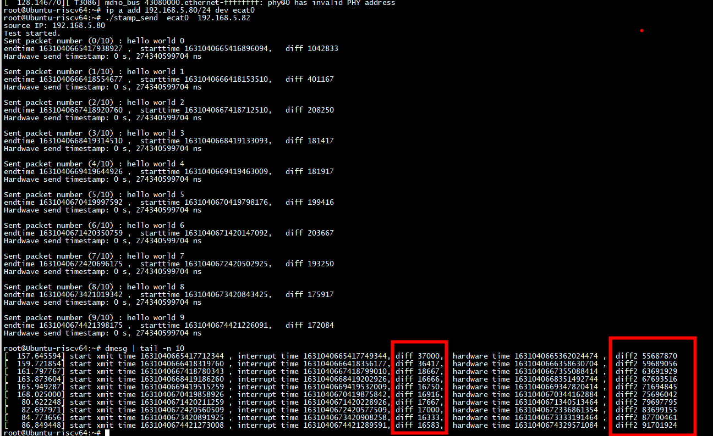

# struct sk_buff

```
struct sk_buff {

        union {
                ktime_t         tstamp;
                u64             skb_mstamp_ns; /* earliest departure time */
        };
```


# skb_hwtstamps
```
static inline struct skb_shared_hwtstamps *skb_hwtstamps(struct sk_buff *skb)
{
        return &skb_shinfo(skb)->hwtstamps;
}
```


#  skb_tx_timestamp

```

/**
 * skb_tx_timestamp() - Driver hook for transmit timestamping
 *
 * Ethernet MAC Drivers should call this function in their hard_xmit()
 * function immediately before giving the sk_buff to the MAC hardware.
 *
 * Specifically, one should make absolutely sure that this function is
 * called before TX completion of this packet can trigger.  Otherwise
 * the packet could potentially already be freed.
 *
 * @skb: A socket buffer.
 */
static inline void skb_tx_timestamp(struct sk_buff *skb)
{
        skb_clone_tx_timestamp(skb);
        if (skb_shinfo(skb)->tx_flags & SKBTX_SW_TSTAMP)
                skb_tstamp_tx(skb, NULL);
}
```

# macb_tx_interrupt读取dma的硬件时间戳

调用gem_ptp_do_txstamp

```
         skb = tx_skb->skb;

                        /* First, update TX stats if needed */
                        if (skb) {
                                if (unlikely(skb_shinfo(skb)->tx_flags &
                                             SKBTX_HW_TSTAMP) &&
                                    gem_ptp_do_txstamp(queue, skb, desc) == 0) {
                                        /* skb now belongs to timestamp buffer
                                         * and will be removed later
                                         */
                                        tx_skb->skb = NULL;
                                }
                                netdev_vdbg(bp->dev, "skb %u (data %p) TX complete\n",
                                            macb_tx_ring_wrap(bp, tail),
                                            skb->data);
                                bp->dev->stats.tx_packets++;
                                queue->stats.tx_packets++;
                                bp->dev->stats.tx_bytes += skb->len;
                                queue->stats.tx_bytes += skb->len;
                        }
```


# 测量

## gem_tstamp_tx

```C
static void gem_tstamp_tx(struct macb *bp, struct sk_buff *skb,
                          struct macb_dma_desc_ptp *desc_ptp)
{
        struct skb_shared_hwtstamps shhwtstamps;
        struct timespec64 ts;

        gem_hw_timestamp(bp, desc_ptp->ts_1, desc_ptp->ts_2, &ts);
        memset(&shhwtstamps, 0, sizeof(shhwtstamps));
        shhwtstamps.hwtstamp = ktime_set(ts.tv_sec, ts.tv_nsec);
        skb_tstamp_tx(skb, &shhwtstamps);
#if TEST_PTP_MEASURE
        ktime_t int_time = ktime_get_real();
        u64 diff =  int_time -  skb->tstamp;
        u64 diff2 =  skb->tstamp - shhwtstamps.hwtstamp;
        if(time_after64(shhwtstamps.hwtstamp,skb->tstamp))
        {
                diff2 =  shhwtstamps.hwtstamp  -  skb->tstamp;
                pr_info("skb->tstamp is smaller \n");
        }
        pr_info("start xmit time %llu , interrupt time %llu, diff %llu,  hardware time %llu ,  diff2 %llu \n", skb->tstamp, int_time,diff,shhwtstamps.hwtstamp, diff2);
#endif
}
```
# macb_start_xmit

```
static netdev_tx_t macb_start_xmit(struct sk_buff *skb, struct net_device *dev)
        /* Map socket buffer for DMA transfer */
        if (!macb_tx_map(bp, queue, skb, hdrlen)) {
                          
                dev_kfree_skb_any(skb);
                goto unlock;
        }

        /* Make newly initialized descriptor visible to hardware */
        wmb();
        skb_tx_timestamp(skb); 
#if TEST_PTP_MEASURE
        //struct skb_shared_hwtstamps shhwtstamps;
        //ktime_t time_start;
        //memset(&shhwtstamps, 0, sizeof(shhwtstamps));
        //shhwtstamps.hwtstamp = ktime_get();
        //skb_tstamp_tx(skb, &shhwtstamps);
        skb->tstamp = ktime_get_real();
#endif
```

##  run 



 