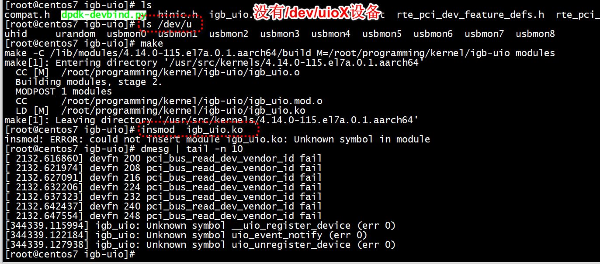
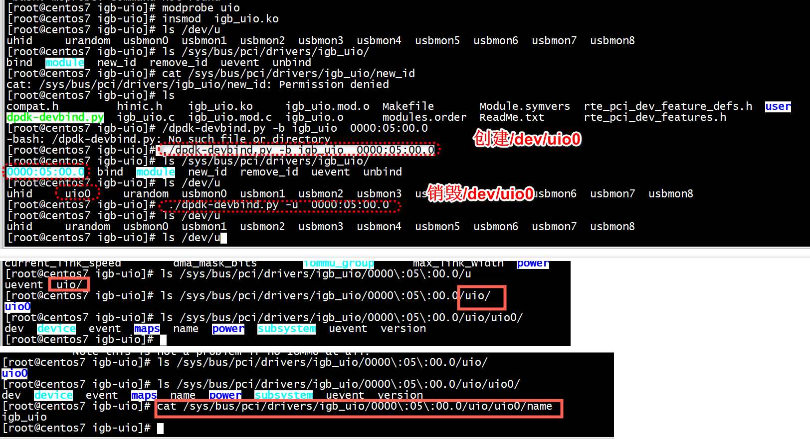

# make and install 
1. make sure you have install this

Fedora
  $sudo yum install kernel-headers
or
Ubuntu   
  $sudo apt-get install linux-headers-$(uname -r)

2. from this dir do this

$make 
$sudo modprobe uio
$sudo insmod igb_uio.ko


#  ./dpdk-devbind.py

```
[root@centos7 igb-uio]# ls /sys/bus/pci/drivers/igb_uio/new_id 
/sys/bus/pci/drivers/igb_uio/new_id
[root@centos7 igb-uio]# cat /sys/bus/pci/drivers/igb_uio/new_id 
cat: /sys/bus/pci/drivers/igb_uio/new_id: Permission denied
[root@centos7 igb-uio]# 
```

```
[root@centos7 igb-uio]# ./dpdk-devbind.py -s

Network devices using kernel driver
===================================
0000:05:00.0 'Hi1822 Family (2*100GE) 0200' if=enp5s0 drv=hinic unused=igb_uio 
0000:06:00.0 'Hi1822 Family (2*100GE) 0200' if=enp6s0 drv=hinic unused=igb_uio 
0000:7d:00.0 'HNS GE/10GE/25GE RDMA Network Controller a222' if=enp125s0f0 drv=hns3 unused=hns_roce_hw_v2,igb_uio *Active*
0000:7d:00.1 'HNS GE/10GE/25GE Network Controller a221' if=enp125s0f1 drv=hns3 unused=igb_uio 
0000:7d:00.2 'HNS GE/10GE/25GE RDMA Network Controller a222' if=enp125s0f2 drv=hns3 unused=hns_roce_hw_v2,igb_uio 
0000:7d:00.3 'HNS GE/10GE/25GE Network Controller a221' if=enp125s0f3 drv=hns3 unused=igb_uio 

No 'Baseband' devices detected
==============================

No 'Crypto' devices detected
============================

No 'Eventdev' devices detected
==============================

No 'Mempool' devices detected
=============================

No 'Compress' devices detected
==============================

No 'Misc (rawdev)' devices detected
===================================
[root@centos7 igb-uio]# ethtool -i enp5s0
driver: hinic
version: 
firmware-version: 
expansion-rom-version: 
bus-info: 0000:05:00.0
supports-statistics: no
supports-test: no
supports-eeprom-access: no
supports-register-dump: no
supports-priv-flags: no
[root@centos7 igb-uio]# ./dpdk-devbind.py -b hinic 0000:05:00.0
Notice: 0000:05:00.0 already bound to driver hinic, skipping
[root@centos7 igb-uio]# ethtool -i enp5s0
driver: hinic
version: 
firmware-version: 
expansion-rom-version: 
bus-info: 0000:05:00.0
supports-statistics: no
supports-test: no
supports-eeprom-access: no
supports-register-dump: no
supports-priv-flags: no
[root@centos7 igb-uio]# ./dpdk-devbind.py -b igb_uio  0000:05:00.0
[root@centos7 igb-uio]# ethtool -i enp5s0
Cannot get driver information: No such device
[root@centos7 igb-uio]# 
```

```
[root@centos7 igb-uio]# ./dpdk-devbind.py -s

Network devices using DPDK-compatible driver
0000:05:00.0 'Hi1822 Family (2*100GE) 0200' drv=igb_uio unused=hinic

Network devices using kernel driver
0000:06:00.0 'Hi1822 Family (2*100GE) 0200' if=enp6s0 drv=hinic unused=igb_uio 
0000:7d:00.0 'HNS GE/10GE/25GE RDMA Network Controller a222' if=enp125s0f0 drv=hns3 unused=hns_roce_hw_v2,igb_uio *Active*
0000:7d:00.1 'HNS GE/10GE/25GE Network Controller a221' if=enp125s0f1 drv=hns3 unused=igb_uio 
0000:7d:00.2 'HNS GE/10GE/25GE RDMA Network Controller a222' if=enp125s0f2 drv=hns3 unused=hns_roce_hw_v2,igb_uio 
0000:7d:00.3 'HNS GE/10GE/25GE Network Controller a221' if=enp125s0f3 drv=hns3 unused=igb_uio 
```


## ubind
```
[root@centos7 igb-uio]# ./dpdk-devbind.py -u  0000:05:00.0
[root@centos7 igb-uio]# 
```

# pci_dev->mem_resource


```
struct rte_mem_resource mem_resource[PCI_MAX_RESOURCE];
```

```
eth_em_dev_init(struct rte_eth_dev *eth_dev)
{
        hw->hw_addr = (void *)pci_dev->mem_resource[0].addr; //////////////
        hw->device_id = pci_dev->id.device_id;
        adapter->stopped = 0;

        /* For ICH8 support we'll need to map the flash memory BAR */
        if (eth_em_dev_is_ich8(hw))
                hw->flash_address = (void *)pci_dev->mem_resource[1].addr;//////////////

```

# user space test    

```Text
igb-uio/tools/debug/
```




> ##   /dev/uio0设备




```
[root@centos7 igb-uio]# cat /sys/bus/pci/drivers/igb_uio/0000\:05\:00.0/uio/uio0/name
igb_uio
[root@centos7 igb-uio]# 
```

+ 1 igbuio_setup_bars  --> igbuio_pci_setup_iomem 设置struct uio_info   

+ 2 register uio driver err = uio_register_device(&dev->dev, &udev->info);   

```
static int
igbuio_pci_setup_iomem(struct pci_dev *dev, struct uio_info *info,
                       int n, int pci_bar, const char *name)
{
        unsigned long addr, len;
        void *internal_addr;
        if (n >= ARRAY_SIZE(info->mem))
                return -EINVAL;

        addr = pci_resource_start(dev, pci_bar);
        len = pci_resource_len(dev, pci_bar);
        if (addr == 0 || len == 0)
                return -1;
        if (wc_activate == 0) {
                internal_addr = ioremap(addr, len);
                pr_info("wc_activate is set and internal_addr : %p, and addr %lx, and len %lx \n", internal_addr, addr, len);
                if (internal_addr == NULL)
                        return -1;
        } else {
                internal_addr = NULL;
        }
        if (0 == n)
        {
            print_hwif_attr(internal_addr);
        }
        info->mem[n].name = name;
        info->mem[n].addr = addr;
        info->mem[n].internal_addr = internal_addr;
        info->mem[n].size = len;
        info->mem[n].memtype = UIO_MEM_PHYS;
        return 0;
}
```


> ###  uio_mmap UIO_MEM_PHYS  --> remap_pfn_range
```
static int uio_mmap(struct file *filep, struct vm_area_struct *vma)
{
        struct uio_listener *listener = filep->private_data;
        struct uio_device *idev = listener->dev;
        int mi;
        unsigned long requested_pages, actual_pages;
        int ret = 0;

        if (vma->vm_end < vma->vm_start)
                return -EINVAL;

        vma->vm_private_data = idev;

        mutex_lock(&idev->info_lock);
        if (!idev->info) {
                ret = -EINVAL;
                goto out;
        }

        mi = uio_find_mem_index(vma);
        if (mi < 0) {
                ret = -EINVAL;
                goto out;
        }

        requested_pages = vma_pages(vma);
        actual_pages = ((idev->info->mem[mi].addr & ~PAGE_MASK)
                        + idev->info->mem[mi].size + PAGE_SIZE -1) >> PAGE_SHIFT;
        if (requested_pages > actual_pages) {
                ret = -EINVAL;
                goto out;
        }

        if (idev->info->mmap) {
                ret = idev->info->mmap(idev->info, vma);
                goto out;
        }

        switch (idev->info->mem[mi].memtype) {
                case UIO_MEM_PHYS:
                        ret = uio_mmap_physical(vma);
                        break;
                case UIO_MEM_LOGICAL:
                case UIO_MEM_VIRTUAL:
                        ret = uio_mmap_logical(vma);
                        break;
                default:
                        ret = -EINVAL;
        }

```

> ###  igbuio_pci_open

```
[346499.514246] [<ffff000000d902f4>] igbuio_pci_open+0x2c/0x2c0 [igb_uio]
[346499.520745] [<ffff00000097082c>] uio_open+0xb4/0x100 [uio]
```
```
        /* fill uio infos */
        udev->info.name = "igb_uio";
        udev->info.version = "0.1";
        udev->info.irqcontrol = igbuio_pci_irqcontrol;
        udev->info.open = igbuio_pci_open;
        udev->info.release = igbuio_pci_release;
        udev->info.priv = udev;
        udev->pdev = dev;
        atomic_set(&udev->refcnt, 0);
```


```
static int uio_open(struct inode *inode, struct file *filep)
{
 if (idev->info && idev->info->open)
                ret = idev->info->open(idev->info, inode);
```