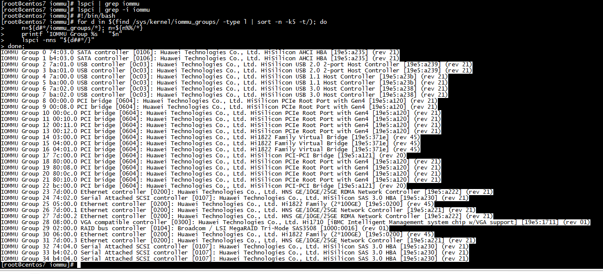
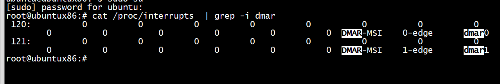

# pci iommu

```Shell
#!/bin/bash
for d in $(find /sys/kernel/iommu_groups/ -type l | sort -n -k5 -t/); do 
    n=${d#*/iommu_groups/*}; n=${n%%/*}
    printf 'IOMMU Group %s ' "$n"
    lspci -nns "${d##*/}"
done;

```


##  iommu_device_register

intel_iommu_ops
```C
        iommu_device_register(&iommu->iommu, &amd_iommu_ops, NULL);
        return pci_enable_device(iommu->dev);
```

## dmar interrupt




# unbind driver 
```
[root@centos7 igb-uio]# ./dpdk-devbind.py  -u 0000:05:00.0
[root@centos7 igb-uio]# ./dpdk-devbind.py  -s

```
# insmod  pci_test2.ko 
```
[root@centos7 iommu]# insmod  pci_test2.ko 
[root@centos7 iommu]# echo 0x19e5 0x0200 > /sys/bus/pci/drivers/PCIe_demo/new_id
[root@centos7 iommu]# dmesg | tail -n 10
[2527155.927089] ***************** pci iommu ************ 
[2527155.932299] dbg_added iommu_domain_alloc ok
[2527155.936651] dbg_added iommu_attach_device ok
[2527155.943100] dbg_added iommu_map ok
[2527155.946658]  phys_addr: 0000002100000000, my_iova: 0000000050100000 
[root@centos7 iommu]# 

[root@centos7 iommu_groups]# find ./ -name '*06*'
./31/devices/0000:06:00.0
[root@centos7 iommu_groups]#  ls /sys/kernel/iommu_groups/31/devices/
0000:06:00.0
[root@centos7 iommu_groups]#  ls /sys/kernel/iommu_groups/25/devices/
0000:05:00.0
[root@centos7 iommu_groups]# 
```

# reserved_regions

```
[root@centos7 iommu]# cat /sys/bus/pci/devices/0000:05:00.0/iommu_group/reserved_regions
0x0000000008000000 0x00000000080fffff msi
0x00000000e0000000 0x00000000f7feffff reserved
0x0000080000000000 0x0000082fffffffff reserved
[root@centos7 iommu]# 
```


# iommu_domain_alloc

```
struct iommu_domain *iommu_domain_alloc(struct bus_type *bus)
{
    return __iommu_domain_alloc(bus, IOMMU_DOMAIN_UNMANAGED);
}

static struct iommu_domain *__iommu_domain_alloc(struct bus_type *bus,
                         unsigned type)
{
    struct iommu_domain *domain;
        //判断bus和bus->iommu_ops  不能为null后
    if (bus == NULL || bus->iommu_ops == NULL)
        return NULL;

    //调用bus->iommu_ops->domain_alloc 申请domain
    domain = bus->iommu_ops->domain_alloc(type);
    if (!domain)
        return NULL;

//给domain的ops赋值为bus->iommu_ops
    domain->ops  = bus->iommu_ops;
    domain->type = type;
    /* Assume all sizes by default; the driver may override this later */
    domain->pgsize_bitmap  = bus->iommu_ops->pgsize_bitmap;

    return domain;
}
```

# arm_smmu_ops

```
[root@centos7 boot]# grep  ffff000008ecec38  System.map-4.14.0-115.el7a.0.1.aarch64
ffff000008ecec38 d arm_smmu_ops
[root@centos7 boot]# 
```


#  iommu_map


