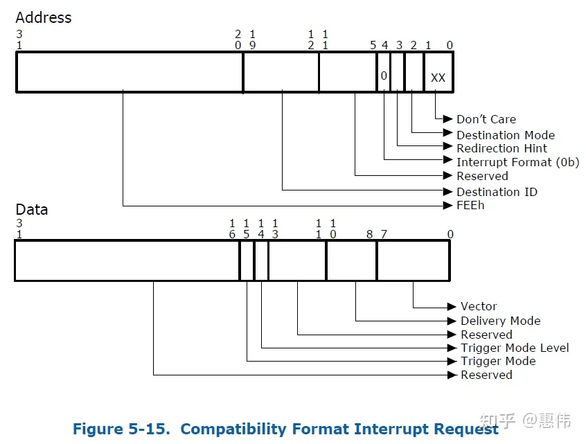
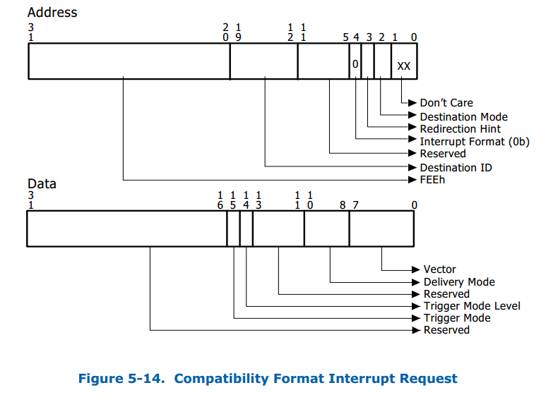
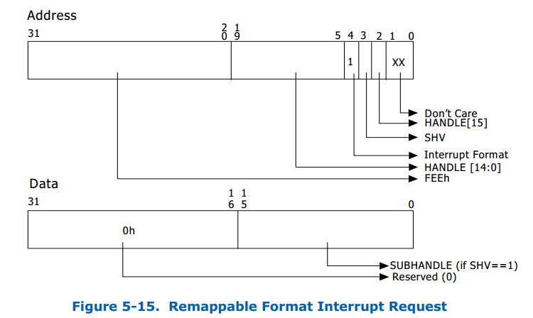
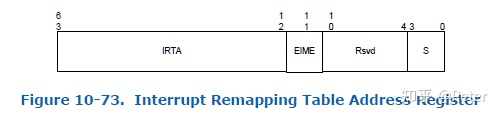

# arm_smmu_map

```

        //ret = iommu_map(mydomain, my_iova, page_to_phys(pages), PAGE_SIZE * 2,  IOMMU_READ | IOMMU_WRITE);
        //ret = arm_smmu_map(mydomain, my_iova, phys_addr, size, IOMMU_READ | IOMMU_WRITE);
        ret = (pdev->dev.bus)->iommu_ops->map(mydomain, my_iova, phys_addr, size, IOMMU_READ | IOMMU_WRITE);
```

```
./usertools/dpdk-devbind.py -u 0000:05:00.0
Warning: no supported DPDK kernel modules are loaded
```

```
[root@centos7 iommu]# echo 0x19e5 0x0200 > /sys/bus/pci/drivers/PCIe_demo/new_id
```

```
[root@centos7 iommu]# dmesg | tail -n 20
[1214848.855901] faa0: 0000ffffc495a1a0 ffff803f1d8cc300 0000000000000003 0000000000000000
[1214848.863867] fac0: 0000000080000000 0000000050100000 0000002100000000 0000000000000840
[1214848.871833] fae0: 0000000000010000 ffff803f1a4c8080 ffff803f1d8cc310 ffff00004268fb50
[1214848.879798] fb00: ffff000008565300 ffff00004268fb50 ffff000008565488 0000000020c00009
[1214848.887764] fb20: 0000000000010000 ffff00000985f198 ffffffffffffffff 0000000000010000
[1214848.895729] fb40: ffff00004268fb50 ffff000008565488
[1214848.900758] [<ffff000008565488>] __arm_lpae_map+0x2ac/0x2d0
[1214848.906476] [<ffff000008565300>] __arm_lpae_map+0x124/0x2d0
[1214848.912195] [<ffff000008565300>] __arm_lpae_map+0x124/0x2d0
[1214848.917914] [<ffff000008565580>] arm_lpae_map+0xd4/0x130
[1214848.923376] [<ffff00000856a7d0>] arm_smmu_map+0x48/0x5c
[1214848.928751] [<ffff000000df0144>] PCIe_probe+0x12c/0x1d8 [pci_test2]
[1214848.935162] [<ffff000008475fa8>] local_pci_probe+0x48/0xb0
[1214848.940795] [<ffff0000080ed870>] work_for_cpu_fn+0x24/0x34
[1214848.946428] [<ffff0000080f13ac>] process_one_work+0x174/0x3b0
[1214848.952319] [<ffff0000080f180c>] worker_thread+0x224/0x48c
[1214848.957952] [<ffff0000080f8638>] kthread+0x10c/0x138
[1214848.963067] [<ffff000008084f54>] ret_from_fork+0x10/0x18
[1214848.968527] ---[ end trace 3fc9ce22f4375431 ]---
[1214848.973306] dbg_added iommu_map error
```

## arm_lpae_map

1) arm_smmu_attach_dev  -> arm_smmu_domain_finalise -> alloc_io_pgtable_ops 
     -> io_pgtable_init_table -> io_pgtable_arm_64_lpae_s1_init_fns 
	    -> arm_64_lpae_alloc_pgtable_s1 -> __arm_lpae_alloc_pages -> dma_map_single.
dma_map_single函数的作用就是接收一个虚拟地址，然后建立起需要做的IOMMU映射，然后返回设备访问的总线地址Z。然后通知设备对Z地址做DMA映射，得到物理地址。

2)arm_lpae_map -> __arm_lpae_map -> arm_lpae_install_table 
             -> __arm_lpae_sync_pte -> dma_sync_single_for_device。
dma_sync_single_for_device的作用是在让设备能够再次访问DMA区域前调用，将之前CPU访问过的状态进行同步。

```

static int arm_smmu_map(struct iommu_domain *domain, unsigned long iova,
                        phys_addr_t paddr, size_t size, int prot)
{
        struct io_pgtable_ops *ops = to_smmu_domain(domain)->pgtbl_ops;

        if (!ops)
                return -ENODEV;

        return ops->map(ops, iova, paddr, size, prot);
}


static int arm_lpae_map(struct io_pgtable_ops *ops, unsigned long iova,
                        phys_addr_t paddr, size_t size, int iommu_prot)
{
        struct arm_lpae_io_pgtable *data = io_pgtable_ops_to_data(ops);
        arm_lpae_iopte *ptep = data->pgd;
        int ret, lvl = ARM_LPAE_START_LVL(data);
        arm_lpae_iopte prot;

        /* If no access, then nothing to do */
        if (!(iommu_prot & (IOMMU_READ | IOMMU_WRITE)))
                return 0;

        if (WARN_ON(iova >= (1ULL << data->iop.cfg.ias) ||
                    paddr >= (1ULL << data->iop.cfg.oas)))
                return -ERANGE;

        prot = arm_lpae_prot_to_pte(data, iommu_prot);
        ret = __arm_lpae_map(data, iova, paddr, size, prot, lvl, ptep);
        /*
         * Synchronise all PTE updates for the new mapping before there's
         * a chance for anything to kick off a table walk for the new iova.
         */
        wmb();

        return ret;
}

static void *__arm_lpae_alloc_pages(size_t size, gfp_t gfp,
                                    struct io_pgtable_cfg *cfg)
{
        struct device *dev = cfg->iommu_dev;
        dma_addr_t dma;
        void *pages = alloc_pages_exact(size, gfp | __GFP_ZERO);

        if (!pages)
                return NULL;

        if (!(cfg->quirks & IO_PGTABLE_QUIRK_NO_DMA)) {
                dma = dma_map_single(dev, pages, size, DMA_TO_DEVICE);  /////////////////////////////////
                if (dma_mapping_error(dev, dma))
                        goto out_free;
                /*
                 * We depend on the IOMMU being able to work with any physical
                 * address directly, so if the DMA layer suggests otherwise by
                 * translating or truncating them, that bodes very badly...
                 */
                if (dma != virt_to_phys(pages))
                        goto out_unmap;
        }

        return pages;

out_unmap:
        dev_err(dev, "Cannot accommodate DMA translation for IOMMU page tables\n");
        dma_unmap_single(dev, dma, size, DMA_TO_DEVICE);
out_free:
        free_pages_exact(pages, size);
        return NULL;
}

static void __arm_lpae_sync_pte(arm_lpae_iopte *ptep,
                                struct io_pgtable_cfg *cfg)
{
        dma_sync_single_for_device(cfg->iommu_dev, __arm_lpae_dma_addr(ptep),
                                   sizeof(*ptep), DMA_TO_DEVICE); //////////////////////////////
}
```
***总结***
   
struct dma_map_ops iommu_dma_ops ->

        struct iommu_ops arm_iommu_op ->

                struct io_pgtable_ops
				
# interrupt remmaping

 ## MSI
 
通过DMA写物理地址0x0FEE_XXXX来产生中断，PCI config space中有MSI Address和Data寄存器，驱动配置这两个寄存器，Address寄存器中有Destination ID，表示Local APIC ID，Address寄存器所有字段组合起来就是x0FEE_XXXX，Data寄存器有vector号，表示中断号。



## Interrupt Remapping

Interrupt Remapping的出现改变了x86体系结构上的中断投递方式，外部中断源发出的中断请求格式发生了较大的改变， 中断请求会先被中断重映射硬件截获后再通过查询中断重映射表的方式最终投递到目标CPU上。 这些外部设备中断源则包括了中断控制器(I/OxAPICs)以及MSI/MSIX兼容设备PCI/PCIe设备等。 Interrupt Remapping是需要硬件来支持的，这里的硬件应该主要是指的IOMMU（尽管intel手册并没有直接说明），Interrupt Remapping的Capability是通过Extended Capability Register来报告的。

在没有使能Interrupt Remapping的情况下，设备中断请求格式称之为Compatibility format，其结构主要包含一个32bit的Address和一个32bit的Data字段，Address字段包含了中断要投递的目标CPU的APIC ID信息，Data字段主要包含了要投递的vecotr号和投递方式。结构如下图：



其中Address的bit 4为Interrupt Format位，用来标志这个Request是Compatibility format（bit4=0）还是Remapping format (bit 4=1)。

在开启了Interrupt Remapping之后，设备的中断请求格式称之为Remapping format，其结构同样由一个32bit的Address和一个32bit的Data字段构成。但与Compatibility format不同的是此时Adress字段不再包含目标CPU的APIC ID信息而是提供了一个16bit的HANDLE索引，并且Address的bit 4为"1"表示Request为Remapping format。同时bit 3是一个标识位(SHV)，用来标志Request是否包含了SubHandle，当该位置位时表示Data字段的低16bit为SubHandle索引。Remapping format的中断请求格式如下图：




在Interrupt Remapping模式下，***硬件查询系统软件在内存中预设的中断重映射表(Interrupt Remapping Table)来投递中断***。中断重映射表由中断重映射表项(Interrupt Remapping Table Entry)构成，每个IRTE占用128bit（具体格式介绍见文末），中断重映射表的基地址存放在Interrupt Remapping Table Address Register中。硬件通过下面的方式去计算中断的interrupt_index：

```
if (address.SHV == 0) {
    interrupt_index = address.handle;
} else {
    interrupt_index = (address.handle + data.subhandle);
}
```

Interrupt Remap Table Address Register用来指向中断重映射表的位置。系统软件通常是OS/VMM需要program这个寄存器。



中断重映射表每个item大小为16Bytes叫做Interrupt Remap Table Entry（IRET）它包含了重映射之后的中断相关的Destination ID、Vector、Trigger Mode、Delivery Mode等信息。

***当IOMMU硬件逻辑检测到0xFEEX_XXXXh的内存写请求之后***，它就认为这是一个中断请求，然后检测中断重映射有没有开启，以及中断请求的格式是否是可重映射格式，如果都符合就进一步检测Address/Data中数据的有效性，然后算出interrupt_index并用它作为索引找到对应的IRTE，然后按照IRTE的设置产生一个新的传递给CPU的中断。

对于设备产生MSI/MSIX类型的中断我们比较容易理解怎么让它产生可重映射的中断，因为它的Address/Data的寄存器和上文提到的格式很像，我们只要把Bit4设置成1就是可重映射类型的中断了。

***在直通设备情况下，外设发出的MSI中断需要在iommu做重映射，先映射到host上某一个中断源上以后，由这个中断处理函数负责将投递到guest***

## vfio interrupt remapping

vfio在使用interrupt remapping主要使能函数是vfio_msi_enable与vfio_msi_set_block，前者主要在host分配pci相关的中断vector，以及调用intel_irq_remapping_alloc准备irte表项，而后者针对每一个vector中断在host上申请中断处理函数vfio_msihandler，主要作用就是换下irqfd，通过kvm_set_irq进行中断注入。

```
     ret = request_irq(irq, vfio_msihandler, 0,
               vdev->ctx[vector].name, trigger);
     if (ret) {
         kfree(vdev->ctx[vector].name);
         eventfd_ctx_put(trigger);
         return ret;
     }

     vdev->ctx[vector].producer.token = trigger;
     vdev->ctx[vector].producer.irq = irq;
     ret = irq_bypass_register_producer(&vdev->ctx[vector].producer)
```


```
  static irqreturn_t vfio_msihandler(int irq, void *arg)
  {
      struct eventfd_ctx *trigger = arg;
 
      eventfd_signal(trigger, 1);
      return IRQ_HANDLED;
  }
```

# references

[VFIO(Virtual Function IO)研究](https://cloud.tencent.com/developer/article/1816469)


