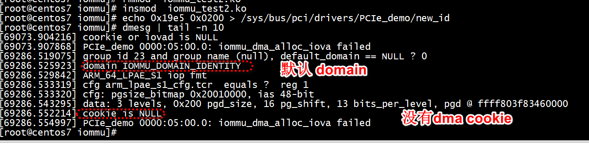
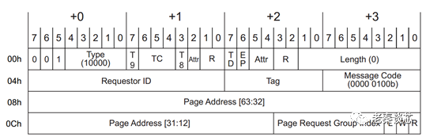
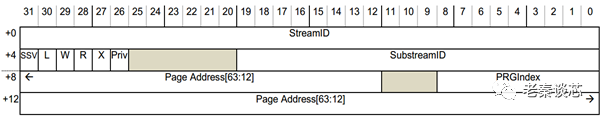
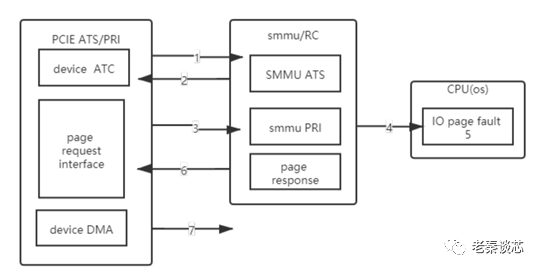

# NULL == cookie and NULL == iovad 导致 cordump


```
static dma_addr_t iommu_dma_alloc_iova(struct iommu_domain *domain,
                size_t size, dma_addr_t dma_limit, struct device *dev)
{
        struct iommu_dma_cookie *cookie = domain->iova_cookie;
        struct iova_domain *iovad ;
        unsigned long shift, iova_len, iova = 0;

        if(NULL == cookie)
        {
             pr_err("cookie is NULL \n");
             return 0;
        }
        iovad = &cookie->iovad;
        if(NULL == iovad)
        {
             pr_err("iovad is NULL \n");
             return 0;
        }
```


#  insmod  iommu_test.ko 
```
./dpdk-devbind.py  -u 0000:05:00.0
[root@centos7 iommu]# rmmod hinic
[root@centos7 iommu]# insmod  iommu_test.ko 
[root@centos7 iommu]# echo 0x19e5 0x0200 > /sys/bus/pci/drivers/PCIe_demo/new_id
```
+ 1 支持ARM_64_LPAE_S1地址转换    
+ 2 pgd @ ffff803fd18d0000 用户存储页表   
+ 3 arm_lpae_s1_cfg.tcr存储配置信息从test_arm_64_lpae_alloc_pgtable_s1可以看出    
+ 4 test_arm_lpae_dump_ops 可以查看smmu页表结构   
```
[69911.330962] ARM_64_LPAE_S1 iop fmt 
[69911.334441] cfg arm_lpae_s1_cfg.tcr  equals ?  reg 1
[69911.334442] cfg: pgsize_bitmap 0x20010000, ias 48-bit
[69911.344417] data: 3 levels, 0x200 pgd_size, 16 pg_shift, 13 bits_per_level, pgd @ ffff803fd18d0000
[69911.353344] matched pa 0x3f84060000 <-> 0x3f84060000, test_arm_lpae_iova_to_phys: 0x3f84060000
[69911.361919] matched pa 0x3f83460000 <-> 0x3f83460000, test_arm_lpae_iova_to_phys: 0x3f83460000
[69911.370490] matched pa 0x3fd0990000 <-> 0x3fd0990000, test_arm_lpae_iova_to_phys: 0x3fd0990000
[69911.379066] matched pa 0x3fcf6e0000 <-> 0x3fcf6e0000, test_arm_lpae_iova_to_phys: 0x3fcf6e0000
[69911.387641] pci iommu test successfully
```
 
# iommu_test2

> ## IOMMU_DOMAIN_UNMANAGED vs. IOMMU_DOMAIN_DMA

有四种domain，init_dmars中用到了IOMMU_DOMAIN_IDENTITY，这个类型的domain只能有一个，kvm和dpdk会用到IOMMU_DOMAIN_UNMANAGED，一个qemu或者一个dpdk进程一个domain。IOMMU_DOMAIN_BLOCKED和IOMMU_DOMAIN_DMA是内核用到，它和iommu group有关系，一个group对应一个domain，一个group有可能有多个dev，这个和pci硬件结构有关系，详见函数pci_device_group。
```Text
a. IOMMU_DOMAIN_UNMANAGED    - DMA mappings managed by IOMMU-API user, used for VMs
b. IOMMU_DOMAIN_DMA    - Internally used for DMA-API implementations. This flag allows IOMMU drivers to implement certain optimizations for these domains

IOMMU_DOMAIN_DMA对应default_domain
IOMMU_DOMAIN_UNMANAGED对应VFIO, 或者GPU自行创建的domain
```
+ 多个domain解决的问题： 用户态发起的DMA，它自己在分配iova，直接设置下来，要求iommu就用这个iova，内核对这个设备做dma_map，也要分配iova， 两者（两个iova）冲突产生。   

 解决办法 就是：   
VFIO：默认情况下，iommu（应该是DMA设备，而不是IOMMU）上会绑定一个default_domain，它具有IOMMU_DOMAIN_DMA属性，原来怎么弄就怎么弄，这时你可以调用dma_map()。但如果你要用VFIO，你就要（DMA设备）先detach原来的驱动，改用VFIO的驱动，VFIO就给你换一个domain，这个domain的属性是IOMMU_DOMAIN_UNMANAGED，之后你爱用哪个iova就用那个iova，你自己保证不会冲突就好，VFIO通过iomm

+ 执行如下，会导致系统挂掉

```
domain = test_iommu_domain_alloc(&pci_bus_type,IOMMU_DOMAIN_DMA);
```

> ## dma_cookie

```
int iommu_get_dma_cookie(struct iommu_domain *domain)
{
        if (domain->iova_cookie)
                return -EEXIST;

        domain->iova_cookie = cookie_alloc(IOMMU_DMA_IOVA_COOKIE);
        if (!domain->iova_cookie)
                return -ENOMEM;

        return 0;
}
EXPORT_SYMBOL(iommu_get_dma_cookie);
```

 
 
 
```
domain = test_iommu_domain_alloc(&pci_bus_type,IOMMU_DOMAIN_UNMANAGED);
    //domain = test_iommu_domain_alloc(&pci_bus_type,IOMMU_DOMAIN_DMA);
```
IOMMU_DOMAIN_UNMANAGED没有dma cookie

# SMMU 重要寄存器记录
smmu寄存器分为secure 和non-secure   
secure 为0x8000开头   
1）SMMU_STRTAB_BASE：STE 表基地址   
2） SMMU_STRTAB_BASE_CFG： 控制STE表是线性还是2level，以及ste表大小。   
3） SMMU_CMDQ_BASE： 配置cmd queue   
4）SMMU_EVTQ_BASE   


```
        writel_relaxed(reg, smmu->base + ARM_SMMU_CR1);

        /* CR2 (random crap) */
        reg = CR2_PTM | CR2_RECINVSID | CR2_E2H;
        writel_relaxed(reg, smmu->base + ARM_SMMU_CR2);

        /* Stream table */
        writeq_relaxed(smmu->strtab_cfg.strtab_base,
                       smmu->base + ARM_SMMU_STRTAB_BASE);
        writel_relaxed(smmu->strtab_cfg.strtab_base_cfg,
                       smmu->base + ARM_SMMU_STRTAB_BASE_CFG);

        /* Command queue */
        writeq_relaxed(smmu->cmdq.q.q_base, smmu->base + ARM_SMMU_CMDQ_BASE);
        writel_relaxed(smmu->cmdq.q.prod, smmu->base + ARM_SMMU_CMDQ_PROD);
        writel_relaxed(smmu->cmdq.q.cons, smmu->base + ARM_SMMU_CMDQ_CONS);
```
> ## smmu->base
```
        res = platform_get_resource(pdev, IORESOURCE_MEM, 0);
        ioaddr = res->start;
        smmu->base = devm_ioremap_resource(dev, res);
```

> ##  ARM_SMMU_STRTAB_BASE

[深入浅出 Linux 中的 ARM IOMMU SMMU I](https://www.jianshu.com/p/0cb9321127a7)

初始化流表配置结构体 struct arm_smmu_strtab_cfg 的流表基址，流表项个数，和流表配置值等字段，其中的流表配置值将在后面被写入 SMMU_STRTAB_BASE_CFG 寄存器；   

+ 分配dma coherent内存流表   
```
static int arm_smmu_init_strtab_2lvl(struct arm_smmu_device *smmu)
{
strtab = dmam_alloc_coherent(smmu->dev, l1size, &cfg->strtab_dma,
                                     GFP_KERNEL | __GFP_ZERO);
}
```

```
static int arm_smmu_init_strtab(struct arm_smmu_device *smmu)
{
        u64 reg;
        int ret;

        if (smmu->features & ARM_SMMU_FEAT_2_LVL_STRTAB)
                ret = arm_smmu_init_strtab_2lvl(smmu);
        else
                ret = arm_smmu_init_strtab_linear(smmu);

        if (ret)
                return ret;

        /* Set the strtab base address */
        reg  = smmu->strtab_cfg.strtab_dma &
               STRTAB_BASE_ADDR_MASK << STRTAB_BASE_ADDR_SHIFT;
        reg |= STRTAB_BASE_RA;
        smmu->strtab_cfg.strtab_base = reg;

        /* Allocate the first VMID for stage-2 bypass STEs */
        set_bit(0, smmu->vmid_map);
        return 0;
}
```
+ 流表基地址写入smmu->base + ARM_SMMU_STRTAB_BASE    

```
writeq_relaxed(smmu->strtab_cfg.strtab_base,
                       smmu->base + ARM_SMMU_STRTAB_BASE);
```

#  iommu_map_dma pin memory
iommu_map_dma
```
iommu_map_dma  vfio_pin_map_dma
```

#  struct io_pgtable_ops -> arm_lpae_iova_to_phys

```
static struct arm_lpae_io_pgtable *
arm_lpae_alloc_pgtable(struct io_pgtable_cfg *cfg)
{
        unsigned long va_bits, pgd_bits;
        struct arm_lpae_io_pgtable *data;

        arm_lpae_restrict_pgsizes(cfg);

        if (!(cfg->pgsize_bitmap & (SZ_4K | SZ_16K | SZ_64K)))
                return NULL;

        if (cfg->ias > ARM_LPAE_MAX_ADDR_BITS)
                return NULL;

        if (cfg->oas > ARM_LPAE_MAX_ADDR_BITS)
                return NULL;

        if (!selftest_running && cfg->iommu_dev->dma_pfn_offset) {
                dev_err(cfg->iommu_dev, "Cannot accommodate DMA offset for IOMMU page tables\n");
                return NULL;
        }

        data = kmalloc(sizeof(*data), GFP_KERNEL);
        if (!data)
                return NULL;

        data->pg_shift = __ffs(cfg->pgsize_bitmap);
        data->bits_per_level = data->pg_shift - ilog2(sizeof(arm_lpae_iopte));

        va_bits = cfg->ias - data->pg_shift;
        data->levels = DIV_ROUND_UP(va_bits, data->bits_per_level);

        /* Calculate the actual size of our pgd (without concatenation) */
        pgd_bits = va_bits - (data->bits_per_level * (data->levels - 1));
        data->pgd_size = 1UL << (pgd_bits + ilog2(sizeof(arm_lpae_iopte)));

        data->iop.ops = (struct io_pgtable_ops) {
                .map            = arm_lpae_map,
                .unmap          = arm_lpae_unmap,
                .iova_to_phys   = arm_lpae_iova_to_phys,
        };

        return data;
}
```
#  arm_lpae_map
```
iommu_map  --> arm_smmu_map -->   arm_lpae_map-->   __arm_lpae_map
``` 
arm_lpae_map -> __arm_lpae_map -> arm_lpae_install_table -> __arm_lpae_sync_pte -> dma_sync_single_for_device。
dma_sync_single_for_device的作用是在让设备能够再次访问DMA区域前调用，将之前CPU访问过的状态进行同步   


#  arm_lpae_iova_to_phys
```
static phys_addr_t arm_lpae_iova_to_phys(struct io_pgtable_ops *ops,
                                         unsigned long iova)
{
        struct arm_lpae_io_pgtable *data = io_pgtable_ops_to_data(ops);
        arm_lpae_iopte pte, *ptep = data->pgd;
        int lvl = ARM_LPAE_START_LVL(data);

        do {
                /* Valid IOPTE pointer? */
                if (!ptep)
                        return 0;

                /* Grab the IOPTE we're interested in */
                ptep += ARM_LPAE_LVL_IDX(iova, lvl, data);
                pte = READ_ONCE(*ptep);

                /* Valid entry? */
                if (!pte)
                        return 0;

                /* Leaf entry? */
                if (iopte_leaf(pte,lvl))
                        goto found_translation;

                /* Take it to the next level */
                ptep = iopte_deref(pte, data);
        } while (++lvl < ARM_LPAE_MAX_LEVELS);

        /* Ran out of page tables to walk */
        return 0;

found_translation:
        iova &= (ARM_LPAE_BLOCK_SIZE(lvl, data) - 1);
        return ((phys_addr_t)iopte_to_pfn(pte,data) << data->pg_shift) | iova;
}
```

# 页表

+ 1  pgd
```
   /* Allocate pgd pages */
        data->pgd = __arm_lpae_alloc_pages(data->pgd_size, GFP_KERNEL, cfg);
```

#  arm_iommu_unmap_page
```
static void arm_iommu_unmap_page(struct device *dev, dma_addr_t handle,
		size_t size, enum dma_data_direction dir, unsigned long attrs)
{
	struct dma_iommu_mapping *mapping = to_dma_iommu_mapping(dev);
	dma_addr_t iova = handle & PAGE_MASK;
	struct page *page = phys_to_page(iommu_iova_to_phys(mapping->domain, iova));
	int offset = handle & ~PAGE_MASK;
	int len = PAGE_ALIGN(size + offset);

	if (!iova)
		return;

	if ((attrs & DMA_ATTR_SKIP_CPU_SYNC) == 0)
		__dma_page_dev_to_cpu(page, offset, size, dir);

	iommu_unmap(mapping->domain, iova, len);
	__free_iova(mapping, iova, len);
}
```

#  pci_vfio_setup_dma_maps  VFIO_IOMMU_MAP_DMA

```
/* set up DMA mappings */
static int
pci_vfio_setup_dma_maps(int vfio_container_fd)
{
	const struct rte_memseg *ms = rte_eal_get_physmem_layout();
	int i, ret;

	ret = ioctl(vfio_container_fd, VFIO_SET_IOMMU,
			VFIO_TYPE1_IOMMU);
	if (ret) {
		RTE_LOG(ERR, EAL, "  cannot set IOMMU type, "
				"error %i (%s)\n", errno, strerror(errno));
		return -1;
	}

	/* map all DPDK segments for DMA. use 1:1 PA to IOVA mapping */
	for (i = 0; i < RTE_MAX_MEMSEG; i++) {
		struct vfio_iommu_type1_dma_map dma_map;

		if (ms[i].addr == NULL)
			break;

		memset(&dma_map, 0, sizeof(dma_map));
		dma_map.argsz = sizeof(struct vfio_iommu_type1_dma_map);
		dma_map.vaddr = ms[i].addr_64;
		dma_map.size = ms[i].len;
		dma_map.iova = ms[i].phys_addr;
		dma_map.flags = VFIO_DMA_MAP_FLAG_READ | VFIO_DMA_MAP_FLAG_WRITE;

		ret = ioctl(vfio_container_fd, VFIO_IOMMU_MAP_DMA, &dma_map);

		if (ret) {
			RTE_LOG(ERR, EAL, "  cannot set up DMA remapping, "
					"error %i (%s)\n", errno, strerror(errno));
			return -1;
		}
	}

	return 0;
}
```


```
/* set up interrupt support (but not enable interrupts) */
static int
pci_vfio_setup_interrupts(struct rte_pci_device *dev, int vfio_dev_fd)
{
	int i, ret, intr_idx;

	/* default to invalid index */
	intr_idx = VFIO_PCI_NUM_IRQS;

	/* get interrupt type from internal config (MSI-X by default, can be
	 * overriden from the command line
	 */
	switch (internal_config.vfio_intr_mode) {
	case RTE_INTR_MODE_MSIX:
		intr_idx = VFIO_PCI_MSIX_IRQ_INDEX;
		break;
	case RTE_INTR_MODE_MSI:
		intr_idx = VFIO_PCI_MSI_IRQ_INDEX;
		break;
	case RTE_INTR_MODE_LEGACY:
		intr_idx = VFIO_PCI_INTX_IRQ_INDEX;
		break;
	/* don't do anything if we want to automatically determine interrupt type */
	case RTE_INTR_MODE_NONE:
		break;
	default:
		RTE_LOG(ERR, EAL, "  unknown default interrupt type!\n");
		return -1;
	}

	/* start from MSI-X interrupt type */
	for (i = VFIO_PCI_MSIX_IRQ_INDEX; i >= 0; i--) {
		struct vfio_irq_info irq = { .argsz = sizeof(irq) };
		int fd = -1;

		/* skip interrupt modes we don't want */
		if (internal_config.vfio_intr_mode != RTE_INTR_MODE_NONE &&
				i != intr_idx)
			continue;

		irq.index = i;

		ret = ioctl(vfio_dev_fd, VFIO_DEVICE_GET_IRQ_INFO, &irq);
		if (ret < 0) {
			RTE_LOG(ERR, EAL, "  cannot get IRQ info, "
					"error %i (%s)\n", errno, strerror(errno));
			return -1;
		}

		/* if this vector cannot be used with eventfd, fail if we explicitly
		 * specified interrupt type, otherwise continue */
		if ((irq.flags & VFIO_IRQ_INFO_EVENTFD) == 0) {
			if (internal_config.vfio_intr_mode != RTE_INTR_MODE_NONE) {
				RTE_LOG(ERR, EAL,
						"  interrupt vector does not support eventfd!\n");
				return -1;
			} else
				continue;
		}

		/* set up an eventfd for interrupts */
		fd = eventfd(0, 0);
		if (fd < 0) {
			RTE_LOG(ERR, EAL, "  cannot set up eventfd, "
					"error %i (%s)\n", errno, strerror(errno));
			return -1;
		}

		dev->intr_handle.fd = fd;
		dev->intr_handle.vfio_dev_fd = vfio_dev_fd;

		switch (i) {
		case VFIO_PCI_MSIX_IRQ_INDEX:
			internal_config.vfio_intr_mode = RTE_INTR_MODE_MSIX;
			dev->intr_handle.type = RTE_INTR_HANDLE_VFIO_MSIX;
			break;
		case VFIO_PCI_MSI_IRQ_INDEX:
			internal_config.vfio_intr_mode = RTE_INTR_MODE_MSI;
			dev->intr_handle.type = RTE_INTR_HANDLE_VFIO_MSI;
			break;
		case VFIO_PCI_INTX_IRQ_INDEX:
			internal_config.vfio_intr_mode = RTE_INTR_MODE_LEGACY;
			dev->intr_handle.type = RTE_INTR_HANDLE_VFIO_LEGACY;
			break;
		default:
			RTE_LOG(ERR, EAL, "  unknown interrupt type!\n");
			return -1;
		}

		return 0;
	}

	/* if we're here, we haven't found a suitable interrupt vector */
	return -1;
}
```

# 缺页处理  
在ATS规范中，Page Request Interface Extension是一个相对独立的功能，通过Page Request Interface（PRI）可以使内存在做DMA的时候不用强制PIN在内存中，所谓PIN在内存中是指，将DMA要访问的内存数据页在使用过程中一直保持在内存中，不能换出到后备存储器，也不能迁移到其他物理页。有了PRI该问题得到了解决，在设备做DMA的过程中不需要保证物理页常驻内存，只需要遇到不在内存的时候通过增加PRI的过程换入所需的页即可。Page Request InterfaceExtension可以帮助function发出pagerequest包，包格式图如下：



硬件上SMMU配合PCIE PRI增加PRI queue，用来接收pcie的page request包对应的请求数据，SMMU硬件将数据写入PRI queue中。



如图为PRI queue中的数据格式，StreamID对应PCIE包的requestorID，substreamID对应PCIE包的PASID，page address为function请求的页地址。以上数据会随着PCIE的PRI请求不断写入PRI queue，由CPU去逐一处理。

以上看似零散的功能在下边的应用例子中，我们能看到他们的合理性。


如图所示，动态过程如下：

+ 1 PCIE Device首先通过本地ATC查找某页地址的转换，未成功则通过ATS发起针对页地址的translation request   
+ 2 SMMU收到RC的地址转换请求，查找本地TLB，如果没有，硬件进行page table    walk,若页表不存在或者页不在内存中，则需要返回translationfault给PCIE device.   
+ 3 PCIE PRI 发起page request给RC，携带streamID,substreamID,地址等信息   
+ 4 SMMU获得该信息后组成数据格式包放入PRI queue ，并产生中断通知CPU（OS）   
+ 5 OS 内存管理子系统将缺页补上，即处理IO Page fault handling   
+ 6 SMMU(RC)通过response告知device,发送page response,页处理完成，该内存页已经准备好，可进行DMA操作
PCIE Device发起DMA操作   