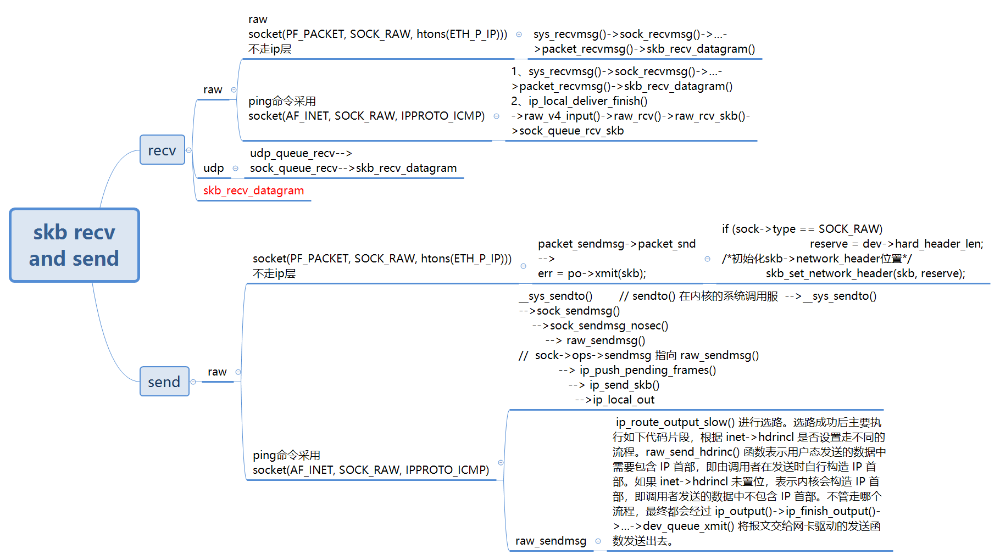

#  ip_route_output_key

```

static void icmp_reply(struct icmp_bxm *icmp_param, struct sk_buff *skb)
{
        struct ipcm_cookie ipc;
        struct rtable *rt = skb_rtable(skb);
        struct net *net = dev_net(rt->dst.dev);
        struct flowi4 fl4;
        struct sock *sk;
        struct inet_sock *inet;
        __be32 daddr, saddr;
        u32 mark = IP4_REPLY_MARK(net, skb->mark);
        int type = icmp_param->data.icmph.type;
        int code = icmp_param->data.icmph.code;

        if (ip_options_echo(net, &icmp_param->replyopts.opt.opt, skb))
                return;

        /* Needed by both icmp_global_allow and icmp_xmit_lock */
        local_bh_disable();

        /* global icmp_msgs_per_sec */
        if (!icmpv4_global_allow(net, type, code))
                goto out_bh_enable;

        sk = icmp_xmit_lock(net);
        if (!sk)
                goto out_bh_enable;
        inet = inet_sk(sk);

        icmp_param->data.icmph.checksum = 0;

        ipcm_init(&ipc);
        inet->tos = ip_hdr(skb)->tos;
        ipc.sockc.mark = mark;
        daddr = ipc.addr = ip_hdr(skb)->saddr;
        saddr = fib_compute_spec_dst(skb);

        if (icmp_param->replyopts.opt.opt.optlen) {
                ipc.opt = &icmp_param->replyopts.opt;
                if (ipc.opt->opt.srr)
                        daddr = icmp_param->replyopts.opt.opt.faddr;
        }
        memset(&fl4, 0, sizeof(fl4));
        fl4.daddr = daddr;
        fl4.saddr = saddr;
        fl4.flowi4_mark = mark;
        fl4.flowi4_uid = sock_net_uid(net, NULL);
        fl4.flowi4_tos = RT_TOS(ip_hdr(skb)->tos);
        fl4.flowi4_proto = IPPROTO_ICMP;
        fl4.flowi4_oif = l3mdev_master_ifindex(skb->dev);
        security_skb_classify_flow(skb, flowi4_to_flowi_common(&fl4));
        rt = ip_route_output_key(net, &fl4);
        if (IS_ERR(rt))
                goto out_unlock;
        if (icmpv4_xrlim_allow(net, rt, &fl4, type, code))
                icmp_push_reply(sk, icmp_param, &fl4, &ipc, &rt);
        ip_rt_put(rt);
out_unlock:
        icmp_xmit_unlock(sk);
out_bh_enable:
        local_bh_enable();
}
```

#  icmp_route_lookup

```

        rt = icmp_route_lookup(net, &fl4, skb_in, iph, saddr, tos, mark,
                               type, code, &icmp_param);
        if (IS_ERR(rt))
                goto out_unlock;

        /* peer icmp_ratelimit */
        if (!icmpv4_xrlim_allow(net, rt, &fl4, type, code))
                goto ende;

        /* RFC says return as much as we can without exceeding 576 bytes. */

        room = dst_mtu(&rt->dst);
        if (room > 576)
                room = 576;
        room -= sizeof(struct iphdr) + icmp_param.replyopts.opt.opt.optlen;
        room -= sizeof(struct icmphdr);

        icmp_param.data_len = skb_in->len - icmp_param.offset;
        if (icmp_param.data_len > room)
                icmp_param.data_len = room;
        icmp_param.head_len = sizeof(struct icmphdr);

        /* if we don't have a source address at this point, fall back to the
         * dummy address instead of sending out a packet with a source address
         * of 0.0.0.0
         */
        if (!fl4.saddr)
                fl4.saddr = htonl(INADDR_DUMMY);

        icmp_push_reply(sk, &icmp_param, &fl4, &ipc, &rt);
```

# xmit


```
// include/linux/netdevice.h
static inline int dev_queue_xmit(struct sk_buff *skb)
{
        return __dev_queue_xmit(skb, NULL);
}


static inline int dev_direct_xmit(struct sk_buff *skb, u16 queue_id)
{
        int ret;

        ret = __dev_direct_xmit(skb, queue_id);
        if (!dev_xmit_complete(ret))
                kfree_skb(skb);
        return ret;
}

```

# references

[linux内核协议栈 icmp 报文收发流程](linux内核协议栈 icmp 报文收发流程)