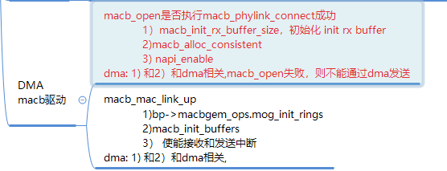

# 硬件描述符和skb


## 硬件描述符



### macb_alloc_consistent
```
static int macb_alloc_consistent(struct macb *bp)
{
    struct macb_queue *queue;
    unsigned int q;
    int size;

    for (q = 0, queue = bp->queues; q < bp->num_queues; ++q, ++queue) {
   
        queue->rx_ring = dma_alloc_coherent(&bp->pdev->dev, size,
                         &queue->rx_ring_dma, GFP_KERNEL);
    }
    if (bp->macbgem_ops.mog_alloc_rx_buffers(bp))  // call  gem_alloc_rx_buffers
        goto out_err;


}
```


#### gem_alloc_rx_buffers

```
static int gem_alloc_rx_buffers(struct macb *bp)
{
    struct macb_queue *queue;
    unsigned int q;
    int size;

    for (q = 0, queue = bp->queues; q < bp->num_queues; ++q, ++queue) {
        size = bp->rx_ring_size * sizeof(struct sk_buff *);
        queue->rx_skbuff = kzalloc(size, GFP_KERNEL);
    }
    return 0;
}
```


### queue->rx_ring_dma

```
static void macb_init_buffers(struct macb *bp)
{
    struct macb_queue *queue;
    unsigned int q;

    for (q = 0, queue = bp->queues; q < bp->num_queues; ++q, ++queue) {
        queue_writel(queue, RBQP, lower_32_bits(queue->rx_ring_dma));
#ifdef CONFIG_ARCH_DMA_ADDR_T_64BIT
        if (bp->hw_dma_cap & HW_DMA_CAP_64B)
            queue_writel(queue, RBQPH,
                     upper_32_bits(queue->rx_ring_dma));
#endif
        queue_writel(queue, TBQP, lower_32_bits(queue->tx_ring_dma));
#ifdef CONFIG_ARCH_DMA_ADDR_T_64BIT
        if (bp->hw_dma_cap & HW_DMA_CAP_64B)
            queue_writel(queue, TBQPH,
                     upper_32_bits(queue->tx_ring_dma));
#endif
    }
}
```

## skb

```
static void gem_rx_refill(struct macb_queue *queue)
{
    unsigned int        entry;
    struct sk_buff        *skb;
    dma_addr_t        paddr;
    struct macb *bp = queue->bp;
    struct macb_dma_desc *desc;

    while (CIRC_SPACE(queue->rx_prepared_head, queue->rx_tail,
            bp->rx_ring_size) > 0) {
        entry = macb_rx_ring_wrap(bp, queue->rx_prepared_head);

        /* Make hw descriptor updates visible to CPU */
        rmb();

        queue->rx_prepared_head++;
        desc = macb_rx_desc(queue, entry);   ///////(1)

        if (!queue->rx_skbuff[entry]) {
            /* allocate sk_buff for this free entry in ring */
            skb = netdev_alloc_skb(bp->dev, bp->rx_buffer_size);
            if (unlikely(!skb)) {
                netdev_err(bp->dev,
                       "Unable to allocate sk_buff\n");
                break;
            }

            /* now fill corresponding descriptor entry */
            paddr = dma_map_single(&bp->pdev->dev, skb->data,
                           bp->rx_buffer_size,
                           DMA_FROM_DEVICE);  ///////(2)
            

            queue->rx_skbuff[entry] = skb; ///////(3)

            if (entry == bp->rx_ring_size - 1)
                paddr |= MACB_BIT(RX_WRAP);
            desc->ctrl = 0;
            /* Setting addr clears RX_USED and allows reception,
             * make sure ctrl is cleared first to avoid a race.
             */
            dma_wmb(); /*************/
            macb_set_addr(bp, desc, paddr);  ///////(4)

            /* properly align Ethernet header */
            skb_reserve(skb, NET_IP_ALIGN);
        } else {
            desc->ctrl = 0;
            dma_wmb();
            desc->addr &= ~MACB_BIT(RX_USED);
        }
    }

}
```

###  macb_dma_desc

```
static struct macb_dma_desc *macb_rx_desc(struct macb_queue *queue, unsigned int index)
{
    index = macb_rx_ring_wrap(queue->bp, index);
    index = macb_adj_dma_desc_idx(queue->bp, index);
    return &queue->rx_ring[index];
}
```

###  queue->rx_skbuff

```
static int gem_alloc_rx_buffers(struct macb *bp)
{
    struct macb_queue *queue;
    unsigned int q;
    int size;

    for (q = 0, queue = bp->queues; q < bp->num_queues; ++q, ++queue) {
        size = bp->rx_ring_size * sizeof(struct sk_buff *);
        queue->rx_skbuff = kzalloc(size, GFP_KERNEL);
        if (!queue->rx_skbuff)
            return -ENOMEM;
        else
            netdev_dbg(bp->dev,
                   "Allocated %d RX struct sk_buff entries at %p\n",
                   bp->rx_ring_size, queue->rx_skbuff);
    }
    return 0;
}
```


### macb_set_addr

```
static void macb_set_addr(struct macb *bp, struct macb_dma_desc *desc, dma_addr_t addr)
{
#ifdef CONFIG_ARCH_DMA_ADDR_T_64BIT
    struct macb_dma_desc_64 *desc_64;

    if (bp->hw_dma_cap & HW_DMA_CAP_64B) {
        desc_64 = macb_64b_desc(bp, desc);
        desc_64->addrh = upper_32_bits(addr);
        /* The low bits of RX address contain the RX_USED bit, clearing
         * of which allows packet RX. Make sure the high bits are also
         * visible to HW at that point.
         */
        dma_wmb();
    }
#endif
    desc->addr = lower_32_bits(addr);
}
```


### write phy

#define MACB_MAN                0x0034 /* PHY Maintenance */

```
static int macb_mdio_write(struct mii_bus *bus, int mii_id, int regnum,
                           u16 value)
{
        struct macb *bp = bus->priv;
        int status;

        status = pm_runtime_get_sync(&bp->pdev->dev);

        if (status < 0) {
                pm_runtime_put_noidle(&bp->pdev->dev);
                goto mdio_pm_exit;
        }

        status = macb_mdio_wait_for_idle(bp);

        if (status < 0)
                goto mdio_write_exit;

        if (regnum & MII_ADDR_C45) {
                macb_writel(bp, MAN, (MACB_BF(SOF, MACB_MAN_C45_SOF)
                            | MACB_BF(RW, MACB_MAN_C45_ADDR)
                            | MACB_BF(PHYA, mii_id)
                            | MACB_BF(REGA, (regnum >> 16) & 0x1F)
                            | MACB_BF(DATA, regnum & 0xFFFF)
                            | MACB_BF(CODE, MACB_MAN_C45_CODE)));

                status = macb_mdio_wait_for_idle(bp);
                if (status < 0)
                        goto mdio_write_exit;

                macb_writel(bp, MAN, (MACB_BF(SOF, MACB_MAN_C45_SOF)
                            | MACB_BF(RW, MACB_MAN_C45_WRITE)
                            | MACB_BF(PHYA, mii_id)
                            | MACB_BF(REGA, (regnum >> 16) & 0x1F)
                            | MACB_BF(CODE, MACB_MAN_C45_CODE)
                            | MACB_BF(DATA, value)));
        } else {
                macb_writel(bp, MAN, (MACB_BF(SOF, MACB_MAN_C22_SOF)
                                | MACB_BF(RW, MACB_MAN_C22_WRITE)
                                | MACB_BF(PHYA, mii_id)
                                | MACB_BF(REGA, regnum)
                                | MACB_BF(CODE, MACB_MAN_C22_CODE)
                                | MACB_BF(DATA, value)));
        }

        status = macb_mdio_wait_for_idle(bp);

        if (status < 0)
                goto mdio_write_exit;

mdio_write_exit:
        pm_runtime_mark_last_busy(&bp->pdev->dev);
        pm_runtime_put_autosuspend(&bp->pdev->dev);
mdio_pm_exit:
        return status;
}
```

# phy

