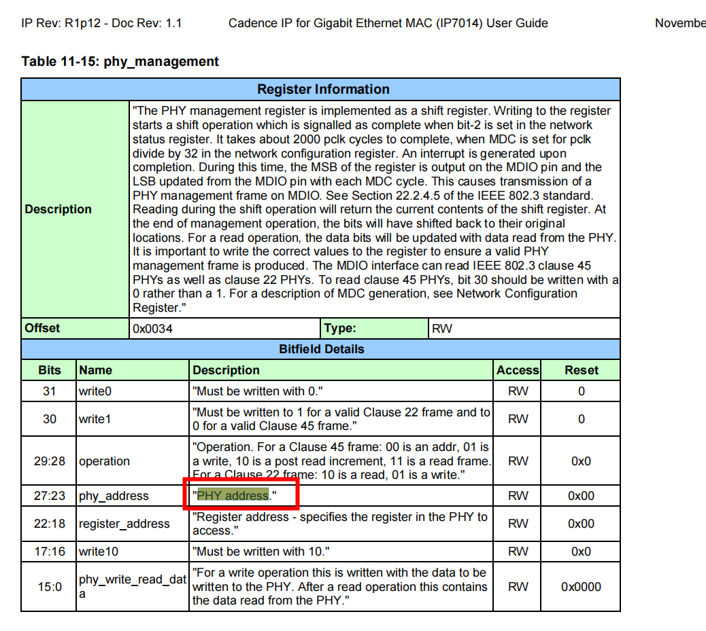

# phy驱动 读写寄存器

```
int __mdiobus_read(struct mii_bus *bus, int addr, u32 regnum)
{
        int retval;

        lockdep_assert_held_once(&bus->mdio_lock);

        retval = bus->read(bus, addr, regnum);

        trace_mdio_access(bus, 1, addr, regnum, retval, retval);
        mdiobus_stats_acct(&bus->stats[addr], true, retval);

        return retval;
}
EXPORT_SYMBOL(__mdiobus_read);
```

## 发起mdio读写

mii_id: 表示phy地址
```
} else {
		macb_writel(bp, MAN, (MACB_BF(SOF, MACB_MAN_C22_SOF)
				| MACB_BF(RW, MACB_MAN_C22_WRITE)
				| MACB_BF(PHYA, mii_id)
				| MACB_BF(REGA, regnum)
				| MACB_BF(CODE, MACB_MAN_C22_CODE)
				| MACB_BF(DATA, value)));
	}

	status = macb_mdio_wait_for_idle(bp)
```

## phy 地址




#  bp->mii_bus->read and  bp->mii_bus->write 初始化
```
static int macb_mii_init(struct macb *bp)
{
	int err = -ENXIO;

	/* Enable management port */
	macb_writel(bp, NCR, MACB_BIT(MPE));

	bp->mii_bus = mdiobus_alloc();
	if (!bp->mii_bus) {
		err = -ENOMEM;
		goto err_out;
	}

	bp->mii_bus->name = "MACB_mii_bus";
	bp->mii_bus->read = &macb_mdio_read;
	bp->mii_bus->write = &macb_mdio_write;
	snprintf(bp->mii_bus->id, MII_BUS_ID_SIZE, "%s-%x",
		 bp->pdev->name, bp->pdev->id);
	bp->mii_bus->priv = bp;
	bp->mii_bus->parent = &bp->pdev->dev;

	dev_set_drvdata(&bp->dev->dev, bp->mii_bus);

	err = macb_mdiobus_register(bp);

	if (err)
		goto err_out_free_mdiobus;

	err = macb_mii_probe(bp->dev);
	if (err)
		goto err_out_unregister_bus;

	return 0;

err_out_unregister_bus:
	mdiobus_unregister(bp->mii_bus);
err_out_free_mdiobus:
	mdiobus_free(bp->mii_bus);
err_out:
	return err;
}
```

```
[root@riscv]:~$:ls  /sys/bus/mdio_bus/devices/
43080000.ethernet-ffffffff:00  43090000.eth-ffffffff:05
[root@riscv]:~$:cat  /sys/bus/mdio_bus/devices/43090000.eth-ffffffff:05
cat: read error: Is a directory
[root@riscv]:~$:ls  /sys/bus/mdio_bus/devices/
43080000.ethernet-ffffffff:00  43090000.eth-ffffffff:05
[root@riscv]:~$:ls /sys/bus/mdio_bus/devices/43090000.eth-ffffffff:05
driver          phy_has_fixups  statistics
of_node         phy_id          subsystem
phy_dev_flags   phy_interface   uevent
[root@riscv]:~$:ls /sys/bus/mdio_bus/devices/43090000.eth-ffffffff:05/of_node/
compatible  name        phandle     reg         status
[root@riscv]:~$:cat  /sys/bus/mdio_bus/devices/43090000.eth-ffffffff:05/of_node/
compatible 
[root@riscv]:~$:cat  /sys/bus/mdio_bus/devices/43090000.eth-ffffffff:05/of_node/
compatible 
[root@riscv]:~$:cat  /sys/bus/mdio_bus/devices/43090000.eth-ffffffff:05/of_node/
phandle 
[root@riscv]:~$:cat  /sys/bus/mdio_bus/devices/43090000.eth-ffffffff:05/of_node/
reg 
[root@riscv]:~$:cat  /sys/bus/mdio_bus/devices/43090000.eth-ffffffff:05/phy_i
phy_id         phy_interface
[root@riscv]:~$:cat  /sys/bus/mdio_bus/devices/43090000.eth-ffffffff:05/phy_id
0x2000a231
[root@riscv]:~$:

```

