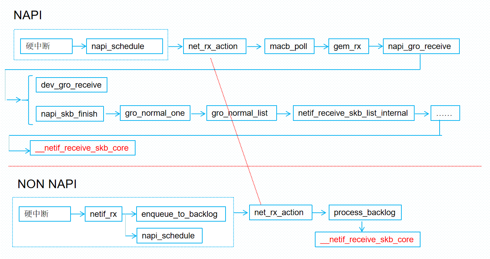
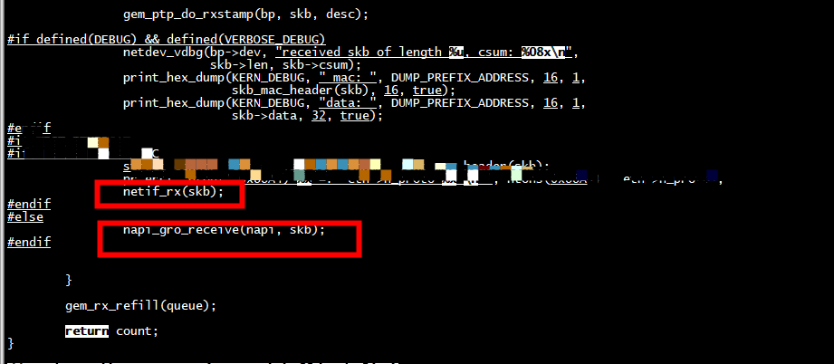
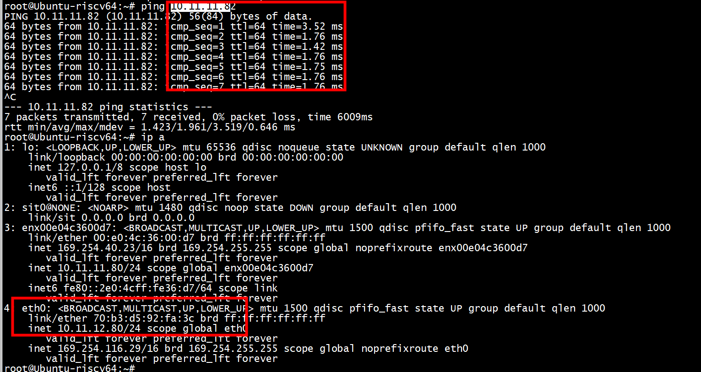
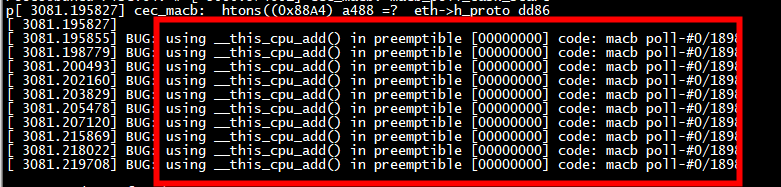
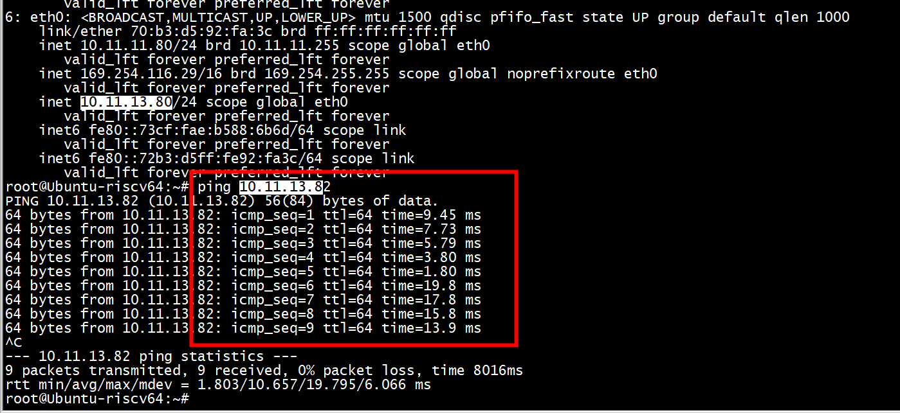

# non-napi

 因项目需要，网卡接收报文时直接在内核态轮询，不采用中断、软中断、napi
 
 ***注意这么调用 netif_rx(skb)有问题，netif_rx(skb)会触发软中断，应调用netif_receive_skb***
 
 
 
 
 
 ```
 static int gem_rx(struct macb_queue *queue, struct napi_struct *napi,
		  int budget)
{
	struct macb *bp = queue->bp;
	unsigned int		len;
	unsigned int		entry;
	struct sk_buff		*skb;
	struct macb_dma_desc	*desc;
	int			count = 0;

	while (count < budget) {
		u32 ctrl;
		dma_addr_t addr;
		bool rxused;

		entry = macb_rx_ring_wrap(bp, queue->rx_tail);
		desc = macb_rx_desc(queue, entry);

		/* Make hw descriptor updates visible to CPU */
		rmb();

		rxused = (desc->addr & MACB_BIT(RX_USED)) ? true : false;
		addr = macb_get_addr(bp, desc);

		if (!rxused)
			break;

		/* Ensure ctrl is at least as up-to-date as rxused */
		dma_rmb();

		ctrl = desc->ctrl;

		queue->rx_tail++;
		count++;

		if (!(ctrl & MACB_BIT(RX_SOF) && ctrl & MACB_BIT(RX_EOF))) {
			netdev_err(bp->dev,
				   "not whole frame pointed by descriptor\n");
			bp->dev->stats.rx_dropped++;
			queue->stats.rx_dropped++;
			break;
		}
		skb = queue->rx_skbuff[entry];
		if (unlikely(!skb)) {
			netdev_err(bp->dev,
				   "inconsistent Rx descriptor chain\n");
			bp->dev->stats.rx_dropped++;
			queue->stats.rx_dropped++;
			break;
		}
		/* now everything is ready for receiving packet */
		queue->rx_skbuff[entry] = NULL;
		len = ctrl & bp->rx_frm_len_mask;

		netdev_vdbg(bp->dev, "gem_rx %u (len %u)\n", entry, len);
                
		skb_put(skb, len);
#if TEST_SKB_DMA
		pr_err(" recv skb data:  %x ", skb->data);
#endif
		skb_push(skb,2);
		dma_unmap_single(&bp->pdev->dev, addr,
				 bp->rx_buffer_size, DMA_FROM_DEVICE);

		skb->protocol = eth_type_trans(skb, bp->dev);
		skb_checksum_none_assert(skb);
		if (bp->dev->features & NETIF_F_RXCSUM &&
		    !(bp->dev->flags & IFF_PROMISC) &&
		    GEM_BFEXT(RX_CSUM, ctrl) & GEM_RX_CSUM_CHECKED_MASK)
			skb->ip_summed = CHECKSUM_UNNECESSARY;

		bp->dev->stats.rx_packets++;
		queue->stats.rx_packets++;
		bp->dev->stats.rx_bytes += skb->len;
		queue->stats.rx_bytes += skb->len;

		gem_ptp_do_rxstamp(bp, skb, desc);

#if defined(DEBUG) && defined(VERBOSE_DEBUG)
		netdev_vdbg(bp->dev, "received skb of length %u, csum: %08x\n",
			    skb->len, skb->csum);
		print_hex_dump(KERN_DEBUG, " mac: ", DUMP_PREFIX_ADDRESS, 16, 1,
			       skb_mac_header(skb), 16, true);
		print_hex_dump(KERN_DEBUG, "data: ", DUMP_PREFIX_ADDRESS, 16, 1,
				skb->data, 32, true);
#endif
	        //print_eth_proto(skb,true);
		//print_hex_dump(KERN_ERR, " mac: ", DUMP_PREFIX_ADDRESS, 16, 1,
		//       skb_mac_header(skb), 16, true);
		netif_rx(skb);
	}

	gem_rx_refill(queue);

	return count;
}
 ```
 
 ```
 static int netif_rx_internal(struct sk_buff *skb)
{

	{
		unsigned int qtail;
		ret = enqueue_to_backlog(skb, get_cpu(), &qtail);
		put_cpu();
	}
	return ret;
}
```


## enqueue_to_backlog 软中断
enueue_to_backlog主要做以下事情：

1) 获取CPU的softnet_data

2)保存本地中断信息，并禁止本地中断

3)将skb添加到CPU的输入队列input_pkt_queue

4)恢复本地中断

5)如果CPU的输入队列input_pkt_queu为空，说明当前时收到第一个数据帧，应该标记软件中断，并且将backlog添加到poll_list中,backlog也就是初始化的process_backlog。如果CPU输入队列不为空说明当前已经标记过软件中断，只需要将数据帧加入到CPU的输入队列中。

6)如果当前CPU输入队列已经满了，那么netif_rx就会扔掉数据帧，释放缓冲区只能用的内存空间，更行CPU的扔包统计信息。
 

```
static int enqueue_to_backlog(struct sk_buff *skb, int cpu,
			      unsigned int *qtail)
{
	struct softnet_data *sd;
	unsigned long flags;
	unsigned int qlen;
 
	sd = &per_cpu(softnet_data, cpu); //获取cpu的softnet_data
 
	local_irq_save(flags);			//禁止本地CPU中断，并保存本地中断信息
 
	rps_lock(sd);
	if (!netif_running(skb->dev))
		goto drop;
	qlen = skb_queue_len(&sd->input_pkt_queue);
	if (qlen <= netdev_max_backlog && !skb_flow_limit(skb, qlen)) {		//判断队列是否超过最大值
		if (skb_queue_len(&sd->input_pkt_queue)) {
enqueue:
			__skb_queue_tail(&sd->input_pkt_queue, skb);		//将skb添加到cpu输入队列input_pkt_queue
			input_queue_tail_incr_save(sd, qtail);
			rps_unlock(sd);
			local_irq_restore(flags);	//恢复本地CPU中断
			return NET_RX_SUCCESS;
		}
 
		/* Schedule NAPI for backlog device
		 * We can use non atomic operation since we own the queue lock
		 */
		if (!__test_and_set_bit(NAPI_STATE_SCHED, &sd->backlog.state)) {
			if (!rps_ipi_queued(sd))
				____napi_schedule(sd, &sd->backlog);   //如果NAPI_STATE_SCHED标志没有设置表示当前没有软中断在处理数据包，
		}											   //将backlog添加到poll_list中,backlog也就是初始化的process_backlog
		goto enqueue;
	}

}


 ```
 
 
 ## netif_rx(skb)  pk  netif_receive_skb(skb)
 
 
 换成netif_receive_skb出现这种bug
 
  
  

 
 
 ```
 static int gem_rx(struct macb *bp, int budget)
{
	unsigned int		len;
	unsigned int		entry;
	struct sk_buff		*skb;
	struct macb_dma_desc	*desc;
	int			count = 0;

	while (count < budget) {
		u32 ctrl;
		dma_addr_t addr;
		bool rxused;

		entry = macb_rx_ring_wrap(bp, bp->rx_tail);
		desc = macb_rx_desc(bp, entry);

		/* Make hw descriptor updates visible to CPU */
		rmb();

		rxused = (desc->addr & MACB_BIT(RX_USED)) ? true : false;
		addr = macb_get_addr(bp, desc);
		ctrl = desc->ctrl;

		if (!rxused)
			break;

		bp->rx_tail++;
		count++;

		if (!(ctrl & MACB_BIT(RX_SOF) && ctrl & MACB_BIT(RX_EOF))) {
			netdev_err(bp->dev,
				   "not whole frame pointed by descriptor\n");
			bp->dev->stats.rx_dropped++;
			break;
		}
		skb = bp->rx_skbuff[entry];
		if (unlikely(!skb)) {
			netdev_err(bp->dev,
				   "inconsistent Rx descriptor chain\n");
			bp->dev->stats.rx_dropped++;
			break;
		}
		/* now everything is ready for receiving packet */
		bp->rx_skbuff[entry] = NULL;
		len = ctrl & bp->rx_frm_len_mask;

		netdev_vdbg(bp->dev, "gem_rx %u (len %u)\n", entry, len);

		skb_put(skb, len);
		dma_unmap_single(&bp->pdev->dev, addr,
				 bp->rx_buffer_size, DMA_FROM_DEVICE);

		skb->protocol = eth_type_trans(skb, bp->dev);
		skb_checksum_none_assert(skb);
		if (bp->dev->features & NETIF_F_RXCSUM &&
		    !(bp->dev->flags & IFF_PROMISC) &&
		    GEM_BFEXT(RX_CSUM, ctrl) & GEM_RX_CSUM_CHECKED_MASK)
			skb->ip_summed = CHECKSUM_UNNECESSARY;

		bp->dev->stats.rx_packets++;
		bp->dev->stats.rx_bytes += skb->len;

		gem_ptp_do_rxstamp(bp, skb, desc);

#if defined(DEBUG) && defined(VERBOSE_DEBUG)
		netdev_vdbg(bp->dev, "received skb of length %u, csum: %08x\n",
			    skb->len, skb->csum);
		print_hex_dump(KERN_DEBUG, " mac: ", DUMP_PREFIX_ADDRESS, 16, 1,
			       skb_mac_header(skb), 16, true);
		print_hex_dump(KERN_DEBUG, "data: ", DUMP_PREFIX_ADDRESS, 16, 1,
			       skb->data, 32, true);
#endif

		netif_receive_skb(skb);
	}

	gem_rx_refill(bp);

	return count;
}
 ```
 
   netif_rx_ni 调用了preempt_disable
```
  int netif_rx(struct sk_buff *skb)
{
        int ret;

        trace_netif_rx_entry(skb);

        ret = netif_rx_internal(skb);
        trace_netif_rx_exit(ret);

        return ret;
}
EXPORT_SYMBOL(netif_rx);

int netif_rx_ni(struct sk_buff *skb)
{
        int err;

        trace_netif_rx_ni_entry(skb);

        preempt_disable();
        err =    (skb);
        if (local_softirq_pending())
                do_softirq();
        preempt_enable();
        trace_netif_rx_ni_exit(err);

        return err;
}
EXPORT_SYMBOL(netif_rx_ni);
```
 
加上 preempt_disable解决
```
  preempt_disable();
  netif_receive_skb(skb);
  preempt_enable();
``` 
 
  



# struct softnet_data 

```
struct softnet_data {
struct list_head        poll_list;
struct sk_buff_head     input_pkt_queue;
struct napi_struct      backlog;
}
```

## backlog初始化
```
net_dev_init(void)
{
for_each_possible_cpu(i) {
                init_gro_hash(&sd->backlog);
                sd->backlog.poll = process_backlog;
                sd->backlog.weight = weight_p;
        }

}
```
调用驱动初始化时通过 netif_napi_add 注册的回调收包 poll 函数；非NAPI为固定 process_backlog()


```
/*
 * 遍历中断对应CPU的 softnet_data.poll_list 上的设备结构体，将设备上的数据包发到网络协议栈处理
 * 1. 设置软中断一次最大处理数据量、时间
 * 2. napi_poll: 逐个处理设备结构体，其中会使用驱动初始化时注册的回调收包 poll 函数，将数据包送到网络协议栈
 * 3. 如果最后 poll_list 上还有设备没处理，则退出前再次触发软中断
 */
static void net_rx_action(struct softirq_action *h)
{
	struct softnet_data *sd = this_cpu_ptr(&softnet_data);
	/* 设置软中断一次允许的最大执行时间为2个jiffies */
	unsigned long time_limit = jiffies + 2;
	/* 设置软中断接收函数一次最多处理的报文个数为300 */
	int budget = netdev_budget;
	LIST_HEAD(list);
	LIST_HEAD(repoll);
	/* 关闭本地cpu的中断，下面判断list是否为空时防止硬中断抢占 */
	local_irq_disable();
	/* 将要轮询的设备链表转移到临时链表上 */
	list_splice_init(&sd->poll_list, &list);
	local_irq_enable();
	/* 循环处理poll_list链表上的等待处理的napi */
	for (;;) {
		struct napi_struct *n;
		/* 如果遍历完链表，则停止 */
		if (list_empty(&list)) {
			if (!sd_has_rps_ipi_waiting(sd) && list_empty(&repoll))
				return;
			break;
		}
		/* 获取链表中首个设备 */
		n = list_first_entry(&list, struct napi_struct, poll_list);
		/* 调用驱动初始化时通过 netif_napi_add 注册的回调收包 poll 函数；非NAPI为固定 process_backlog()
		 * 处理完一个设备上的报文则要记录处理数量
		 */
		budget -= napi_poll(n, &repoll);

		/* 如果超出预设时间或者达到处理报文最大个数则停止处理 */
		if (unlikely(budget <= 0 ||
			     time_after_eq(jiffies, time_limit))) {
			sd->time_squeeze++;
			break;
		}
	}

	local_irq_disable();

	list_splice_tail_init(&sd->poll_list, &list);
	list_splice_tail(&repoll, &list);
	list_splice(&list, &sd->poll_list);
	/* 如果softnet_data.poll_list上还有未处理设备，则继续触发软中断 */
	if (!list_empty(&sd->poll_list))
		__raise_softirq_irqoff(NET_RX_SOFTIRQ);

	net_rps_action_and_irq_enable(sd);
}
```


 
 # references
 
 
 [linux硬件中断处理流程2----netif_rx](https://blog.csdn.net/City_of_skey/article/details/125579582)