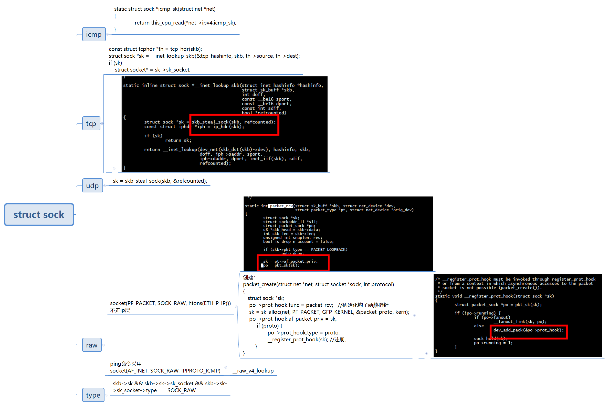

# hooknum

```
first_hook.hooknum = NF_INET_PRE_ROUTING;
second_hook.hooknum = NF_INET_LOCAL_IN;
third_hook.hooknum = NF_INET_FORWARD ;
fourth_hook.hooknum = NF_INET_LOCAL_OUT;
fifth_hook.hooknum = NF_INET_POST_ROUTING;
```

```
int registerFilter(void) // module entrance
{
    printk(KERN_INFO "Registering filters.\n"); // register the hook

    /* //NF_INET_PRE_ROUTING
     first_hook.hook = printInfo; // get the print info
     first_hook.hooknum = NF_INET_PRE_ROUTING;
     first_hook.pf = PF_INET;
     first_hook.priority = NF_IP_PRI_FIRST;
     nf_register_net_hook(&init_net, &first_hook);
     //NF_INET_LOCAL_IN
     second_hook.hook = printInfo; // get the print info
     second_hook.hooknum = NF_INET_LOCAL_IN;
     second_hook.pf = PF_INET;
     second_hook.priority = NF_IP_PRI_FIRST;
     nf_register_net_hook(&init_net, &second_hook);
     //NF_INET_FORWARD
     third_hook.hook = printInfo; // get the print info
     third_hook.hooknum = NF_INET_FORWARD ;
     third_hook.pf = PF_INET;
     third_hook.priority = NF_IP_PRI_FIRST;
     nf_register_net_hook(&init_net, &third_hook);
     //NF_INET_LOCAL_OUT
     fourth_hook.hook = printInfo; // get the print info
     fourth_hook.hooknum = NF_INET_LOCAL_OUT;
     fourth_hook.pf = PF_INET;
     fourth_hook.priority = NF_IP_PRI_FIRST;
     nf_register_net_hook(&init_net, &fourth_hook);
     //NF_INET_POST_ROUTING
     fifth_hook.hook = printInfo; // get the print info
     fifth_hook.hooknum = NF_INET_POST_ROUTING;
     fifth_hook.pf = PF_INET;
     fifth_hook.priority = NF_IP_PRI_FIRST;
     nf_register_net_hook(&init_net, &fifth_hook);
     return 0; */

    first_hook.hook = printInfo; // get the print info
    first_hook.hooknum = NF_INET_LOCAL_OUT;
    first_hook.pf = PF_INET;
    first_hook.priority = NF_IP_PRI_FIRST;
    nf_register_net_hook(&init_net, &first_hook);

    second_hook.hook = blockUDP;
    second_hook.hooknum = NF_INET_POST_ROUTING; // first four lines initializes the fork
    second_hook.pf = PF_INET;
    second_hook.priority = NF_IP_PRI_FIRST;
    nf_register_net_hook(&init_net, &second_hook);

    return 0;
}
```


# insmod  icmp_dbg.ko 


```
[root@riscv]:~$:insmod  icmp_dbg.ko 
[   10.224024][ T1085] icmp_dbg: loading out-of-tree module taints kernel.
[   10.243770][ T1085] icmp_dbg: module verification failed: signature and/or required key missing - tainting kernel
[   10.272211][ T1085] ---------------------------------------
[   10.283863][ T1085] Loading dropicmp kernel module...
[root@riscv]:~$:[   21.109422][    C0] preroute Got ICMP  packet and print it. 
[   21.121268][    C0] src_ip: 192.168.5.82 
[   21.129646][    C0] dst_ip: 192.168.5.79
[   21.137886][    C0] local in Got ICMP Request packet and print it. 
[   21.150954][    C0] src_ip: 192.168.5.82 
[   21.159317][    C0] dst_ip: 192.168.5.79
[   21.167687][    C0] local out Got ICMP Reply packet and print it. 
[   21.180589][    C0] src_ip: 192.168.5.79 
[   21.188952][    C0] dst_ip: 192.168.5.82
[   23.187138][    C0] preroute Got ICMP  packet and print it. 
[   23.198945][    C0] src_ip: 192.168.5.82 
[   23.207317][    C0] dst_ip: 192.168.5.79
[   23.215519][    C0] local in Got ICMP Request packet and print it. 
[   23.228589][    C0] src_ip: 192.168.5.82 
[   23.236954][    C0] dst_ip: 192.168.5.79
[   23.245187][    C0] local out Got ICMP Reply packet and print it. 
[   23.258084][    C0] src_ip: 192.168.5.79 
[   23.266449][    C0] dst_ip: 192.168.5.82

```

从192.168.5.82 机器上ping 192.168.5.79

```
root@ubuntux86:/work# ping 192.168.5.79 
PING 192.168.5.79 (192.168.5.79) 56(84) bytes of data.
64 bytes from 192.168.5.79: icmp_seq=1 ttl=64 time=42.8 ms
64 bytes from 192.168.5.79: icmp_seq=2 ttl=64 time=42.5 ms
```

# struct sock

 

#  ICMP socket

```
static struct sock *icmp_sk(struct net *net)
{
	return this_cpu_read(*net->ipv4.icmp_sk);
}
```

```
static void icmp_push_reply(struct icmp_bxm *icmp_param,
			    struct flowi4 *fl4,
			    struct ipcm_cookie *ipc, struct rtable **rt)
{
	struct sock *sk;
	struct sk_buff *skb;

	sk = icmp_sk(dev_net((*rt)->dst.dev));
}
```

```
static void icmp_reply(struct icmp_bxm *icmp_param, struct sk_buff *skb)
{
	struct ipcm_cookie ipc;
	struct rtable *rt = skb_rtable(skb);
	struct net *net = dev_net(rt->dst.dev);
	struct flowi4 fl4;
	struct sock *sk;
	struct inet_sock *inet;

	sk = icmp_xmit_lock(net);
}
```

## 初始化

```
static int __net_init icmp_sk_init(struct net *net)
{
	int i, err;

	net->ipv4.icmp_sk = alloc_percpu(struct sock *);
	if (!net->ipv4.icmp_sk)
		return -ENOMEM;

	for_each_possible_cpu(i) {
		struct sock *sk;

		err = inet_ctl_sock_create(&sk, PF_INET,
					   SOCK_RAW, IPPROTO_ICMP, net);
		if (err < 0)
			goto fail;

		*per_cpu_ptr(net->ipv4.icmp_sk, i) = sk;

		/* Enough space for 2 64K ICMP packets, including
		 * sk_buff/skb_shared_info struct overhead.
		 */
		sk->sk_sndbuf =	2 * SKB_TRUESIZE(64 * 1024);

		/*
		 * Speedup sock_wfree()
		 */
		sock_set_flag(sk, SOCK_USE_WRITE_QUEUE);
		inet_sk(sk)->pmtudisc = IP_PMTUDISC_DONT;
	}

	/* Control parameters for ECHO replies. */
	net->ipv4.sysctl_icmp_echo_ignore_all = 0;
	net->ipv4.sysctl_icmp_echo_ignore_broadcasts = 1;

	/* Control parameter - ignore bogus broadcast responses? */
	net->ipv4.sysctl_icmp_ignore_bogus_error_responses = 1;

	/*
	 * 	Configurable global rate limit.
	 *
	 *	ratelimit defines tokens/packet consumed for dst->rate_token
	 *	bucket ratemask defines which icmp types are ratelimited by
	 *	setting	it's bit position.
	 *
	 *	default:
	 *	dest unreachable (3), source quench (4),
	 *	time exceeded (11), parameter problem (12)
	 */

	net->ipv4.sysctl_icmp_ratelimit = 1 * HZ;
	net->ipv4.sysctl_icmp_ratemask = 0x1818;
	net->ipv4.sysctl_icmp_errors_use_inbound_ifaddr = 0;

	return 0;

fail:
	icmp_sk_exit(net);
	return err;
}
```

#  skb->sk->sk_socket->type

```
unsigned int hook_func(void *priv, struct sk_buff *skb, const struct nf_hook_state *state)
{
        sock_buff = skb;
        ip_header = (struct iphdr *)skb_network_header(sock_buff); //grab network header using accessor
        mac_header = (struct ethhdr *)skb_mac_header(sock_buff);

        if(!sock_buff) { return NF_DROP;}

        if (ip_header->protocol==IPPROTO_ICMP) { //icmp=1 udp=17 tcp=6
        icmp_header = icmp_hdr(skb);
        if(skb->sk && skb->sk->sk_socket && skb->sk->sk_socket->type == SOCK_RAW)
        {
               printk(KERN_INFO "****************SOCK_RAW *************\n");
        }
                printk(KERN_INFO "preroute Got ICMP  packet and print it. \n");     //log we’ve got udp packet to /var/log/messages
                printk(KERN_INFO "src_ip: %pI4 \n", &ip_header->saddr);
                printk(KERN_INFO "dst_ip: %pI4\n", &ip_header->daddr);
        }
        return NF_ACCEPT;
}
```

```
[root@centos7 netfilter]# insmod  icmp_dbg.ko 
[root@centos7 netfilter]# ping 10.10.16.82
PING 10.10.16.82 (10.10.16.82) 56(84) bytes of data.
64 bytes from 10.10.16.82: icmp_seq=1 ttl=64 time=29.5 ms
64 bytes from 10.10.16.82: icmp_seq=2 ttl=64 time=29.3 ms
64 bytes from 10.10.16.82: icmp_seq=3 ttl=64 time=29.3 ms
^C
--- 10.10.16.82 ping statistics ---
3 packets transmitted, 3 received, 0% packet loss, time 2003ms
rtt min/avg/max/mdev = 29.302/29.381/29.524/0.172 ms
[root@centos7 netfilter]# dmesg | tail -n 10
[1318402.314693] preroute Got ICMP  packet and print it. 
[1318402.319806] src_ip: 10.10.16.251 
[1318402.323278] dst_ip: 10.10.16.82
[1318402.896183] local out Got ICMP Reply packet and print it. 
[1318402.901818] src_ip: 10.10.16.251 
[1318402.905292] dst_ip: 10.10.16.82
[1318402.908593] ****************SOCK_RAW *************
[1318402.913534] preroute Got ICMP  packet and print it. 
[1318402.918650] src_ip: 10.10.16.251 
[1318402.922121] dst_ip: 10.10.16.82
[root@centos7 netfilter]# dmesg | tail -n 20
[1318419.969834] src_ip: 10.10.16.251 
[1318419.973305] dst_ip: 10.10.16.82
[1318419.976609] ****************SOCK_RAW *************
[1318419.981550] preroute Got ICMP  packet and print it. 
[1318419.986665] src_ip: 10.10.16.251 
[1318419.990136] dst_ip: 10.10.16.82
[1318421.039909] local out Got ICMP Reply packet and print it. 
[1318421.045545] src_ip: 10.10.16.251 
[1318421.049017] dst_ip: 10.10.16.82
[1318421.052318] ****************SOCK_RAW *************
[1318421.057261] preroute Got ICMP  packet and print it. 
[1318421.062375] src_ip: 10.10.16.251 
[1318421.065849] dst_ip: 10.10.16.47
[1318421.839904] local out Got ICMP Reply packet and print it. 
[1318421.845542] src_ip: 10.10.16.251 
[1318421.849014] dst_ip: 10.10.16.82
[1318421.852315] ****************SOCK_RAW *************
[1318421.857259] preroute Got ICMP  packet and print it. 
[1318421.862373] src_ip: 10.10.16.251 
[1318421.865847] dst_ip: 10.10.16.47
[root@centos7 netfilter]# 
```

#   NF_INET_POST_ROUTING


```
/* Output packet to network from transport.  */
static inline int dst_output(struct net *net, struct sock *sk, struct sk_buff *skb)
{
    return skb_dst(skb)->output(net, sk, skb);
}

int ip_output(struct net *net, struct sock *sk, struct sk_buff *skb)
{
    struct net_device *dev = skb_dst(skb)->dev;
    skb->dev = dev;
    skb->protocol = htons(ETH_P_IP);

    return NF_HOOK_COND(NFPROTO_IPV4, NF_INET_POST_ROUTING,
          net, sk, skb, NULL, dev,
          ip_finish_output,
          !(IPCB(skb)->flags & IPSKB_REROUTED));
}
```
 在 ip_output 里面我们又看到了熟悉的 NF_HOOK。这一次是 NF_INET_POST_ROUTING，也即 POSTROUTING 链，处理完之后调用 ip_finish_output()进入MAC层。
 
 
 # post_routing 调用 dev_queue_xmit
 
 
 ```
 unsigned int hook_func_post_routing
(
 const struct nf_hook_ops *ops,
 //unsigned int hookno,
 struct sk_buff *skb,
 const struct net_device *in,
 const struct net_device *out,
 int (*okfn)(struct sk_buff *)
 )
{
    struct iphdr *innerIpHdr=(struct iphdr *)skb_network_header(skb);
    struct iphdr *outerIpHdr=NULL;
    struct ethhdr *neth_hdr;

    unsigned int src_ip = (unsigned int)innerIpHdr->saddr;
    unsigned int innerPktLen = 0;
    int ret=0;

    if( 1==netif_running(gUsb0Iface) && src_ip == wifiIp && 0!=usb0Ip && 0!=proxyIp)
    {
        innerPktLen = ntohs(innerIpHdr->tot_len);

        printIP("POSTROUTING", skb, innerIpHdr);

        if( skb_headroom(skb) < sizeof(struct iphdr) )
        {
            printk(KERN_INFO "POSTROUTING skb headroom not enough. expanding");
            if( 0 != pskb_expand_head( skb, (sizeof(struct iphdr)) - skb_headroom(skb), 0, GFP_ATOMIC) )
            {
                printk(KERN_INFO "POSTROUTING pskb_expand_head failed");
                kfree_skb(skb);
                return NF_STOLEN;
            }
        }

        outerIpHdr = (struct iphdr *) skb_push(skb, sizeof(struct iphdr));
        outerIpHdr->version = 4;
        outerIpHdr->ihl = 5;
        outerIpHdr->tos = innerIpHdr->tos;
        outerIpHdr->tot_len = htons(sizeof(struct iphdr) + innerPktLen);
        outerIpHdr->id = 0;
        outerIpHdr->frag_off = innerIpHdr->frag_off;
        outerIpHdr->ttl = innerIpHdr->ttl;
        outerIpHdr->protocol = 4;
        outerIpHdr->saddr = usb0Ip;
        outerIpHdr->daddr = proxyIp;
        outerIpHdr->check = 0;
        outerIpHdr->check = ip_fast_csum( (uint16_t *)outerIpHdr, (outerIpHdr->ihl) );

        skb_reset_network_header(skb);

        skb->dev = gUsb0Iface;
        skb->ip_summed = CHECKSUM_NONE;
        skb->pkt_type = PACKET_OTHERHOST;

        if( skb_headroom(skb) < sizeof(struct ethhdr) )
        {
            if( 0 != pskb_expand_head( skb, (sizeof(struct ethhdr)) - skb_headroom(skb), 0, GFP_ATOMIC) )
            {
                printk(KERN_INFO "POSTROUTING pskb_expand_head failed");
                kfree_skb(skb);
                return NF_STOLEN;
            }
        }

        neth_hdr = (struct ethhdr *)skb_push(skb, ETH_HLEN);
        if(neth_hdr != NULL)
        {
            memcpy(neth_hdr->h_source, skb->dev->dev_addr, ETH_ALEN);
            neth_hdr->h_proto = __constant_htons(ETH_P_IP);
        }
        else
        {
            printk(KERN_INFO "POSTROUTING neth_hdr allocation failed\n");
        }

        printIP("POSTROUTING", skb, outerIpHdr);
        ret = dev_queue_xmit(skb);
        printk(KERN_INFO "POSTROUTING dev_queue_xmit returned %d\n", ret);
        return NF_STOLEN;
    }
    else
        printIP("POSTROUTING not tunnelling ", skb, innerIpHdr);

    printk(KERN_INFO "---------------------------------------\n");

    return NF_ACCEPT;
}

 ```