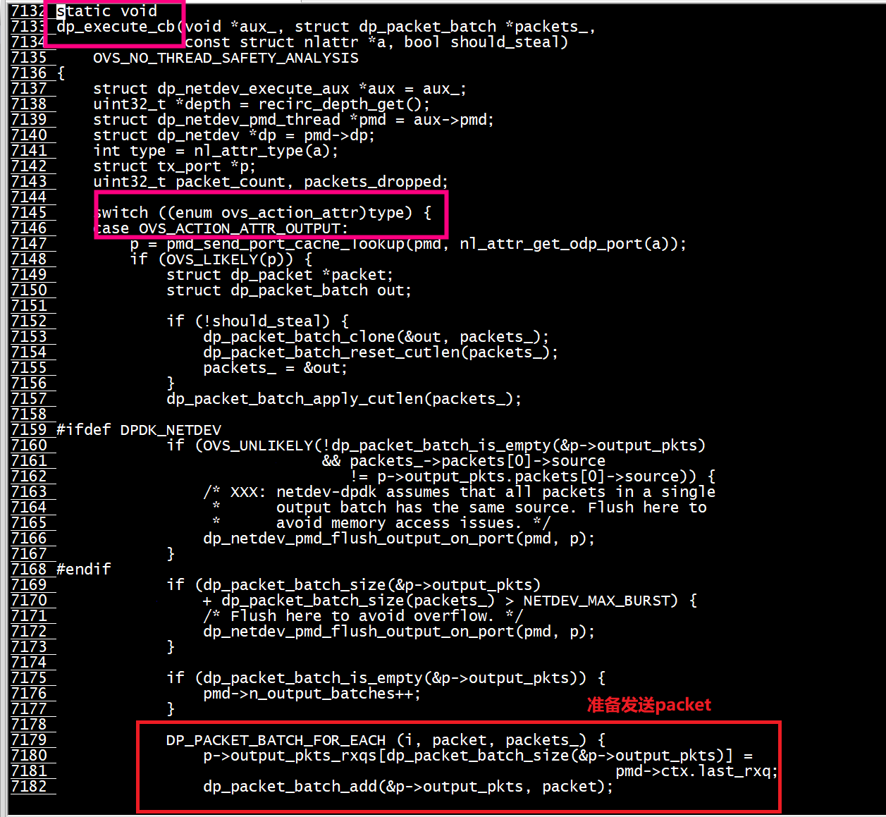

# dpdk
```
开启gdb
export EXTRA_CFLAGS="-O0 -g"
 mkdir -p /usr/src/dpdk
[root@centos7 dpdk-19.11]# make install T=arm64-armv8a-linuxapp-gcc  DESTDIR=/usr/src/dpdk -j 64
[root@centos7 dpdk-19.11]# ./usertools/dpdk-devbind.py  -u 0000:05:00.0
Warning: no supported DPDK kernel modules are loaded
[root@centos7 dpdk-19.11]# 
```
## 大页设置
./usertools/dpdk-setup.sh
选择其中的选项49：设置大页，让每个numa   node均分同样的大页数量
mount -t hugetlbfs none /dev/hugepages

## 绑定vfio-pci
```
 ./usertools/dpdk-devbind.py   --bind=vfio-pci  0000:05:00.0
./usertools/dpdk-devbind.py   -s

Network devices using DPDK-compatible driver
============================================
0000:05:00.0 'Hi1822 Family (2*100GE) 0200' drv=vfio-pci unused=hinic
```
# ovs
+ 1 编译 + 创建目录
```shell
./boot.sh
 ./configure --with-dpdk=/usr/src/dpdk --prefix=/usr --sysconfdir=/etc --localstatedir=/var  CFLAGS='-g -O0' 
make install
[root@centos7 openvswitch-2.13.0]# mkdir -p /etc/openvswitch
[root@centos7 openvswitch-2.13.0]# mkdir -p /var/run/openvswitch
```

   + 1.1 undefined reference to `pcap_dump'
   ```
LDFLAGS = 
MSVC64_LDFLAGS = 
OVS_LDFLAGS =  -L/usr/src/dpdk/lib
PTHREAD_LDFLAGS = 
SSL_LDFLAGS =  
AM_LDFLAGS = $(SSL_LDFLAGS) $(OVS_LDFLAGS) $(am__append_2)
   ```
 加上  LDFLAGS='-lpcap '
   ```  
 ./configure --with-dpdk=/usr/src/dpdk --prefix=/usr --sysconfdir=/etc --localstatedir=/var  CFLAGS='-g -O0'  LDFLAGS='-lpcap'
   ```


+ 2 创建数据库
```
 ovsdb-tool create /etc/openvswitch/conf.db /usr/share/openvswitch/vswitch.ovsschema
```
+ 3 置ovs-vsct、 ovsdb-server、ovs-vswitchd软连接
```
 [root@centos7 openvswitch-2.13.0]# ln -s  /usr/bin/ovs-vsctl    /usr/local/bin/ovs-vsctl
```


+ 4 执行 bash start_ovs.sh


```
  ovs-vsctl add-br br0 -- set bridge br0 datapath_type=netdev
```

## ovs log

参考 lib/timeval.c   

```
#include "openvswitch/vlog.h"

VLOG_DEFINE_THIS_MODULE(timeval);
```
```
VLOG_ERR("wake up from WaitForMultipleObjects after deadline");
```

## ovs 数据库

/etc/openvswitch/conf.db

```
ovsdb-client dump unix:/var/run/openvswitch/db.sock --data=json | more
```


## ovs-vsctl get Open_vSwitch . other_config
```Shell
ovs-vsctl get Open_vSwitch . other_config
{dpdk-init="true", hw-offload="true", n-handler-threads="2", n-revalidator-threads="2"}
```

```Shell
ovs-vsctl --no-wait set Open_vSwitch . other_config:dpdk-init=true
ovs-vsctl --no-wait set Open_vSwitch . other_config:max-idle=500000
ovs-vsctl --no-wait set Open_vSwitch . other_config:dpdk-lcore-mask=0x40000
ovs-vsctl --no-wait set Open_vSwitch . other_config:pmd-cpu-mask=0x80000
ovs-vsctl --no-wait set Open_vSwitch . other_config:dpdk-socket-mem=2048
ovs-vsctl --no-wait set Open_vSwitch . other_config:n-rxq=1
ovs-vsctl --no-wait set Open_vSwitch . other_config:n-txq=1
ovs-vsctl --no-wait set Open_vSwitch . other_config:dpdk-extra="-w 0000:85:00.0,representor=[0-1],dv_flow_en=1"
```

##  ovs-appctl版本问题
```Shell
[root@centos7 openvswitch-2.13.0]# ovs-appctl -t /var/run/openvswitch/db.sock  dpctl/dump-flows type=offloaded
unknown methodovs-appctl: /var/run/openvswitch/db.sock: server returned an error
[root@centos7 openvswitch-2.13.0]# ovs-appctl   dpctl/dump-flows type=offloaded
2023-12-13T07:58:12Z|00001|daemon_unix|WARN|/usr/local/var/run/openvswitch/ovs-vswitchd.pid: open: No such file or directory
ovs-appctl: cannot read pidfile "/usr/local/var/run/openvswitch/ovs-vswitchd.pid" (No such file or directory)
[root@centos7 openvswitch-2.13.0]# 
```
换成新编译的    
```
[root@centos7 openvswitch-2.13.0]# ./utilities/ovs-appctl   dpctl/dump-flows type=offloaded
```

```
./utilities/ovs-appctl tnl/arp/show
```

## ovs-tcpdump 

```
./utilities/ovs-tcpdump -i dpdk1
```

# ovs show

```
[root@centos7 openvswitch-2.13.0]#  ovs-vsctl add-br br0 -- set bridge br0 datapath_type=netdev
ovs-vsctl add-port br0 dpdk1 -- set Interface dpdk1 type=dpdk options:dpdk-devargs=0000:05:00.0
[root@centos7 openvswitch-2.13.0]# ovs-vsctl show
07d26c1e-14d0-4f57-98ff-f26b77ed929f
    Bridge br0
        datapath_type: netdev
        Port br0
            Interface br0
                type: internal
        Port dpdk1
            Interface dpdk1
                type: dpdk
                options: {dpdk-devargs="0000:05:00.0"}
    ovs_version: "2.13.0"
```

```
 ip netns add ns1
 ip link add host1 type veth peer veth0
 ip link set host1 up
 ip l set veth0 up
 ip link set veth0 netns ns1
ip netns exec ns1 ip l set veth0 up
 ovs-vsctl add-port br0 host1
 ip netns exec ns1 ip addr add 192.168.1.251/24 dev veth0

```
查看流表
```
[root@centos7 openvswitch-2.13.0]# ovs-ofctl dump-flows br0
 cookie=0x0, duration=619.751s, table=0, n_packets=283161, n_bytes=19180771, priority=0 actions=NORMAL
[root@centos7 openvswitch-2.13.0]#
```

查看端口编号
```
root@centos7 openvswitch-2.13.0]# ovs-ofctl show br0
OFPT_FEATURES_REPLY (xid=0x2): dpid:000044a191a49c0b
n_tables:254, n_buffers:0
capabilities: FLOW_STATS TABLE_STATS PORT_STATS QUEUE_STATS ARP_MATCH_IP
actions: output enqueue set_vlan_vid set_vlan_pcp strip_vlan mod_dl_src mod_dl_dst mod_nw_src mod_nw_dst mod_nw_tos mod_tp_src mod_tp_dst
 1(dpdk1): addr:44:a1:91:a4:9c:0b
     config:     0
     state:      0
     current:    AUTO_NEG
     speed: 0 Mbps now, 0 Mbps max
 2(host1): addr:0a:ad:ac:e1:b9:18
     config:     0
     state:      0
     current:    10GB-FD COPPER
     speed: 10000 Mbps now, 0 Mbps max
 LOCAL(br0): addr:44:a1:91:a4:9c:0b
     config:     PORT_DOWN
     state:      LINK_DOWN
     current:    10MB-FD COPPER
     speed: 10 Mbps now, 0 Mbps max
OFPT_GET_CONFIG_REPLY (xid=0x4): frags=normal miss_send_len=0
[root@centos7 openvswitch-2.13.0]# 
```
+ 添加流表
```
[root@centos7 openvswitch-2.13.0]# ovs-ofctl dump-flows br0
 cookie=0x0, duration=619.751s, table=0, n_packets=283161, n_bytes=19180771, priority=0 actions=NORMAL
[root@centos7 openvswitch-2.13.0]# ovs-ofctl add-flow br0 table=1,priority=100,ip,nw_dst=192.168.1.251/32,actions=output:2
[root@centos7 openvswitch-2.13.0]# ovs-ofctl del-flows br0 "in_port=host1"
[root@centos7 openvswitch-2.13.0]# ovs-ofctl dump-flows br0
 cookie=0x0, duration=1629.981s, table=0, n_packets=281, n_bytes=23394, priority=1,in_port=host2 actions=mod_vlan_vid:5,output:host1
[root@centos7 openvswitch-2.13.0]#  
```
arp
```
 ovs-ofctl add-flow br0 dl_type=0x806,actions=flood
```

normal

```
 ovs-ofctl add-flow br0 actions=NORMAL
```
+  删除流表
//使用OFPFC_DELETE删除流表时，可以只指定in_port或者ip就可以将上面两条流表删除
```
ovs-ofctl del-flows br10 "in_port=2"
ovs-ofctl del-flows br10 "ip"
ovs-ofctl del-flows br3 "ip,nw_dst=192.168.11.65"
```
//使用OFPFC_DELETE_STRICT(加上选项 --strict)删除流表时，需要指定流表的所有内容，包括优先级
```
[root@centos7 openvswitch-2.13.0]# ovs-ofctl --strict del-flows br0 "priority=1,in_port=host1"
[root@centos7 openvswitch-2.13.0]# ovs-ofctl dump-flows br0
 cookie=0x0, duration=1496.006s, table=0, n_packets=276, n_bytes=23016, priority=1,in_port=host2 actions=mod_vlan_vid:5,output:host1
 cookie=0x0, duration=1470.149s, table=0, n_packets=277, n_bytes=24194, priority=1,in_port=host1,dl_vlan=5 actions=strip_vlan,output:host2
[root@centos7 openvswitch-2.13.0]#
```

# test2 ovs vlan

[ovs vlan](https://www.jianshu.com/p/815fba32f017)


+ ns1 vlan5 and eth0   

```
ip netns exec ns1 ip link add link veth0 name veth0.5 type vlan id 5
``` 

```
[root@centos7 openvswitch-2.13.0]# ip netns exec ns1  ip a
1: lo: <LOOPBACK> mtu 65536 qdisc noop state DOWN group default qlen 1000
    link/loopback 00:00:00:00:00:00 brd 00:00:00:00:00:00
2: veth0.5@veth0: <BROADCAST,MULTICAST,UP,LOWER_UP> mtu 1500 qdisc noqueue state UP group default qlen 1000
    link/ether 42:f6:c3:fe:b7:fb brd ff:ff:ff:ff:ff:ff
    inet 192.168.1.251/24 scope global veth0.5
       valid_lft forever preferred_lft forever
    inet6 fe80::40f6:c3ff:fefe:b7fb/64 scope link 
       valid_lft forever preferred_lft forever
14: veth0@if15: <BROADCAST,MULTICAST,UP,LOWER_UP> mtu 1500 qdisc noqueue state UP group default qlen 1000
    link/ether 42:f6:c3:fe:b7:fb brd ff:ff:ff:ff:ff:ff link-netnsid 0
```	
+ ns2   eth0      
```
[root@centos7 openvswitch-2.13.0]# ip netns exec ns2  ip  a
1: lo: <LOOPBACK> mtu 65536 qdisc noop state DOWN group default qlen 1000
    link/loopback 00:00:00:00:00:00 brd 00:00:00:00:00:00
16: veth0@if17: <BROADCAST,MULTICAST,UP,LOWER_UP> mtu 1500 qdisc noqueue state UP group default qlen 1000
    link/ether 3a:b6:3d:1f:95:62 brd ff:ff:ff:ff:ff:ff link-netnsid 0
    inet 192.168.1.252/24 scope global veth0
       valid_lft forever preferred_lft forever
    inet6 fe80::38b6:3dff:fe1f:9562/64 scope link 
       valid_lft forever preferred_lft forever
[root@centos7 openvswitch-2.13.0]# 
```
+ 删除normal flow， 添加两条流： 
``` 
 ovs-ofctl del-flows br0
 ovs-ofctl add-flow br0 "priority=1,in_port=5,actions=mod_vlan_vid:5,output:4"
 ovs-ofctl add-flow br0 "priority=1,in_port=4,dl_vlan=5,actions=strip_vlan,output:5"
``` 

```
[root@centos7 openvswitch-2.13.0]# ovs-ofctl show br0
OFPT_FEATURES_REPLY (xid=0x2): dpid:00004a9640bc014f
n_tables:254, n_buffers:0
capabilities: FLOW_STATS TABLE_STATS PORT_STATS QUEUE_STATS ARP_MATCH_IP
actions: output enqueue set_vlan_vid set_vlan_pcp strip_vlan mod_dl_src mod_dl_dst mod_nw_src mod_nw_dst mod_nw_tos mod_tp_src mod_tp_dst
 4(host1): addr:ba:63:d1:a6:2e:f1
     config:     0
     state:      0
     current:    10GB-FD COPPER
     speed: 10000 Mbps now, 0 Mbps max
 5(host2): addr:be:cc:05:f9:d4:49
     config:     0
     state:      0
     current:    10GB-FD COPPER
     speed: 10000 Mbps now, 0 Mbps max
 LOCAL(br0): addr:4a:96:40:bc:01:4f
     config:     0
     state:      0
     current:    10MB-FD COPPER
     speed: 10 Mbps now, 0 Mbps max
OFPT_GET_CONFIG_REPLY (xid=0x4): frags=normal miss_send_len=0
[root@centos7 openvswitch-2.13.0]#  ovs-ofctl del-flows br0
[root@centos7 openvswitch-2.13.0]# ovs-ofctl add-flow br0 "priority=1,in_port=5,actions=mod_vlan_vid:5,output:4"
[root@centos7 openvswitch-2.13.0]# ovs-ofctl add-flow br0 "priority=1,in_port=4,dl_vlan=5,actions=strip_vlan,output:5"
```
+ ping 
```
[root@centos7 openvswitch-2.13.0]# ip netns exec ns1 ping 192.168.1.252
PING 192.168.1.252 (192.168.1.252) 56(84) bytes of data.
64 bytes from 192.168.1.252: icmp_seq=1 ttl=64 time=0.572 ms
64 bytes from 192.168.1.252: icmp_seq=2 ttl=64 time=0.135 ms
^C
--- 192.168.1.252 ping statistics ---
2 packets transmitted, 2 received, 0% packet loss, time 1008ms
rtt min/avg/max/mdev = 0.135/0.353/0.572/0.219 ms
[root@centos7 openvswitch-2.13.0]# 
```
##  OFPACT_STRIP_VLAN flow_pop_vlan


删除一条流，ping失败   
```
[root@centos7 openvswitch-2.13.0]# ovs-ofctl del-flows br0 "in_port=host1"
[root@centos7 openvswitch-2.13.0]# ovs-ofctl dump-flows br0
 cookie=0x0, duration=1629.981s, table=0, n_packets=281, n_bytes=23394, priority=1,in_port=host2 actions=mod_vlan_vid:5,output:host1
[root@centos7 openvswitch-2.13.0]# ip netns exec ns1 ping 192.168.1.252
PING 192.168.1.252 (192.168.1.252) 56(84) bytes of data.
^C
--- 192.168.1.252 ping statistics ---
2 packets transmitted, 0 received, 100% packet loss, time 1078ms

[root@centos7 openvswitch-2.13.0]# 
```

## OFPACT_OUTPUT OFPACT_STRIP_VLAN

+ ip netns exec ns1 ping 192.168.1.252 先执行 OFPACT_STRIP_VLAN    
+ 然后执行OFPACT_OUTPUT   


##  eth_pop_vlan 什么时候执行？
仅保留一条流  
+ 流表如下   
```
[root@centos7 openvswitch-2.13.0]# ovs-ofctl dump-flows br0
 cookie=0x0, duration=1320.828s, table=0, n_packets=477, n_bytes=21942, priority=1,in_port=host1,dl_vlan=5 actions=strip_vlan,output:host2
```
+ 执行ping   
```
[root@centos7 openvswitch-2.13.0]# ip netns exec ns1 ping 192.168.1.252
PING 192.168.1.252 (192.168.1.252) 56(84) bytes of data.
^C
--- 192.168.1.252 ping statistics ---
1 packets transmitted, 0 received, 100% packet loss, time 0ms

[root@centos7 openvswitch-2.13.0]# 
```
```
/* Removes outermost VLAN header (if any is present) from 'packet'.
 *
 * 'packet->l2_5' should initially point to 'packet''s outer-most VLAN header
 * or may be NULL if there are no VLAN headers. */
void
eth_pop_vlan(struct dp_packet *packet)
{
    struct vlan_eth_header *veh = dp_packet_eth(packet);

    if (veh && dp_packet_size(packet) >= sizeof *veh
        && eth_type_vlan(veh->veth_type)) {

        memmove((char *)veh + VLAN_HEADER_LEN, veh, 2 * ETH_ADDR_LEN);
        dp_packet_resize_l2(packet, -VLAN_HEADER_LEN);
    }
}
```
***OVS_ACTION_ATTR_POP_VLAN***   


##    什么时候往host2发送报文？
仅保留一条流，执行ping   
```
[root@centos7 openvswitch-2.13.0]# ovs-ofctl dump-flows br0
 cookie=0x0, duration=1320.828s, table=0, n_packets=477, n_bytes=21942, priority=1,in_port=host1,dl_vlan=5 actions=strip_vlan,output:host2
```

+ 1 dp_execute_cb往output_packets添加数据   
+ 2 dp_netdev_pmd_flush_output_packets从output_packets取数据   


 

   ### dp_execute_cb -> OVS_ACTION_ATTR_OUTPUT
   
  




##    什么时候insert emc？ 


仅保留一条流，执行ping  
```
[root@centos7 openvswitch-2.13.0]# ovs-ofctl dump-flows br0
 cookie=0x0, duration=1320.828s, table=0, n_packets=477, n_bytes=21942, priority=1,in_port=host1,dl_vlan=5 actions=strip_vlan,output:host2
```


# vlan 命令
```
ip netns exec ns1 ip link add link veth0 name veth0.5 type vlan id 5
ovs-vsctl set Port host2 tag=100
# 添加 VLAN tag
ovs-ofctl add-flow s1 "in_port=1,actions=mod_vlan_vid:10,output:2"

# 去掉 VLAN tag 再匹配转发
ovs-ofctl add-flow s1 "priority=1,in_port=1,dl_vlan=10,actions=strip_vlan,output:2"

# 按照 VLAN tag 去匹配转发，范围为 0-4095
ovs-ofctl add-flow s1 "priority=1,in_port=1,dl_vlan=777,actions=output:2"

ovs-ofctl add-flow br0 "priority=3,in_port=100,dl_vlan=0xffff,actions=mod_vlan_vid:101,normal"
解释一下就是，向网桥br0中添加一条流表项(Flow entry)，这条流表项在其table中优先级为3，其匹配字段指定的规则为：①数据包从port 100进入交换机br0(可以用ovs-ofctl show br0查看port)，②数据包不带VLAN tag(dl_vlan=0xffff)。对于这两个条件都匹配的数据包，执行如下action：①先给数据包打上vlan tag 101，②之后交给OVS自身转发，不再受openflow流表控制。
```
# 修改数据包源IP地址
```
#test1对应vnet12网卡，vnet12网卡挂载到OpenFlow端口7上
ovs-ofctl add-flow br-test "in_port=7,actions=mod_nw_src:172.16.1.111,output=8"
```

# error

##  Error attaching device
```
ovs-vsctl add-port br0 dpdk1 -- set Interface dpdk1 type=dpdk options:dpdk-devargs=0000:05:00.0
ovs-vsctl: Error detected while setting up 'dpdk1': Error attaching device '0000:05:00.0' to DPDK
```
local_dev_probe

采用0000:05:00.0执行 ping-pong server，ping没问题  

+ 原因
   
  + a 启动 ovs-vswitchd的时候，由于以前执行了ovs-vsctl add-port br0 dpdk1保存在ovs db中，但是0000:05:00.0网卡没有绑定vfio仍然使用hinic驱动。
+ 解决办法 
  + a 先删除 ovs-vsctl del-port br0 dpdk1，
  + b 0000:05:00.0网卡绑定vfio
  + c 重启ovs-vswitchd

```
[root@centos7 openvswitch-2.13.0]# ovs-vsctl add-port br0 dpdk1 -- set Interface dpdk1 type=dpdk options:dpdk-devargs=0000:05:00.0
[root@centos7 openvswitch-2.13.0]# ovs-vsctl del-port br0 dpdk1
[root@centos7 openvswitch-2.13.0]# 
```
添加dpdk网卡成功

# Megaflow
为了避免这种性能极度恶化的情况，Open vSwitch 引入了 MegaFlow。和 MicroFlow 的精确匹配 不同，MegaFlow 可以做到模糊匹配，一个条目可以匹配一组数据包。它的实现和用户态的 TSS 类似， 但是在组织上有所不同。   

一是没有优先级，这样可以快速返回无需遍历所有的哈希表；   

二是 MegaFlow 中不像用户态中大量 table 组成了 pipeline，只通过一个 table 来进行匹配。   

我们来看下面一条OpenFlow流表规则。   

priority=200,ip,nw_dst=10.0.0.0/16 actions=output:1   
它的作用就是匹配所有目的IP是10.0.0.0/16的网络包，从网卡1送出。对于下面的传输层连接，对应 的action都是一样的。   

11.0.0.2:5742 -> 10.0.0.10:3306   
11.0.0.2:5743 -> 10.0.0.10:3306   
11.0.0.2:5744 -> 10.0.0.11:3306   
11.0.0.3:5742 -> 10.0.0.10:3306   
但是对应于microflow cache来说，就要有4条cache，需要上送4次ovs-vswitchd。但是实际上，如 果在kernel datapath如果有下面一条cache，只匹配目的IP地址：   

ip,nw_dst=10.0.0.0/16 actions=output:1   
那么数以亿计的传输层连接，可以在OVS内核模块，仅通过这条cache，完成转发。因为只有一条 cache，所以也只有一次上送ovs-vswitchd。这样能大大减少内核态向用户态上送的次数，从而提升网 络性能。这样一条非精确匹配的cache，被OpenVSwitch称为megaflow。  

MegaFlow Cache 性能最关键的就是看如何能实现更好的泛化能力，即每个条目都能匹配尽可能多 的数据包，减少用户态和内核态之间进行交互的次数。同时需要尽可能降低哈希查询的次数，在尽可能 少的表里得到预期的结果。    


+  Megaflow 需要多次 hash table    
在 OVS 中，Megaflow 需要查询多次 hash table 是因为 Megaflow 是由多个字段组成，每个字段都需要在相应的 hash table 中查找匹配的流表项。例如，Megaflow 可能包含源 MAC 地址、目的 MAC 地址、源 IP 地址、目的 IP 地址、协议类型等字段，每个字段都需要在相应的 hash table 中进行查询，才能找到匹配的流表项。   
此外，OVS 中的 hash table 是基于哈希函数实现的，哈希函数可能会出现碰撞，导致多个流表项映射到同一个桶中。在这种情况下，需要对该桶中的所有流表项进行线性搜索，以找到与 Megaflow 匹配的流表项。因此，Megaflow 需要查询多次 hash table，以确保找到所有与 Megaflow 匹配的流表项。
+  Microflow 需要一次 hash table     
在 OVS 中，Microflow 只需要查询一次 hash table 是因为 Microflow 是由固定数量的字段组成，包括源 MAC 地址、目的 MAC 地址、协议类型、源端口号和目的端口号。这些字段被组合成一个 5-tuple，可以通过哈希函数转换为一个哈希值，然后用该哈希值在 OVS 的 flow table 中查找匹配的流表项。由于 Microflow 的字段数量是固定的，且哈希函数能够有效地将 5-tuple 映射到 flow table 中的桶中，因此只需要查询一次 hash table 就能够找到与 Microflow 匹配的流表项。
 

# 控制器
[OpenvSwitch/OpenFlow 架构解析与实践案例](https://www.cnblogs.com/jmilkfan-fanguiju/p/10589725.html)