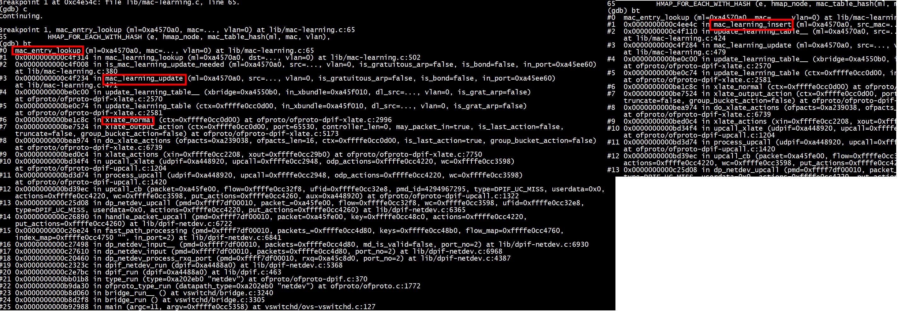
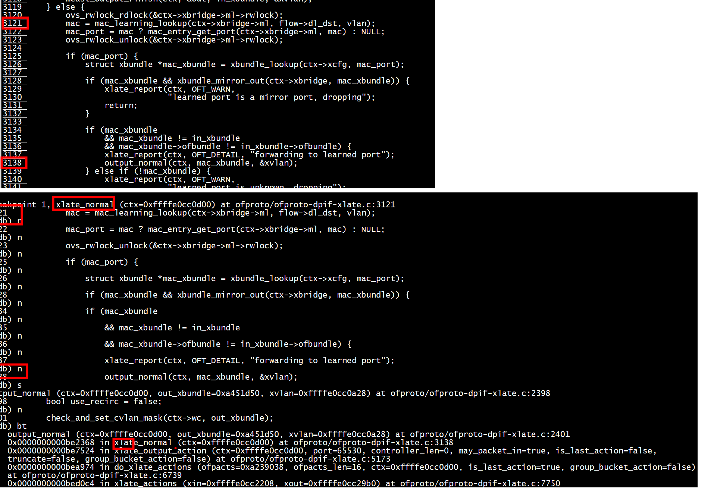
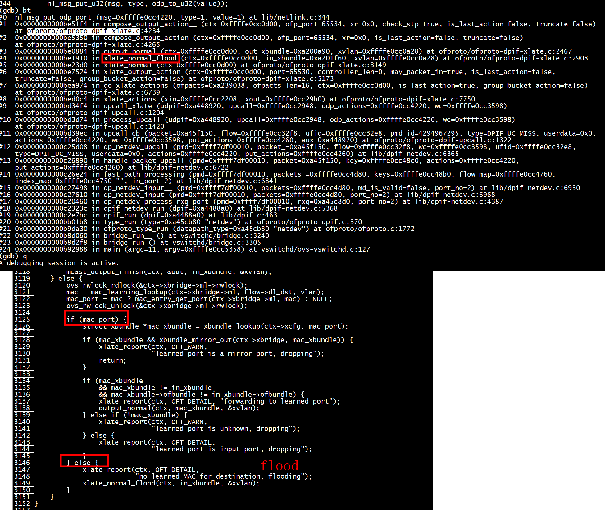
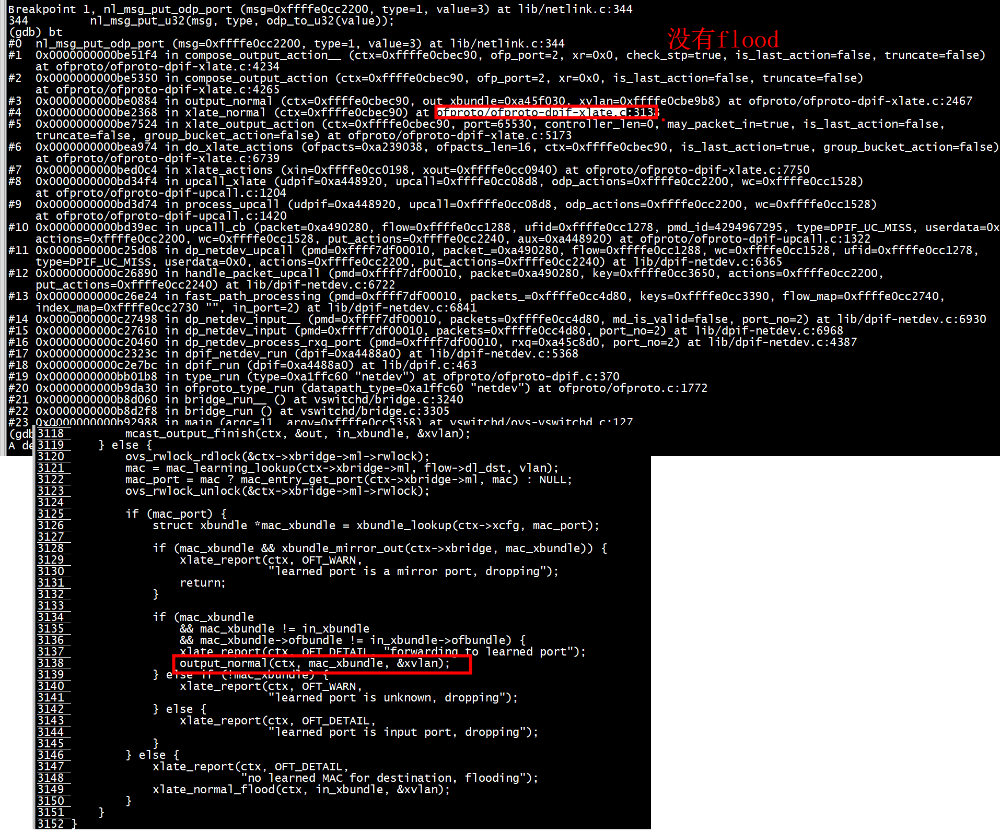
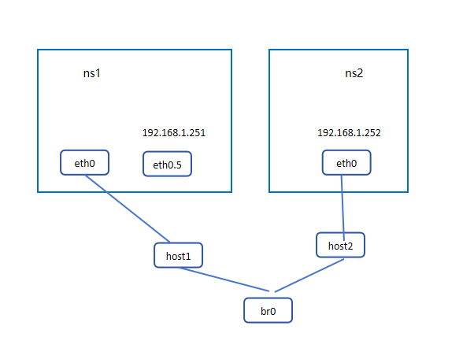
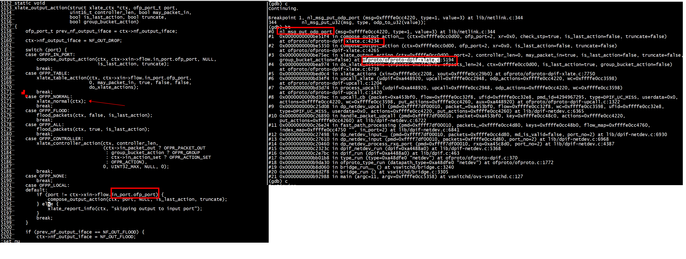
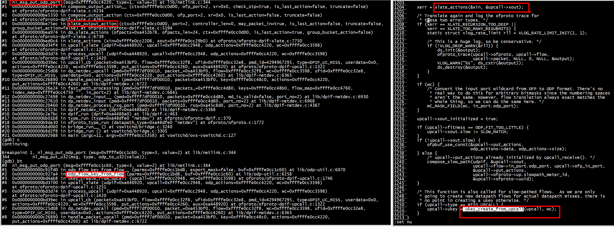

#  FDB table

[Troubleshooting FDB table wrapping in Open vSwitch](https://developers.redhat.com/blog/2018/09/19/troubleshooting-fdb-table-wrapping-in-open-vswitch#)

下面来讨论下vswitchd中的cam表，代码在lib/mac-learning.h lib/mac-learning.c中，
vswitchd内部维护了一个mac/port的cam表，其中mac entry的老化时间为300秒，cam表定义了flooding vlan的概念，即如果vlan是flooding，表示不会去学习任何地址，这个vlan的所有转发都通过flooding完成，   

```
struct mac_entry {
    struct hmap_node hmap_node;         
    struct list lru_node;      
    time_t expires;            
    time_t grat_arp_lock;              
    uint8_t mac[ETH_ADDR_LEN];  
    uint16_t vlan;              
    tag_type tag;              

   
    union {
        void *p;
        int i;
    } port;
};
```
```
struct mac_learning {
    struct hmap table;                  mac_entry组成的hmap哈希表，mac_entry通过hmap_node挂载到mac_learning->table中
    struct list lrus;                        lru的链表，mac_entry通过lru_node挂载到mac_learning->lrus中
    uint32_t secret;                 
    unsigned long *flood_vlans;
    unsigned int idle_time;               最大老化时间
};  
```

```
static uint32_t
mac_table_hash(const struct mac_learning *ml, const uint8_t mac[ETH_ADDR_LEN],
               uint16_t vlan)
{
    unsigned int mac1 = get_unaligned_u32((uint32_t *) mac);
    unsigned int mac2 = get_unaligned_u16((uint16_t *) (mac + 4));
    return hash_3words(mac1, mac2 | (vlan << 16), ml->secret);
}  
``` 
+ mac_entry计算的hash值，由mac_learning->secret，vlan, mac地址共同通过hash_3words计算出来   
+ mac_entry_lookup，通过mac地址，vlan来查看是否已经对应的mac_entry   
+ get_lru，找到lru链表对应的第一个mac_entry   
+ mac_learning_create/mac_learning_destroy，创建/销毁mac_learning表   
+ mac_learning_may_learn，如果vlan不是flooding vlan且mac地址不是多播地址，返回true  
+ mac_learning_insert，向mac_learning中插入一条mac_entry，首先通过mac_entry_lookup查看mac,    vlan对应的mac_entry是否存在，不存在的话如果此时mac_learning已经有了MAC_MAX条mac_entry，老化最老的那条，之后创建mac_entry并插入到cam表中。   
+ mac_learning_lookup，调用mac_entry_lookup在cam表中查找某个vlan对应的mac地址   
+ mac_learning_run，循环老化已经超时的mac_entry   

# ping 一个不存在的地址

+ flow

```
./utilities/ovs-ofctl  dump-flows br0
 cookie=0x0, duration=10058.773s, table=0, n_packets=68, n_bytes=2996, priority=0 actions=NORMAL
```

+  ping 之前

```
./utilities/ovs-appctl fdb/show br0
 port  VLAN  MAC                Age
```

+ ns1的mac

```
[root@centos7 ~]# ip netns exec ns1 ip a
13: veth0@if14: <BROADCAST,MULTICAST,UP,LOWER_UP> mtu 1500 qdisc noqueue state UP group default qlen 1000
    link/ether 72:c7:e0:85:a1:68 brd ff:ff:ff:ff:ff:ff link-netnsid 0
    inet 192.168.1.251/24 scope global veth0
       valid_lft forever preferred_lft forever
    inet6 fe80::70c7:e0ff:fe85:a168/64 scope link 
       valid_lft forever preferred_lft forever
```
**72:c7:e0:85:a1:68**

+  执行ping   

```
[root@centos7 ~]# ip netns exec ns1 ping 192.168.1.253
PING 192.168.1.253 (192.168.1.253) 56(84) bytes of data.
From 192.168.1.251 icmp_seq=1 Destination Host Unreachable
From 192.168.1.251 icmp_seq=2 Destination Host Unreachable
From 192.168.1.251 icmp_seq=3 Destination Host Unreachable
From 192.168.1.251 icmp_seq=4 Destination Host Unreachable
From 192.168.1.251 icmp_seq=5 Destination Host Unreachablee
```

mac_entry_lookup

+  ping之后

```
./utilities/ovs-appctl fdb/show br0
 port  VLAN  MAC                Age
    1     0  72:c7:e0:85:a1:68    0
```

# ping 正常通信



```
[root@centos7 tcpreplay]# ip netns exec ns1 ping 192.168.1.252
PING 192.168.1.252 (192.168.1.252) 56(84) bytes of data.
64 bytes from 192.168.1.252: icmp_seq=1 ttl=64 time=0.132 ms
^C
--- 192.168.1.252 ping statistics ---
1 packets transmitted, 1 received, 0% packet loss,
```

```
./utilities/ovs-appctl fdb/show br0
 port  VLAN  MAC                Age
    2     0  0a:7e:21:dc:af:6a   20
    1     0  72:c7:e0:85:a1:68   16
```

#  I output port

```
dp_execute_cb(void *aux_, struct dp_packet_batch *packets_,
              const struct nlattr *a, bool should_steal)
    OVS_NO_THREAD_SAFETY_ANALYSIS
{
    struct dp_netdev_execute_aux *aux = aux_;
    uint32_t *depth = recirc_depth_get();
    struct dp_netdev_pmd_thread *pmd = aux->pmd;
    struct dp_netdev *dp = pmd->dp;
    int type = nl_attr_type(a);
    struct tx_port *p;
    switch ((enum ovs_action_attr)type) {
    case OVS_ACTION_ATTR_OUTPUT:
        p = pmd_send_port_cache_lookup(pmd, nl_attr_get_odp_port(a));
}
```

```
odp_port_t
nl_attr_get_odp_port(const struct nlattr *nla)
{
    return u32_to_odp(nl_attr_get_u32(nla));
}
```

##  II OVS_ACTION_ATTR_OUTPUT --> output port 
compose_output_action__   
```
compose_output_action__
            nl_msg_put_odp_port(ctx->odp_actions,
                                OVS_ACTION_ATTR_OUTPUT,
                                out_port);
```


##  II learn mac 是空表(flood)

```
./utilities/ovs-appctl fdb/show br0
 port  VLAN  MAC                Age
```



```
[root@centos7 tcpreplay]# ip netns exec ns1 ping 192.168.1.252
PING 192.168.1.252 (192.168.1.252) 56(84) bytes of data.
64 bytes from 192.168.1.252: icmp_seq=1 ttl=64 time=0.265 ms
64 bytes from 192.168.1.252: icmp_seq=2 ttl=64 time=0.136 ms
64 bytes from 192.168.1.252: icmp_seq=3 ttl=64 time=0.132 ms
64 bytes from 192.168.1.252: icmp_seq=4 ttl=64 time=0.132 ms
```
一开始learn mac 是空表，需要采取flood        
##  II learn mac表有效
 learn mac 学习了dst mac之后，不需要采取flood   
```
./utilities/ovs-appctl fdb/show br0
 port  VLAN  MAC                Age
    2     0  0a:7e:21:dc:af:6a  258
    1     0  72:c7:e0:85:a1:68  258
```



# I 更改流表(flow有output port)



```
[root@centos7 openvswitch-dbg-2.13.0]# ./utilities/ovs-ofctl del-flows br0
[root@centos7 openvswitch-dbg-2.13.0]# ovs-ofctl add-flow br0 "priority=2,in_port=2,actions=mod_vlan_vid:5,output:1"
[root@centos7 openvswitch-dbg-2.13.0]# ovs-ofctl add-flow br0 "priority=1,in_port=1,dl_vlan=5,actions=strip_vlan,output:2"
[root@centos7 openvswitch-dbg-2.13.0]# ./utilities/ovs-ofctl  dump-flows br0
 cookie=0x0, duration=17.199s, table=0, n_packets=0, n_bytes=0, priority=2,in_port=host2 actions=mod_vlan_vid:5,output:host1
 cookie=0x0, duration=3.342s, table=0, n_packets=0, n_bytes=0, priority=1,in_port=host1,dl_vlan=5 actions=strip_vlan,output:host2
[root@centos7 openvswitch-dbg-2.13.0]# 
```

```
[root@centos7 tcpreplay]# ip netns exec ns1 ping 192.168.1.252
PING 192.168.1.252 (192.168.1.252) 56(84) bytes of data.
64 bytes from 192.168.1.252: icmp_seq=1 ttl=64 time=0.148 ms
64 bytes from 192.168.1.252: icmp_seq=2 ttl=64 time=0.133 ms
```

## II not case OFPP_NORMAL

流表含有output port
## II    odp_flow_key_from_flow  -->  nl_msg_put_odp_port(buf, OVS_KEY_ATTR_IN_PORT



### III ukey_create_from_upcall

 ukey_create_from_upcall 

```
    /* This function is also called for slow-pathed flows.  As we are only
     * going to create new datapath flows for actual datapath misses, there is
     * no point in creating a ukey otherwise. */
    if (upcall->type == MISS_UPCALL) {
        upcall->ukey = ukey_create_from_upcall(upcall, wc);
    }
``` 
只有一条NORMAL规则，没有ping 操作，ukey_create_from_upcall也会不断被调用   
```
./utilities/ovs-ofctl  dump-flows br0
 cookie=0x0, duration=108.778s, table=0, n_packets=18, n_bytes=1488, actions=NORMAL
```
 
# I  OFPP_IN_PORT

```
xlate_output_action(struct xlate_ctx *ctx, ofp_port_t port,
                    uint16_t controller_len, bool may_packet_in,
                    bool is_last_action, bool truncate,
                    bool group_bucket_action)
{
    ofp_port_t prev_nf_output_iface = ctx->nf_output_iface;

    ctx->nf_output_iface = NF_OUT_DROP;

    switch (port) {
    case OFPP_IN_PORT:
        compose_output_action(ctx, ctx->xin->flow.in_port.ofp_port, NULL,
                              is_last_action, truncate);
        break;
```

Sometimes one really needs to send a packet out its ingress port (“hairpin”). In this case, output to OFPP_IN_PORT, which in ovs-ofctl syntax is expressed as just in_port, e.g.:
```
ovs-ofctl add-flow br0 in_port=2,actions=in_port
```