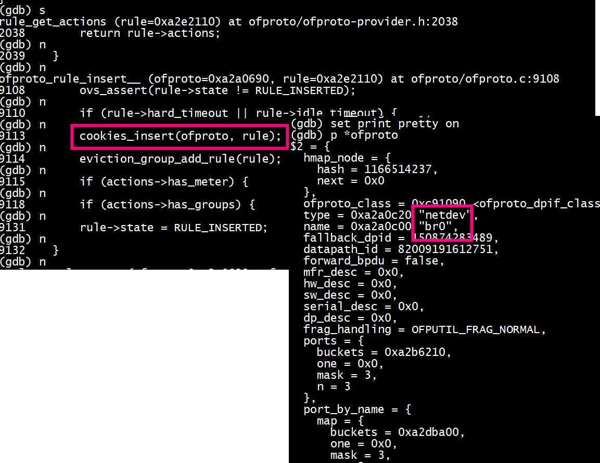
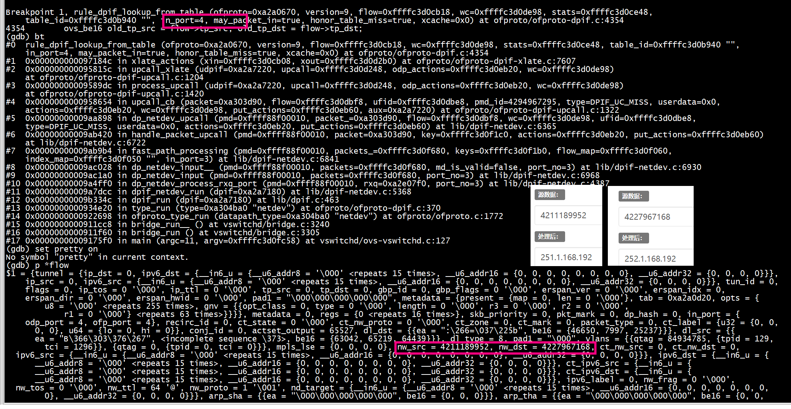
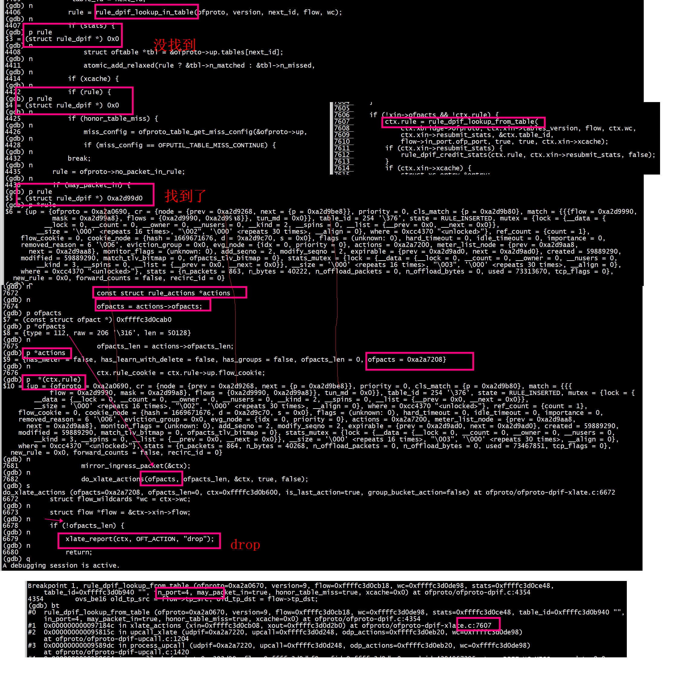
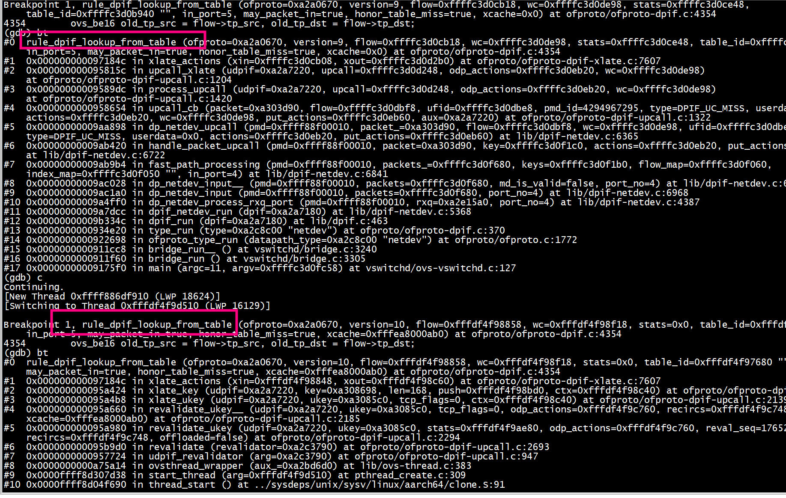
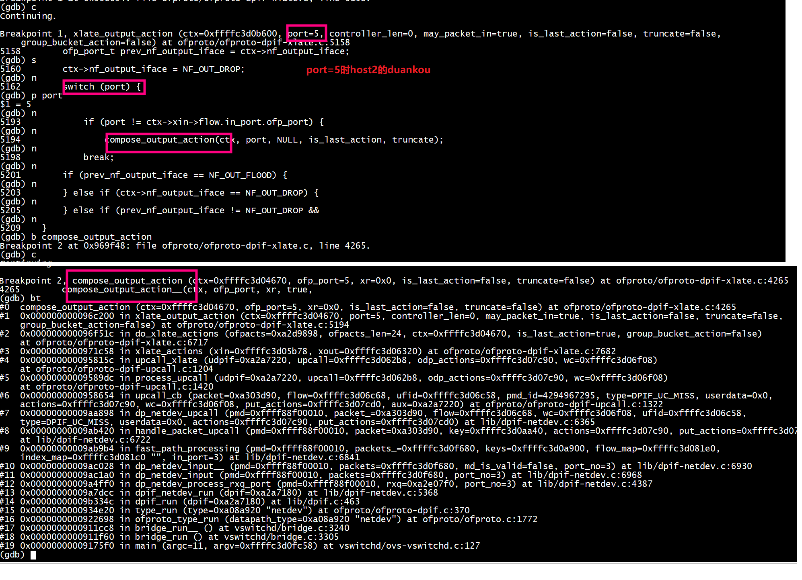
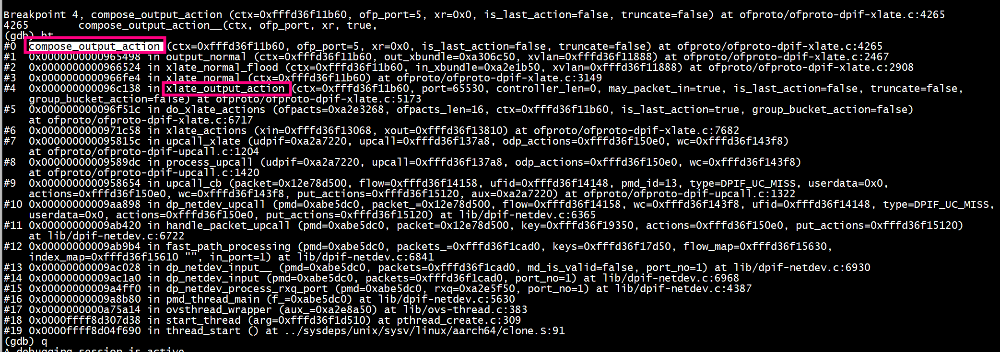

# add-flow
[OpenvSwitch 流表转换](https://zhaozhanxu.com/archives/258/)

```
ovs-ofctl add-flow br0 "priority=1,in_port=5,actions=mod_vlan_vid:5,output:4"
```
flow如下：
```
[root@centos7 openvswitch-2.13.0]# ovs-ofctl dump-flows br0
 cookie=0x0, duration=1901.648s, table=0, n_packets=0, n_bytes=0, priority=1,in_port=host2 actions=mod_vlan_vid:5,output:host1
[root@centos7 openvswitch-2.13.0]# 
```
```
(gdb) bt
#0  ofproto_rule_insert__ (ofproto=0xa2a0690, rule=0xa2e2110) at ofproto/ofproto.c:9105
#1  0x000000000092b3e0 in replace_rule_start (ofproto=0xa2a0690, ofm=0xffffc3d0f198, old_rule=0x0, new_rule=0xa2e2110) at ofproto/ofproto.c:5563
#2  0x000000000092a764 in add_flow_start (ofproto=0xa2a0690, ofm=0xffffc3d0f198) at ofproto/ofproto.c:5182
#3  0x00000000009304c0 in ofproto_flow_mod_start (ofproto=0xa2a0690, ofm=0xffffc3d0f198) at ofproto/ofproto.c:8020
#4  0x000000000092cb24 in handle_flow_mod__ (ofproto=0xa2a0690, fm=0xffffc3d0f750, req=0xffffc3d0f300) at ofproto/ofproto.c:6205
#5  0x000000000092ca64 in handle_flow_mod (ofconn=0xa2df710, oh=0xa2dda40) at ofproto/ofproto.c:6182
#6  0x0000000000931328 in handle_single_part_openflow (ofconn=0xa2df710, oh=0xa2dda40, type=OFPTYPE_FLOW_MOD) at ofproto/ofproto.c:8496
#7  0x0000000000931654 in handle_openflow (ofconn=0xa2df710, msgs=0xffffc3d0f888) at ofproto/ofproto.c:8677
#8  0x0000000000978d28 in ofconn_run (ofconn=0xa2df710, handle_openflow=0x931594 <handle_openflow>) at ofproto/connmgr.c:1321
#9  0x0000000000976aa8 in connmgr_run (mgr=0xa2a0c40, handle_openflow=0x931594 <handle_openflow>) at ofproto/connmgr.c:356
#10 0x0000000000922c18 in ofproto_run (p=0xa2a0690) at ofproto/ofproto.c:1883
#11 0x0000000000911d40 in bridge_run__ () at vswitchd/bridge.c:3246
#12 0x0000000000911f60 in bridge_run () at vswitchd/bridge.c:3305
#13 0x00000000009175f0 in main (argc=11, argv=0xffffc3d0fc58) at vswitchd/ovs-vswitchd.c:127
```
 


```
static void
cookies_insert(struct ofproto *ofproto, struct rule *rule)
    OVS_REQUIRES(ofproto_mutex)
{
    hindex_insert(&ofproto->cookies, &rule->cookie_node,
                  hash_cookie(rule->flow_cookie));
}
```

## lookup rule（match drop）
flow如下：
```
[root@centos7 openvswitch-2.13.0]# ovs-ofctl dump-flows br0
 cookie=0x0, duration=1901.648s, table=0, n_packets=0, n_bytes=0, priority=1,in_port=host2 actions=mod_vlan_vid:5,output:host1
[root@centos7 openvswitch-2.13.0]# 
```
执行ip netns exec ns1 ping 192.168.1.252    

struct flow *flow的nw_src = 4211189952, nw_dst = 4227967168，对应ip地址192.168.1.251，192.168.1.252，

 

+ rule_dpif_lookup_from_table 
rule_dpif_lookup_from_table会查找指定table的流表，默认是table 0，用一个循环去遍历每一个table，然后知道找到匹配的rule   
```
 for (next_id = *table_id;
         next_id < ofproto->up.n_tables;
         next_id++, next_id += (next_id == TBL_INTERNAL))
    {
```

+ rule_dpif_lookup_from_table 失败(匹配到drop rule)，执行drop
 

#  ovs-ofctl del-flows br0

 


#  xlate_output_action
ip netns exec ns1 ping 192.168.1.252  
流表如下
```
[root@centos7 openvswitch-2.13.0]# ovs-ofctl del-flows br0
[root@centos7 openvswitch-2.13.0]# ovs-ofctl add-flow br0 "priority=1,in_port=4,dl_vlan=5,actions=strip_vlan,output:5"
[root@centos7 openvswitch-2.13.0]# ovs-ofctl dump-flows br0
 cookie=0x0, duration=13.870s, table=0, n_packets=0, n_bytes=0, priority=1,in_port=host1,dl_vlan=5 actions=strip_vlan,output:host2
[root@centos7 openvswitch-2.13.0]# ip netns exec ns1 ping 192.168.1.252
PING 192.168.1.252 (192.168.1.252) 56(84) bytes of data.
```
 

#  xlate_normal


```
[root@centos7 openvswitch-2.13.0]# ovs-ofctl del-flows br0
[root@centos7 openvswitch-2.13.0]#  ovs-ofctl add-flow br0 actions=NORMAL
```

```
[root@centos7 openvswitch-2.13.0]# ip netns exec ns1 route add default gw   192.168.1.1
[root@centos7 openvswitch-2.13.0]# ip netns exec ns1 ping 10.10.103.251
```

```
[root@centos7 openvswitch-2.13.0]# ip netns exec ns1 ping 10.10.103.81
PING 10.10.103.81 (10.10.103.81) 56(84) bytes of data.
^C
--- 10.10.103.81 ping statistics ---
2 packets transmitted, 0 received, 100% packet loss, time 1008ms

[root@centos7 openvswitch-2.13.0]# 
```

在xlate_output_action__中，大部分情况都是走到OFPP_NORMAL里面，调用xlate_normal，里面会调用mac_learning_lookup, 查找mac表找到报文的出口port，然后调用output_normal，output_normal最终调用.
vswitchd内部维护了一个mac/port的cam表，其中mac entry的老化时间为300秒，cam表定义了flooding vlan的概念，即如果vlan是flooding，表示不会去学习任何地址，这个vlan的所有转发都通过flooding完成

 
```
compose_output_action__(struct action_xlate_ctx *ctx, uint16_t ofp_port,

                        bool check_stp)
{
    const struct ofport_dpif *ofport = get_ofp_port(ctx->ofproto, ofp_port);
    uint16_t odp_port = ofp_port_to_odp_port(ofp_port);
    ovs_be16 flow_vlan_tci = ctx->flow.vlan_tci;
    uint8_t flow_nw_tos = ctx->flow.nw_tos;
    uint16_t out_port;
...

    out_port = vsp_realdev_to_vlandev(ctx->ofproto, odp_port,
                                      ctx->flow.vlan_tci);
    if (out_port != odp_port) {
        ctx->flow.vlan_tci = htons(0);
    }
    commit_odp_actions(&ctx->flow, &ctx->base_flow, ctx->odp_actions);
    nl_msg_put_u32(ctx->odp_actions, OVS_ACTION_ATTR_OUTPUT, out_port);

    ctx->sflow_odp_port = odp_port;
    ctx->sflow_n_outputs++;
    ctx->nf_output_iface = ofp_port;
    ctx->flow.vlan_tci = flow_vlan_tci;
    ctx->flow.nw_tos = flow_nw_tos;
}
```
commit_odp_actions，用来把所有action编码车功能nlattr的格式存到ctx->odp_actions中，之后的nl_msg_put_u32(ctx->odp_actions, OVS_ACTION_ATTR_OUTPUT, out_port)把报文的出口port添加进去，这样一条flow action差不多组合完毕了
 
# netdev_linux_send 
先删除dpdk port  ovs-vsctl del-port br0 dpdk1
```
[root@centos7 openvswitch-2.13.0]# ovs-ofctl dump-flows br0
 cookie=0x0, duration=469.818s, table=0, n_packets=57, n_bytes=2622, priority=1,in_port=host1,dl_vlan=5 actions=strip_vlan,output:host2
[root@centos7 openvswitch-2.13.0]# 
```

```
ip netns exec ns1 ping 192.168.1.252
PING 192.168.1.252 (192.168.1.252) 56(84) bytes of data.
```
执行ping触发netdev_linux_send
```
(gdb) bt
#0  netdev_linux_send (netdev_=0xa29ee70, qid=0, batch=0xa305140, concurrent_txq=true) at lib/netdev-linux.c:1688
#1  0x00000000009f1b74 in netdev_send (netdev=0xa29ee70, qid=0, batch=0xa305140, concurrent_txq=true) at lib/netdev.c:871
#2  0x00000000009a4be0 in dp_netdev_pmd_flush_output_on_port (pmd=0xffff88f00010, p=0xa305110) at lib/dpif-netdev.c:4298
#3  0x00000000009a4df0 in dp_netdev_pmd_flush_output_packets (pmd=0xffff88f00010, force=false) at lib/dpif-netdev.c:4338
#4  0x00000000009a5030 in dp_netdev_process_rxq_port (pmd=0xffff88f00010, rxq=0xa2e07f0, port_no=3) at lib/dpif-netdev.c:4393
#5  0x00000000009a7dcc in dpif_netdev_run (dpif=0xa2a7180) at lib/dpif-netdev.c:5368
#6  0x00000000009b334c in dpif_run (dpif=0xa2a7180) at lib/dpif.c:463
#7  0x0000000000934e20 in type_run (type=0xa303640 "netdev") at ofproto/ofproto-dpif.c:370
#8  0x0000000000922698 in ofproto_type_run (datapath_type=0xa303640 "netdev") at ofproto/ofproto.c:1772
#9  0x0000000000911cc8 in bridge_run__ () at vswitchd/bridge.c:3240
#10 0x0000000000911f60 in bridge_run () at vswitchd/bridge.c:3305
#11 0x00000000009175f0 in main (argc=11, argv=0xffffc3d0fc58) at vswitchd/ovs-vswitchd.c:127
```

 
# dpdk

***netdev_dpdk_eth_send***
```
(gdb) bt
#0  netdev_dpdk_eth_send (netdev=0x15fd82cc0, qid=0, batch=0xa2a6f60, concurrent_txq=false) at lib/netdev-dpdk.c:2944
#1  0x00000000009f1b74 in netdev_send (netdev=0x15fd82cc0, qid=0, batch=0xa2a6f60, concurrent_txq=false) at lib/netdev.c:871
#2  0x00000000009a4be0 in dp_netdev_pmd_flush_output_on_port (pmd=0xffff88f00010, p=0xa2a6f30) at lib/dpif-netdev.c:4298
#3  0x00000000009a4df0 in dp_netdev_pmd_flush_output_packets (pmd=0xffff88f00010, force=false) at lib/dpif-netdev.c:4338
#4  0x00000000009a5030 in dp_netdev_process_rxq_port (pmd=0xffff88f00010, rxq=0xa2de550, port_no=2) at lib/dpif-netdev.c:4393
#5  0x00000000009a7dcc in dpif_netdev_run (dpif=0xa2a7180) at lib/dpif-netdev.c:5368
#6  0x00000000009b334c in dpif_run (dpif=0xa2a7180) at lib/dpif.c:463
#7  0x0000000000934e20 in type_run (type=0xa2b6990 "netdev") at ofproto/ofproto-dpif.c:370
#8  0x0000000000922698 in ofproto_type_run (datapath_type=0xa2b6990 "netdev") at ofproto/ofproto.c:1772
#9  0x0000000000911cc8 in bridge_run__ () at vswitchd/bridge.c:3240
#10 0x0000000000911f60 in bridge_run () at vswitchd/bridge.c:3305
#11 0x00000000009175f0 in main (argc=11, argv=0xffffc3d0fc58) at vswitchd/ovs-vswitchd.c:127
(gdb) q
```
 ## linux

```
netdev_linux_batch_rxq_recv_tap
netdev_linux_batch_rxq_recv_sock
```
#  struct netdev_class netdev_tap_class

```
const struct netdev_class netdev_tap_class = {
    NETDEV_LINUX_CLASS_COMMON,
    .type = "tap",
    .is_pmd = false,
    .construct = netdev_linux_construct_tap,
    .destruct = netdev_linux_destruct,
    .get_stats = netdev_tap_get_stats,
    .get_features = netdev_linux_get_features,
    .get_status = netdev_linux_get_status,
    .send = netdev_linux_send,
    .rxq_construct = netdev_linux_rxq_construct,
    .rxq_destruct = netdev_linux_rxq_destruct,
    .rxq_recv = netdev_linux_rxq_recv,
};
```
#   struct netdev_dummy
struct netdev_dummy {
}