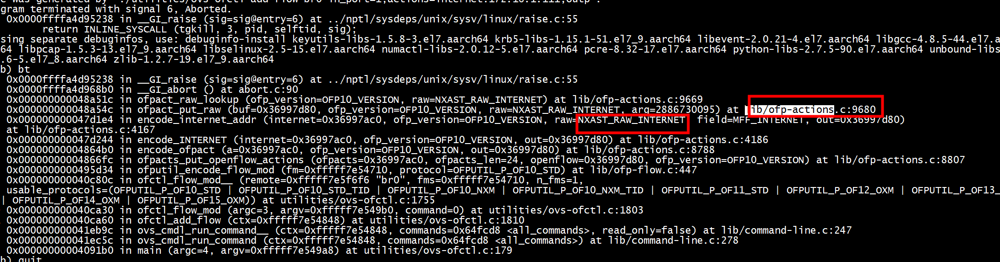
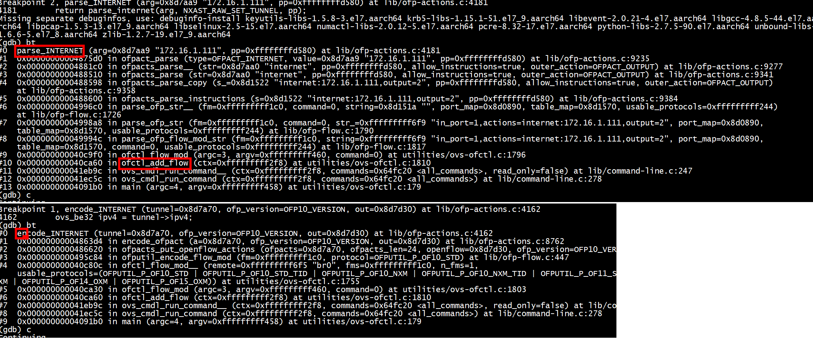
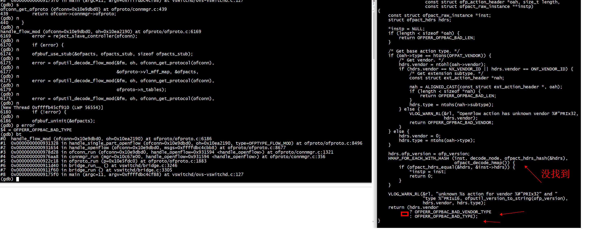
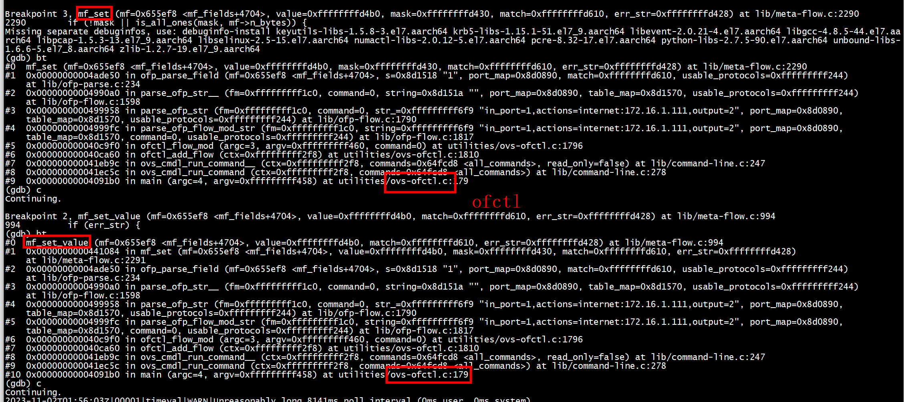
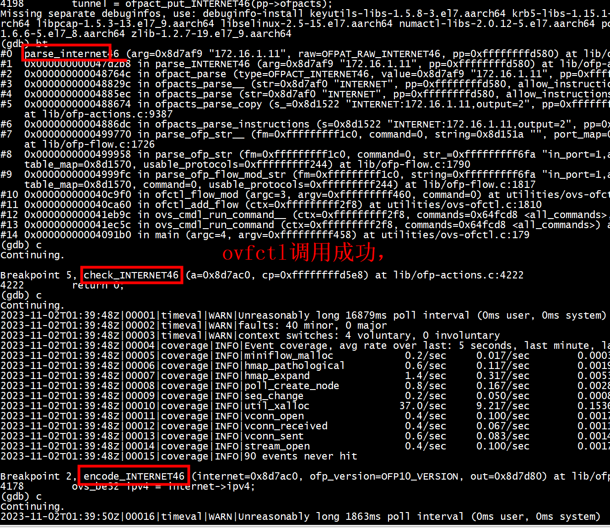
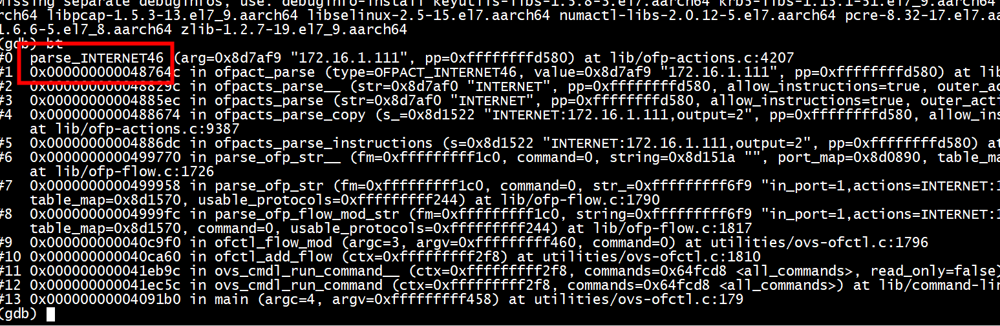
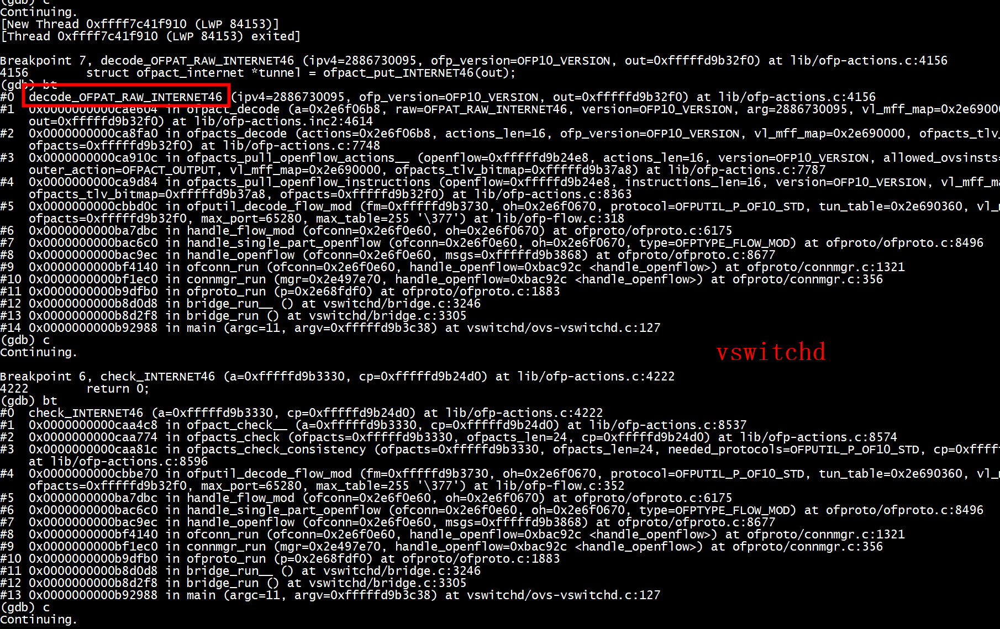
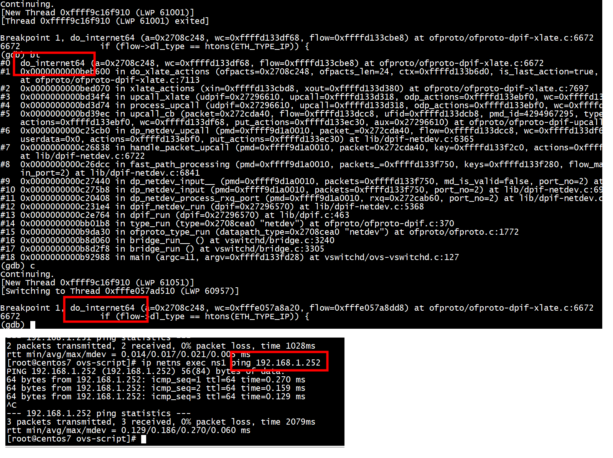
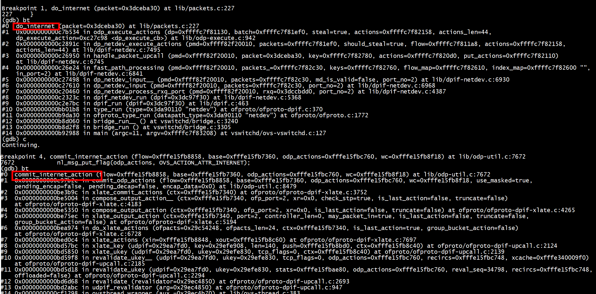

#  NXAST_RAW_CHECK_PKT_LARGER


# actions=set_tunnel
NXAST_RAW_SET_TUNNEL    
```
/* NX1.0+(1): uint16_t. */
    NXAST_RAW_RESUBMIT,
    /* NX1.0+(14): struct nx_action_resubmit. */
    NXAST_RAW_RESUBMIT_TABLE,
    /* NX1.0+(2): uint32_t. */
    NXAST_RAW_SET_TUNNEL,
    /* NX1.0+(9): uint64_t. */
    NXAST_RAW_SET_TUNNEL64,
```
##  ofpact_put_SET_TUNNEL
```
grep ofpact_put_SET_TUNNEL -rn *
lib/ofp-actions.c:4076:    struct ofpact_tunnel *tunnel = ofpact_put_SET_TUNNEL(out);
lib/ofp-actions.c:4087:    struct ofpact_tunnel *tunnel = ofpact_put_SET_TUNNEL(out);
lib/ofp-actions.c:4117:    tunnel = ofpact_put_SET_TUNNEL(pp->ofpacts);
```

##   put_NXAST_SET_TUNNEL

```
lib/ofp-actions.c:4102:            put_NXAST_SET_TUNNEL(out, tun_id);
lib/ofp-actions.c:4104:            put_NXAST_SET_TUNNEL64(out, tun_id);
lib/ofp-actions.inc2:4366:put_NXAST_SET_TUNNEL(struct ofpbuf *openflow, uint32_t arg){
lib/ofp-actions.inc2:4371:put_NXAST_SET_TUNNEL64(struct ofpbuf *openflow, uint64_t arg){
lib/ofp-actions.inc1:124:put_NXAST_SET_TUNNEL(struct ofpbuf *openflow, uint32_t arg);
lib/ofp-actions.inc1:127:put_NXAST_SET_TUNNEL64(struct ofpbuf *openflow, uint64_t arg);
```

## decode_NXAST_RAW_SET_TUNNEL
自动生成
```
static enum ofperr decode_NXAST_RAW_SET_TUNNEL(uint32_t, enum ofp_version, struct ofpbuf *);
static enum ofperr decode_NXAST_RAW_SET_TUNNEL64(uint64_t, enum ofp_version, struct ofpbuf *);
```

但是要实现
```
static enum ofperr
decode_NXAST_RAW_SET_TUNNEL(uint32_t tun_id,
                            enum ofp_version ofp_version OVS_UNUSED,
                            struct ofpbuf *out)
{
    struct ofpact_tunnel *tunnel = ofpact_put_SET_TUNNEL(out);
    tunnel->ofpact.raw = NXAST_RAW_SET_TUNNEL;
    tunnel->tun_id = tun_id;
    return 0;
}
```


## MFF_TUN_ID
nx-match.inc
```
{ .nf = { NXM_HEADER(0x0,0x1,16,0,8), 0, "NXM_NX_TUN_ID", MFF_TUN_ID } },
{ .nf = { NXM_HEADER(0x0,0x8000,38,0,8), 4, "OXM_OF_TUNNEL_ID", MFF_TUN_ID } 
```
 
```
include/openvswitch/meta-flow.h
enum OVS_PACKED_ENUM mf_field_id {
 MFF_TUN_ID,
 }
```
使用MFF_TUN_ID
```
static void
encode_SET_TUNNEL(const struct ofpact_tunnel *tunnel,
                  enum ofp_version ofp_version, struct ofpbuf *out)
{
    uint64_t tun_id = tunnel->tun_id;

    if (ofp_version < OFP12_VERSION) {
        if (tun_id <= UINT32_MAX
            && tunnel->ofpact.raw != NXAST_RAW_SET_TUNNEL64) {
            put_NXAST_SET_TUNNEL(out, tun_id);
        } else {
            put_NXAST_SET_TUNNEL64(out, tun_id);
        }
    } else {
        put_set_field(out, ofp_version, MFF_TUN_ID, tun_id);
    }
}
```
## match

```
void
match_set_tun_id(struct match *match, ovs_be64 tun_id)
{
    match_set_tun_id_masked(match, tun_id, OVS_BE64_MAX);
}

void
match_set_tun_id_masked(struct match *match, ovs_be64 tun_id, ovs_be64 mask)
{
    match->wc.masks.tunnel.tun_id = mask;
    match->flow.tunnel.tun_id = tun_id & mask;
}
```
设置match->flow
## flow

```
/* Initializes 'flow_metadata' with the metadata found in 'flow'. */
void
flow_get_metadata(const struct flow *flow, struct match *flow_metadata)
{
    int i;

    BUILD_ASSERT_DECL(FLOW_WC_SEQ == 41);

    match_init_catchall(flow_metadata);
    if (flow->tunnel.tun_id != htonll(0)) {
        match_set_tun_id(flow_metadata, flow->tunnel.tun_id);
    }
```

```

```


##  OFPACT(ENUM, STRUCT, MEMBER, NAME)

```
 /* Metadata. */                                                     \
    OFPACT(SET_TUNNEL,      ofpact_tunnel,      ofpact, "set_tunnel")   \
```

```
#define OFPACT(ENUM, STRUCT, MEMBER, NAME)                              \
    BUILD_ASSERT_DECL(offsetof(struct STRUCT, ofpact) == 0);            \
                                                                        \
    /* Action structures must be a multiple of OFPACT_ALIGNTO bytes. */ \
    BUILD_ASSERT_DECL(sizeof(struct STRUCT) % OFPACT_ALIGNTO == 0);     \
                                                                        \
    /* Variable-length data must start at a multiple of OFPACT_ALIGNTO  \
     * bytes. */                                                        \
    BUILD_ASSERT_DECL(offsetof(struct STRUCT, MEMBER)                   \
                      % OFPACT_ALIGNTO == 0);                           \
                                                                        \
    /* If there is variable-length data, it starts at the end of the    \
     * structure. */                                                    \
    BUILD_ASSERT_DECL(!offsetof(struct STRUCT, MEMBER)                  \
                      || (offsetof(struct STRUCT, MEMBER)               \
                          == sizeof(struct STRUCT)));                   \
                                                                        \
    static inline struct STRUCT *                                       \
    ofpact_get_##ENUM(const struct ofpact *ofpact)                      \
    {                                                                   \
        ovs_assert(ofpact->type == OFPACT_##ENUM);                      \
        return ALIGNED_CAST(struct STRUCT *, ofpact);                   \
    }                                                                   \
                                                                        \
    static inline struct STRUCT *                                       \
    ofpact_get_##ENUM##_nullable(const struct ofpact *ofpact)           \
    {                                                                   \
        ovs_assert(!ofpact || ofpact->type == OFPACT_##ENUM);           \
        return ALIGNED_CAST(struct STRUCT *, ofpact);                   \
    }                                                                   \
                                                                        \
    static inline struct STRUCT *                                       \
    ofpact_put_##ENUM(struct ofpbuf *ofpacts)                           \
    {                                                                   \
        return (struct STRUCT *) ofpact_put(ofpacts, OFPACT_##ENUM,     \
                                            sizeof(struct STRUCT));     \
    }                                                                   \
                                                                        \
    static inline void                                                  \
    ofpact_init_##ENUM(struct STRUCT *ofpact)                           \
    {                                                                   \
        ofpact_init(&ofpact->ofpact, OFPACT_##ENUM,                     \
                    sizeof(struct STRUCT));                             \
    }                                                                   \
                                                                        \
    static inline void                                                  \
    ofpact_finish_##ENUM(struct ofpbuf *ofpbuf, struct STRUCT **ofpactp) \
    {                                                                   \
        struct ofpact *ofpact = &(*ofpactp)->ofpact;                    \
        ovs_assert(ofpact->type == OFPACT_##ENUM);                      \
        *ofpactp = (struct STRUCT *) ofpact_finish(ofpbuf, ofpact);     \
    }
OFPACTS
#undef OFPACT
 
```

## 定义 struct ofpact_tunnel

```
/* OFPACT_SET_TUNNEL.
 *
 * Used for NXAST_SET_TUNNEL, NXAST_SET_TUNNEL64. */
struct ofpact_tunnel {
    OFPACT_PADDED_MEMBERS(
        struct ofpact ofpact;
        uint64_t tun_id;
    );
};
```


## 解释 actions=set_tunnel:100

通过str_to_u64(arg, &tunnel->tun_id)将tun_id = 100 存入tunnel->tun_id
```
static char * OVS_WARN_UNUSED_RESULT
parse_set_tunnel(char *arg, enum ofp_raw_action_type raw,
                 const struct ofpact_parse_params *pp)
{
    struct ofpact_tunnel *tunnel;

    tunnel = ofpact_put_SET_TUNNEL(pp->ofpacts);
    tunnel->ofpact.raw = raw;
    return str_to_u64(arg, &tunnel->tun_id);
}
```

将tun_id = 100 存入    
```
static void
format_SET_TUNNEL(const struct ofpact_tunnel *a,
                  const struct ofpact_format_params *fp)
{
    ds_put_format(fp->s, "%sset_tunnel%s:%s%#"PRIx64, colors.param,
                  (a->tun_id > UINT32_MAX
                   || a->ofpact.raw == NXAST_RAW_SET_TUNNEL64 ? "64" : ""),
                  colors.end, a->tun_id);
}
```

# OFPACT_SET_IPV4_DST  SET_IPV4

```
ovs-ofctl --strict add-flow pubbr0 priority=100,idle_timeout=50000,
tcp,dl_dst=00:16:3e:4a:06:bf,
nw_dst=192.168.1.244,tp_dst=80,actions=mod_dl_dst:00:16:3e:50:dd:ac,
mod_nw_dst=192.168.1.242,mod_tp_dst:8000,output:12,local
```

```
static void
encode_SET_IPV4_SRC(const struct ofpact_ipv4 *ipv4,
                    enum ofp_version ofp_version, struct ofpbuf *out)
{
    encode_SET_IPV4_addr(ipv4, ofp_version, OFPAT_RAW_SET_NW_SRC, MFF_IPV4_SRC,
                         out);
}

static void
encode_SET_IPV4_DST(const struct ofpact_ipv4 *ipv4,
                    enum ofp_version ofp_version, struct ofpbuf *out)
{
    encode_SET_IPV4_addr(ipv4, ofp_version, OFPAT_RAW_SET_NW_DST, MFF_IPV4_DST,
                         out);
}

static char * OVS_WARN_UNUSED_RESULT
parse_SET_IPV4_SRC(char *arg, const struct ofpact_parse_params *pp)
{
    return str_to_ip(arg, &ofpact_put_SET_IPV4_SRC(pp->ofpacts)->ipv4);
}

static char * OVS_WARN_UNUSED_RESULT
parse_SET_IPV4_DST(char *arg, const struct ofpact_parse_params *pp)
{
    return str_to_ip(arg, &ofpact_put_SET_IPV4_DST(pp->ofpacts)->ipv4);
}
static enum ofperr
check_set_ipv4(struct ofpact_check_params *cp)
{
    ovs_be16 dl_type = get_dl_type(&cp->match->flow);
    if (dl_type != htons(ETH_TYPE_IP)) {
        inconsistent_match(&cp->usable_protocols);
    }
    return 0;
}

static enum ofperr
check_SET_IPV4_SRC(const struct ofpact_ipv4 *a OVS_UNUSED,
                   struct ofpact_check_params *cp)
{
    return check_set_ipv4(cp);
}

static enum ofperr
check_SET_IPV4_DST(const struct ofpact_ipv4 *a OVS_UNUSED,
                   struct ofpact_check_params *cp)
{
    return check_set_ipv4(cp);
}
static void
format_SET_IPV4_DST(const struct ofpact_ipv4 *a,
                    const struct ofpact_format_params *fp)
{
    ds_put_format(fp->s, "%smod_nw_dst:%s"IP_FMT,
                  colors.param, colors.end, IP_ARGS(a->ipv4));
}
```
关键词 smod_nw_dst 

# add action


```
    /* NX1.3+(50): struct uint32_t, ... */
    NXAST_RAW_INTERNET
```

## 两个put()
+ lib/ofp-actions.inc2
```
static inline void
put_NXAST_INTERNET(struct ofpbuf *openflow, uint32_t arg){
    ofpact_put_raw(openflow, 1, NXAST_RAW_SET_INTERNET, arg);
}
```

+  lib/ofp-actions.inc1:127
```
static inline void
put_NXAST_INTERNET(struct ofpbuf *openflow, uint32_t arg);
```

+ 添加ofpact_put_internet
include/openvswitch/ofp-actions.h


## 添加命令

命令名称internet
```
 OFPACT(INTERNET64,     ofpact_internet, ofpact, "internet") 
```

```
    /* Metadata. */                                                     \
    OFPACT(SET_TUNNEL,      ofpact_tunnel,      ofpact, "set_tunnel")   \
    OFPACT(SET_QUEUE,       ofpact_queue,       ofpact, "set_queue")    \
    OFPACT(POP_QUEUE,       ofpact_null,        ofpact, "pop_queue")    \
    OFPACT(FIN_TIMEOUT,     ofpact_fin_timeout, ofpact, "fin_timeout")  \
    OFPACT(INTERNET,     ofpact_internet, ofpact, "internet")  \
```

## decode_NXAST_RAW_INTERNET函数
  /* NX1.3+(50): uint32_t, ... */
    NXAST_RAW_INTERNET,
uint32_t决定了decode_NXAST_RAW_INTERNET的参数 tun_id的类型是uint32_t

```
lib/ofp-actions.c:4149:decode_NXAST_RAW_INTERNET(uint32_t tun_id,
lib/ofp-actions.inc2:4755:        return decode_NXAST_RAW_INTERNET(arg, version, out);
lib/ofp-actions.inc1:296:static enum ofperr decode_NXAST_RAW_INTERNET(uint32_t, enum ofp_version, struct ofpbuf *);
```

```
static enum ofperr
decode_NXAST_RAW_INTERNET(uint32_t tun_id,
                              enum ofp_version ofp_version OVS_UNUSED,
                              struct ofpbuf *out)
{
    struct ofpact_internet *tunnel = ofpact_put_INTERNET(out);
    tunnel->ofpact.raw = NXAST_RAW_INTERNET;
    //tunnel->tun_id = tun_id;
    return 0;
}
```

## 动作关键词internet46
```
static void
format_INTERNET(const struct ofpact_internet *a,
                  const struct ofpact_format_params *fp)
{
     ds_put_format(fp->s, "%sinternet46:%s"IP_FMT,
                  colors.param, colors.end, IP_ARGS(a->ipv4));
}
```
## ovs-ofctl解析action
```
[root@centos7 ovs-script]# ovs-ofctl add-flow br0 "in_port=1,actions=internet46:172.16.1.111,output=2"
ovs-ofctl: unknown action internet46
[root@centos7 ovs-script]# ovs-ofctl add-flow br0 "in_port=1,actions=internet:172.16.1.111,output=2"
ovs-ofctl: unknown action internet
```

采用新的ovs-ofctl

```
[root@centos7 openvswitch-dbg-2.13.0]# ./utilities/ovs-ofctl  add-flow br0 "in_port=1,actions=internet:172.16.1.111,output=2"
2023-11-01T03:58:46Z|00001|ofp_actions|WARN|unknown OpenFlow10 action for vendor 0x2320 and type 50
2023-11-01T03:58:46Z|00002|ofp_actions|WARN|bad action at offset 0 (OFPBAC_BAD_VENDOR_TYPE):
00000000  ff ff 00 10 00 00 23 20-00 32 00 00 6f 01 10 ac
00000010  00 00 00 08 00 02 00 00-
OFPT_ERROR (xid=0x6): OFPBAC_BAD_VENDOR_TYPE
OFPT_FLOW_MOD (xid=0x6): ***decode error: OFPBAC_BAD_VENDOR_TYPE***
00000000  01 0e 00 60 00 00 00 06-00 38 20 fe 00 01 00 00 |...`.....8 .....|
00000010  00 00 00 00 00 00 00 00-00 00 00 00 00 00 00 00 |................|
00000020  00 00 00 00 00 00 00 00-00 00 00 00 00 00 00 00 |................|
00000030  00 00 00 00 00 00 00 00-00 00 00 00 00 00 80 00 |................|
00000040  ff ff ff ff ff ff 00 00-ff ff 00 10 00 00 23 20 |..............# |
00000050  00 32 00 00 6f 01 10 ac-00 00 00 08 00 02 00 00 |.2..o...........|
```
***这个bug因为encode_INTERNET导致，不能采用put_NXAST_INTERNET***    


 

这个assert corduemp bug是因为ofpact_put_raw，ofpact_raw_lookup struct ofpact_raw_instance 失败导致
需要采用OFPAT_RAW_INTERNET，而不是NXAST_RAW_INTERNET
```
/* NX1.3+(50): uint32_t, ... */
    NXAST_RAW_INTERNET, 
```
OFPAT_RAW_SET_NW_DST
```
   /* OF1.0(7), OF1.1(6), OF1.2+(6) is deprecated (use Set-Field):
     * uint32_t. */
    OFPAT_RAW_INTERNET,
```


gdb ./utilities/ovs-ofctl   

```
(gdb) bt
#0  log_bad_action (actions=0x8d8fb8, actions_len=24, bad_action=0x8d8fb8, error=OFPERR_OFPBAC_BAD_VENDOR_TYPE) at lib/ofp-actions.c:7700
#1  0x0000000000484108 in ofpacts_decode (actions=0x8d8fb8, actions_len=24, ofp_version=OFP10_VERSION, vl_mff_map=0x0, ofpacts_tlv_bitmap=0xffffffffedc8, 
    ofpacts=0xffffffffed10) at lib/ofp-actions.c:7727
#2  0x0000000000484250 in ofpacts_pull_openflow_actions__ (openflow=0xffffffffd198, actions_len=24, version=OFP10_VERSION, allowed_ovsinsts=63, ofpacts=0xffffffffed10, 
    outer_action=OFPACT_OUTPUT, vl_mff_map=0x0, ofpacts_tlv_bitmap=0xffffffffedc8) at lib/ofp-actions.c:7761
#3  0x0000000000484ec8 in ofpacts_pull_openflow_instructions (openflow=0xffffffffd198, instructions_len=24, version=OFP10_VERSION, vl_mff_map=0x0, 
    ofpacts_tlv_bitmap=0xffffffffedc8, ofpacts=0xffffffffed10) at lib/ofp-actions.c:8335
#4  0x00000000004955b4 in ofputil_decode_flow_mod (fm=0xffffffffed50, oh=0x8d8f70, protocol=OFPUTIL_P_OF10_STD_TID, tun_table=0x0, vl_mff_map=0x0, ofpacts=0xffffffffed10, 
    max_port=65280, max_table=255 '\377') at lib/ofp-flow.c:318
#5  0x0000000000495eb4 in ofputil_flow_mod_format (s=0xffffffffee98, oh=0x8d8f70, port_map=0x8d7b10, table_map=0x8d84c0, verbosity=1) at lib/ofp-flow.c:501
#6  0x00000000004b4e1c in ofp_to_string__ (oh=0x8d8f70, port_map=0x8d7b10, table_map=0x8d84c0, raw=OFPRAW_OFPT10_FLOW_MOD, string=0xffffffffee98, verbosity=1)
    at lib/ofp-print.c:1033
#7  0x00000000004b5330 in ofp_to_string (oh_=0x8d8f70, len=96, port_map=0x8d7b10, table_map=0x8d84c0, verbosity=1) at lib/ofp-print.c:1244
#8  0x00000000004941cc in ofperr_msg_format (string=0xfffffffff038, error=OFPERR_OFPBAC_BAD_VENDOR_TYPE, payload=0xffffffffef58, port_map=0x8d7b10, table_map=0x8d84c0)
    at lib/ofp-errors.c:253
#9  0x00000000004b3b20 in ofp_print_error_msg (string=0xfffffffff038, oh=0x8d7d80, port_map=0x8d7b10, table_map=0x8d84c0) at lib/ofp-print.c:435
#10 0x00000000004b4d5c in ofp_to_string__ (oh=0x8d7d80, port_map=0x8d7b10, table_map=0x8d84c0, raw=OFPRAW_OFPT_ERROR, string=0xfffffffff038, verbosity=2)
    at lib/ofp-print.c:998
#11 0x00000000004b5330 in ofp_to_string (oh_=0x8d7d80, len=108, port_map=0x8d7b10, table_map=0x8d84c0, verbosity=2) at lib/ofp-print.c:1244
#12 0x00000000004b547c in ofp_print (stream=0xffffbe1f0f30 <_IO_2_1_stderr_>, oh=0x8d7d80, len=108, port_map=0x8d7b10, table_map=0x8d84c0, verbosity=2)
    at lib/ofp-print.c:1288
#13 0x000000000040a254 in transact_multiple_noreply (vconn=0x8d7ce0, requests=0xfffffffff120) at utilities/ovs-ofctl.c:719
#14 0x000000000040a524 in transact_noreply (vconn=0x8d7ce0, request=0x8d7d30) at utilities/ovs-ofctl.c:801
#15 0x000000000040c818 in ofctl_flow_mod__ (remote=0xfffffffff6f5 "br0", fms=0xfffffffff1c0, n_fms=1, 
    usable_protocols=(OFPUTIL_P_OF10_STD | OFPUTIL_P_OF10_STD_TID | OFPUTIL_P_OF10_NXM | OFPUTIL_P_OF10_NXM_TID | OFPUTIL_P_OF11_STD | OFPUTIL_P_OF12_OXM | OFPUTIL_P_OF13_OXM | OFPUTIL_P_OF14_OXM | OFPUTIL_P_OF15_OXM)) at utilities/ovs-ofctl.c:1755
#16 0x000000000040ca30 in ofctl_flow_mod (argc=3, argv=0xfffffffff460, command=0) at utilities/ovs-ofctl.c:1803
#17 0x000000000040ca60 in ofctl_add_flow (ctx=0xfffffffff2f8) at utilities/ovs-ofctl.c:1810
#18 0x000000000041eb9c in ovs_cmdl_run_command__ (ctx=0xfffffffff2f8, commands=0x64fc20 <all_commands>, read_only=false) at lib/command-line.c:247
#19 0x000000000041ec5c in ovs_cmdl_run_command (ctx=0xfffffffff2f8, commands=0x64fc20 <all_commands>) at lib/command-line.c:278
#20 0x00000000004091b0 in main (argc=4, argv=0xfffffffff458) at utilities/ovs-ofctl.c:179
(gdb) 
```
 


```
[root@centos7 openvswitch-dbg-2.13.0]# ./utilities/ovs-ofctl  add-flow br0 "in_port=1,actions=internet:172.16.1.111,output=2"
OFPT_ERROR (xid=0x6): OFPBAC_BAD_TYPE
OFPT_FLOW_MOD (xid=0x6): ADD in_port=host1 actions=internet46:111.1.16.172,output:host2
```


"OFPT_ERROR (xid=0x6): OFPBAC_BAD_TYPE"是因为ovs-vswitchd 执行 出错，
gdb ovs-vswitchd 发现：
```
(gdb) bt
#0  ofpact_decode_raw (ofp_version=OFP10_VERSION, oah=0x10ea21d8, length=16, instp=0xffffdbc4b590) at lib/ofp-actions.c:9516
#1  0x0000000000a337a4 in ofpact_pull_raw (buf=0xffffdbc4b620, ofp_version=OFP10_VERSION, raw=0xffffdbc4b61c, arg=0xffffdbc4b610) at lib/ofp-actions.c:9528
#2  0x0000000000a2d844 in ofpacts_decode (actions=0x10ea21d8, actions_len=16, ofp_version=OFP10_VERSION, vl_mff_map=0x10e5ffd0, ofpacts_tlv_bitmap=0xffffdbc4caf8, 
    ofpacts=0xffffdbc4c640) at lib/ofp-actions.c:7663
#3  0x0000000000a2d9e0 in ofpacts_pull_openflow_actions__ (openflow=0xffffdbc4b838, actions_len=16, version=OFP10_VERSION, allowed_ovsinsts=63, ofpacts=0xffffdbc4c640, 
    outer_action=OFPACT_OUTPUT, vl_mff_map=0x10e5ffd0, ofpacts_tlv_bitmap=0xffffdbc4caf8) at lib/ofp-actions.c:7704
#4  0x0000000000a2e658 in ofpacts_pull_openflow_instructions (openflow=0xffffdbc4b838, instructions_len=16, version=OFP10_VERSION, vl_mff_map=0x10e5ffd0, 
    ofpacts_tlv_bitmap=0xffffdbc4caf8, ofpacts=0xffffdbc4c640) at lib/ofp-actions.c:8278
#5  0x0000000000a40548 in ofputil_decode_flow_mod (fm=0xffffdbc4ca80, oh=0x10ea2190, protocol=OFPUTIL_P_OF10_STD, tun_table=0x10e60330, vl_mff_map=0x10e5ffd0, 
    ofpacts=0xffffdbc4c640, max_port=65280, max_table=255 '\377') at lib/ofp-flow.c:318
#6  0x000000000092ca24 in handle_flow_mod (ofconn=0x10c5ae60, oh=0x10ea2190) at ofproto/ofproto.c:6175
#7  0x0000000000931328 in handle_single_part_openflow (ofconn=0x10c5ae60, oh=0x10ea2190, type=OFPTYPE_FLOW_MOD) at ofproto/ofproto.c:8496
#8  0x0000000000931654 in handle_openflow (ofconn=0x10c5ae60, msgs=0xffffdbc4cbb8) at ofproto/ofproto.c:8677
#9  0x0000000000978d28 in ofconn_run (ofconn=0x10c5ae60, handle_openflow=0x931594 <handle_openflow>) at ofproto/connmgr.c:1321
#10 0x0000000000976aa8 in connmgr_run (mgr=0x10c67e00, handle_openflow=0x931594 <handle_openflow>) at ofproto/connmgr.c:356
#11 0x0000000000922c18 in ofproto_run (p=0x10e5fdc0) at ofproto/ofproto.c:1883
#12 0x0000000000911d40 in bridge_run__ () at vswitchd/bridge.c:3246
#13 0x0000000000911f60 in bridge_run () at vswitchd/bridge.c:3305
#14 0x00000000009175f0 in main (argc=11, argv=0xffffdbc4cf88) at vswitchd/ovs-vswitchd.c:127
(gdb) 
```
 

查看static struct ofpact_raw_instance all_raw_instances[] = {

```
{ { 0x00000000, 100, 0x01 },
      OFPAT_RAW_INTERNET46,
      HMAP_NODE_NULL_INITIALIZER,
      HMAP_NODE_NULL_INITIALIZER,
      8,
      8,
      4,
      4,
      "OFPAT_INTERNET46",
      NULL,
    }
```
***encode_internet_addr --> ofpact_put_raw也会查找struct ofpact_raw_instance***,最后发现时ovs-vswitchd版本没更新，不支持
OFPAT_RAW_INTERNET46，更新后：     
```
[root@centos7 openvswitch-dbg-2.13.0]# ./utilities/ovs-ofctl  add-flow br0 "in_port=1,actions=INTERNET:172.16.1.11,output=2"
[root@centos7 openvswitch-dbg-2.13.0]# ./utilities/ovs-ofctl dump-flows br0
 cookie=0x0, duration=74.511s, table=0, n_packets=0, n_bytes=0, in_port=host1 actions=internet:172.16.1.11,output:host2
 cookie=0x0, duration=80.463s, table=0, n_packets=0, n_bytes=0, priority=0 actions=NORMAL
[root@centos7 openvswitch-dbg-2.13.0]# 
```

## MFF_INTERNET

```
include/openvswitch/meta-flow.h
enum OVS_PACKED_ENUM mf_field_id {
    
    MFF_N_IDS
};
 }
  
```

 struct flow 结构体
 ```
struct flow {
    /* Metadata */
    struct flow_tnl tunnel;     /* Encapsulating tunnel parameters. */
    ovs_be64 metadata;          /* OpenFlow Metadata. */
    uint32_t regs[FLOW_N_REGS]; /* Registers. */
    uint32_t skb_priority;      /* Packet priority for QoS. */
    uint32_t pkt_mark;          /* Packet mark. */
    uint32_t dp_hash;           /* Datapath computed hash value. The exact
                                 * computation is opaque to the user space. */
    union flow_in_port in_port; /* Input port.*/
    uint32_t recirc_id;         /* Must be exact match. */
    uint8_t ct_state;           /* Connection tracking state. */
    uint8_t ct_nw_proto;        /* CT orig tuple IP protocol. */
    uint16_t ct_zone;           /* Connection tracking zone. */
    uint32_t ct_mark;           /* Connection mark.*/
    ovs_be32 packet_type;       /* OpenFlow packet type. */
    ovs_u128 ct_label;          /* Connection label. */
    uint32_t conj_id;           /* Conjunction ID. */
    ofp_port_t actset_output;   /* Output port in action set. */

    /* L2, Order the same as in the Ethernet header! (64-bit aligned) */
    struct eth_addr dl_dst;     /* Ethernet destination address. */
    struct eth_addr dl_src;     /* Ethernet source address. */
    ovs_be16 dl_type;           /* Ethernet frame type.
                                   Note: This also holds the Ethertype for L3
                                   packets of type PACKET_TYPE(1, Ethertype) */
    uint8_t pad1[2];            /* Pad to 64 bits. */
    union flow_vlan_hdr vlans[FLOW_MAX_VLAN_HEADERS]; /* VLANs */
    ovs_be32 mpls_lse[ROUND_UP(FLOW_MAX_MPLS_LABELS, 2)]; /* MPLS label stack
                                                             (with padding). */
    /* L3 (64-bit aligned) */
    ovs_be32 nw_src;            /* IPv4 source address or ARP SPA. */
    ovs_be32 nw_dst;            /* IPv4 destination address or ARP TPA. */
    ovs_be32 ct_nw_src;         /* CT orig tuple IPv4 source address. */
    ovs_be32 ct_nw_dst;         /* CT orig tuple IPv4 destination address. */
    struct in6_addr ipv6_src;   /* IPv6 source address. */
    struct in6_addr ipv6_dst;   /* IPv6 destination address. */
    struct in6_addr ct_ipv6_src; /* CT orig tuple IPv6 source address. */
    struct in6_addr ct_ipv6_dst; /* CT orig tuple IPv6 destination address. */
    ovs_be32 ipv6_label;        /* IPv6 flow label. */
    uint8_t nw_frag;            /* FLOW_FRAG_* flags. */
    uint8_t nw_tos;             /* IP ToS (including DSCP and ECN). */
    uint8_t nw_ttl;             /* IP TTL/Hop Limit. */
    uint8_t nw_proto;           /* IP protocol or low 8 bits of ARP opcode. */
    struct in6_addr nd_target;  /* IPv6 neighbor discovery (ND) target. */
    struct eth_addr arp_sha;    /* ARP/ND source hardware address. */
    struct eth_addr arp_tha;    /* ARP/ND target hardware address. */
    ovs_be16 tcp_flags;         /* TCP flags/ICMPv6 ND options type.
                                 * With L3 to avoid matching L4. */
    ovs_be16 pad2;              /* Pad to 64 bits. */
    struct ovs_key_nsh nsh;     /* Network Service Header keys */
```


```
struct nxm_field_index {
    struct hmap_node header_node; /* In nxm_header_map. */
    struct hmap_node name_node;   /* In nxm_name_map. */
    struct ovs_list mf_node;      /* In mf_mf_map[nf.id]. */
    const struct nxm_field nf;
};
struct nxm_field {
    uint64_t header;
    enum ofp_version version;
    const char *name;           /* e.g. "NXM_OF_IN_PORT". */

    enum mf_field_id id;
};

```

+ 参考

+ ./include/openvswitch/meta-flow.h tun_ipv6_src

```

    /* "tun_ipv6_src".
     *
     * The IPv6 source address in the outer IP header of a tunneled packet.
     *
     * For non-tunneled packets, the value is 0.
     *
     * Type: be128.
     * Maskable: bitwise.
     * Formatting: IPv6.
     * Prerequisites: none.
     * Access: read/write.
     * NXM: NXM_NX_TUN_IPV6_SRC(109) since v2.5.
     * OXM: none.
     * Prefix lookup member: tunnel.ipv6_src.
     */
	 MFF_TUN_IPV6_SRC,
```
tunnel.ipv6_src是struct flow的成员变量tunnel的成员变量ipv6_src
 struct flow -> tunnel  struct flow_tnl tunnel--> 
    
+ lib/meta-flow.inc tun_ipv6_src
根据./include/openvswitch/meta-flow.h tun_ipv6_src自动生成
```
{
    MFF_TUN_IPV6_SRC,
    "tun_ipv6_src", NULL,
    16, 128, false,
    MFM_FULLY, MFS_IPV6, MFP_NONE, true, false,
    OFPUTIL_P_NXM_OXM_ANY,
    OFPUTIL_P_NXM_OXM_ANY,
    OFPUTIL_P_NXM_OXM_ANY,
    FLOW_U32OFS(tunnel.ipv6_src),
},
```
16字节，128位

###  lib/meta-flow.c 处理 MFF_INTERNET
参考MFF_IPV4_DST
1） mf_set_flow_value   
2） mf_set_value   
3） mf_set   
4） mf_set_wild   

 gdb  ./utilities/ovs-ofctl 
 
###  lib/meta-flow.xml  处理 MFF_INTERNET
```
MFF_INTERNET: field not documented (please add documentation in lib/meta-flow.xml)
```

### 调用流程

gdb ./utilities/ovs-ofctl 不是 ovs-vswitchd 、 ovsdb-server   
+ 1) ofputil_encode_flow_mod -->  encode_INTERNET46
+ 2) ofputil_flow_mod_format -->format_INTERNET  -->  parse_INTERNET

 gdb  ./utilities/ovs-ofctl 
 
 
decode_NXAST_RAW_INTERNET

 

gdb   vswitchd
 
# OFPACT_INTERNET46

参考 OFPACT_CHECK_PKT_LARGER
ofproto/ofproto-dpif-xlate.c
lib/ofp-actions.c
ofproto/ofproto-dpif-xlate.c

# do_xlate_actions
参考 OFPACT_CHECK_PKT_LARGER/OFPACT_SET_IPV4_DST
```
        case OFPACT_STRIP_VLAN:
            flow_pop_vlan(flow, wc);
            break;
```
```
      case OFPACT_SET_IPV4_DST:
            if (flow->dl_type == htons(ETH_TYPE_IP)) {
                memset(&wc->masks.nw_dst, 0xff, sizeof wc->masks.nw_dst);
                flow->nw_dst = ofpact_get_SET_IPV4_DST(a)->ipv4;
            }
            break;
```

```
   case OFPACT_INTERNET46: {
             do_internet64(a,wc,flow);
             break;
        }
```
 


## cordump
```
Program received signal SIGABRT, Aborted.
0x0000ffff804d5238 in __GI_raise (sig=sig@entry=6) at ../nptl/sysdeps/unix/sysv/linux/raise.c:55
55        return INLINE_SYSCALL (tgkill, 3, pid, selftid, sig);
(gdb) bt
#0  0x0000ffff804d5238 in __GI_raise (sig=sig@entry=6) at ../nptl/sysdeps/unix/sysv/linux/raise.c:55
#1  0x0000ffff804d68b0 in __GI_abort () at abort.c:90
#2  0x0000000000d3b624 in ovs_abort_valist (err_no=0, format=0xf8df38 "%s: assertion %s failed in %s()", args=...) at lib/util.c:419
#3  0x0000000000d45c54 in vlog_abort_valist (module_=0x11beeb8 <this_module>, message=0xf8df38 "%s: assertion %s failed in %s()", args=...) at lib/vlog.c:1227
#4  0x0000000000d45d00 in vlog_abort (module=0x11beeb8 <this_module>, message=0xf8df38 "%s: assertion %s failed in %s()") at lib/vlog.c:1241
#5  0x0000000000d3ae30 in ovs_assert_failure (where=0xf53628 "./include/openvswitch/ofp-actions.h:1309", function=0xf56328 <__func__.16454> "ofpact_get_SET_IPV4_DST", 
    condition=0xf53840 "ofpact->type == OFPACT_SET_IPV4_DST") at lib/util.c:86
#6  0x0000000000bdaa14 in ofpact_get_SET_IPV4_DST (ofpact=0x2e44ff68) at ./include/openvswitch/ofp-actions.h:1309
#7  0x0000000000bea6d8 in do_internet64 (a=0x2e44ff68, wc=0xfffffd9b1e78, flow=0xfffffd9b0af8) at ofproto/ofproto-dpif-xlate.c:6674
#8  0x0000000000beb600 in do_xlate_actions (ofpacts=0x2e44ff68, ofpacts_len=24, ctx=0xfffffd9af5e0, is_last_action=true, group_bucket_action=false)
    at ofproto/ofproto-dpif-xlate.c:7113
```
ofpact_get_SET_IPV4_DST不是属于OFPACT_INTERNET46的


## 设置OVS_ACTION_ATTR_POP_VLAN
+ ./datapath/linux/compat/include/linux/openvswitch.h定义OVS_ACTION_ATTR_INTERNET
+ 1) commit_vlan_action
+ 2) nl_msg_put_flag(actions, OVS_ACTION_ATTR_POP_VLAN)
+ 3) odp_action_len(nl_mmsg长度，不需要)
+ 4) format_odp_actions -->format_odp_action（不需要）
+ 5) parse_odp_action__（不需要）
+ 6） requires_datapath_assistance（return false）

OVS_ACTION_ATTR_INTERNET 参考OVS_ACTION_ATTR_SET_MASKED
 
# 编译

```
boot.sh
 ./configure --with-dpdk=/usr/src/dpdk --prefix=/usr --sysconfdir=/etc --localstatedir=/var  CFLAGS='-g -O0' 
 make clean(防止部分改动了出错)
 make -j16
```

rm -rf ./lib/.libs/libopenvswitch.a


## undefined reference to `check_INTERNET'
```
lib/.libs/libopenvswitch.a(ofp-actions.o): In function `ofpact_check__':
/root/openvswitch-dbg-2.13.0/lib/ofp-actions.c:8537: undefined reference to `check_INTERNET'
lib/.libs/libopenvswitch.a(ofp-actions.o): In function `encode_ofpact':
/root/openvswitch-dbg-2.13.0/lib/ofp-actions.c:8790: undefined reference to `encode_INTERNET'
lib/.libs/libopenvswitch.a(ofp-actions.o): In function `ofpact_format':
/root/openvswitch-dbg-2.13.0/lib/ofp-actions.c:9180: undefined reference to `format_INTERNET'
lib/.libs/libopenvswitch.a(ofp-actions.o): In function `ofpact_parse':
/root/openvswitch-dbg-2.13.0/lib/ofp-actions.c:9264: undefined reference to `parse_INTERNET'
```
把
```
OFPACT(INTERNET,     ofpact_internet, ofpact, "internet")  \
```
改成

```
OFPACT(INTERNET46,     ofpact_internet, ofpact, "internet")  \
```

# 总结
+ 1） 采用OFPAT_RAW_INTERNET   

+ 2） ofp_version < OFP12_VERSION 采用ofpact_put_raw   

+ 3）  定义OFPAT_RAW_INTERNET和MFF_INTERNET需要写注释，否则无法编译，   

+ 4）  定义OFPAT_RAW_INTERNET和MFF_INTERNET的seq必须是独一无二的   
+ 5)   vswitchd调用decode_OFPAT_RAW_INTERNET46， ofctl调用 parse_internet46 然后 encode_INTERNET46   
