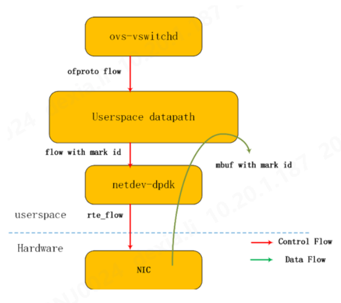

在DPDK v19.08版本中，rte_flow MARK支持仅适用于非vector收包。因此，在为OVS目的编译DPDK之前，用户需要通过编辑DPDK config /common_base文件来关闭i40e PMD中的vector收包：    
```
CONFIG_RTE_LIBRTE_I40E_INC_VECTOR= n  
``` 

编译DPDK并将其包含在OVS编译步骤中之后，可以通过调用ovs-vsctl来配置vswitch需要流硬件卸载：   

```
ovs-vsctl --no-wait set Open_vSwitch . other_config:hw-offload=true
```


```Shell
[root@centos7 openvswitch-2.13.0]# ovs-vsctl --no-wait set Open_vSwitch . other_config:hw-offload=true
[root@centos7 openvswitch-2.13.0]# ./vswitchd/ovs-vswitchd unix:/var/run/openvswitch/db.sock -vconsole:emer -vsyslog:err -vfile:info --mlockall --no-chdir --log-file=/var/log/openvswitch/ovs-vswitchd.log --pidfile=/var/run/openvswitch/ovs-vswitchd.pid --detach --monitor
[root@centos7 openvswitch-2.13.0]# ovs-vsctl get Open_vSwitch . other_config
{dpdk-init="true", hw-offload="true", n-handler-threads="2", n-revalidator-threads="2"}
```
将Intel® Ethernet Controller 700系列设备作为端口添加到交换机实例后，当硬件端口接收到的数据包和交换机中设置的Open Flow规则匹配时，OVS就尝试把流规则写入硬件。通过在ovs-appctl中启用以下syslog调试选项，可以获得流在进行硬件编程处理时的进一步调试输出：   
```
[ubuntu]$  sudo /usr/local/bin/ovs-appctl vlog/set netdev_dpdk:syslog:dbg 
[ubuntu]$  sudo /usr/local/bin/ovs-appctl vlog/set dpdk:syslog:dbg
[ubuntu]$ 
```


# 查看offloaded flow   

```
./utilities/ovs-appctl   dpctl/dump-flows type=offloaded
./utilities/ovs-appctl   dpctl/dump-flows type=ovs
```

#  dp_netdev_flow_add
```
static int
dpif_netdev_flow_put(struct dpif *dpif, const struct dpif_flow_put *put)
{
    struct dp_netdev *dp = get_dp_netdev(dpif);
    struct dp_netdev_flow *netdev_flow;
    struct netdev_flow_key key;
    struct dp_netdev_pmd_thread *pmd;
    struct match match;
    ovs_u128 ufid;
    unsigned pmd_id = put->pmd_id == PMD_ID_NULL
                      ? NON_PMD_CORE_ID : put->pmd_id;
    int error;

    error = dpif_netdev_flow_from_nlattrs(put->key, put->key_len, &match.flow);
    if (error) {
        return error;
    }
    error = dpif_netdev_mask_from_nlattrs(put->key, put->key_len,
                                          put->mask, put->mask_len,
                                          &match.flow, &match.wc);
    if (error) {
        return error;
    }

    pmd = dp_netdev_get_pmd(dp, pmd_id);
    if (!pmd) {
        return EINVAL;
    }

    /* Must produce a netdev_flow_key for lookup.
     * This interface is no longer performance critical, since it is not used
     * for upcall processing any more. */
    netdev_flow_key_from_flow(&key, &match.flow);

    if (put->ufid) {
        ufid = *put->ufid;
    } else {
        dpif_flow_hash(dpif, &match.flow, sizeof match.flow, &ufid);
    }

    ovs_mutex_lock(&pmd->flow_mutex);
    /* TODO: Special lookup to check if a dp rule already exists.
     * Requires to check the filter program chain too. */
    netdev_flow = dp_netdev_pmd_lookup_flow(pmd, &key, NULL, NULL);
    if (!netdev_flow) {
        if (put->flags & DPIF_FP_CREATE) {
            if (cmap_count(&pmd->flow_table) < MAX_FLOWS) {
                if (put->stats) {
                    memset(put->stats, 0, sizeof *put->stats);
                }
                dp_netdev_flow_add(pmd, &match, &ufid, put->filter_prog_chain,
                                   put->actions, put->actions_len);
                error = 0;
            } else {
                error = EFBIG;
            }
        } else {
            error = ENOENT;
        }
    }
```

#  dpdk-testpmd 
```
1.usertools/dpdk-devbind.py --force --bind=vfio-pci 0000:86:00.0 0000:86:00.1
2.x86_64-native-linuxapp-gcc/app/dpdk-testpmd  -l 1,2 -n 4 -w 0000:86:00.0 -w
0000:86:00.1  --file-prefix=dpdk_361_20201110000440   -- -i --rxq=4 --txq=4
--port-topology=chained
3.set fwd rxonly
4.set verbose 1
5.start
6.flow create 0 ingress pattern eth / ipv4 / udp / end actions rss types
ipv4-udp end queues end key
1234567890123456789012345678901234567890FFFFFFFFFFFF1234567890123456789012345678901234567890FFFFFFFFFFFF
/ end
```


# Testing TCP Segmentation Offload (TSO) 

[Testing TCP Segmentation Offload (TSO) with Intel® Ethernet Controller 710 Series Network Cards in Open vSwitch* with DPDK](https://www.intel.com/content/www/us/en/developer/articles/technical/testing-tcp-segmentation-offload-tso-with-intel-ethernet-controller-710-series-network.html)   

# references

[Open vSwitch Offload by SmartNICs on Arm](https://community.arm.com/arm-community-blogs/b/tools-software-ides-blog/posts/open-vswitch-offload-by-smartnics-on-arm)
 