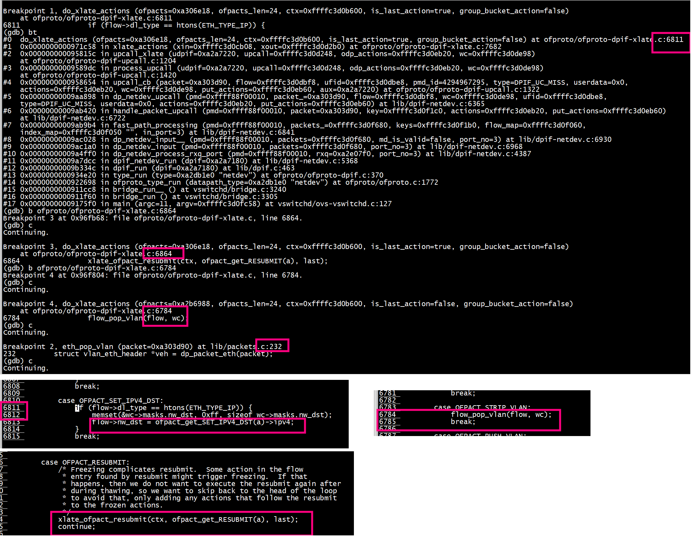
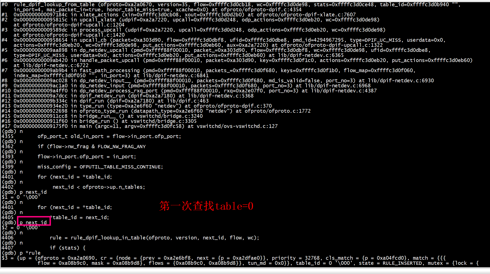
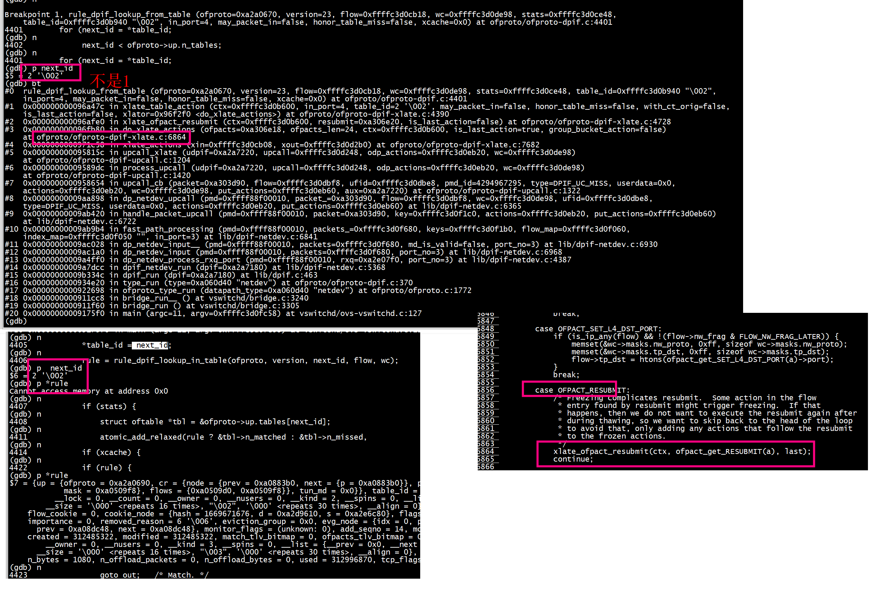
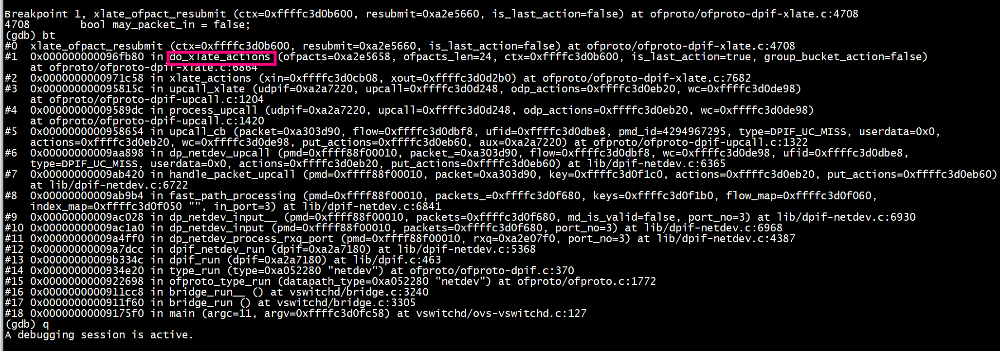
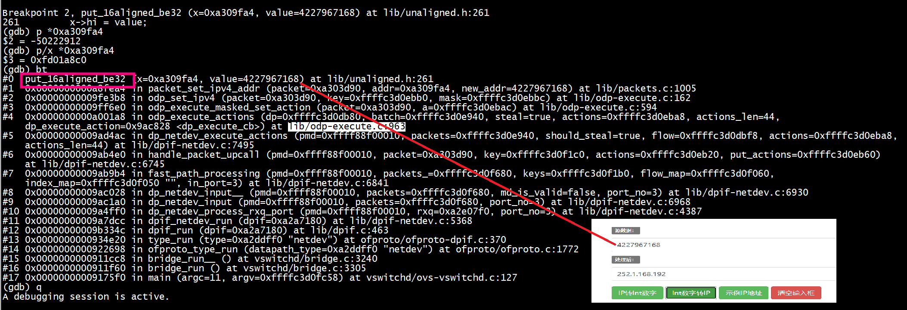
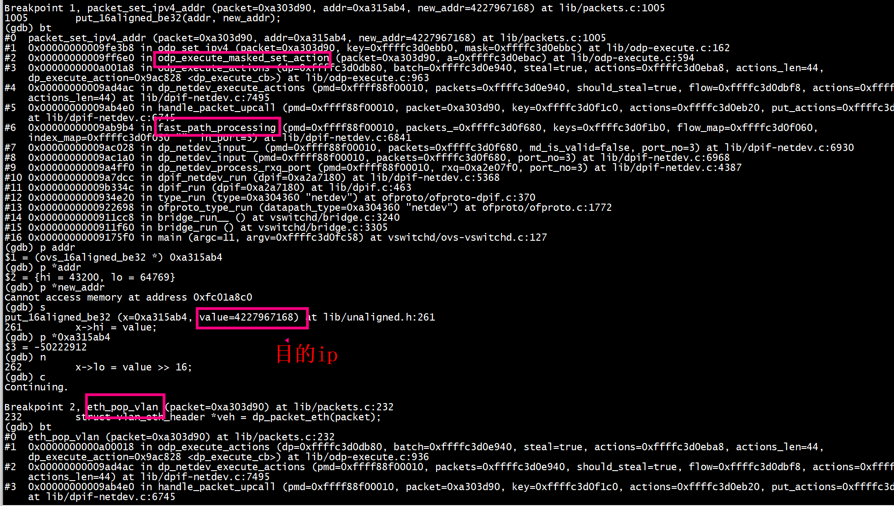
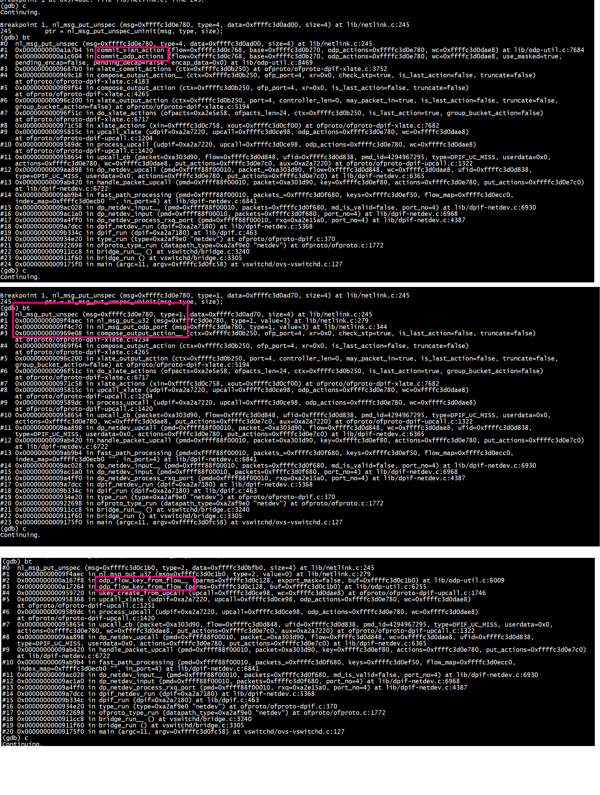
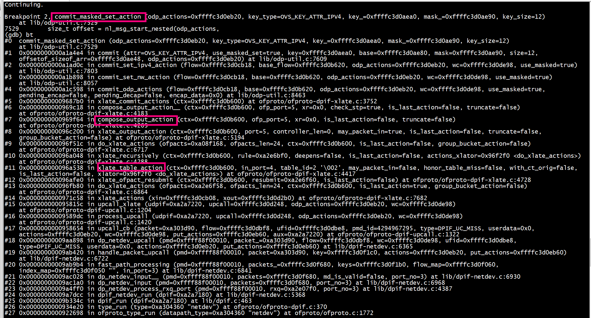
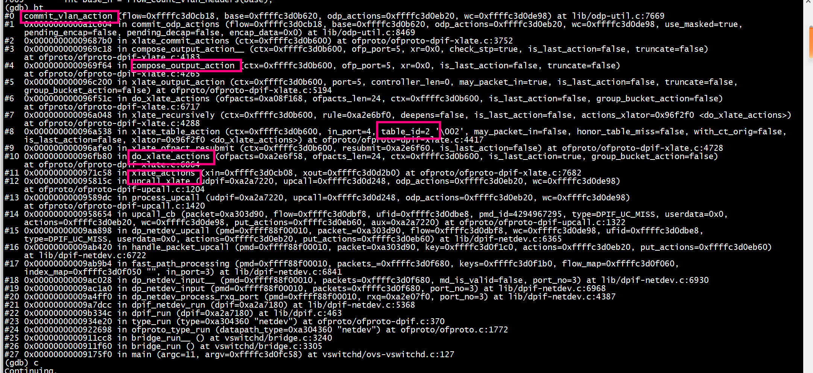
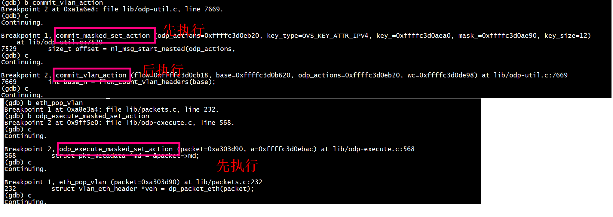

## flow
更改IP
```
[root@centos7 ~]#  ovs-ofctl add-flow br0 "in_port=4,actions=mod_nw_dst:192.168.1.252,,resubmit(,2)"
[root@centos7 ~]#  ovs-ofctl add-flow br0 "table=2,priority=1,in_port=4,dl_vlan=5,actions=strip_vlan,output:5"
[root@centos7 ~]# ovs-ofctl add-flow br0 "priority=1,in_port=5,actions=mod_vlan_vid:5,output:4"
```

```
[root@centos7 ~]# ovs-ofctl dump-flows br0
 cookie=0x0, duration=612.974s, table=0, n_packets=18, n_bytes=1080, in_port=host1 actions=mod_nw_dst:192.168.1.252,resubmit(,2)
 cookie=0x0, duration=582.581s, table=0, n_packets=5, n_bytes=434, priority=1,in_port=host2 actions=mod_vlan_vid:5,output:host1
 cookie=0x0, duration=603.334s, table=2, n_packets=18, n_bytes=1080, priority=1,in_port=host1,dl_vlan=5 actions=strip_vlan,output:host2
[root@centos7 ~]# 
```
表2：   
```
ovs-ofctl add-flow br0 "table=2,priority=1,in_port=4,dl_vlan=5,actions=strip_vlan,output:5"
```

## 添加arp
```
[root@centos7 ~]# ip netns exec ns1 ip n add 192.168.1.253 dev veth0.5  lladdr 3a:b6:3d:1f:95:62
[root@centos7 ~]# ip netns exec ns1 ip n
192.168.1.253 dev veth0.5 lladdr 3a:b6:3d:1f:95:62 PERMANENT
192.168.1.1 dev veth0.5  FAILED
```
## ping
```
[root@centos7 ~]# ip netns exec ns1 ping 192.168.1.253
PING 192.168.1.253 (192.168.1.253) 56(84) bytes of data.
64 bytes from 192.168.1.252: icmp_seq=1 ttl=64 time=0.476 ms
64 bytes from 192.168.1.252: icmp_seq=2 ttl=64 time=0.265 ms
64 bytes from 192.168.1.252: icmp_seq=3 ttl=64 time=0.218 ms
64 bytes from 192.168.1.252: icmp_seq=4 ttl=64 time=0.222 ms
^C
--- 192.168.1.253 ping statistics ---
4 packets transmitted, 4 received, 0% packet loss, time 3128ms
rtt min/avg/max/mdev = 0.218/0.295/0.476/0.106 ms
[root@centos7 ~]# 
```


```
ofproto/ofproto-dpif.c:4401
do_xlate_actions
dp_execute_cb
odp_execute_actions
```

## OFPACT_RESUBMIT
+ 1 OFPACT_SET_IPV4_DST 设置 flow->nw_dst   
+ 2 do_xlate_actions --> OFPACT_RESUBMIT   
+ 3 flow_pop_vlan
+ 4 OVS_ACTION_ATTR_SET_MASKED -->  odp_execute_masked_set_action
+ 5 eth_pop_vlan
```
6783         case OFPACT_STRIP_VLAN:
6784             flow_pop_vlan(flow, wc);
6785             break;
6786 
6787         case OFPACT_PUSH_VLAN:
6788             flow_push_vlan_uninit(flow, wc);
6789             flow->vlans[0].tpid = ofpact_get_PUSH_VLAN(a)->ethertype;
6790             flow->vlans[0].tci = htons(VLAN_CFI);
6791             break;
6856         case OFPACT_RESUBMIT:
6857             /* Freezing complicates resubmit.  Some action in the flow
6858              * entry found by resubmit might trigger freezing.  If that
6859              * happens, then we do not want to execute the resubmit again after
6860              * during thawing, so we want to skip back to the head of the loop
6861              * to avoid that, only adding any actions that follow the resubmit
6862              * to the frozen actions.
6863              */
6864             xlate_ofpact_resubmit(ctx, ofpact_get_RESUBMIT(a), last);
6865             continue;
```

```
6803         case OFPACT_SET_IPV4_SRC:
6804             if (flow->dl_type == htons(ETH_TYPE_IP)) {
6805                 memset(&wc->masks.nw_src, 0xff, sizeof wc->masks.nw_src);
6806                 flow->nw_src = ofpact_get_SET_IPV4_SRC(a)->ipv4;
6807             }
6808             break;
6809 
6810         case OFPACT_SET_IPV4_DST:
6811             if (flow->dl_type == htons(ETH_TYPE_IP)) {
6812                 memset(&wc->masks.nw_dst, 0xff, sizeof wc->masks.nw_dst);
6813                 flow->nw_dst = ofpact_get_SET_IPV4_DST(a)->ipv4;
6814             }
6815             break;
```

```
void
flow_pop_vlan(struct flow *flow, struct flow_wildcards *wc)
{
    int n = flow_count_vlan_headers(flow);
    if (n > 1) {
        if (wc) {
            memset(&wc->masks.vlans[1], 0xff,
                   sizeof(union flow_vlan_hdr) * (n - 1));
        }
        memmove(&flow->vlans[0], &flow->vlans[1],
                sizeof(union flow_vlan_hdr) * (n - 1));
    }
    if (n > 0) {
        memset(&flow->vlans[n - 1], 0, sizeof(union flow_vlan_hdr));
    }
}
```

###  第一次查表

### 第二次查表


##  xlate_ofpact_resubmit执行
   
## mod_nw_dst 执行


xfd01a8c0对应的IP地址：   
```
(gdb) p/x *0xa309fa4
$3 = 0xfd01a8c0
```


```
>>> import socket
>>> import struct
>>> ip = socket.inet_ntoa(struct.pack('I',4227967168)) 
>>> print(ip)
192.168.1.252
>>> ip = socket.inet_ntoa(struct.pack('I',0xfd01a8c0)) 
>>> print(ip)
192.168.1.253
>>>
```

```
>>> import socket
>>> import struct
>>> ip = socket.inet_ntoa(struct.pack('I',socket.htonl(0xfd01a8c0))) 
>>> print(ip)
253.1.168.192
>>> ip = socket.inet_ntoa(struct.pack('I',socket.htonl(4227967168))) 
>>> print(ip)
252.1.168.192
>>> 
```

## mod_nw_dst 和 pop vlan 执行

# fast path


# actions

```
 struct ofpbuf *actions,
 dp_netdev_execute_actions(pmd, &b, should_steal, flow,
                                  actions->data, actions->size);
```

```
 struct ofpbuf *actions
 /* OFPACT_SET_IPV4_SRC, OFPACT_SET_IPV4_DST.
 *
 * Used for OFPAT10_SET_NW_SRC, OFPAT10_SET_NW_DST. */
struct ofpact_ipv4 {
    OFPACT_PADDED_MEMBERS(
        struct ofpact ofpact;
        ovs_be32 ipv4;
    );
};
```

```
/* OFPACT_PUSH_VLAN.
 *
 * Used for OFPAT11_PUSH_VLAN. */
struct ofpact_push_vlan {
    OFPACT_PADDED_MEMBERS(
        struct ofpact ofpact;
        ovs_be16 ethertype;
    );
};
```

##  encode_SET_IPV4_DST
```
static void
encode_SET_IPV4_DST(const struct ofpact_ipv4 *ipv4,
                    enum ofp_version ofp_version, struct ofpbuf *out)
{
    encode_SET_IPV4_addr(ipv4, ofp_version, OFPAT_RAW_SET_NW_DST, MFF_IPV4_DST,
                         out);
}
```

##    commit_masked_set_action  OVS_ACTION_ATTR_SET_MASKED




```
  static bool
  commit(enum ovs_key_attr attr, bool use_masked_set,
         const void *key, void *base, void *mask, size_t size,
         struct offsetof_sizeof *offsetof_sizeof_arr,
        struct ofpbuf *odp_actions)
  {
      if (keycmp_mask(key, base, offsetof_sizeof_arr, mask)) {
         bool fully_masked = odp_mask_is_exact(attr, mask, size);
 
         if (use_masked_set && !fully_masked) {
             commit_masked_set_action(odp_actions, attr, key, mask, size);
         } else {
 
  }
```
OVS_ACTION_ATTR_SET_MASKED    
```
  void
commit_masked_set_action(struct ofpbuf *odp_actions,
                         enum ovs_key_attr key_type,
                         const void *key_, const void *mask_, size_t key_size)
{
    size_t offset = nl_msg_start_nested(odp_actions,
                                        OVS_ACTION_ATTR_SET_MASKED);
    char *data = nl_msg_put_unspec_uninit(odp_actions, key_type, key_size * 2);
    const char *key = key_, *mask = mask_;

    memcpy(data + key_size, mask, key_size);
    /* Clear unmasked bits while copying. */
    while (key_size--) {
        *data++ = *key++ & *mask++;
    }    
    nl_msg_end_nested(odp_actions, offset);
}
```

##   commit_vlan_action   OVS_ACTION_ATTR_POP_VLAN/OVS_ACTION_ATTR_PUSH_VLAN


