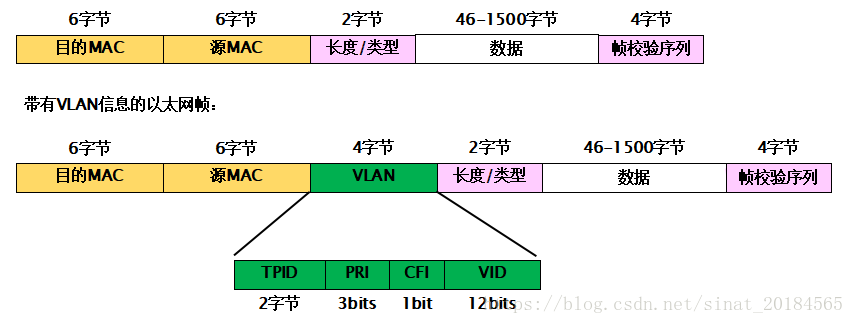
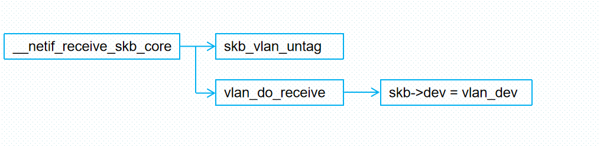

# purpose


```
 echo 0x19e5 0x0200 > /sys/bus/pci/drivers/hinic/new_id 
 ip  a add 192.168.10.251/24  dev enp6s0
 ip  a add 192.168.11.251/24  dev  enp5s0
 tcpdump -i enp5s0 icmp or arp and    host  192.168.10.251  -env 
```

## normal


## pmac to emac


```
//#if 0
#if TEST_TSN_E_P_MAC_TX
        struct net_device * dst_dev = NULL;

        struct ethhdr *eth;
        if (!strcmp(netdev->name, "enp6s0"))
        {
            eth = (struct ethhdr *)skb_mac_header(skb);
            dst_dev= dev_get_by_name(&init_net, "enp5s0");
            skb->dev = dst_dev;
            // memcpy(eth->h_source, orig_eth->h_dest, ETH_ALEN)
            dev_put(dst_dev);
            nic_dev = netdev_priv(dst_dev);
            //return dev_queue_xmit(skb);
        }
#endif
```


# dev_get_by_name
linux可以使用dev_get_by_name函数取得设备指针，但是使用是需要注意，使用过dev_get_by_name函数后一定要使用dev_put(pDev)函数取消设备引用，不然可能导致GET的设备无法正常卸载。

一般在将设备指针赋值给SKB->dev后就可以dev_put(pDev)

```
pDev = dev_get_by_name("sap1");
struct sk_buff *pIGMP_Query_skb_clone = NULL;
pIGMP_Query_skb_clone=skb_clone(pIGMP_Query_skb, GFP_ATOMIC);
pIGMP_Query_skb_clone->dev=pDev;
dev_put(pIGMP_Query_skb_clone->dev);
dev_queue_xmit(pIGMP_Query_skb_clone)
```

##  dev_put

```

/**
 *      dev_put - release reference to device
 *      @dev: network device
 *
 * Release reference to device to allow it to be freed.
 */
static inline void dev_put(struct net_device *dev)
{
#ifdef CONFIG_PCPU_DEV_REFCNT
        this_cpu_dec(*dev->pcpu_refcnt);
#else
        refcount_dec(&dev->dev_refcnt);
#endif
}

struct net_device *dev_get_by_name(struct net *net, const char *name)
{
        struct net_device *dev;

        rcu_read_lock();
        dev = dev_get_by_name_rcu(net, name);
        if (dev)
                dev_hold(dev);
        rcu_read_unlock();
        return dev;
}

static inline void dev_hold(struct net_device *dev)
{
#ifdef CONFIG_PCPU_DEV_REFCNT
        this_cpu_inc(*dev->pcpu_refcnt);
#else
        refcount_inc(&dev->dev_refcnt);
#endif
}
```

# PACKET_HOST  PACKET_OTHERHOST

```
/* Packet types */

#define PACKET_HOST             0               /* To us                */
#define PACKET_BROADCAST        1               /* To all               */
#define PACKET_MULTICAST        2               /* To group             */
#define PACKET_OTHERHOST        3               /* To someone else      */
#define PACKET_OUTGOING         4               /* Outgoing of any type */
#define PACKET_LOOPBACK         5               /* MC/BRD frame looped back */
#define PACKET_USER             6               /* To user space        */
#define PACKET_KERNEL           7               /* To kernel space      */
/* Unused, PACKET_FASTROUTE and PACKET_LOOPBACK are invisible to user space */
#define PACKET_FASTROUTE        6               /* Fastrouted frame     */

```

```
__be16 eth_type_trans(struct sk_buff *skb, struct net_device *dev)
{
  skb->dev = dev;
  skb->pkt_type = PACKET_OTHERHOST;
}
```

```
/**
 * eth_type_trans - determine the packet's protocol ID.
 * @skb: received socket data
 * @dev: receiving network device
 *
 * The rule here is that we
 * assume 802.3 if the type field is short enough to be a length.
 * This is normal practice and works for any 'now in use' protocol.
 */
__be16 eth_type_trans(struct sk_buff *skb, struct net_device *dev)
{
        unsigned short _service_access_point;
        const unsigned short *sap;
        const struct ethhdr *eth;

        skb->dev = dev;
        skb_reset_mac_header(skb);

        eth = (struct ethhdr *)skb->data;
        skb_pull_inline(skb, ETH_HLEN);

        if (unlikely(is_multicast_ether_addr_64bits(eth->h_dest))) {
                if (ether_addr_equal_64bits(eth->h_dest, dev->broadcast))
                        skb->pkt_type = PACKET_BROADCAST;
                else
                        skb->pkt_type = PACKET_MULTICAST;
        }
        else if (unlikely(!ether_addr_equal_64bits(eth->h_dest,
                                                   dev->dev_addr)))
                skb->pkt_type = PACKET_OTHERHOST;

        /*
         * Some variants of DSA tagging don't have an ethertype field
         * at all, so we check here whether one of those tagging
         * variants has been configured on the receiving interface,
         * and if so, set skb->protocol without looking at the packet.
         */
        if (unlikely(netdev_uses_dsa(dev)))
                return htons(ETH_P_XDSA);

        if (likely(eth_proto_is_802_3(eth->h_proto)))
                return eth->h_proto;

        /*
         *      This is a magic hack to spot IPX packets. Older Novell breaks
         *      the protocol design and runs IPX over 802.3 without an 802.2 LLC
         *      layer. We look for FFFF which isn't a used 802.2 SSAP/DSAP. This
         *      won't work for fault tolerant netware but does for the rest.
         */
        sap = skb_header_pointer(skb, 0, sizeof(*sap), &_service_access_point);
        if (sap && *sap == 0xFFFF)
                return htons(ETH_P_802_3);

        /*
         *      Real 802.2 LLC
         */
        return htons(ETH_P_802_2);
}
EXPORT_SYMBOL(eth_type_trans
```


# dev  在napi中有什么用


```
static enum gro_result dev_gro_receive(struct napi_struct *napi, struct sk_buff *skb)
{
    if (netif_elide_gro(skb->dev))
        goto normal;
}
static void gro_list_prepare(struct napi_struct *napi, struct sk_buff *skb)
{
    struct sk_buff *p;
    unsigned int maclen = skb->dev->hard_header_len;
    u32 hash = skb_get_hash_raw(skb);
    //遍历gro_list,然后判断是否有可能两个skb 相似。
    for (p = napi->gro_list; p; p = p->next) {
        unsigned long diffs;
        NAPI_GRO_CB(p)->flush = 0;
        if (hash != skb_get_hash_raw(p)) {
            NAPI_GRO_CB(p)->same_flow = 0;
            continue;
        }
        diffs = (unsigned long)p->dev ^ (unsigned long)skb->dev;////////////////////////////
		
}
```


echo 20000 >/sys/class/net/eth1/gro_flush_timeout
echo 10 >/sys/class/net/eth1/napi_defer_hard_irqs

```
                skb_record_rx_queue(skb, qp->q_id);
                skb->protocol = eth_type_trans(skb, rxq->netdev);


#if TEST_TSN_E_P_MAC
                if (!strcmp(rxq->netdev->name, "enp5s0"))
                {
                    struct net_device * dst_dev = dev_get_by_name(&init_net, "enp6s0");
                    if (dst_dev) {
                    pr_info("dst_dev name %s \n", dst_dev->name);
                    if( PACKET_OTHERHOST == skb->pkt_type)
                    {
                            skb->pkt_type = PACKET_HOST;
                    }
                    skb->dev = dst_dev;
                    dev_put(dst_dev);
                   }
               }
#endif
                napi_gro_receive(&rxq->napi, skb);
```

## napi->gro_list 
 ***GRO分别是什么用来作甚***
  GRO(Generic Receive Offload)的功能将多个 TCP 数据聚合在一个skb（socbuff）结构，然后作为一个大数据包交付给上层的网络协议栈，以减少上层协议栈处理skb的开销，提高系统接收TCP数据包的性能。这个功能需要网卡驱动程序的支持。合并了多个skb的超级 skb能够一次性通过网络协议栈，从而减轻CPU负载。
  GRO是针对网络收包流程进行改进的，并且只有NAPI类型的驱动才支持此功能。因此如果要支持GRO，不仅要内核支持，驱动也必须调用相应的接口来开启此功能。用ethtool -K gro on来开启GRO。
 
 GRO与TSO类似，但TSO只支持发送数据包。支持GRO的驱动会在NAPI的回调poll方法中读取数据包，然后调用GRO的接口napi_gro_receive或者napi_gro_frags来将数据包送进协议栈。


```
root@ubuntux86:/home/ubuntu# ethtool -k enp0s31f6
Features for enp0s31f6:
rx-checksumming: on
tx-checksumming: on
        tx-checksum-ipv4: off [fixed]
        tx-checksum-ip-generic: on
        tx-checksum-ipv6: off [fixed]
        tx-checksum-fcoe-crc: off [fixed]
        tx-checksum-sctp: off [fixed]
scatter-gather: on
        tx-scatter-gather: on
        tx-scatter-gather-fraglist: off [fixed]
tcp-segmentation-offload: on
        tx-tcp-segmentation: on
        tx-tcp-ecn-segmentation: off [fixed]
        tx-tcp-mangleid-segmentation: off
        tx-tcp6-segmentation: on
generic-segmentation-offload: on
generic-receive-offload: on           ////////////////////////////////
large-receive-offload: off [fixed]
rx-vlan-offload: on
tx-vlan-offload: on
ntuple-filters: off [fixed]
receive-hashing: on
highdma: on [fixed]
rx-vlan-filter: off [fixed]
vlan-challenged: off [fixed]
tx-lockless: off [fixed]
netns-local: off [fixed]
tx-gso-robust: off [fixed]
tx-fcoe-segmentation: off [fixed]
tx-gre-segmentation: off [fixed]
tx-gre-csum-segmentation: off [fixed]
tx-ipxip4-segmentation: off [fixed]
tx-ipxip6-segmentation: off [fixed]
tx-udp_tnl-segmentation: off [fixed]
tx-udp_tnl-csum-segmentation: off [fixed]
tx-gso-partial: off [fixed]
tx-tunnel-remcsum-segmentation: off [fixed]
tx-sctp-segmentation: off [fixed]
tx-esp-segmentation: off [fixed]
tx-udp-segmentation: off [fixed]
tx-gso-list: off [fixed]
fcoe-mtu: off [fixed]
tx-nocache-copy: off
loopback: off [fixed]
rx-fcs: off
rx-all: off
tx-vlan-stag-hw-insert: off [fixed]
rx-vlan-stag-hw-parse: off [fixed]
rx-vlan-stag-filter: off [fixed]
l2-fwd-offload: off [fixed]
hw-tc-offload: off [fixed]
esp-hw-offload: off [fixed]
esp-tx-csum-hw-offload: off [fixed]
rx-udp_tunnel-port-offload: off [fixed]
tls-hw-tx-offload: off [fixed]
tls-hw-rx-offload: off [fixed]
rx-gro-hw: off [fixed]
tls-hw-record: off [fixed]
rx-gro-list: off
macsec-hw-offload: off [fixed]
rx-udp-gro-forwarding: off
hsr-tag-ins-offload: off [fixed]
hsr-tag-rm-offload: off [fixed]
hsr-fwd-offload: off [fixed]
hsr-dup-offload: off [fixed]
```
 
 例如virtionet中函数调用栈如下

receive_buf->napi_gro_receive->skb_gro_reset_offset->napi_skb_finish
 
 
 

```
struct napi_struct
{
    unsigned int    gro_count;  //gro_list 上挂的skb 个数。
    struct sk_buff  *gro_list; //等待合并的skb 链表
}
```

```
 napi_gro_receive(&rxq->napi, skb)
gro_result_t napi_gro_receive(struct napi_struct *napi, struct sk_buff *skb)
{
        skb_mark_napi_id(skb, napi);
        trace_napi_gro_receive_entry(skb);

        skb_gro_reset_offset(skb);

        return napi_skb_finish(dev_gro_receive(napi, skb), skb);
}
```

```
static enum gro_result dev_gro_receive(struct napi_struct *napi, struct sk_buff *skb)
{
 gro_list_prepare(napi, skb);
 
 pp = ptype->callbacks.gro_receive(&napi->gro_list, skb);
 napi->gro_count++
}
```

# 多对列


```
root@SIG-0101:~# ethtool -l  switch
Channel parameters for switch:
Cannot get device channel parameters
: Operation not supported
root@SIG-0101:~# brctl show switch
bridge name     bridge id               STP enabled     interfaces
switch          8000.001df312527c       no              swp0
                                                        swp1
                                                        swp2
                                                        swp3
root@SIG-0101:~# ehtool -i switch
-bash: ehtool: command not found
root@SIG-0101:~# ehttool -i switch
-bash: ehttool: command not found
root@SIG-0101:~# ethtool -i switch
driver: bridge
version: 2.3
firmware-version: N/A
expansion-rom-version: 
bus-info: N/A
supports-statistics: no
supports-test: no
supports-eeprom-access: no
supports-register-dump: no
supports-priv-flags: no
root@SIG-0101:~# ethtool -i swp2  
driver: dsa
version: 5.4.3-rt1
firmware-version: N/A
expansion-rom-version: 
bus-info: platform
supports-statistics: yes
supports-test: no
supports-eeprom-access: no
supports-register-dump: no
supports-priv-flags: no
root@SIG-0101:~# ethtool -l swp2
Channel parameters for swp2:
Cannot get device channel parameters
: Operation not supported
root@SIG-0101:~# 
```


```
17: eth0.110@enahisic2i0: <BROADCAST,MULTICAST> mtu 1500 qdisc noop state DOWN group default qlen 1000
    link/ether 48:57:02:64:ea:1b brd ff:ff:ff:ff:ff:ff
[root@bogon ~]# ip link set eth0.110 up
[root@bogon ~]# ethtool -l eth0.110 
Channel parameters for eth0.110:
Cannot get device channel parameters
: Operation not supported
[root@bogon ~]# ethtool -l  enahisic2i0
Channel parameters for enahisic2i0:
Pre-set maximums:
RX:             16
TX:             16
Other:          0
Combined:       0
Current hardware settings:
RX:             16
TX:             16
Other:          0
Combined:       0

[root@bogon ~]# 

[root@bogon ~]# ethtool -l eth0.110 
Channel parameters for eth0.110:
Cannot get device channel parameters
: Operation not supported
[root@bogon ~]# 
```

## vlan和switch qdsic实现


***netif_is_multiqueue(dev) and dev->priv_flags & IFF_NO_QUEUE***
```
#if TEST_TSN_E_P_MAC
        netdev->priv_flags |= IFF_NO_QUEUE;
#endif
```

```
static void attach_default_qdiscs(struct net_device *dev)
{
        struct netdev_queue *txq;
        struct Qdisc *qdisc;

        txq = netdev_get_tx_queue(dev, 0);

        if (!netif_is_multiqueue(dev) ||
            dev->priv_flags & IFF_NO_QUEUE) {
                netdev_for_each_tx_queue(dev, attach_one_default_qdisc, NULL);
                dev->qdisc = txq->qdisc_sleeping; ////
                qdisc_refcount_inc(dev->qdisc);
        } else {
                qdisc = qdisc_create_dflt(txq, &mq_qdisc_ops, TC_H_ROOT);
                if (qdisc) {
                        dev->qdisc = qdisc;
                        qdisc->ops->attach(qdisc);
                }
        }
#ifdef CONFIG_NET_SCHED
        if (dev->qdisc != &noop_qdisc)
                qdisc_hash_add(dev->qdisc, false);
#endif
}
```


skb->queue_mapping有变化


# ifconfig  enp5s0 promisc

## 设置网卡为混杂模式


 ```
 [root@centos7 hinic-tsn]# ifconfig  enp5s0 -promisc
[root@centos7 hinic-tsn]# 
[root@centos7 hinic-tsn]# 
[root@centos7 hinic-tsn]# ifconfig  enp5s0 -promisc
[root@centos7 hinic-tsn]# ifconfig  enp5s0 promisc
[root@centos7 hinic-tsn]# 
 ```
 
 
 
 
## 网卡工作模式
网卡有以下几种工作模式，通常网卡会配置广播和多播模式：

广播模式（Broad Cast Model）:它的物理地址地址是 0Xffffff 的帧为广播帧，工作在广播模式的网卡接收广播帧。它将会接收所有目的地址为广播地址的数据包，一般所有的网卡都会设置为这个模式

多播传送（MultiCast Model）：多播传送地址作为目的物理地址的帧可以被组内的其它主机同时接收，而组外主机却接收不到。但是，如果将网卡设置为多播传送模式，它可以接收所有的多播传送帧，而不论它是不是组内成员。当数据包的目的地址为多播地址，而且网卡地址是属于那个多播地址所代表的多播组时，网卡将接纳此数据包，即使一个网卡并不是一个多播组的成员，程序也可以将网卡设置为多播模式而接收那些多播的数据包。

直接模式（Direct Model）:工作在直接模式下的网卡只接收目地址是自己 Mac 地址的帧。只有当数据包的目的地址为网卡自己的地址时，网卡才接收它。

混杂模式（Promiscuous Model）:工作在混杂模式下的网卡接收所有的流过网卡的帧，抓包程序就是在这种模式下运行的。网卡的缺省工作模式包含广播模式和直接模式，即它只接收广播帧和发给自己的帧。如果采用混杂模式，网卡将接受同一网络内所有所发送的数据包，这样就可以到达对于网络信息监视捕获的目的。它将接收所有经过的数据包，这个特性是编写网络监听程序的关键。
 

# ifconfig  enp5s0 -promisc


## tcpdump 不运行


## tcpdump 运行

***tcpdump程序抓包的时候是promisc模式，所以能偶尔ping通***


 
# 开启多对列


```
[root@centos7 hinic-tsn]# insmod  hinic.ko 
[root@centos7 hinic-tsn]#  echo 0x19e5 0x0200 > /sys/bus/pci/drivers/hinic/new_id 
[root@centos7 hinic-tsn]#  ip  a add 192.168.10.251/24  dev enp6s0
[root@centos7 hinic-tsn]# ifconfig enp5s0 promisc
[root@centos7 hinic-tsn]# ethtool -l enp6s0
Channel parameters for enp6s0:
Pre-set maximums:
RX:             16
TX:             16
Other:          0
Combined:       0
Current hardware settings:
RX:             8
TX:             8
Other:          0
Combined:       0

[root@centos7 hinic-tsn]# ethtool -l enp5s0
Channel parameters for enp5s0:
Pre-set maximums:
RX:             16
TX:             16
Other:          0
Combined:       0
Current hardware settings:
RX:             8
TX:             8
Other:          0
Combined:       0

[root@centos7 hinic-tsn]# 
```

```
[root@centos7 hinic-tsn]# dmesg | tail -n 60
[75806.982293]  txq1 ffff803fd5576c00  and  skb->queue_mapping 6 
[75806.988101]  txq2 ffff803fd5565c00 , ffff000008754714, status 0 
[75806.994084] qdsic enqueue and qdsic run 
[75806.997992] rc 0, rc == NET_XMIT_SUCCESS: 1 
[75807.002246]  txq1 ffff803fd5576c00  and  skb->queue_mapping 6 
[75807.008055]  txq2 ffff803fd5565c00 , ffff000008754714, status 0 
[75807.014035] qdsic enqueue and qdsic run 
[75807.017943] rc 0, rc == NET_XMIT_SUCCESS: 1 
[75807.022198]  txq1 ffff803fd5576c00  and  skb->queue_mapping 6 
[75807.028006]  txq2 ffff803fd5565c00 , ffff000008754714, status 0 
[75807.033988] qdsic enqueue and qdsic run 
[75807.037896] rc 0, rc == NET_XMIT_SUCCESS: 1 
[75807.042151]  txq1 ffff803fd5576c00  and  skb->queue_mapping 6 
[75807.047959]  txq2 ffff803fd5565c00 , ffff000008754714, status 0 
[75807.053941] qdsic enqueue and qdsic run 
[75807.057849] rc 0, rc == NET_XMIT_SUCCESS: 1 
[75807.062111]  txq1 ffff803fd5576800  and  skb->queue_mapping 4 
[75807.067919]  txq2 ffff803fd5565800 , ffff000008754714, status 0 
[75807.073899] qdsic enqueue and qdsic run 
[75807.077809] rc 0, rc == NET_XMIT_SUCCESS: 1 
[75807.963900]  txq1 ffff803fd5576c00  and  skb->queue_mapping 6 
[75807.969709]  txq2 ffff803fd5565c00 , ffff000008754714, status 0 
[75807.975690] qdsic enqueue and qdsic run 
[75807.979598] rc 0, rc == NET_XMIT_SUCCESS: 1 
[75807.983853]  txq1 ffff803fd5576c00  and  skb->queue_mapping 6 
[75807.989661]  txq2 ffff803fd5565c00 , ffff000008754714, status 0 
[75807.995643] qdsic enqueue and qdsic run 
[75807.999551] rc 0, rc == NET_XMIT_SUCCESS: 1 
[75808.003806]  txq1 ffff803fd5576c00  and  skb->queue_mapping 6 
[75808.009614]  txq2 ffff803fd5565c00 , ffff000008754714, status 0 
[75808.015597] qdsic enqueue and qdsic run 
[75808.019505] rc 0, rc == NET_XMIT_SUCCESS: 1 
[75808.023759]  txq1 ffff803fd5576c00  and  skb->queue_mapping 6 
[75808.029567]  txq2 ffff803fd5565c00 , ffff000008754714, status 0 
[75808.035550] qdsic enqueue and qdsic run 
[75808.039458] rc 0, rc == NET_XMIT_SUCCESS: 1 
[75808.043712]  txq1 ffff803fd5576c00  and  skb->queue_mapping 6 
[75808.049520]  txq2 ffff803fd5565c00 , ffff000008754714, status 0 
[75808.055503] qdsic enqueue and qdsic run 
[75808.059411] rc 0, rc == NET_XMIT_SUCCESS: 1 
[75808.965475]  txq1 ffff803fd5576c00  and  skb->queue_mapping 6 
[75808.971285]  txq2 ffff803fd5565c00 , ffff000008754714, status 0 
[75808.977265] qdsic enqueue and qdsic run 
[75808.981174] rc 0, rc == NET_XMIT_SUCCESS: 1 
[75808.985429]  txq1 ffff803fd5576c00  and  skb->queue_mapping 6 
[75808.991237]  txq2 ffff803fd5565c00 , ffff000008754714, status 0 
[75808.997217] qdsic enqueue and qdsic run 
[75809.001125] rc 0, rc == NET_XMIT_SUCCESS: 1 
[75809.005379]  txq1 ffff803fd5576c00  and  skb->queue_mapping 6 
[75809.011188]  txq2 ffff803fd5565c00 , ffff000008754714, status 0 
[75809.017170] qdsic enqueue and qdsic run 
[75809.021078] rc 0, rc == NET_XMIT_SUCCESS: 1 
[75809.025333]  txq1 ffff803fd5576c00  and  skb->queue_mapping 6 
[75809.031141]  txq2 ffff803fd5565c00 , ffff000008754714, status 0 
[75809.037123] qdsic enqueue and qdsic run 
[75809.041031] rc 0, rc == NET_XMIT_SUCCESS: 1 
[75809.045285]  txq1 ffff803fd5576c00  and  skb->queue_mapping 6 
[75809.051094]  txq2 ffff803fd5565c00 , ffff000008754714, status 0 
[75809.057076] qdsic enqueue and qdsic run 
[75809.060984] rc 0, rc == NET_XMIT_SUCCESS: 1 
[root@centos7 hinic-tsn]# 
```


```
 pr_err(" txq2 %p , %p, status %d \n", txq2, q->enqueue ? q->enqueue : NULL, test_bit(__QDISC_STATE_DEACTIVATED, &q->state) );
```
q->enqueue 不是NULL


# 单队列


```
#if TEST_TSN_E_P_MAC
        netdev->priv_flags |= IFF_NO_QUEUE;
#endif
```

```
[root@centos7 hinic-tsn]# insmod  hinic.ko 
[root@centos7 hinic-tsn]#  echo 0x19e5 0x0200 > /sys/bus/pci/drivers/hinic/new_id 
[root@centos7 hinic-tsn]#  ip  a add 192.168.10.251/24  dev enp6s0
[root@centos7 hinic-tsn]# ifconfig enp5s0 promisc
[root@centos7 hinic-tsn]# ethtool -l enp6s0
Channel parameters for enp6s0:
Pre-set maximums:
RX:             16
TX:             16
Other:          0
Combined:       0
Current hardware settings:
RX:             8
TX:             8
Other:          0
Combined:       0

[root@centos7 hinic-tsn]# ethtool -l enp5s0
Channel parameters for enp5s0:
Pre-set maximums:
RX:             16
TX:             16
Other:          0
Combined:       0
Current hardware settings:
RX:             8
TX:             8
Other:          0
Combined:       0

[root@centos7 hinic-tsn]# 
```


```
[root@centos7 hinic-tsn]# dmesg | tail -n 60
[76295.328473]  txq1 ffff803fd5562c00  and  skb->queue_mapping 6 
[76295.334282]  txq2 ffff803fd5560c00 ,           (null), status 0 
[76295.340263] qdsic enqueue and qdsic run 
[76295.344171] rc 0, rc == NET_XMIT_SUCCESS: 1 
[76295.348426]  txq1 ffff803fd5562c00  and  skb->queue_mapping 6 
[76295.354234]  txq2 ffff803fd5560c00 ,           (null), status 0 
[76295.360216] qdsic enqueue and qdsic run 
[76295.364124] rc 0, rc == NET_XMIT_SUCCESS: 1 
[76295.368379]  txq1 ffff803fd5562c00  and  skb->queue_mapping 6 
[76295.374187]  txq2 ffff803fd5560c00 ,           (null), status 0 
[76295.380169] qdsic enqueue and qdsic run 
[76295.384077] rc 0, rc == NET_XMIT_SUCCESS: 1 
[76295.388332]  txq1 ffff803fd5562c00  and  skb->queue_mapping 6 
[76295.394140]  txq2 ffff803fd5560c00 ,           (null), status 0 
[76295.400120] qdsic enqueue and qdsic run 
[76295.404028] rc 0, rc == NET_XMIT_SUCCESS: 1 
[76295.408282]  txq1 ffff803fd5562c00  and  skb->queue_mapping 6 
[76295.414091]  txq2 ffff803fd5560c00 ,           (null), status 0 
[76295.420071] qdsic enqueue and qdsic run 
[76295.423979] rc 0, rc == NET_XMIT_SUCCESS: 1 
[76296.330063]  txq1 ffff803fd5562c00  and  skb->queue_mapping 6 
[76296.335873]  txq2 ffff803fd5560c00 ,           (null), status 0 
[76296.341855] qdsic enqueue and qdsic run 
[76296.345764] rc 0, rc == NET_XMIT_SUCCESS: 1 
[76296.350018]  txq1 ffff803fd5562c00  and  skb->queue_mapping 6 
[76296.355826]  txq2 ffff803fd5560c00 ,           (null), status 0 
[76296.361807] qdsic enqueue and qdsic run 
[76296.365715] rc 0, rc == NET_XMIT_SUCCESS: 1 
[76296.369969]  txq1 ffff803fd5562c00  and  skb->queue_mapping 6 
[76296.375777]  txq2 ffff803fd5560c00 ,           (null), status 0 
[76296.381760] qdsic enqueue and qdsic run 
[76296.385668] rc 0, rc == NET_XMIT_SUCCESS: 1 
[76296.389922]  txq1 ffff803fd5562c00  and  skb->queue_mapping 6 
[76296.395730]  txq2 ffff803fd5560c00 ,           (null), status 0 
[76296.401710] qdsic enqueue and qdsic run 
[76296.405618] rc 0, rc == NET_XMIT_SUCCESS: 1 
[76296.409872]  txq1 ffff803fd5562c00  and  skb->queue_mapping 6 
[76296.415681]  txq2 ffff803fd5560c00 ,           (null), status 0 
[76296.421663] qdsic enqueue and qdsic run 
[76296.425571] rc 0, rc == NET_XMIT_SUCCESS: 1 
[76297.331634]  txq1 ffff803fd5562c00  and  skb->queue_mapping 6 
[76297.337444]  txq2 ffff803fd5560c00 ,           (null), status 0 
[76297.343424] qdsic enqueue and qdsic run 
[76297.347332] rc 0, rc == NET_XMIT_SUCCESS: 1 
[76297.351587]  txq1 ffff803fd5562c00  and  skb->queue_mapping 6 
[76297.357395]  txq2 ffff803fd5560c00 ,           (null), status 0 
[76297.363377] qdsic enqueue and qdsic run 
[76297.367285] rc 0, rc == NET_XMIT_SUCCESS: 1 
[76297.371540]  txq1 ffff803fd5562c00  and  skb->queue_mapping 6 
[76297.377348]  txq2 ffff803fd5560c00 ,           (null), status 0 
[76297.383330] qdsic enqueue and qdsic run 
[76297.387238] rc 0, rc == NET_XMIT_SUCCESS: 1 
[76297.391492]  txq1 ffff803fd5562c00  and  skb->queue_mapping 6 
[76297.397300]  txq2 ffff803fd5560c00 ,           (null), status 0 
[76297.403283] qdsic enqueue and qdsic run 
[76297.407190] rc 0, rc == NET_XMIT_SUCCESS: 1 
[76297.411445]  txq1 ffff803fd5562c00  and  skb->queue_mapping 6 
[76297.417252]  txq2 ffff803fd5560c00 ,           (null), status 0 
[76297.423234] qdsic enqueue and qdsic run 
[76297.427142] rc 0, rc == NET_XMIT_SUCCESS: 1 
```


# vlan 和skb->dev的更改

先来看一下vlan数据包的帧格式，整个vlan信息大小为4个字节，分别为2个字节的标签协议标识（Tag Protocol Identifier），和2个字节标签控制信息（Tag Control Infomation）。

其中后者TCI又有三个子字段组成：3个bit的优先级（PRI）、一个bit的标准格式指示器（Canonical Format Indicator）和12个bit的vlan id：
 
 
 
 
 
 以下代码是位于net/core/dev.c文件中vlan数据包的主要接收处理函数。驱动层接收上来的数据包已经设置好了skb的protocol字段（为8021Q或者8021AD）。依次调用skb_vlan_untag与vlan_do_receive函数进行处理。
 
```
static int __netif_receive_skb_core(struct sk_buff *skb, bool pfmemalloc)
{
another_round:
 
    if (skb->protocol == cpu_to_be16(ETH_P_8021Q) ||
        skb->protocol == cpu_to_be16(ETH_P_8021AD)) {
        skb = skb_vlan_untag(skb);
    }
    if (skb_vlan_tag_present(skb)) {
        if (vlan_do_receive(&skb))
            goto another_round;
    }
}
```

## 剥离VLAN标签

对于函数skb_vlan_untag来说，主要功能是从数据包中提取vlan信息，保存到skb结构中，然后从数据包中取出vlan相关字段，另外，获取数据包的真实协议类型更新到skb的protocol字段(三层协议类型)，替换了之前的ETH_P_8021Q或者ETH_P_8021AD。

skb_reorder_vlan_header函数负责将vlan信息从数据包中剥离出来。
 
```
static inline void vlan_set_encap_proto(struct sk_buff *skb, struct vlan_hdr *vhdr)
{
    proto = vhdr->h_vlan_encapsulated_proto;
    if (ntohs(proto) >= ETH_P_802_3_MIN)
        skb->protocol = proto;
}
static struct sk_buff *skb_reorder_vlan_header(struct sk_buff *skb)
{
    memmove(skb->data - ETH_HLEN, skb->data - skb->mac_len - VLAN_HLEN, 2 * ETH_ALEN);
}
struct sk_buff *skb_vlan_untag(struct sk_buff *skb)
{
    vhdr = (struct vlan_hdr *)skb->data;
    vlan_tci = ntohs(vhdr->h_vlan_TCI);
    __vlan_hwaccel_put_tag(skb, skb->protocol, vlan_tci);
 
    vlan_set_encap_proto(skb, vhdr);
	
	skb = skb_reorder_vlan_header(skb);
}

```

## VLAN设备接收

系统中必须要有与数据包中vlan id相同的vlan设备，否则结束处理。找到此vlan设备后将其赋值给skb的dev，此时就完成了接收设备从物理网卡到vlan设备的转换，skb中的vlan_tci也就没有用处了可以清理。VLAN设备可能具有与其所在物理设备不同的MAC地址，在此情况下物理设备驱动程序会赋值PACKET_OTHERHOST到skb的pkt_type，需要进一步判断数据包目的MAC是否为vlan的MAC地址，如果是，修改pkt_type为PACKET_HOST，表示为发往本机的数据包。

如果关闭VLAN_FLAG_REORDER_HDR选项，vlan_do_receive函数会重新把vlan信息插入到skb的payload中。
 
```

bool vlan_do_receive(struct sk_buff **skbp)
{
    vlan_dev = vlan_find_dev(skb->dev, vlan_proto, vlan_id);
    if (!vlan_dev) return false;
 
    skb->dev = vlan_dev;
    if (skb->pkt_type == PACKET_OTHERHOST) {
        if (ether_addr_equal(eth_hdr(skb)->h_dest, vlan_dev->dev_addr))
            skb->pkt_type = PACKET_HOST;
    }
    skb->vlan_tci = 0;
}
```
 ***更新skb->dev, skb->dev = vlan_dev;***

 对于IP数据包，skb的protocol换成了0x0806，ip_rcv函数就可以正常接收了。
 
  
 