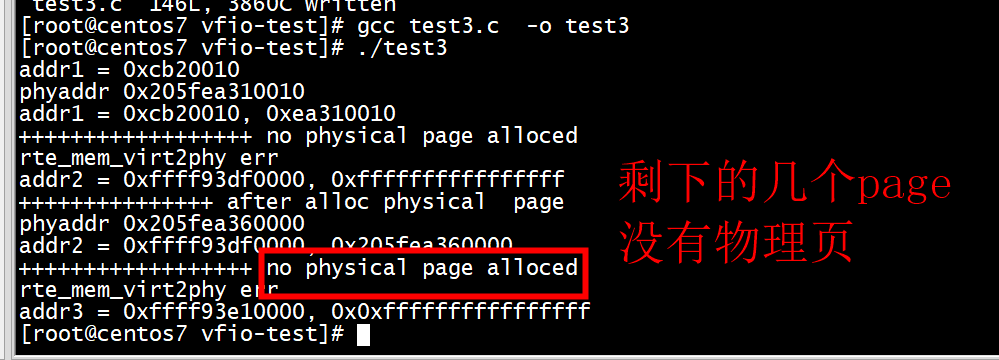

# os
```
[root@centos7 programming]# uname -a
Linux centos7 4.14.0-115.el7a.0.1.aarch64 #1 SMP Sun Nov 25 20:54:21 UTC 2018 aarch64 aarch64 aarch64 GNU/Linux
[root@centos7 programming]# 
```

# test1 
```
addr1 = 0x2c3b0010, 0x1fa10010
[root@centos7 pagemap]# gcc test1.c -o test1
[root@centos7 pagemap]# ./test1
pid = 108147, virtual addr = 400c54 , physical addr = 9d760c54
pid = 108148, virtual addr = 400c54 , physical addr = 9d760c54

```

# test2
```
[root@centos7 pagemap]# gcc test2.c  -o test2
/tmp/cc5DvZdk.o: In function `main':
test2.c:(.text+0x244): undefined reference to `numa_alloc_onnode'
test2.c:(.text+0x2ac): undefined reference to `numa_alloc_onnode'
test2.c:(.text+0x310): undefined reference to `numa_alloc_local'
test2.c:(.text+0x378): undefined reference to `numa_free'
test2.c:(.text+0x384): undefined reference to `numa_free'
test2.c:(.text+0x390): undefined reference to `numa_free'
collect2: error: ld returned 1 exit status
[root@centos7 pagemap]# gcc test2.c  -o test2 -lnuma
[root@centos7 pagemap]# ./test2
success alloc on node0, vaddress: 0x8caa0000.
-r-------- 1 root root 0 Jun 13 08:11 /proc/self/pagemap
page:0x81000000003fe0ab

the physic address alloc in node0: 0x3fe0ab4000 
success alloc on node0, vaddress: 0x8c6a0000.
-r-------- 1 root root 0 Jun 13 08:11 /proc/self/pagemap
page:0x81000000005fed27

the physic address alloc in node1: 0x5fed274000 
success alloc on local, vaddress: 0x8c2a0000.
-r-------- 1 root root 0 Jun 13 08:11 /proc/self/pagemap
page:0x81000000205feff0

the physic address alloc local: 0x205feff04000 
```


# test3

```
[root@centos7 pagemap]# ./test3 
addr1 = 0x2c3b0010
phyaddr 0x205e1fa10010
addr1 = 0x2c3b0010, 0x1fa10010
```

# test4

```
[root@centos7 pagemap]# ./test4
Argument number is not correct!
 pagemap PID VIRTUAL_ADDRESS
[root@centos7 pagemap]# 
```

#  mmap_test


```
[root@centos7 vfio-test]# ./mmap_test
addr1 = 0xcb20010
phyaddr 0x205fea310010
addr1 = 0xcb20010, 0xea310010
++++++++++++++++++ no physical page alloced 
rte_mem_virt2phy err 
addr2 = 0xffff93df0000, 0xffffffffffffffff  //////////////
+++++++++++++++ after alloc physical  page  
phyaddr 0x205fea360000
addr2 = 0xffff93df0000, 0x205fea360000
++++++++++++++++++ no physical page alloced 
rte_mem_virt2phy err 
addr3 = 0xffff93e10000, 0x0xffffffffffffffff ///////////////////////
```



#  MAP_FIXED

***addr2 = (nil)***

```
[root@centos7 vfio-test]# ./mmap_test2 
addr1 = 0xc7f0010
phyaddr 0x205f6e8d0010
addr1 = 0xc7f0010, 0x6e8d0010
++++++++++++++++++ no physical page alloced 
rte_mem_virt2phy err 
addr2 = (nil), 0xffffffffffffffff
+++++++++++++++ after alloc physical  page  
phyaddr 0x205f1cff0000
addr2 = (nil), 0x205f1cff0000
++++++++++++++++++ no physical page alloced 
rte_mem_virt2phy err 
addr3 = 0x20000, 0x0xffffffffffffffff
```


##  mmap-fix

```
[root@centos7 vfio-test]# ./mmap-fix 
0xffffcb251028 addr test begin**************** 
mmap succeeded,  with same address!mapped addres 0x10000
wrote byte 0 to location 0x10000
wrote byte 1 to location 0x10001
wrote byte 2 to location 0x10002
wrote byte 3 to location 0x10003
wrote byte 4 to location 0x10004
wrote byte 5 to location 0x10005
wrote byte 6 to location 0x10006
wrote byte 7 to location 0x10007
wrote byte 8 to location 0x10008
wrote byte 9 to location 0x10009
0x1 addr test begin**************** 
mmap failed 
```

***mmap failed***