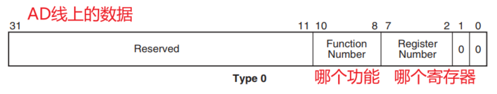

***1）pci设备的内存空间 irq号不是固定的，是操作系统分配的***

***2）pci设备的前64个字节的格式是一样的，是标准化的，其他的可以不一样***

***3）地址转换：***

  3.1 内存控制器片选信号选择pcie控制器
  
  3.2 pcie控制器进行地址转换
  
  PCIE总线体系把地址空间分成两个部分，第一个部分叫ECAM空间，是PCIE的标准配置空间，提供标准的控制整个PCIE功能的基本语义，它的地址组成是***“RC基地址+16位BDF+偏移”***（BDF是Bus，Device，Function的简称，在Linux上lspci就能看见）。通过对这个空间寻址，就可以实现对PCIE总线系统的配置。
  
  第二个部分我这里简称BAR空间，这个空间是RC和系统总线设计者讨论决定的，在对ECAM进行配置的时候，软件和硬件进行协商，最后在某个BDF的ECAM空间的Base Address Register（BAR）中指向分配好的，给这个EP的一组IO空间。

##  ：配置PCI Agent设备

PCI设备可以简单地分为PCI Bridge和PCI Agent：

* PCI Bridge：桥，用来扩展PCI设备，必定有一个Root Bridge，下面还可以有其他Bridge。
* PCI Agent：真正的PCI设备(比如网卡)，是PCI树的最末端

 

### 怎么配置PCI Agent设备？

* 选中：通过IDSEL来选中某个设备

* 怎么访问配置空间：发起一个type 0的配置命令

  * PCI设备最多有8个功能，每个功能都有自己的配置空间(配置寄存器)
  * 你要访问哪个功能？哪个寄存器？发起
    

* CPU读取配置空间的BAR，得知：这个PCI设备想申请多大空间

* CPU分配PCI地址，写到PCI设备的BAR里


# Type0&Type1配置头空间


其中Type0 Header最多有6个BAR，而Type1 Header最多有两个BAR。这就意味着，对于Endpoint来说，最多可以拥有6个不同的地址空间。但是实际应用中基本上不会用到6个，通常1~3个BAR比较常见。

# 枚举


每个PCIe设备的资源大小是怎么确定的呢？Spec规定，每个PCIe设备都有6个寄存器来向系统声明它需要什么样的资源以及大小。这6个寄存器称之为BAR（Base AddressRegister），从BAR0到BAR5。当向这些寄存器写全1，并再读取这些寄存器的值。***第一个的非0的bit位***即是此设备需要的资源大小。举个例子，假设我们写0xFFFF_FFFF到BAR0，回读的值为0xFFFF_0000，低16bit为零，意味着整个BAR的大小需要***2^16 = 64K bytes***。确认PCIe设备资源大小后，BIOS就把系统分配给这个设备的地址写入到这个BAR里面。驱动程序只需要读取这个BAR寄存器，获取地址后，就可以操作对应的额数据了。


## 地址映射

### 32-bit Memory Address Space Request


### 64-bit Memory Address Space Request


###  IO Address Space Request


# lspci -vv -s 0000:00:1f.6 


```
root@ubuntux86:/boot# lspci -tv
-[0000:00]-+-00.0  Intel Corporation Device 9b33
           +-01.0-[01]--+-00.0  NVIDIA Corporation TU104GL [Quadro RTX 4000]
           |            +-00.1  NVIDIA Corporation TU104 HD Audio Controller
           |            +-00.2  NVIDIA Corporation TU104 USB 3.1 Host Controller
           |            \-00.3  NVIDIA Corporation TU104 USB Type-C UCSI Controller
           +-02.0  Intel Corporation Device 9bc5
           +-14.0  Intel Corporation Device 43ed
           +-14.2  Intel Corporation Device 43ef
           +-15.0  Intel Corporation Device 43e8
           +-15.1  Intel Corporation Device 43e9
           +-16.0  Intel Corporation Device 43e0
           +-17.0  Intel Corporation Device 43d2
           +-1d.0-[02]----00.0  Sandisk Corp Device 5006
           +-1f.0  Intel Corporation Device 438f
           +-1f.3  Intel Corporation Device f0c8
           +-1f.4  Intel Corporation Device 43a3
           +-1f.5  Intel Corporation Device 43a4
           \-1f.6  Intel Corporation Ethernet Connection (14) I219-LM
```


```
root@ubuntux86:/work/pci_test# lspci -vv -s 0000:00:1f.6 
00:1f.6 Ethernet controller: Intel Corporation Ethernet Connection (14) I219-LM (rev 11)
        Subsystem: Dell Ethernet Connection (14) I219-LM
        Control: I/O- Mem+ BusMaster- SpecCycle- MemWINV- VGASnoop- ParErr- Stepping- SERR- FastB2B- DisINTx-
        Status: Cap+ 66MHz- UDF- FastB2B- ParErr- DEVSEL=fast >TAbort- <TAbort- <MAbort- >SERR- <PERR- INTx-
        Interrupt: pin A routed to IRQ 16
        Region 0: Memory at 70280000 (32-bit, non-prefetchable) [size=128K]
        Capabilities: [c8] Power Management version 3
                Flags: PMEClk- DSI+ D1- D2- AuxCurrent=0mA PME(D0+,D1-,D2-,D3hot+,D3cold+)
                Status: D0 NoSoftRst+ PME-Enable- DSel=0 DScale=1 PME-
        Capabilities: [d0] MSI: Enable- Count=1/1 Maskable- 64bit+
                Address: 0000000000000000  Data: 0000
        Kernel driver in use: PCIe_demo
        Kernel modules: e1000e

root@ubuntux86:/work/pci_test# 
```
## test1
```
static int PCIe_probe(struct pci_dev *pdev, const struct pci_device_id *id)
{
	pr_info("***************** pci bus  info show ************ \n");
    printk("Vendor: %04x Device: %04x, devfun %d, and name %s \n", pdev->vendor, pdev->device, pdev->devfn, pci_name(pdev));
    //printk("Vendor: %#x Device: %#x, devfun %x, and name %s \n", pdev->vendor, pdev->device, pdev->devfn, pci_name(pdev));
	struct pci_bus *bus = pdev->bus;
	show_pci_info(bus);
    pr_info("***************** pci scan ************ \n");
	test_pci_scan_device(bus, 254);
	test_pci_scan_device(bus, 8);
	return 0;
}
```


```
[  123.555996] ***************** pci bus  info show ************ 
[  123.556004] Vendor: 8086 Device: 15f9, devfun 254, and name 0000:00:1f.6 
[  123.556011] bus name : , bus ops 000000003e21e69e 
[  123.556019] ***************** pci scan ************ 
[  123.556030] vendor 8086, deivce 15f9, fn 254 
[  123.556036] vendor 8086, deivce 1901, fn 8 
```


# pci_dev_type
```
const struct device_type pci_dev_type = {
        .groups = pci_dev_attr_groups,
};
```

# struct bus_type pci_bus_type

```
struct bus_type pci_bus_type = {
        .name           = "pci",
        .match          = pci_bus_match,
        .uevent         = pci_uevent,
        .probe          = pci_device_probe,
        .remove         = pci_device_remove,
        .shutdown       = pci_device_shutdown,
        .dev_groups     = pci_dev_groups,
        .bus_groups     = pci_bus_groups,
        .drv_groups     = pci_drv_groups,
        .pm             = PCI_PM_OPS_PTR,
        .num_vf         = pci_bus_num_vf,
        .dma_configure  = pci_dma_configure,
};
EXPORT_SYMBOL(pci_bus_type)
```


```
static struct pci_dev *pci_get_dev_by_id(const struct pci_device_id *id,
                                         struct pci_dev *from)
{
        struct device *dev;
        struct device *dev_start = NULL;
        struct pci_dev *pdev = NULL;

        if (from)
                dev_start = &from->dev;
        dev = bus_find_device(&pci_bus_type, dev_start, (void *)id,
                              match_pci_dev_by_id);
        if (dev)
                pdev = to_pci_dev(dev);
        pci_dev_put(from);
        return pdev;
}
```
# 对配置空间的访问
x86架构中pci配置空间的访问有4种方式：pci_bios、pci_conf1、pci_conf2、pci_mmcfg。最优的方式是mmcfg，
这需要bios配置，把pci配置空间映射到cpu mem空间；pci_conf1、pci_conf2方式是通过io指针间接访问的；
pci_bios方式应该是调用bios提供的服务进程进行访问。使用I/O访问的方式只可以访问配置空间的前256字节，
而使用mmcfg的方式则可以完全支持PCIE的扩展寄存器即4K字节的配置空间。
在linux初始化的时候，需要给驱动程序选择一种最优的访问方式。

##  PCI驱动中对配置空间的访问的实现
注：基于4.4版本内核
系统在初始化PCI总线的时候，会设置好读取配置空间的方法，读取的方式就上述的两大类（I/O端口访问、MEM访问），
提供给上层的可用接口函数是read函数和write函数，系统初始化完成后会将实现好的read方法和write方法绑定至结构体pci_ops，
我们首先来看两段代码。
```
const struct pci_raw_ops *__read_mostly raw_pci_ops;       //pci设备访问
const struct pci_raw_ops *__read_mostly raw_pci_ext_ops;   //pcie设备扩展寄存器访问

int raw_pci_read(unsigned int domain, unsigned int bus, unsigned int devfn,
						int reg, int len, u32 *val)
{
	//判定是否小于256字节，如果在256范围内则调用raw_pci_ops方法
	if (domain == 0 && reg < 256 && raw_pci_ops)  
		return raw_pci_ops->read(domain, bus, devfn, reg, len, val);
	if (raw_pci_ext_ops)
		return raw_pci_ext_ops->read(domain, bus, devfn, reg, len, val);
	return -EINVAL;
}

int raw_pci_write(unsigned int domain, unsigned int bus, unsigned int devfn,
						int reg, int len, u32 val)
{
	if (domain == 0 && reg < 256 && raw_pci_ops)
		return raw_pci_ops->write(domain, bus, devfn, reg, len, val);
	if (raw_pci_ext_ops)
		return raw_pci_ext_ops->write(domain, bus, devfn, reg, len, val);
	return -EINVAL;
}

static int pci_read(struct pci_bus *bus, unsigned int devfn, int where, int size, u32 *value)
{
	return raw_pci_read(pci_domain_nr(bus), bus->number,
				 devfn, where, size, value);
}

static int pci_write(struct pci_bus *bus, unsigned int devfn, int where, int size, u32 value)
{
	return raw_pci_write(pci_domain_nr(bus), bus->number,
				  devfn, where, size, value);
}

struct pci_ops pci_root_ops = {
	.read = pci_read,
	.write = pci_write,
}
 
```
 
```
struct pci_raw_ops *raw_pci_ops;

static int pci_read(struct pci_bus *bus, unsigned int devfn, int where, int size, u32 *value)
{
	//老版本的不会区分，只实现一种方法
	return raw_pci_ops->read(0, bus->number, devfn, where, size, value);
}

static int pci_write(struct pci_bus *bus, unsigned int devfn, int where, int size, u32 value)
{
	return raw_pci_ops->write(0, bus->number, devfn, where, size, value);
}

struct pci_ops pci_root_ops = {
	.read = pci_read,
	.write = pci_write,
};
 
```

# pci_read/write   和Type0 & Type1 型配置请求

***pci_read/write会由根root转化为Type1事务层包****

Type0还是Type1是由事务层包（TLP）包头中的Type Field所决定的，而读还是写则是由TLP包头中的Format Field所决定的。分别以下两张图所示：


   
    PCIe中只有Root才可以发起配置空间读写请求，并且我们知道Root的每个端口中都包含有一个P2P桥。当Root发起配置空间读写请求时，相应的桥首先检查请求的BDF中的Bus号是否与自己的下一级总线号（Secondary Bus Number）相等，如果相等，则先将Type1转换为Type0，然后发给下一级（即Endpoint）。

如果不相等，但是在自己的下一级总线号（Secondary Bus Number）和最后一级总线号（Subordinate Bus Number）之间，则直接将Type1型请求发送给下一级。如果还是不相等，则该桥认为这一请求和自己没什么关系，则忽略该请求。

注：Root最先发送的配置请求一定是Type1型的。非桥设备（Endpoint）会直接忽略Type1型的配置请求。

一个简单的例子如下图所示：


# pci-host-generic


```
[    0.445685] pci-host-generic: call_driver_probe of 30000000.pci 
[    0.447099] pci-host-generic 30000000.pci: host bridge /soc/pci@30000000 ranges:
[    0.449115] pci-host-generic 30000000.pci:       IO 0x0003000000..0x000300ffff -> 0x0000000000
[    0.450289] pci-host-generic 30000000.pci:      MEM 0x0040000000..0x007fffffff -> 0x0040000000
[    0.451688] OF: tracing pci@30000000 __of_get_address addrp == NULL ?  0 
[    0.456207] pci-host-generic 30000000.pci: ECAM at [mem 0x30000000-0x3fffffff] for [bus 00-ff]
[    0.459232] pci-host-generic 30000000.pci: PCI host bridge to bus 0000:00
[    0.459893] pci_bus 0000:00: root bus resource [bus 00-ff]
[    0.460316] pci_bus 0000:00: root bus resource [io  0x0000-0xffff]
[    0.460730] pci_bus 0000:00: root bus resource [mem 0x40000000-0x7fffffff]
[    0.463164] pci 0000:00:00.0: [1b36:0008] type 00 class 0x060000
```


# ECAM方式访问

ECAM全称为Enhanced Configuration Access Mechanism，意思为增强的配置访问方式，其实就是MMIO方式访问。在某个平台上要想通过ECAM方式访问配置空间，大致需要经过以下几个步骤的设置：

PCIE总线体系把地址空间分成两个部分，第一个部分叫ECAM空间，是PCIE的标准配置空间，提供标准的控制整个PCIE功能的基本语义，它的地址组成是“RC基地址+16位BDF+偏移”（BDF是Bus，Device，Function的简称，在Linux上lspci就能看见）。通过对这个空间寻址，就可以实现对PCIE总线系统的配置。

第二个部分我这里简称BAR空间，这个空间是RC和系统总线设计者讨论决定的，在对ECAM进行配置的时候，软件和硬件进行协商，最后在某个BDF的ECAM空间的Base Address Register（BAR）中指向分配好的，给这个EP的一组IO空间。

***1)*** 通过平台相关的寄存器来设置ECAM方式访问的配置空间在存储器域的基地址和总大小

***2)*** 根据bus、dev、func、reg这四个参数来确定要访问的存储器域地址

***3)*** 通过要访问的字节数来确定调用何种接口进行访问，比如单字节、双字节还是四字节。

***4)*** 通过ECAM方式可以访问pci/pcie全部的配置空间，由于规范中规定每个pci/pcie的功能都需要独立的配置空间，所以所有的pci/pcie设备占用的ECAM空间大小为256(总线数)*32(设备数)*8(功能数)*4KB(pcie配置空间大小)=256MB。在实际的嵌入式系统中，一般不会用到这么多的pci/pcie设备，所以ECAM的空间一般情况下不会设置为256MB，典型设置值为十几MB。

## pci-host-ecam-generic


```
struct pci_ecam_ops pci_generic_ecam_ops = {
	.bus_shift	= 20,
	.pci_ops	= {
		.map_bus	= pci_ecam_map_bus,
		.read		= pci_generic_config_read,
		.write		= pci_generic_config_write,
	}
};
```


```
(gdb) bt
#0  pci_ecam_map_bus (bus=<optimized out>, devfn=<optimized out>, where=<optimized out>) at drivers/pci/ecam.c:170
#1  0xffffffff8028224a in pci_generic_config_read (bus=<optimized out>, devfn=<optimized out>, where=<optimized out>, size=<optimized out>, val=<optimized out>) at drivers/pci/access.c:82
#2  0xffffffff802820aa in pci_bus_read_config_dword (bus=<optimized out>, devfn=<optimized out>, pos=<optimized out>, value=<optimized out>) at drivers/pci/access.c:65
#3  0xffffffff80284fe6 in pci_bus_generic_read_dev_vendor_id (bus=0xffffffe001722000, devfn=0, l=0xffffffd00400ba94, timeout=<optimized out>) at drivers/pci/probe.c:2324
#4  0xffffffff8028564e in pci_bus_read_dev_vendor_id (timeout=60000, l=0xffffffd00400ba94, devfn=0, bus=0xffffffe001722000) at drivers/pci/probe.c:2353
#5  pci_scan_device (devfn=0, bus=0xffffffe001722000) at drivers/pci/probe.c:2366
#6  pci_scan_single_device (devfn=0, bus=0xffffffe001722000) at drivers/pci/probe.c:2536
#7  pci_scan_single_device (bus=0xffffffe001722000, devfn=<optimized out>) at drivers/pci/probe.c:2526
#8  0xffffffff802856f0 in pci_scan_slot (bus=bus@entry=0xffffffe001722000, devfn=devfn@entry=0) at drivers/pci/probe.c:2615
#9  0xffffffff802865d4 in pci_scan_child_bus_extend (bus=0xffffffe001722000, available_buses=available_buses@entry=0) at drivers/pci/probe.c:2832
#10 0xffffffff80286970 in pci_scan_child_bus (bus=<optimized out>) at drivers/pci/probe.c:2962
#11 pci_scan_root_bus_bridge (bridge=bridge@entry=0xffffffe00171fc00) at drivers/pci/probe.c:3140
#12 0xffffffff802869e0 in pci_host_probe (bridge=bridge@entry=0xffffffe00171fc00) at drivers/pci/probe.c:3020
#13 0xffffffff8029ff84 in pci_host_common_probe (pdev=<optimized out>) at drivers/pci/controller/pci-host-common.c:84
#14 0xffffffff80412fa4 in platform_probe (_dev=0xffffffe0016fec10) at drivers/base/platform.c:1427
#15 0xffffffff8062db2a in call_driver_probe (drv=0xffffffff812921e0 <gen_pci_driver+40>, dev=0xffffffe0016fec10) at drivers/base/dd.c:519
#16 really_probe (drv=0xffffffff812921e0 <gen_pci_driver+40>, dev=0xffffffe0016fec10) at drivers/base/dd.c:597
#17 really_probe (dev=0xffffffe0016fec10, drv=0xffffffff812921e0 <gen_pci_driver+40>) at drivers/base/dd.c:543
#18 0xffffffff8062dd12 in __driver_probe_device (drv=0xffffffff812921e0 <gen_pci_driver+40>, dev=dev@entry=0xffffffe0016fec10) at drivers/base/dd.c:751
#19 0xffffffff804112bc in __driver_probe_device (dev=0xffffffe0016fec10, drv=0xffffffff812df390 <probe_count>) at drivers/base/dd.c:734
#20 driver_probe_device (drv=drv@entry=0xffffffff812921e0 <gen_pci_driver+40>, dev=dev@entry=0xffffffe0016fec10) at drivers/base/dd.c:781
#21 0xffffffff8041184c in __driver_attach (data=0xffffffff812921e0 <gen_pci_driver+40>, dev=0xffffffe0016fec10) at drivers/base/dd.c:1143
#22 __driver_attach (dev=0xffffffe0016fec10, data=0xffffffff812921e0 <gen_pci_driver+40>) at drivers/base/dd.c:1095
#23 0xffffffff8040f312 in bus_for_each_dev (bus=<optimized out>, start=start@entry=0x0, data=data@entry=0xffffffff812921e0 <gen_pci_driver+40>, fn=fn@entry=0xffffffff804117ec <__driver_attach>) at drivers/base/bus.c:301
#24 0xffffffff80410bd2 in driver_attach (drv=drv@entry=0xffffffff812921e0 <gen_pci_driver+40>) at drivers/base/dd.c:1160
#25 0xffffffff804106e0 in bus_add_driver (drv=drv@entry=0xffffffff812921e0 <gen_pci_driver+40>) at drivers/base/bus.c:619
#26 0xffffffff80411ea6 in driver_register (drv=<optimized out>) at drivers/base/driver.c:171
#27 0xffffffff80412d28 in __platform_driver_register (drv=drv@entry=0xffffffff812921b8 <gen_pci_driver>, owner=owner@entry=0x0) at drivers/base/platform.c:874
#28 0xffffffff808172b6 in gen_pci_driver_init () at drivers/pci/controller/pci-host-generic.c:87
#29 0xffffffff800020da in do_one_initcall (fn=0xffffffff8081729c <gen_pci_driver_init>) at init/main.c:1297
#30 0xffffffff80800fea in do_initcall_level (command_line=0xffffffe00160b980 "root", level=6) at init/main.c:1370
#31 do_initcalls () at init/main.c:1386
#32 do_basic_setup () at init/main.c:1406
#33 kernel_init_freeable () at init/main.c:1608
#34 0xffffffff80631b56 in kernel_init (unused=<optimized out>) at init/main.c:1500
#35 0xffffffff80003010 in handle_exception () at arch/riscv/kernel/entry.S:232
```


***pci_bus_read_dev_vendor_id: bus, devfn,PCI_VENDOR_ID三个参数读取***

```
/*
 * Read the config data for a PCI device, sanity-check it,
 * and fill in the dev structure.
 */
static struct pci_dev *pci_scan_device(struct pci_bus *bus, int devfn)
{
        struct pci_dev *dev;
        u32 l;

        if (!pci_bus_read_dev_vendor_id(bus, devfn, &l, 60*1000))
                return NULL;

        dev = pci_alloc_dev(bus);
        if (!dev)
                return NULL;

        dev->devfn = devfn;
        dev->vendor = l & 0xffff;
        dev->device = (l >> 16) & 0xffff;

        if (pci_setup_device(dev)) {
                pci_bus_put(dev->bus);
                kfree(dev);
                return NULL;
        }

        return dev;
}

bool pci_bus_generic_read_dev_vendor_id(struct pci_bus *bus, int devfn, u32 *l,
                                        int timeout)
{
        if (pci_bus_read_config_dword(bus, devfn, PCI_VENDOR_ID, l)) //// 固定读取PCI_VENDOR_ID
                return false;

        /* Some broken boards return 0 or ~0 if a slot is empty: */
        if (*l == 0xffffffff || *l == 0x00000000 ||
            *l == 0x0000ffff || *l == 0xffff0000)
                return false;

        if (pci_bus_crs_vendor_id(*l))
                return pci_bus_wait_crs(bus, devfn, l, timeout);

        return true;
}

#define PCI_OP_READ(size, type, len) \
int noinline pci_bus_read_config_##size \
        (struct pci_bus *bus, unsigned int devfn, int pos, type *value) \
{                                                                       \
        int res;                                                        \
        unsigned long flags;                                            \
        u32 data = 0;                                                   \
        if (PCI_##size##_BAD) return PCIBIOS_BAD_REGISTER_NUMBER;       \
        pci_lock_config(flags);                                         \
        res = bus->ops->read(bus, devfn, pos, len, &data);              \ ///////.read		= pci_generic_config_read,
        if (res)                                                        \
                PCI_SET_ERROR_RESPONSE(value);                          \
        else                                                            \
                *value = (type)data;                                    \
        pci_unlock_config(flags);                                       \
        return res;                                                     \
}

int pci_generic_config_read(struct pci_bus *bus, unsigned int devfn,
                            int where, int size, u32 *val)
{
        void __iomem *addr;

        addr = bus->ops->map_bus(bus, devfn, where);
        if (!addr)
                return PCIBIOS_DEVICE_NOT_FOUND;

        if (size == 1)
                *val = readb(addr);
        else if (size == 2)
                *val = readw(addr);
        else
                *val = readl(addr);

        return PCIBIOS_SUCCESSFUL;
}
EXPORT_SYMBOL_GPL(pci_generic_config_read);
```

## linux,pci-probe-only

事实上这个驱动对于PCI总线一般会进行两个操作：配置与枚举。配置操作即为配置整个PCI总线，分配总线和设备号，而枚举操作即为常规的枚举总线上的设备。在PCI总线已经配置好（如固件配置，或者虚拟机等）的情况下，可以通过chosen节点下配置linux,pci-probe-only让内核跳过配置操作。


# pci 和pcie比较

pci:并行，有中断引脚

pcie:串行， 没中断引脚。通过messgage实现中断

# references

[PCIe的ATS机制](https://zhuanlan.zhihu.com/p/411746688)

[PCI总线地址映射](https://www.cnblogs.com/YYFaGe/p/15408417.html)

[hi3559 pcie控制器](https://www.cnblogs.com/YYFaGe/p/16184844.html)

[PCIE总线的地址问题](https://zhuanlan.zhihu.com/p/34047690)

[PCIe 枚举demo](https://blog.csdn.net/wmzjzwlzs/article/details/124018214)

[PCIe扫盲——基地址寄存器（BAR）详解](http://blog.chinaaet.com/justlxy/p/5100053320)

[Linux驱动大全开发之PCI和PCIe](https://www.youtube.com/watch?v=ZMIV7LUMpZg)

[开发者分享 | 使用 lspci 和 setpci 调试 PCIe 问题](https://blog.csdn.net/zhuzongpeng/article/details/127014185)

[PCI驱动框架分析](https://crab2313.github.io/post/pci/)

[操作系统的PCI/PCIe设备驱动问题定界定位方案](https://support-it.huawei.com/docs/zh-cn/typical-scenarios-1/server-knowledgebase/zh-cn_topic_0000001146668820.html)

[PCIe初始化枚举和资源分配流程分析](https://developer.aliyun.com/article/770782)

[PCI总线驱动代码梳理（二）--配置空间访问的设置](https://blog.csdn.net/qq_39376747/article/details/112723404?spm=1001.2101.3001.6650.7&utm_medium=distribute.pc_relevant.none-task-blog-2%7Edefault%7EOPENSEARCH%7ERate-7-112723404-blog-112723705.t0_edu_mix&depth_1-utm_source=distribute.pc_relevant.none-task-blog-2%7Edefault%7EOPENSEARCH%7ERate-7-112723404-blog-112723705.t0_edu_mix&utm_relevant_index=8)