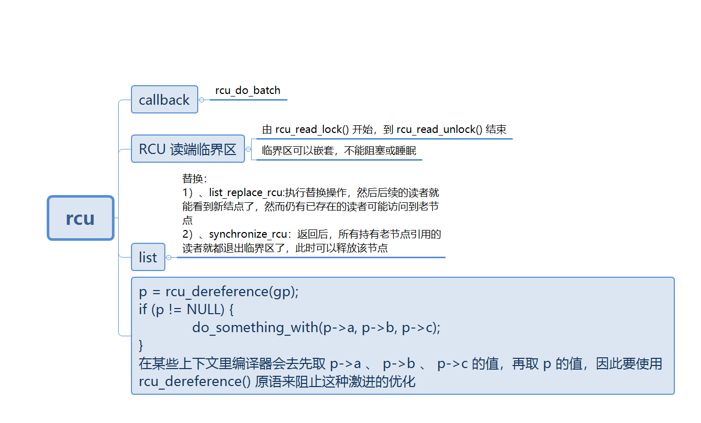
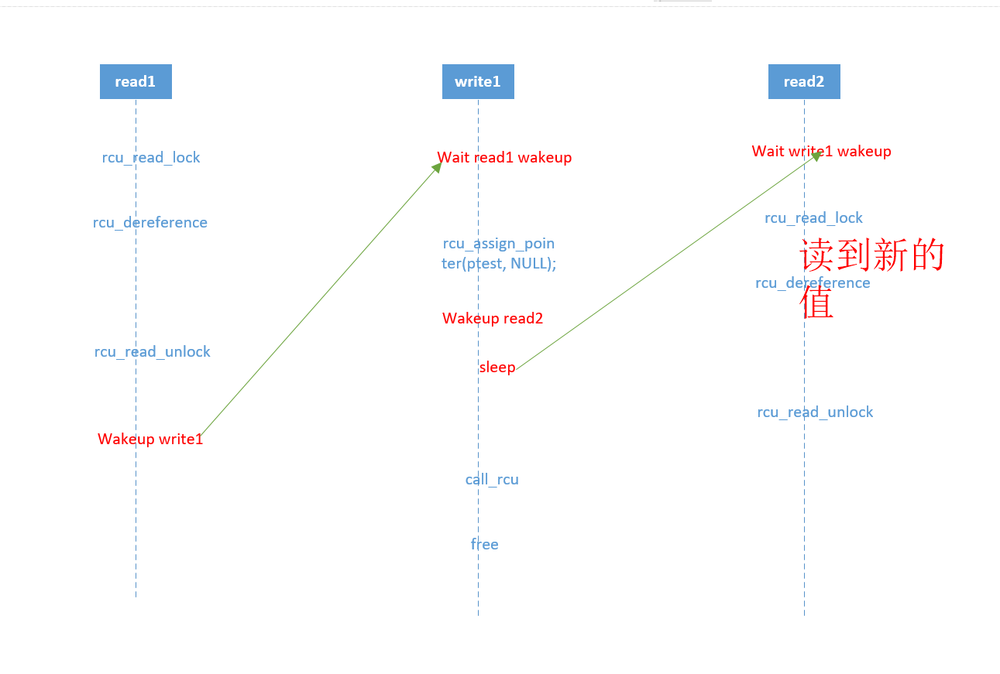

```
[ 1280.443526] rcu_test6: module verification failed: signature and/or required key missing - tainting kernel
[ 1280.453655] figo: my module init 7358
[ 1280.457471] myrcu_reader_thread1: read a=99
[ 1280.461641] myrcu_writer_thread: write to new 5
[ 1280.466163] myrcu_reader_thread2: read a=5
[ 1281.482026]  writer wake up from sleep 
[ 1281.612009] myrcu_del: a=99
```

reader_thread2 读取到了***最新的值***