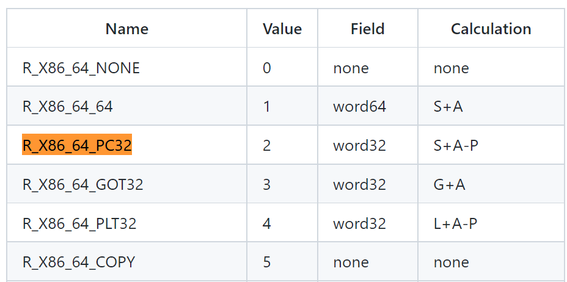
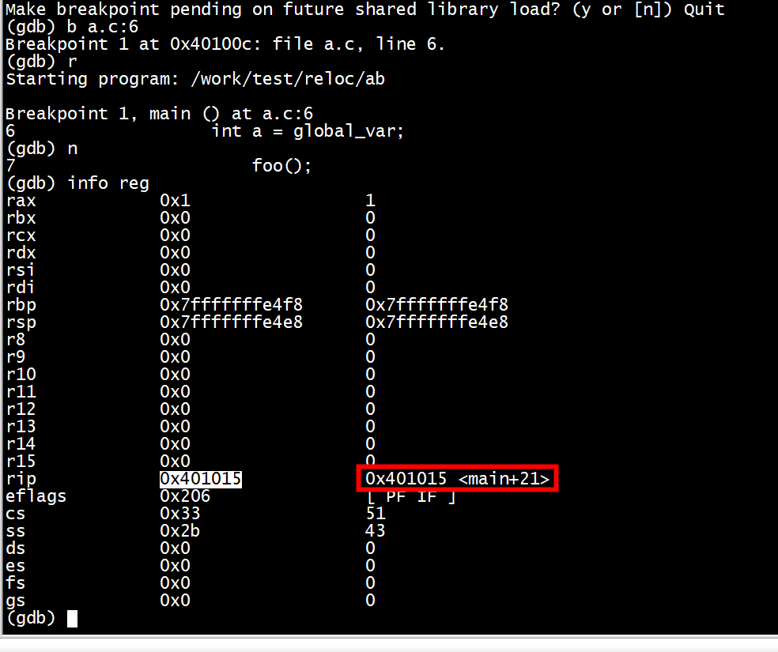

```
/a.c
extern int global_var;

void foo();
int main()
{
    int a = global_var;
    foo();
    return 0;
}

//b.c
int global_var = 1;

void foo()
{
}
```

进行编译，链接: $ gcc -c a.c b.c && ld a.o b.o -e main -o ab

接下来开始分析：

# global_var

首先反汇编a.o: $ $ objdump -d a.o
```
root@ubuntux86:/work/test/reloc# objdump -d a.o

a.o:     file format elf64-x86-64


Disassembly of section .text:

0000000000000000 <main>:
   0:   f3 0f 1e fa             endbr64 
   4:   55                      push   %rbp
   5:   48 89 e5                mov    %rsp,%rbp
   8:   48 83 ec 10             sub    $0x10,%rsp
   c:   8b 05 00 00 00 00       mov    0x0(%rip),%eax        # 12 <main+0x12>
  12:   89 45 fc                mov    %eax,-0x4(%rbp)
  15:   b8 00 00 00 00          mov    $0x0,%eax
  1a:   e8 00 00 00 00          callq  1f <main+0x1f>
  1f:   b8 00 00 00 00          mov    $0x0,%eax
  24:   c9                      leaveq 
  25:   c3                      retq   
root@ubuntux86:/work/test/reloc# objdump -d b.o

b.o:     file format elf64-x86-64


Disassembly of section .text:

0000000000000000 <foo>:
   0:   f3 0f 1e fa             endbr64 
   4:   55                      push   %rbp
   5:   48 89 e5                mov    %rsp,%rbp
   8:   90                      nop
   9:   5d                      pop    %rbp
   a:   c3                      retq   
root@ubuntux86:/work/test/reloc#    
```

地址0x0c处的指令:
c:   8b 05 00 00 00 00       mov    0x0(%rip),%eax        # 12 <main+0x12>
表示将0x00 + R[rip]即(0x00 + 0x012)复制到寄存器%eax，寄存器%eax用来存放变量a的值，由于全局变量定义在其他目标文件中,此时编译器并不知道global_var的地址，所以编译器把寄存器rip的值(下一条命令的地址)看作是全局变量global_var的地址。

继续看地址0x1a处的指令：
  1a:   e8 00 00 00 00          callq  1f <main+0x1f>
表示一个过程调用，过程调用的起始地址为0x01f，该命令就是调用函数foo，与上述global_var的地址类似，编译器将函数foo的起始地址设置为该指令的下一条指令地址

***编译器将这两条指令的地址暂时用0x12和0x1f代替着，把真正的地址计算工作留给了链接。***

***而链接器通过重定位表找到需要被修改的指令并进行调整***


重定位主要由以下两个步骤：

将不同目标文件的同类型的段进行合并，例如将a.o和b.o的.text段进行合并，这这一步完成之后，程序中每条指令和变量的地址都是确定的。
链接器对上述合并后的.text段和.data段中的每个符号引用地址进行修改，将之前的占位地址修改成引用符号的真实地址。
编译器生成目标文件时，当遇到引用的外部定义的函数或变量时并不知道其位置，这时候会生成一个「重定位条目」，用于告诉链接器如何修改最终的地址。指令的重定位条目放置在.rel.text段中，数据的重定位条目放在.rel.data段中。

重定位条目内容如下：

```
typedef struct {
    long offset; /* 待重定向符号的段偏移 */
    long type:32, /* 重定位类型 */
    symbol:32; /* 重定位符号在符号表中的索引 */
    long addend; /* 地址修正时用到的常数 */
} Elf64_Rela;
```

查看a.o的重定位表: readelf -r a.o
```
root@ubuntux86:/work/test/reloc#     readelf -r a.o

Relocation section '.rela.text' at offset 0x258 contains 2 entries:
  Offset          Info           Type           Sym. Value    Sym. Name + Addend
00000000000e  000a00000002 R_X86_64_PC32     0000000000000000 global_var - 4
00000000001b  000c00000004 R_X86_64_PLT32    0000000000000000 foo - 4

Relocation section '.rela.eh_frame' at offset 0x288 contains 1 entry:
  Offset          Info           Type           Sym. Value    Sym. Name + Addend
000000000020  000200000002 R_X86_64_PC32     0000000000000000 .text + 0
root@ubuntux86:/work/test/reloc# 
```
可以看到有两个重定位入口(每个要被重定位地方称为一个重定位入口)

offset是重定位入口偏移：这个值是该重定位入口所要修正的位置的第一个字节相对于段起始的偏移。

在a.o中0x12和0x1f分别是代码段中mov指令和call指令的地址部分

type是指重定位类型，用来告知链接器如何修改重定位入口

重定位类型及其重定位修正方法如下图

A Represents the addend used to compute the value of the relocatable field.
B Represents the base address at which a shared object has been loaded into memory during execution. Generally, a shared object is built with a 0 base virtual address, but the execution address will be different.
G Represents the offset into the global offset table at which the relocation entry’s symbol will reside during execution.
GOT Represents the address of the global offset table.
L Represents the place (section offset or address) of the Procedure Linkage Table entry for a symbol.
P Represents the place (section offset or address) of the storage unit being relocated (computed using r_offset).
S Represents the value of the symbol whose index resides in the relocation entry.
Z Represents the size of the symbol whose index resides in the relocation entry.



以重定位global_var为例

从上面查看重定位表可知global_var的重定位类型为R_X86_64_PC32，那么修正后的地址值计算公式为S - P + A

S = 符号的实际地址

P = 被修正的位置(即重定位入口所要修正的位置)

A = 重定位表中的addend字段


查看链接后的可执行程序ab中global_var的虚拟地址：readelf -s ab

```
root@ubuntux86:/work/test/reloc# readelf -s ab

Symbol table '.symtab' contains 14 entries:
   Num:    Value          Size Type    Bind   Vis      Ndx Name
     0: 0000000000000000     0 NOTYPE  LOCAL  DEFAULT  UND 
     1: 00000000004001c8     0 SECTION LOCAL  DEFAULT    1 
     2: 0000000000401000     0 SECTION LOCAL  DEFAULT    2 
     3: 0000000000402000     0 SECTION LOCAL  DEFAULT    3 
     4: 0000000000404000     0 SECTION LOCAL  DEFAULT    4 
     5: 0000000000000000     0 SECTION LOCAL  DEFAULT    5 
     6: 0000000000000000     0 FILE    LOCAL  DEFAULT  ABS a.c
     7: 0000000000000000     0 FILE    LOCAL  DEFAULT  ABS b.c
     8: 0000000000404000     4 OBJECT  GLOBAL DEFAULT    4 global_var   //a和b链接后
     9: 0000000000404004     0 NOTYPE  GLOBAL DEFAULT    4 __bss_start
    10: 0000000000401000    38 FUNC    GLOBAL DEFAULT    2 main
    11: 0000000000401026    11 FUNC    GLOBAL DEFAULT    2 foo
    12: 0000000000404004     0 NOTYPE  GLOBAL DEFAULT    4 _edata
    13: 0000000000404008     0 NOTYPE  GLOBAL DEFAULT    4 _end
root@ubuntux86:/work/test/reloc# 
```
S = 0x404000


接下来查看global_var对应重定位入口的偏移量和addend常量，从上面查看的重定位表可以得到

```
root@ubuntux86:/work/test/reloc# readelf -r a.o

Relocation section '.rela.text' at offset 0x258 contains 2 entries:
  Offset          Info           Type           Sym. Value    Sym. Name + Addend
00000000000e  000a00000002 R_X86_64_PC32     0000000000000000 global_var - 4
00000000001b  000c00000004 R_X86_64_PLT32    0000000000000000 foo - 4

Relocation section '.rela.eh_frame' at offset 0x288 contains 1 entry:
  Offset          Info           Type           Sym. Value    Sym. Name + Addend
000000000020  000200000002 R_X86_64_PC32     0000000000000000 .text + 0
```

offset(global_var) = 0x0e

A = addend ＝ -4

要得到被修正的位置P，我们需要查看段表获取ab中.text段的地址：readelf -S ab

```
root@ubuntux86:/work/test/reloc# readelf -S ab
There are 9 section headers, starting at offset 0x3208:

Section Headers:
  [Nr] Name              Type             Address           Offset
       Size              EntSize          Flags  Link  Info  Align
  [ 0]                   NULL             0000000000000000  00000000
       0000000000000000  0000000000000000           0     0     0
  [ 1] .note.gnu.propert NOTE             00000000004001c8  000001c8
       0000000000000020  0000000000000000   A       0     0     8
  [ 2] .text             PROGBITS         0000000000401000  00001000  ///a和b链接后
       0000000000000031  0000000000000000  AX       0     0     1
  [ 3] .eh_frame         PROGBITS         0000000000402000  00002000
       0000000000000058  0000000000000000   A       0     0     8
  [ 4] .data             PROGBITS         0000000000404000  00003000
       0000000000000004  0000000000000000  WA       0     0     4
  [ 5] .comment          PROGBITS         0000000000000000  00003004
       000000000000002b  0000000000000001  MS       0     0     1
  [ 6] .symtab           SYMTAB           0000000000000000  00003030
       0000000000000150  0000000000000018           7     8     8
  [ 7] .strtab           STRTAB           0000000000000000  00003180
       0000000000000035  0000000000000000           0     0     1
  [ 8] .shstrtab         STRTAB           0000000000000000  000031b5
       000000000000004d  0000000000000000           0     0     1
Key to Flags:
  W (write), A (alloc), X (execute), M (merge), S (strings), I (info),
  L (link order), O (extra OS processing required), G (group), T (TLS),
  C (compressed), x (unknown), o (OS specific), E (exclude),
  l (large), p (processor specific)
root@ubuntux86:/work/test/reloc# 
```
此时我们可以求出P = addr(.text) + offset(global_var) = 0x401000 + 0x0e = 0x40100e

```
>>> a=0x401000+0xe
>>> b=0x404000-0x4
>>> print('0x%x'%(b-a))
0x2fee
>>> 
```

最后求出S - P + A = 0x404000 - 0x40100e - 0x04 = 0x2fee

所以修正后的地址值为0x2fee

反编译程序ab：objdump -d ab

```
root@ubuntux86:/work/test/reloc# objdump -d ab

ab:     file format elf64-x86-64


Disassembly of section .text:

0000000000401000 <main>:
  401000:       f3 0f 1e fa             endbr64 
  401004:       55                      push   %rbp
  401005:       48 89 e5                mov    %rsp,%rbp
  401008:       48 83 ec 10             sub    $0x10,%rsp
  40100c:       8b 05 ee 2f 00 00       mov    0x2fee(%rip),%eax        # 404000 <global_var>
  401012:       89 45 fc                mov    %eax,-0x4(%rbp)
  401015:       b8 00 00 00 00          mov    $0x0,%eax
  40101a:       e8 07 00 00 00          callq  401026 <foo>
  40101f:       b8 00 00 00 00          mov    $0x0,%eax
  401024:       c9                      leaveq 
  401025:       c3                      retq   

0000000000401026 <foo>:
  401026:       f3 0f 1e fa             endbr64 
  40102a:       55                      push   %rbp
  40102b:       48 89 e5                mov    %rsp,%rbp
  40102e:       90                      nop
  40102f:       5d                      pop    %rbp
  401030:       c3         
```
# func

```
root@ubuntux86:/work/test/reloc# readelf -r a.o

Relocation section '.rela.text' at offset 0x258 contains 2 entries:
  Offset          Info           Type           Sym. Value    Sym. Name + Addend
00000000000e  000a00000002 R_X86_64_PC32     0000000000000000 global_var - 4
00000000001b  000c00000004 R_X86_64_PLT32    0000000000000000 foo - 4

Relocation section '.rela.eh_frame' at offset 0x288 contains 1 entry:
  Offset          Info           Type           Sym. Value    Sym. Name + Addend
000000000020  000200000002 R_X86_64_PC32     0000000000000000 .text + 0
```

P = addr(.text) + offset(global_var) = 0x401000 + 0x1b = 0x40101b

```
root@ubuntux86:/work/test/reloc# readelf -s ab

Symbol table '.symtab' contains 14 entries:
   Num:    Value          Size Type    Bind   Vis      Ndx Name
     0: 0000000000000000     0 NOTYPE  LOCAL  DEFAULT  UND 
     1: 00000000004001c8     0 SECTION LOCAL  DEFAULT    1 
     2: 0000000000401000     0 SECTION LOCAL  DEFAULT    2 
     3: 0000000000402000     0 SECTION LOCAL  DEFAULT    3 
     4: 0000000000404000     0 SECTION LOCAL  DEFAULT    4 
     5: 0000000000000000     0 SECTION LOCAL  DEFAULT    5 
     6: 0000000000000000     0 FILE    LOCAL  DEFAULT  ABS a.c
     7: 0000000000000000     0 FILE    LOCAL  DEFAULT  ABS b.c
     8: 0000000000404000     4 OBJECT  GLOBAL DEFAULT    4 global_var
     9: 0000000000404004     0 NOTYPE  GLOBAL DEFAULT    4 __bss_start
    10: 0000000000401000    38 FUNC    GLOBAL DEFAULT    2 main
    11: 0000000000401026    11 FUNC    GLOBAL DEFAULT    2 foo  //0x401026
    12: 0000000000404004     0 NOTYPE  GLOBAL DEFAULT    4 _edata
    13: 0000000000404008     0 NOTYPE  GLOBAL DEFAULT    4 _end
root@ubuntux86:/work/test/reloc# 
```

L=0x401026（func符号的虚拟地址）

P = addr(.text) + offset(global_var) = 0x401000 + 0x01b = 0x40101b
S + A - P = 0x401026 - 0x4 - 0x40101b = 0x7

```
>>> a=0x401026 - 0x4 - 0x40101b
>>> print('0x%x'%(a))
0x7
>>> 
```

```
e8 00 00 00 00          callq  1f <main+0x1f>
```
根据e8这个机器指令的含义：e8是相对位移调用指令，调用的地址是该指令的下一条指令的起始地址加上偏移量

```
>>> a=0x401026 - 0x4 - 0x40101b
>>> print('0x%x'%(a))
0x7
>>> a=0x40101f + 0x7   //下一条指令的地址
>>> print('0x%x'%(a))
0x401026
>>> 
```

在运行时，call指令调用PC值为0x401026




# references

[符号地址的确定 ](https://github.com/chenpengcong/blog/issues/11)
  