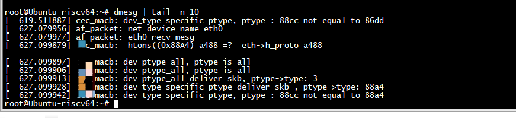

#   ETH_P_IP

```

    int proto = htons(ETH_P_IP);
    //int proto = htons(ETH_P_ARP);
    //int proto = htons(ETH_P_ALL);
    //int proto = ETH_P_IP;
    struct ethhdr *recv_ethhdr;
    struct ip *recv_iphdr;
    struct icmp *recv_icmphdr;

        if (argc > 1)
                strcpy(ifName, argv[1]);
        else
                strcpy(ifName, "eth0");
    fd = make_raw_socket(proto);
    if (fd < 0) {
        perror("make socket");
    }
    bind_raw_socket_to_interface(ifName, fd, proto);
```

在 list_for_each_entry_rcu(ptype,&skb->dev->ptype_specific, list)的时候coredump了

  
  
  
删除list_for_each_entry_rcu(ptype,&skb->dev->ptype_specific, list)就可以了，tcpdump正常

  


# 关闭skb->dev->ptype_all

关闭skb->dev->ptype_all之后，tcpdump无法抓取网卡接收的报文

  
  
关闭skb->dev->ptype_all之后，ETH_P_ALL raw socket 也无法抓取网卡接收的报文

   
   
# raw socket 接收

 


```
root@Ubuntu-riscv64:~# cat /proc/kallsyms  | grep netdev_tstamp_prequeue
ffffffff81a2aeb4 G netdev_tstamp_prequeue
root@Ubuntu-riscv64:~# cat /proc/kallsyms  | grep 'ptype_all'           
ffffffff81a811c8 B ptype_all
root@Ubuntu-riscv64:~# cat /proc/kallsyms  | grep 'ptype_base'
ffffffff81a81208 B ptype_base
root@Ubuntu-riscv64:~# 
```

## 接收ethercat



## 接收ping


```
		struct packet_type *ptype, *pt_prev=NULL;
		struct net_device *orig_dev;
		int ret;
		skb->dev = bp->dev;
        //skb->dev  set in __netdev_alloc_skb
		orig_dev = skb->dev;
		skb_reset_network_header(skb);
		if (!skb_transport_header_was_set(skb))
        		skb_reset_transport_header(skb);
		skb_reset_mac_len(skb);
		__be16 type = skb->protocol;
		int *p_netdev_tstamp_prequeue = 0xffffffff81a2aeb4; 
        struct list_head *p_ptype_all = 0xffffffff81a811c8;
        struct list_head *p_ptype_base = 0xffffffff81a81208;
        int (*func)(struct sk_buff **pskb, bool pfmemalloc, struct packet_type **ppt_prev);
		//net_timestamp_check((*p_netdev_tstamp_prequeue), skb);
		__net_timestamp(skb);
		skb_defer_rx_timestamp(skb);
		skb->skb_iif = skb->dev->ifindex;
		skb_gro_reset_offset(skb, 0);
		    // 
	        list_for_each_entry_rcu(ptype, p_ptype_all, list) {
		    if (htons(ETH_P_IP) == ptype->type)
		    {
			pr_info("ptype_all, ptype is ip \n");
		    }
		    else if (htons(ETH_P_ALL) == ptype->type)
		    {
			pr_info("ptype_all, ptype is all  \n");
		    }
		    if (pt_prev)
		    {
		        pr_info("ptype_all deliver skb, ptype->type: %x \n", htons(ptype->type));
		        refcount_inc(&skb->users);
		        pt_prev->func(skb, skb->dev, pt_prev, orig_dev);
		    }
		    pt_prev = ptype;
	         }

	        list_for_each_entry_rcu(ptype,&skb->dev->ptype_all, list) {
		    if (htons(ETH_P_IP) == ptype->type)
		    {
			pr_info("dev ptype_all, ptype is ip \n");
		    }
		    else if (htons(ETH_P_ALL) == ptype->type)
		    {
			pr_info("dev ptype_all, ptype is all  \n");
		    }
		    if (pt_prev)
		    {
		    pr_info("dev ptype_all deliver skb, ptype->type: %x \n", htons(ptype->type));
		    refcount_inc(&skb->users);
		    pt_prev->func(skb, skb->dev, pt_prev, orig_dev);
		    }
		    pt_prev = ptype;
	         }

	        list_for_each_entry_rcu(ptype,&p_ptype_base[ntohs(type) & PTYPE_HASH_MASK], list) {
		    if (htons(ETH_P_IP) == ptype->type)
		    {
			pr_info("base_type, ptype is ip \n");
		    }
		    else if (htons(ETH_P_ALL) == ptype->type)
		    {
			pr_info("base_type, ptype is all  \n");
		    }
		    if (ptype->type != type)
		    {
		        pr_info("base_type,  ptype->type: %x not equal to %x \n", htons(ptype->type), htons(type));
			                  continue;
		    }
		    if (pt_prev)
		    {
		    pr_info("base_type deliver skb, ptype->type: %x \n", htons(ptype->type));
		    refcount_inc(&skb->users);
		    pt_prev->func(skb, skb->dev, pt_prev, orig_dev);
		    }
		    pt_prev = ptype;
	         }

	        list_for_each_entry_rcu(ptype,&skb->dev->ptype_specific, list) {
		    if (htons(ETH_P_IP) == ptype->type)
		    {
			pr_info("dev_type specific ptype is ip \n");
		    }
		    else if (htons(ETH_P_ALL) == ptype->type)
		    {
			pr_info("dev_type specific ptype, ptype is all  \n");
		    }
		    if (ptype->type != type)
		    {
		        pr_info("dev_type specific ptype, ptype : %x not equal to %x\n", htons(ptype->type), htons(type));
			                  continue;
		    }
		    if (pt_prev)
		    {
		    pr_info("dev_type specific ptype deliver skb , ptype->type: %x \n", htons(ptype->type));
		    refcount_inc(&skb->users);
		    pt_prev->func(skb, skb->dev, pt_prev, orig_dev);
		    }
		    pt_prev = ptype;
	         }

```

# bind

```
        //if ((sd = socket(PF_PACKET, SOCK_RAW, htons(ETH_P_ALL))) < 0) {
        if ((sd = socket(AF_INET, SOCK_RAW, IPPROTO_ICMP)) < 0) {
                perror("raw socket");
                exit(1);
        }
        /* Get the index of the interface to send on */
        memset(&if_idx, 0, sizeof(struct ifreq));
        strncpy(if_idx.ifr_name, ifName, IFNAMSIZ-1);
        if (ioctl(sd, SIOCGIFINDEX, &if_idx) < 0)
            perror("SIOCGIFINDEX");
        memset( &sll, 0, sizeof( sll ) );
        sll.sll_family   = AF_PACKET;
        sll.sll_ifindex  = if_idx.ifr_ifindex;
        sll.sll_protocol = htons( IPPROTO_ICMP);
        sll.sll_protocol = htons( ETH_P_ALL);
   /* bind the raw socket to the interface */
   if( bind( sd, (struct sockaddr *) &sll, sizeof( sll ) ) == -1 )
    {
       printf( "bind %s failed \n", ifName);
       return( 1 );
  }
```
socket(AF_INET, SOCK_RAW, IPPROTO_ICMP)创建的socket 调用bind接口失败，

socket(PF_PACKET, SOCK_RAW, IPPROTO_ICMP))创建的socket 调用bind接口成功，
 


