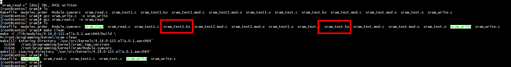

ARM中只有I/O内存的没有I/O端口，ARM9运行后默认是开启MMU的，Linux采用虚拟存储管理内存，具体的内存管理方式本文不作展开。所以要使用Linux访问外设必须要先进行内存映射。这里主要涉及两个函数：

（1）Request_mem_region：该函数检查所需要转换的内存是否被占用，进行合法性检查，有些驱动中没有，个人认为安全性起见还是使用为妙。

（2）Ioremap：该函数完成物理地址到虚拟地址的映射，映射后的地址才能被Linux内核使用。
 
# make




# ioremap_nocache


# create_mspace_with_base

create_mspace_with_base((void *)base,MALLOC_SIZE,0)

***MALLOC_SIZE满足如下关系才会成功创建create_mspace_with_base***

MALLOC_SIZE > msize + TOP_FOOT_SIZE && MALLOC_SIZE < (size_t) -(msize + TOP_FOOT_SIZE + mparams.page_size


***page size***
```
#define malloc_getpagesize      4096
```
# malloc in uboot

## malloc_cache_aligned
```
static inline void *malloc_cache_aligned(size_t size)
{
	return memalign(ARCH_DMA_MINALIGN, ALIGN(size, ARCH_DMA_MINALIGN));
}
```

##  alloc_cache_aligned

# references

[使用dlmalloc管理自己的嵌入式系统内存](https://www.cnblogs.com/smilingsusu/p/11881605.html)
[vpp源码分析-dlmalloc](https://www.jianshu.com/p/a8d97b3958ce)