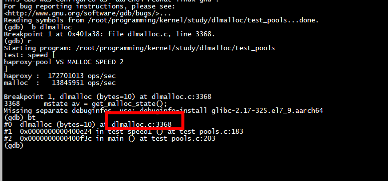
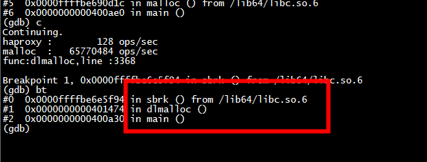

# run

```
root@centos7 dlmalloc]# gcc -O2 -o test_pools -D USE_DLMALLOC test_pools.c -DUSE_DL_PREFIX dlmalloc.c
[root@centos7 dlmalloc]# ./test_pools 
test: speed [
haproxy-pool VS MALLOC SPEED 2
]
haproxy :  664646468 ops/sec
malloc  :   65733008 ops/sec
dlmalloc:   53933033 ops/sec
success: speed1
```

## debug




### sbrk and  dlmalloc



# references

 

