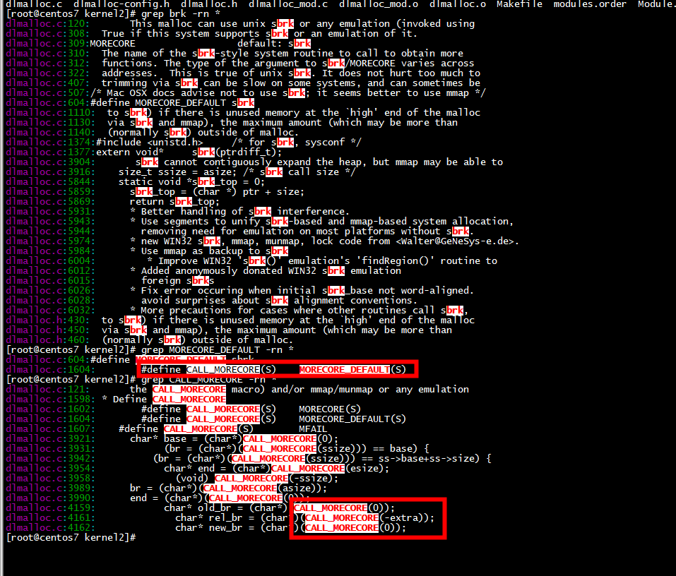
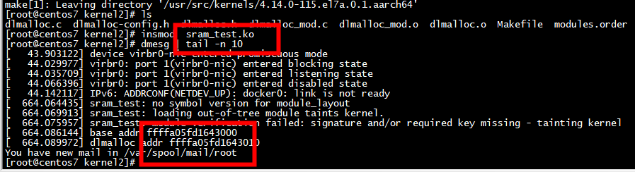

## kernel 1

# make

```
 make -C /lib/modules/4.14.0-115.el7a.0.1.aarch64/build  M=/root/programming/kernel/study/dlmalloc/kernel modules EXTRA_FLAGS+=-DUSE_DL_PREFIX

```

# kernel2

## sbrk and  dlmalloc



```

/**
 * Define CALL_MORECORE
 */
#if HAVE_MORECORE
    #ifdef MORECORE
        #define CALL_MORECORE(S)    MORECORE(S)
    #else  /* MORECORE */
        #define CALL_MORECORE(S)    MORECORE_DEFAULT(S)
    #endif /* MORECORE */
#else  /* HAVE_MORECORE */
    #define CALL_MORECORE(S)        MFAIL
#endif /* HAVE_MORECORE */

```

##  insmod  sram_test.ko 

