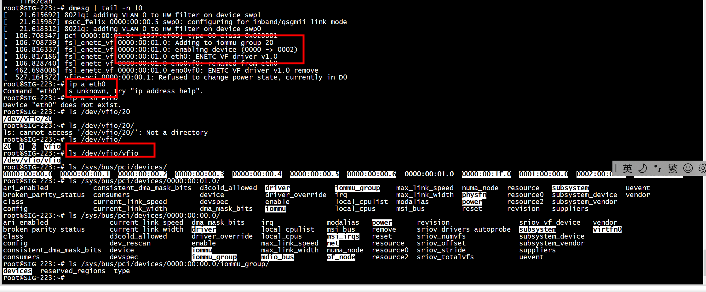

# eno0


```
root@SIG-0101:~# ethtool -i eno0
driver: fsl_enetc
version: 5.4.3-rt1
firmware-version: 
expansion-rom-version: 
bus-info: 0000:00:00.0
supports-statistics: yes
supports-test: no
supports-eeprom-access: no
supports-register-dump: yes
supports-priv-flags: no
root@SIG-0101:~# 
```

```
root@SIG-0101:~# lspci -vvs 0000:00:00.0
0000:00:00.0 Ethernet controller: Freescale Semiconductor Inc Device e100 (rev 01) (prog-if 01)
        Subsystem: Freescale Semiconductor Inc Device e100
        Device tree node: /sys/firmware/devicetree/base/soc/pcie@1f0000000/ethernet@0,0
        Control: I/O- Mem+ BusMaster+ SpecCycle- MemWINV- VGASnoop- ParErr- Stepping- SERR- FastB2B- DisINTx+
        Status: Cap+ 66MHz- UDF- FastB2B- ParErr- DEVSEL=fast >TAbort- <TAbort- <MAbort- >SERR- <PERR- INTx-
        Latency: 0
        Region 0: Memory at 1f8000000 (32-bit, non-prefetchable) [enhanced] [size=256K]
        Region 2: Memory at 1f8160000 (32-bit, non-prefetchable) [enhanced] [size=64K]
        Capabilities: [40] Express (v2) Root Complex Integrated Endpoint, MSI 00
                DevCap: MaxPayload 128 bytes, PhantFunc 0
                        ExtTag- RBE- FLReset+
                DevCtl: CorrErr- NonFatalErr- FatalErr- UnsupReq-
                        RlxdOrd- ExtTag- PhantFunc- AuxPwr- NoSnoop- FLReset-
                        MaxPayload 128 bytes, MaxReadReq 128 bytes
                DevSta: CorrErr- NonFatalErr- FatalErr- UnsupReq- AuxPwr- TransPend-
                DevCap2: Completion Timeout: Not Supported, TimeoutDis-, NROPrPrP-, LTR-
                         10BitTagComp-, 10BitTagReq-, OBFF Not Supported, ExtFmt-, EETLPPrefix-
                         EmergencyPowerReduction Not Supported, EmergencyPowerReductionInit-
                         FRS-
                         AtomicOpsCap: 32bit- 64bit- 128bitCAS-
                DevCtl2: Completion Timeout: 50us to 50ms, TimeoutDis-, LTR-, OBFF Disabled
                         AtomicOpsCtl: ReqEn-
        Capabilities: [80] MSI-X: Enable+ Count=32 Masked-
                Vector table: BAR=2 offset=00000000
                PBA: BAR=2 offset=00000200
        Capabilities: [90] Power Management version 3
                Flags: PMEClk- DSI- D1- D2- AuxCurrent=0mA PME(D0+,D1-,D2-,D3hot+,D3cold-)
                Status: D0 NoSoftRst+ PME-Enable- DSel=0 DScale=0 PME-
        Capabilities: [9c] Enhanced Allocation (EA): NumEntries=4
                Entry 0: Enable+ Writable- EntrySize=3
                         BAR Equivalent Indicator: BAR 0
                         PrimaryProperties: memory space, non-prefetchable
                         SecondaryProperties: entry unavailable for use, PrimaryProperties should be used
                         Base: 1f8000000
                         MaxOffset: 0003ffff
                Entry 1: Enable+ Writable- EntrySize=3
                         BAR Equivalent Indicator: BAR 2
                         PrimaryProperties: memory space, prefetchable
                         SecondaryProperties: memory space, non-prefetchable
                         Base: 1f8160000
                         MaxOffset: 0000ffff
                Entry 2: Enable+ Writable- EntrySize=3
                         BAR Equivalent Indicator: VF-BAR 0
                         PrimaryProperties: VF memory space, non-prefetchable
                         SecondaryProperties: entry unavailable for use, PrimaryProperties should be used
                         Base: 1f81d0000
                         MaxOffset: 0000ffff
                Entry 3: Enable+ Writable- EntrySize=3
                         BAR Equivalent Indicator: VF-BAR 2
                         PrimaryProperties: VF memory space, prefetchable
                         SecondaryProperties: VF memory space, prefetchable
                         Base: 1f81f0000
                         MaxOffset: 0000ffff
        Capabilities: [100 v1] Advanced Error Reporting
                UESta:  DLP- SDES- TLP- FCP- CmpltTO- CmpltAbrt- UnxCmplt- RxOF- MalfTLP- ECRC- UnsupReq- ACSViol-
                UEMsk:  DLP- SDES- TLP- FCP- CmpltTO- CmpltAbrt- UnxCmplt- RxOF- MalfTLP- ECRC- UnsupReq- ACSViol-
                UESvrt: DLP- SDES- TLP- FCP- CmpltTO- CmpltAbrt- UnxCmplt- RxOF- MalfTLP- ECRC- UnsupReq- ACSViol-
                CESta:  RxErr- BadTLP- BadDLLP- Rollover- Timeout- AdvNonFatalErr-
                CEMsk:  RxErr- BadTLP- BadDLLP- Rollover- Timeout- AdvNonFatalErr-
                AERCap: First Error Pointer: 00, ECRCGenCap- ECRCGenEn- ECRCChkCap- ECRCChkEn-
                        MultHdrRecCap- MultHdrRecEn- TLPPfxPres- HdrLogCap-
                HeaderLog: 00000000 00000000 00000000 00000000
        Capabilities: [130 v1] Access Control Services
                ACSCap: SrcValid- TransBlk- ReqRedir- CmpltRedir- UpstreamFwd- EgressCtrl- DirectTrans-
                ACSCtl: SrcValid- TransBlk- ReqRedir- CmpltRedir- UpstreamFwd- EgressCtrl- DirectTrans-
        Capabilities: [140 v1] Single Root I/O Virtualization (SR-IOV)    
                IOVCap: Migration-, Interrupt Message Number: 000
                IOVCtl: Enable- Migration- Interrupt- MSE- ARIHierarchy-
                IOVSta: Migration-
                Initial VFs: 2, Total VFs: 2, Number of VFs: 0, Function Dependency Link: 00
                VF offset: 8, stride: 1, Device ID: ef00
                Supported Page Size: 00000013, System Page Size: 00000010
                VF Migration: offset: 00000000, BIR: 0
        Kernel driver in use: fsl_enetc
lspci: Unable to load libkmod resources: error -12

root@SIG-0101:~#
```


## echo 1 >  /sys/class/net/eno0/device/sriov_numvfs 
```
root@SIG-0101:~# ls -l /sys/class/net/
total 0
lrwxrwxrwx 1 root root 0 Sep 16 08:58 can0 -> ../../devices/platform/soc/2180000.can/net/can0
lrwxrwxrwx 1 root root 0 Sep 16 08:58 can1 -> ../../devices/platform/soc/2190000.can/net/can1
lrwxrwxrwx 1 root root 0 Sep 16 08:58 eno0 -> ../../devices/platform/soc/1f0000000.pcie/pci0000:00/0000:00:00.0/net/eno0
lrwxrwxrwx 1 root root 0 Sep 16 08:58 eno2 -> ../../devices/platform/soc/1f0000000.pcie/pci0000:00/0000:00:00.2/net/eno2
lrwxrwxrwx 1 root root 0 Sep 16 08:58 erspan0 -> ../../devices/virtual/net/erspan0
lrwxrwxrwx 1 root root 0 Sep 16 08:58 gre0 -> ../../devices/virtual/net/gre0
lrwxrwxrwx 1 root root 0 Sep 16 08:58 gretap0 -> ../../devices/virtual/net/gretap0
lrwxrwxrwx 1 root root 0 Sep 16 08:58 ip6_vti0 -> ../../devices/virtual/net/ip6_vti0
lrwxrwxrwx 1 root root 0 Sep 16 08:58 ip6gre0 -> ../../devices/virtual/net/ip6gre0
lrwxrwxrwx 1 root root 0 Sep 16 08:58 ip6tnl0 -> ../../devices/virtual/net/ip6tnl0
lrwxrwxrwx 1 root root 0 Sep 16 08:58 ip_vti0 -> ../../devices/virtual/net/ip_vti0
lrwxrwxrwx 1 root root 0 Sep 16 08:58 lo -> ../../devices/virtual/net/lo
lrwxrwxrwx 1 root root 0 Sep 16 08:58 sit0 -> ../../devices/virtual/net/sit0
lrwxrwxrwx 1 root root 0 Sep 16 08:58 switch -> ../../devices/virtual/net/switch
lrwxrwxrwx 1 root root 0 Sep 16 08:58 swp0 -> ../../devices/platform/soc/1f0000000.pcie/pci0000:00/0000:00:00.5/net/swp0
lrwxrwxrwx 1 root root 0 Sep 16 08:58 swp1 -> ../../devices/platform/soc/1f0000000.pcie/pci0000:00/0000:00:00.5/net/swp1
lrwxrwxrwx 1 root root 0 Sep 16 08:58 swp2 -> ../../devices/platform/soc/1f0000000.pcie/pci0000:00/0000:00:00.5/net/swp2
lrwxrwxrwx 1 root root 0 Sep 16 08:58 swp3 -> ../../devices/platform/soc/1f0000000.pcie/pci0000:00/0000:00:00.5/net/swp3
lrwxrwxrwx 1 root root 0 Sep 16 08:58 tunl0 -> ../../devices/virtual/net/tunl0
lrwxrwxrwx 1 root root 0 Sep 16 08:58 wlan0 -> ../../devices/platform/soc/3500000.pcie/pci0002:00/0002:00:00.0/0002:01:00.0/net/wlan0
lrwxrwxrwx 1 root root 0 Sep 16 08:58 wwan0 -> ../../devices/platform/soc/3100000.usb/xhci-hcd.0.auto/usb1/1-1/1-1.3/1-1.3:2.0/net/wwan0
root@SIG-0101:~# cat   /sys/class/net/eno0/device/sriov_numvfs 
0
root@SIG-0101:~# echo 1 >  /sys/class/net/eno0/device/sriov_numvfs 
root@SIG-0101:~# ls -l /sys/class/net/
total 0
lrwxrwxrwx 1 root root 0 Sep 16 08:58 can0 -> ../../devices/platform/soc/2180000.can/net/can0
lrwxrwxrwx 1 root root 0 Sep 16 08:58 can1 -> ../../devices/platform/soc/2190000.can/net/can1
lrwxrwxrwx 1 root root 0 Sep 16 08:58 eno0 -> ../../devices/platform/soc/1f0000000.pcie/pci0000:00/0000:00:00.0/net/eno0
lrwxrwxrwx 1 root root 0 Sep 16 10:26 eno0vf0 -> ../../devices/platform/soc/1f0000000.pcie/pci0000:00/0000:00:01.0/net/eno0vf0
lrwxrwxrwx 1 root root 0 Sep 16 08:58 eno2 -> ../../devices/platform/soc/1f0000000.pcie/pci0000:00/0000:00:00.2/net/eno2
lrwxrwxrwx 1 root root 0 Sep 16 08:58 erspan0 -> ../../devices/virtual/net/erspan0
lrwxrwxrwx 1 root root 0 Sep 16 08:58 gre0 -> ../../devices/virtual/net/gre0
lrwxrwxrwx 1 root root 0 Sep 16 08:58 gretap0 -> ../../devices/virtual/net/gretap0
lrwxrwxrwx 1 root root 0 Sep 16 08:58 ip6_vti0 -> ../../devices/virtual/net/ip6_vti0
lrwxrwxrwx 1 root root 0 Sep 16 08:58 ip6gre0 -> ../../devices/virtual/net/ip6gre0
lrwxrwxrwx 1 root root 0 Sep 16 08:58 ip6tnl0 -> ../../devices/virtual/net/ip6tnl0
lrwxrwxrwx 1 root root 0 Sep 16 08:58 ip_vti0 -> ../../devices/virtual/net/ip_vti0
lrwxrwxrwx 1 root root 0 Sep 16 08:58 lo -> ../../devices/virtual/net/lo
lrwxrwxrwx 1 root root 0 Sep 16 08:58 sit0 -> ../../devices/virtual/net/sit0
lrwxrwxrwx 1 root root 0 Sep 16 08:58 switch -> ../../devices/virtual/net/switch
lrwxrwxrwx 1 root root 0 Sep 16 08:58 swp0 -> ../../devices/platform/soc/1f0000000.pcie/pci0000:00/0000:00:00.5/net/swp0
lrwxrwxrwx 1 root root 0 Sep 16 08:58 swp1 -> ../../devices/platform/soc/1f0000000.pcie/pci0000:00/0000:00:00.5/net/swp1
lrwxrwxrwx 1 root root 0 Sep 16 08:58 swp2 -> ../../devices/platform/soc/1f0000000.pcie/pci0000:00/0000:00:00.5/net/swp2
lrwxrwxrwx 1 root root 0 Sep 16 08:58 swp3 -> ../../devices/platform/soc/1f0000000.pcie/pci0000:00/0000:00:00.5/net/swp3
lrwxrwxrwx 1 root root 0 Sep 16 08:58 tunl0 -> ../../devices/virtual/net/tunl0
lrwxrwxrwx 1 root root 0 Sep 16 08:58 wlan0 -> ../../devices/platform/soc/3500000.pcie/pci0002:00/0002:00:00.0/0002:01:00.0/net/wlan0
lrwxrwxrwx 1 root root 0 Sep 16 08:58 wwan0 -> ../../devices/platform/soc/3100000.usb/xhci-hcd.0.auto/usb1/1-1/1-1.3/1-1.3:2.0/net/wwan0
```

## eno0vf0
```
root@SIG-0101:~# ethtool -i  eno0vf0
driver: fsl_enetc_vf
version: 5.4.3-rt1
firmware-version: 
expansion-rom-version: 
bus-info: 0000:00:01.0
supports-statistics: yes
supports-test: no
supports-eeprom-access: no
supports-register-dump: yes
supports-priv-flags: no
root@SIG-0101:~# ethtool -i eno0
driver: fsl_enetc
version: 5.4.3-rt1
firmware-version: 
expansion-rom-version: 
bus-info: 0000:00:00.0
supports-statistics: yes
supports-test: no
supports-eeprom-access: no
supports-register-dump: yes
supports-priv-flags: no
```
```
root@SIG-0101:~# echo 1 >  /sys/class/net/eno0/device/sriov_numvfs 
root@SIG-0101:~# lspci -vvs 0000:00:01.0
0000:00:01.0 Ethernet controller: Freescale Semiconductor Inc Device ef00 (rev 01) (prog-if 01)
        Subsystem: Freescale Semiconductor Inc Device e100
        Control: I/O- Mem- BusMaster+ SpecCycle- MemWINV- VGASnoop- ParErr- Stepping- SERR- FastB2B- DisINTx-
        Status: Cap+ 66MHz- UDF- FastB2B- ParErr- DEVSEL=fast >TAbort- <TAbort- <MAbort- >SERR- <PERR- INTx-
        Latency: 0
        Region 0: Memory at 1f81d0000 (32-bit, non-prefetchable) [disabled] [enhanced] [size=64K]
        Region 2: Memory at 1f81f0000 (32-bit, non-prefetchable) [disabled] [enhanced] [size=64K]
        Capabilities: [40] Express (v2) Root Complex Integrated Endpoint, MSI 00
                DevCap: MaxPayload 128 bytes, PhantFunc 0
                        ExtTag- RBE- FLReset+
                DevCtl: CorrErr- NonFatalErr- FatalErr- UnsupReq-
                        RlxdOrd- ExtTag- PhantFunc- AuxPwr- NoSnoop- FLReset-
                        MaxPayload 128 bytes, MaxReadReq 128 bytes
                DevSta: CorrErr- NonFatalErr- FatalErr- UnsupReq- AuxPwr- TransPend-
                DevCap2: Completion Timeout: Not Supported, TimeoutDis-, NROPrPrP-, LTR-
                         10BitTagComp-, 10BitTagReq-, OBFF Not Supported, ExtFmt-, EETLPPrefix-
                         EmergencyPowerReduction Not Supported, EmergencyPowerReductionInit-
                         FRS-
                         AtomicOpsCap: 32bit- 64bit- 128bitCAS-
                DevCtl2: Completion Timeout: 50us to 50ms, TimeoutDis-, LTR-, OBFF Disabled
                         AtomicOpsCtl: ReqEn-
        Capabilities: [80] MSI-X: Enable+ Count=32 Masked-
                Vector table: BAR=2 offset=00000000
                PBA: BAR=2 offset=00000200
        Capabilities: [100 v1] Advanced Error Reporting
                UESta:  DLP- SDES- TLP- FCP- CmpltTO- CmpltAbrt- UnxCmplt- RxOF- MalfTLP- ECRC- UnsupReq- ACSViol-
                UEMsk:  DLP- SDES- TLP- FCP- CmpltTO- CmpltAbrt- UnxCmplt- RxOF- MalfTLP- ECRC- UnsupReq- ACSViol-
                UESvrt: DLP- SDES- TLP- FCP- CmpltTO- CmpltAbrt- UnxCmplt- RxOF- MalfTLP- ECRC- UnsupReq- ACSViol-
                CESta:  RxErr- BadTLP- BadDLLP- Rollover- Timeout- AdvNonFatalErr-
                CEMsk:  RxErr- BadTLP- BadDLLP- Rollover- Timeout- AdvNonFatalErr-
                AERCap: First Error Pointer: 16, ECRCGenCap- ECRCGenEn- ECRCChkCap- ECRCChkEn-
                        MultHdrRecCap- MultHdrRecEn- TLPPfxPres- HdrLogCap-
                HeaderLog: 00000000 00000000 00000000 00000000
        Capabilities: [130 v1] Access Control Services
                ACSCap: SrcValid- TransBlk- ReqRedir- CmpltRedir- UpstreamFwd- EgressCtrl- DirectTrans-
                ACSCtl: SrcValid- TransBlk- ReqRedir- CmpltRedir- UpstreamFwd- EgressCtrl- DirectTrans-
        Kernel driver in use: fsl_enetc_vf
lspci: Unable to load libkmod resources: error -12
```


## ping 192.168.10.81
```
root@SIG-0101:~# ip link set eno0vf0 up
root@SIG-0101:~# ip a sh   eno0vf0
22: eno0vf0: <BROADCAST,MULTICAST,UP,LOWER_UP> mtu 1500 qdisc mq state UP group default qlen 1000
    link/ether c6:fb:e1:62:bc:79 brd ff:ff:ff:ff:ff:ff
    inet6 fe80::c4fb:e1ff:fe62:bc79/64 scope link 
       valid_lft forever preferred_lft forever
root@SIG-0101:~# ip a add 192.168.10.220/24 dev  eno0vf0
root@SIG-0101:~# ping 192.168.10.81
PING 192.168.10.81 (192.168.10.81) 56(84) bytes of data.
64 bytes from 192.168.10.81: icmp_seq=1 ttl=64 time=4.20 ms
64 bytes from 192.168.10.81: icmp_seq=2 ttl=64 time=2.19 ms
64 bytes from 192.168.10.81: icmp_seq=3 ttl=64 time=2.09 ms
64 bytes from 192.168.10.81: icmp_seq=4 ttl=64 time=2.12 ms
^C
--- 192.168.10.81 ping statistics ---
4 packets transmitted, 4 received, 0% packet loss, time 3004ms
rtt min/avg/max/mdev = 2.086/2.647/4.196/0.894 ms
root@SIG-0101:~# 
```

# tcpdump


# irq


# vfio


## unbind

```
root@SIG-223:~# ls /sys/bus/pci/devices/0000:00:00.2/driver/unbind
/sys/bus/pci/devices/0000:00:00.2/driver/unbind
root@SIG-223:~# lspci -n -s 00:00.2
0000:00:00.2 0200: 1957:e100 (rev 01)
root@SIG-223:~# ethtool -i eno2
driver: fsl_enetc
version: 5.4.3-rt1
firmware-version: 
expansion-rom-version: 
bus-info: 0000:00:00.2
supports-statistics: yes
supports-test: no
supports-eeprom-access: no
supports-register-dump: yes
supports-priv-flags: no
root@SIG-223:~# echo '0000:00:00.2' > /sys/bus/pci/devices/0000:00:00.2/driver/unbind
root@SIG-223:~# ethtool -i eno2
Cannot get driver information: No such device
root@SIG-223:~# echo 1957 e100 >  /sys/bus/pci/drivers/vfio-pci/new_id 
root@SIG-223:~# ethtool -i eno2  // 看不到此設備
Cannot get driver information: No such device
root@SIG-223:~# ls /dev/vfio/
4  5  6  vfio
root@SIG-223:~#  echo '0000:00:00.2' > /sys/bus/pci/devices/0000:00:00.2/driver/unbind
root@SIG-223:~# ls /dev/vfio/
4  6  vfio
root@SIG-223:~# 
```

```
root@SIG-223:~# ls /dev/vfio/
4  5  6  vfio
root@SIG-223:~#  echo '0000:00:00.2' > /sys/bus/pci/devices/0000:00:00.2/driver/unbind
root@SIG-223:~# ls /dev/vfio/
4  6  vfio
root@SIG-223:~# echo 1957 e100 >  /sys/bus/pci/drivers/vfio-pci/new_id 
root@SIG-223:~# ls /dev/vfio/
4  5  6  vfio
```

## vf bind to vifo

当一个PCI设备passthrough给虚拟机后，PCI设备DMA的目的地址是虚拟机指定的，必须要有IOMMU限制这个PCI设备只能操作虚拟机用到的物理内存。
物理PCI设备通过直通的方式进入到虚拟机的客户机时，客户机设备驱动使用透传设备的DMA访问虚拟机内存物理 地址时，***IOMMU会进行 GPA-->HPA***的转换

```
root@SIG-223:~# echo 1 > /sys/class/net/eno0/device/sriov_numvfs
root@SIG-223:~# ip a
```

```

root@SIG-223:~# ethtool -i  eno0vf0
driver: fsl_enetc_vf
version: 5.4.3-rt1
firmware-version: 
expansion-rom-version: 
bus-info: 0000:00:01.0
supports-statistics: yes
supports-test: no
supports-eeprom-access: no
supports-register-dump: yes
supports-priv-flags: no
root@SIG-223:~# ls /dev/vfio/
vfio
root@SIG-223:~# ls /dev/vfio/vfio 
/dev/vfio/vfio
root@SIG-223:~# ls /dev/vfio/
vfio
root@SIG-223:~# ls /dev/vfio/vfio 
/dev/vfio/vfio
root@SIG-223:~# modprobe vfio_pci
root@SIG-223:~# ls /dev/vfio/
vfio  // no group
root@SIG-223:~# ls /dev/vfio/vfio 
/dev/vfio/vfio
root@SIG-223:~# 
```


 ```
 root@SIG-223:~# ls /sys/bus/pci/devices/
0000:00:00.0  0000:00:00.1  0000:00:00.2  0000:00:00.3  0000:00:00.4  0000:00:00.5  0000:00:00.6  0000:00:01.0  0000:00:1f.0  0001:00:00.0  0002:00:00.0  0002:01:00.0
root@SIG-223:~#  echo '0000:00:01.0' > /sys/bus/pci/devices/0000:00:01.0/driver/unbind
root@SIG-223:~# 
 ```
 
 ```
 root@SIG-223:~# lspci -n -s 00:01.0
0000:00:01.0 0200: 1957:ef00 (rev 01)   // 1957:ef00 不同于 1957:e100
 ```
 
 ```
 root@SIG-223:~# ls /dev/vfio/vfio 
/dev/vfio/vfio
root@SIG-223:~# ls /dev/vfio/
4  6  vfio
root@SIG-223:~# echo 1957 ef00 >  /sys/bus/pci/drivers/vfio-pci/new_id
root@SIG-223:~# ls /dev/vfio/
20  4  6  vfio
root@SIG-223:~# 
 ```
 
 ```
[  106.708347] pci 0000:00:01.0: [1957:ef00] type 00 class 0x020001
[  106.708739] fsl_enetc_vf 0000:00:01.0: Adding to iommu group 20
[  106.816337] fsl_enetc_vf 0000:00:01.0: enabling device (0000 -> 0002)
[  106.817186] fsl_enetc_vf 0000:00:01.0 eth0: ENETC VF driver v1.0
[  106.828740] fsl_enetc_vf 0000:00:01.0 eno0vf0: renamed from eth0
[  462.698008] fsl_enetc_vf 0000:00:01.0 eno0vf0: ENETC VF driver v1.0 remove
 ```
 
 

#   fsl_enetc_vf kernel driver 

```
fsl-enetc-vf-y := enetc_vf.o
./enetc/enetc_vf.c
22: eno0vf0: <BROADCAST,MULTICAST> mtu 1500 qdisc noop state DOWN group default qlen 1000
    link/ether 0a:8b:bc:b0:6e:08 brd ff:ff:ff:ff:ff:ff
root@SIG-223:~# ethtool -i  eno0vf0
driver: fsl_enetc_vf
version: 5.4.3-rt1
firmware-version: 
expansion-rom-version: 
bus-info: 0000:00:01.0
supports-statistics: yes
supports-test: no
supports-eeprom-access: no
supports-register-dump: yes
supports-priv-flags: no
```

## probe match

```
static const struct pci_device_id enetc_vf_id_table[] = {
        { PCI_DEVICE(PCI_VENDOR_ID_FREESCALE, ENETC_DEV_ID_VF) },
        { 0, } /* End of table. */
};
```