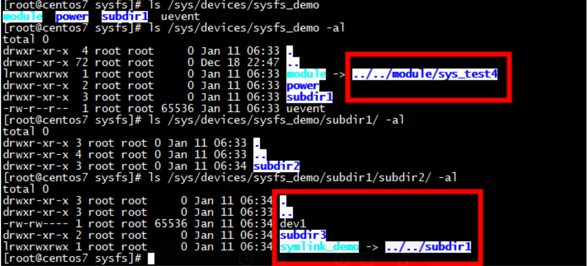

```
[root@centos7 sys]# ls /sys/class/net/
docker0  enp125s0f0  enp125s0f1  enp125s0f2  enp125s0f3  enp5s0  enp6s0  lo  virbr0  virbr0-nic
[root@centos7 sys]# 
[root@centos7 sys]# ls /sys/class/net/enp125s0f0
addr_assign_type  broadcast        device    dormant  gro_flush_timeout  iflink     name_assign_type  phydev          phys_switch_id  queues      subsystem     uevent
address           carrier          dev_id    duplex   ifalias            link_mode  netdev_group      phys_port_id    power           speed       tx_queue_len
addr_len          carrier_changes  dev_port  flags    ifindex            mtu        operstate         phys_port_name  proto_down      statistics  type
[root@centos7 sys]# ls /sys/class/net/enp125s0f0/device/
broken_parity_status      current_link_width  driver           irq             mdio_bus  numa_node  resource                 sriov_numvfs      uevent
class                     d3cold_allowed      driver_override  local_cpulist   modalias  power      resource0                sriov_totalvfs    vendor
config                    device              enable           local_cpus      msi_bus   remove     resource2                subsystem
consistent_dma_mask_bits  devspec             iommu            max_link_speed  msi_irqs  rescan     revision                 subsystem_device
current_link_speed        dma_mask_bits       iommu_group      max_link_width  net       reset      sriov_drivers_autoprobe  subsystem_vendor
[root@centos7 sys]# 
```

# insmod  sys_test4.ko



```
[root@centos7 sysfs]# insmod  sys_test4.ko 
[root@centos7 sysfs]# cat /sys/devices/sysfs_demo/subdir1/
cat: /sys/devices/sysfs_demo/subdir1/: Is a directory
[root@centos7 sysfs]# cat /sys/devices/sysfs_demo/subdir1/subdir2/dev1 
dev_int: 0
[root@centos7 sysfs]# 
```

 rmmod sys_test4.ko 没有coredump
```
[root@centos7 sysfs]# rmmod sys_test4.ko 
[root@centos7 sysfs]# 
```