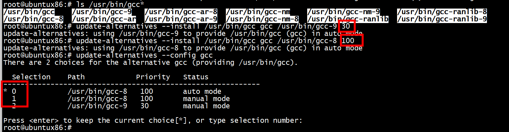

# 查看 gcc/g++ 版本
```

查看当前版本
gcc -v
g++ -v
查看系统已有版本
ls /usr/bin/gcc*
ls /usr/bin/g++*
```

```
若没有需要的版本，先进行安装：
sudo add-apt-repository ppa:ubuntu-toolchain-r/test
sudo apt-get update
sudo apt install gcc-8
sudo apt install g++-8
```

安装apt-get install gcc-8 后   

```
root@ubuntux86:# ls /usr/bin/gcc*
/usr/bin/gcc    /usr/bin/gcc-9   /usr/bin/gcc-ar-8  /usr/bin/gcc-nm    /usr/bin/gcc-nm-9    /usr/bin/gcc-ranlib-8
/usr/bin/gcc-8  /usr/bin/gcc-ar  /usr/bin/gcc-ar-9  /usr/bin/gcc-nm-8  /usr/bin/gcc-ranlib  /usr/bin/gcc-ranlib-9
root@ubuntux86:#
```
# 手动切换运行版本

+ 1 切换之前  

```
root@ubuntux86:# gcc -v
Thread model: posix
gcc version 9.4.0 (Ubuntu 9.4.0-1ubuntu1~20.04.2)
```

+ 2 先将需要的版本添加到 update-alternatives 中，设置优先级   




+ 3 若想删除，执行命令：
sudo update-alternatives --remove gcc /usr/bin/gcc-4.9   
+ 4 手动配置 update-alternatives  
```
sudo update-alternatives --config gcc
sudo update-alternatives --config g++
```

# references

[Ubuntu多版本gcc共存及手动切换使用版本](https://blog.csdn.net/qq_36289572/article/details/132163157)  