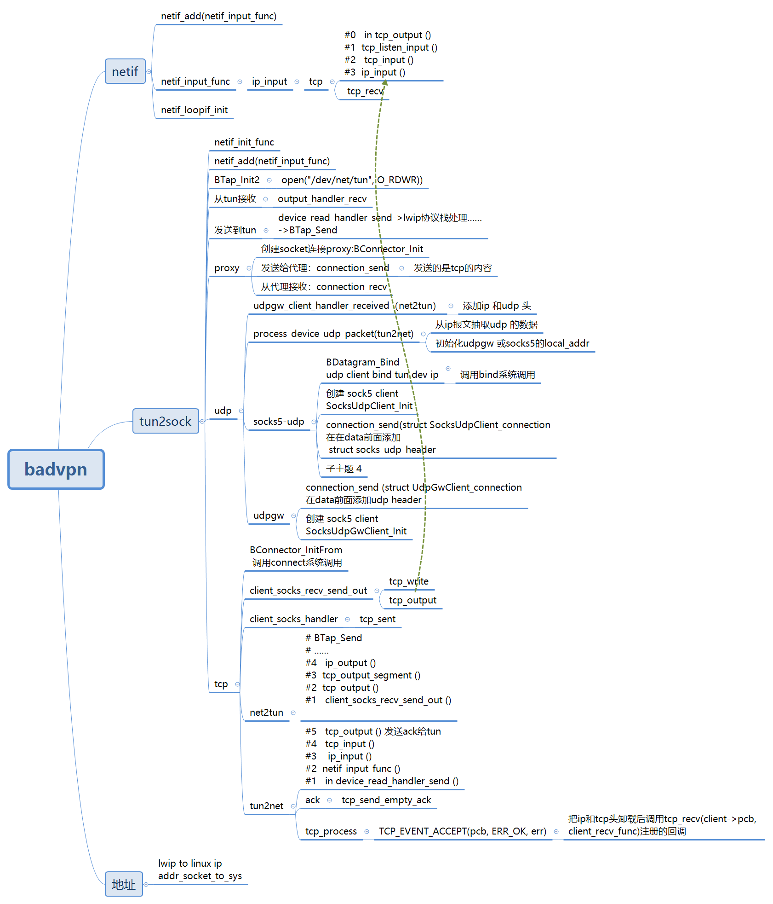

# badvpn



# build

```
mkdir build && cd build && cmake .. -DCMAKE_INSTALL_PREFIX=/root/programming/kernel/badvpntest1/badvpn/install  && make install

```

```
[root@centos7 build]# pwd
/root/programming/kernel/badvpntest1/badvpn/build
[root@centos7 build]# make install -j16
```

# test
```
root@ubuntu:~/badvpn# ./install/bin/badvpn-server --listen-addr 0.0.0.0:7000 --loglevel 4 --logger stdout  --ssl --nssdb sql:/root/badvpn/nssdb/nssdb.txt --server-cert-name "vpnca"
NOTICE(server): initializing BadVPN server 1.999.128
ERROR(server): NSS_Init failed (-8174)
NOTICE(server): exiting
```

## server

```
root@ubuntu:~/badvpn# ./install/bin/badvpn-server --listen-addr 0.0.0.0:7000 --loglevel 4 --logger stdout  
NOTICE(server): initializing BadVPN server 1.999.128
NOTICE(server): entering event loop
INFO(server): client 0 (10.10.16.251:42250): initialized
INFO(server): client 0 (10.10.16.251:42250): received hello
INFO(server): client 1 (10.10.16.81:33938): initialized
INFO(server): client 1 (10.10.16.81:33938): received hello
INFO(server): client 0 (10.10.16.251:42250): accepted 1
INFO(server): client 1 (10.10.16.81:33938): accepted 0
INFO(server): client 0 (10.10.16.251:42250): connection closed
INFO(server): client 0 (10.10.16.251:42250): removing
INFO(server): client 2 (10.10.16.251:35188): initialized
INFO(server): client 2 (10.10.16.251:35188): received hello
INFO(server): client 2 (10.10.16.251:35188): accepted 1
INFO(server): client 1 (10.10.16.81:33938): accepted 2
```


## client1


```
tunctl -u root -t tap0
ifconfig tap0 10.10.10.131/24 up
./install/bin/badvpn-client  --server-addr 10.10.16.82:7000 --transport-mode udp --encryption-mode none --hash-mode none --scope local1 --bind-addr 0.0.0.0:8000 --num-ports 30 --ext-addr 1.1.1.131:8000 local1 --tapdev tap0 --loglevel
```

## client2

```
tunctl -u root -t tap0
ifconfig tap0 10.10.10.129/24 up
 bin/badvpn-client  --server-addr 10.10.16.82:7000 --transport-mode udp --encryption-mode none --hash-mode none --scope local1 --bind-addr 0.0.0.0:8000 --num-ports 30 --ext-addr 1.1.1.129:8000 local1 --tapdev tap0 --loglevel 4
```


#  test2

## server

***no server***
 
 
# client 
```
[root@centos7 ~]# ip tuntap add dev  tun0 mode tun
You have new mail in /var/spool/mail/root
[root@centos7 ~]# 
[root@centos7 ~]#  ifconfig tun0 10.0.0.1 netmask 255.255.255.0
[root@centos7 badvpn]# ./install/bin/badvpn-tun2socks  --tundev tun0 --netif-ipaddr 10.0.0.2 --netif-netmask  255.255.255.0 --socks-server-addr 127.0.0.1:1080
NOTICE(tun2socks): initializing BadVPN tun2socks 1.999.128
NOTICE(tun2socks): entering event loop


[root@centos7 ~]# iptables -nvL | grep 10.0..0.2
[root@centos7 ~]# iptables -nvL | grep 10.0.0.2
[root@centos7 ~]# iptables -nvL -t nat | grep 10.0.0.2
[root@centos7 ~]# iptables -nvL -t filter | grep 10.0.0.2
[root@centos7 ~]#   ping -n 10.0.0.2
PING 10.0.0.2 (10.0.0.2) 56(84) bytes of data.
64 bytes from 10.0.0.2: icmp_seq=1 ttl=255 time=0.060 ms
64 bytes from 10.0.0.2: icmp_seq=2 ttl=255 time=0.023 ms
64 bytes from 10.0.0.2: icmp_seq=3 ttl=255 time=0.019 ms
64 bytes from 10.0.0.2: icmp_seq=4 ttl=255 time=0.018 ms
^C
--- 10.0.0.2 ping statistics ---
4 packets transmitted, 4 received, 0% packet loss, time 3096ms
rtt min/avg/max/mdev = 0.018/0.030/0.060/0.017 ms
[root@centos7 ~]# 

```

***route add default gw 10.0.0.2 metric 6***


### ping 8.8.8.8


  route add <IP_of_SSH_server> gw <IP_of_original_gateway> metric 5

  <same for DNS>
  route add default gw 10.0.0.2 metric 6

***更改default gw太粗暴了***

#### route add  -host 8.8.8.8 gw  10.0.0.2 metric 6


```
route del default gw 10.0.0.2 metric 6
Last login: Fri Oct 14 08:11:16 2022
[root@centos7 ~]# route add  -host 8.8.8.8 gw  10.0.0.2 metric 6
[root@centos7 ~]# ping 8.8.8.8
PING 8.8.8.8 (8.8.8.8) 56(84) bytes of data.
^C
--- 8.8.8.8 ping statistics ---
2 packets transmitted, 0 received, 100% packet loss, time 1075ms

[root@centos7 ~]# 
```


### ping 10.10.16.82


# test3

UDP FORWARDING
tun2socks can forward UDP, however this requires a forwarder daemon, badvpn-udpgw to run on the remote SSH server:


  badvpn-udpgw --listen-addr 127.0.0.1:7300
Then tell tun2socks to forward UDP via the forwarder:


  --udpgw-remote-server-addr 127.0.0.1:7300 

## server

```
root@ubuntu:~/badvpn# ./install/bin/badvpn-udpgw  --listen-addr 0.0.0.0:7000
NOTICE(udpgw): initializing BadVPN udpgw 1.999.128
INFO(udpgw): using DNS server 8.8.8.8:53
NOTICE(udpgw): entering event loop
```


## client
```
[root@centos7 badvpn]# ./install/bin/badvpn-tun2socks  --tundev tun0 --netif-ipaddr 10.0.0.2 --netif-netmask  255.255.255.0 --socks-server-addr 127.0.0.1:1080  --udpgw-remote-server-addr 10.10.16.82:7300
NOTICE(tun2socks): initializing BadVPN tun2socks 1.999.128
NOTICE(tun2socks): entering event loop
ERROR(BConnection): connection failed
ERROR(BSocksClient): connection failed
INFO(SocksUdpGwClient): SOCKS error
ERROR(BConnection): connection failed
ERROR(BSocksClient): connection failed
INFO(SocksUdpGwClient): SOCKS error
INFO(UdpGwClient): keepalive
ERROR(BConnection): connection failed
ERROR(BSocksClient): connection failed
INFO(SocksUdpGwClient): SOCKS error
ERROR(BConnection): connection failed
ERROR(BSocksClient): connection failed
INFO(SocksUdpGwClient): SOCKS error
ERROR(BConnection): connection failed
ERROR(BSocksClient): connection failed
INFO(SocksUdpGwClient): SOCKS error
ERROR(BConnection): connection failed
ERROR(BSocksClient): connection failed
INFO(SocksUdpGwClient): SOCKS error
ERROR(BConnection): connection failed
ERROR(BSocksClient): connection failed
INFO(SocksUdpGwClient): SOCKS error
^CNOTICE(tun2socks): termination requested
NOTICE(tun2socks): tearing down
NOTICE(tun2socks): exiting
```

# gdb

```
[root@centos7 badvpn]# ./install/bin/badvpn-tun2socks  --tundev tun0 --netif-ipaddr 10.0.0.2 --netif-netmask  255.255.255.0 --socks-server-addr 127.0.0.1:1080 
NOTICE(tun2socks): initializing BadVPN tun2socks 1.999.128
NOTICE(tun2socks): entering event loop

```

```
(gdb) bt
#0  0x0000000000413d04 in device_read_handler_send ()
#1  0x000000000042fc50 in _PacketPassInterface_job_operation ()
#2  0x000000000049cf04 in BPendingGroup_ExecuteJob ()
#3  0x000000000042d1a8 in BReactor_Exec ()
#4  0x00000000004122d8 in main ()
``` 

# bind to device 

```
ubuntu@ubuntux86:~$ ip a
1: lo: <LOOPBACK,UP,LOWER_UP> mtu 65536 qdisc noqueue state UNKNOWN group default qlen 1000
    link/loopback 00:00:00:00:00:00 brd 00:00:00:00:00:00
    inet 127.0.0.1/8 scope host lo
       valid_lft forever preferred_lft forever
    inet6 ::1/128 scope host 
       valid_lft forever preferred_lft forever
2: enp0s31f6: <NO-CARRIER,BROADCAST,MULTICAST,UP> mtu 1500 qdisc fq_codel state DOWN group default qlen 1000
    link/ether 30:d0:42:fa:ae:11 brd ff:ff:ff:ff:ff:ff
3: enx00e04c3600d7: <BROADCAST,MULTICAST,UP,LOWER_UP> mtu 1500 qdisc fq_codel state UP group default qlen 1000
    link/ether 00:e0:4c:36:00:d7 brd ff:ff:ff:ff:ff:ff
    inet 10.11.11.82/24 brd 10.11.11.255 scope global noprefixroute enx00e04c3600d7
       valid_lft forever preferred_lft forever
    inet6 fe80::c95f:8c33:cc79:3fa2/64 scope link noprefixroute 
       valid_lft forever preferred_lft forever
4: wlxe0e1a91deeb2: <BROADCAST,MULTICAST,UP,LOWER_UP> mtu 1500 qdisc mq state UP group default qlen 1000
    link/ether e0:e1:a9:1d:ee:b2 brd ff:ff:ff:ff:ff:ff
    inet 192.168.27.232/24 brd 192.168.27.255 scope global dynamic noprefixroute wlxe0e1a91deeb2
       valid_lft 28062sec preferred_lft 28062sec
    inet6 fe80::7fb9:8ccd:f13c:3736/64 scope link noprefixroute 
       valid_lft forever preferred_lft forever
ubuntu@ubuntux86:~$ route -n
Kernel IP routing table
Destination     Gateway         Genmask         Flags Metric Ref    Use Iface
0.0.0.0         192.168.27.1    0.0.0.0         UG    600    0        0 wlxe0e1a91deeb2
10.11.11.0      0.0.0.0         255.255.255.0   U     100    0        0 enx00e04c3600d7
169.254.0.0     0.0.0.0         255.255.0.0     U     1000   0        0 enx00e04c3600d7
192.168.27.0    0.0.0.0         255.255.255.0   U     600    0        0 wlxe0e1a91deeb2
 
root@ubuntux86:/home/ubuntu# route add default gw 10.11.11.81 metric 6

root@ubuntux86:/home/ubuntu# route -n
Kernel IP routing table
Destination     Gateway         Genmask         Flags Metric Ref    Use Iface
0.0.0.0         10.11.11.81     0.0.0.0         UG    6      0        0 enx00e04c3600d7
0.0.0.0         192.168.27.1    0.0.0.0         UG    600    0        0 wlxe0e1a91deeb2
10.11.11.0      0.0.0.0         255.255.255.0   U     100    0        0 enx00e04c3600d7
169.254.0.0     0.0.0.0         255.255.0.0     U     1000   0        0 enx00e04c3600d7
192.168.27.0    0.0.0.0         255.255.255.0   U     600    0        0 wlxe0e1a91deeb2
root@ubuntux86:/home/ubuntu# 
```

```
root@ubuntux86:/home/ubuntu# ping 8.8.8.8
PING 8.8.8.8 (8.8.8.8) 56(84) bytes of data.
^C
--- 8.8.8.8 ping statistics ---
2 packets transmitted, 0 received, 100% packet loss, time 1007ms

root@ubuntux86:/home/ubuntu# ping 8.8.8.8 -i wlxe0e1a91deeb2
ping: bad timing interval: wlxe0e1a91deeb2
root@ubuntux86:/home/ubuntu# ping 8.8.8.8 -I wlxe0e1a91deeb2
PING 8.8.8.8 (8.8.8.8) from 192.168.27.232 wlxe0e1a91deeb2: 56(84) bytes of data.
64 bytes from 8.8.8.8: icmp_seq=1 ttl=50 time=19.3 ms
64 bytes from 8.8.8.8: icmp_seq=2 ttl=50 time=16.3 ms
64 bytes from 8.8.8.8: icmp_seq=3 ttl=50 time=18.4 ms
64 bytes from 8.8.8.8: icmp_seq=4 ttl=50 time=17.8 ms
64 bytes from 8.8.8.8: icmp_seq=5 ttl=50 time=15.5 ms
^C
--- 8.8.8.8 ping statistics ---
5 packets transmitted, 5 received, 0% packet loss, time 4008ms
rtt min/avg/max/mdev = 15.526/17.450/19.336/1.380 ms
root@ubuntux86:/home/ubuntu# 
```
# references 

[跟我一起写一个点对点 VPN - SimpleVPN 详解](https://blog.csdn.net/dog250/article/details/70945840?locationNum=16&fps=1)

