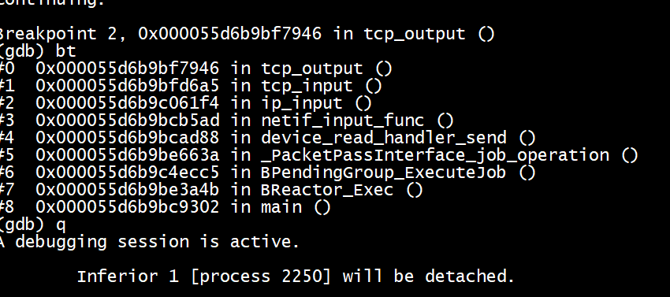
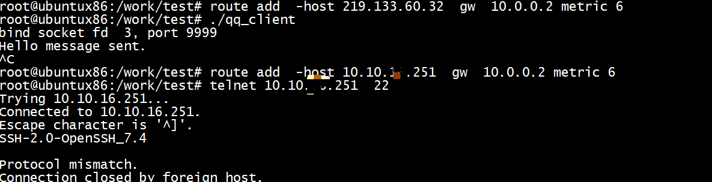

# lwip


## client


## server


### 状态机 tcp_process

各个状态通过TCP_EVENT_ACCEPT(pcb, ERR_OK, err); -->lwip_tcp_event


```
 case ESTABLISHED:
    tcp_receive(pcb);
    if (recv_flags & TF_GOT_FIN) { /* passive close */
      tcp_ack_now(pcb);
      pcb->state = CLOSE_WAIT;
    }
	
```

### 注册回调
```
tcp_recv(struct tcp_pcb *pcb, tcp_recv_fn recv)
{
  LWIP_ASSERT("invalid socket state for recv callback", pcb->state != LISTEN);
  pcb->recv = recv;
}
void
tcp_sent(struct tcp_pcb *pcb, tcp_sent_fn sent)
{
  LWIP_ASSERT("invalid socket state for sent callback", pcb->state != LISTEN);
  pcb->sent = sent;
}
```

```
     #if LWIP_EVENT_API
   
   #define TCP_EVENT_ACCEPT(lpcb,pcb,arg,err,ret) ret = lwip_tcp_event(arg, (pcb),\
                   LWIP_EVENT_ACCEPT, NULL, 0, err)
   #define TCP_EVENT_SENT(pcb,space,ret) ret = lwip_tcp_event((pcb)->callback_arg, (pcb),\
                      LWIP_EVENT_SENT, NULL, space, ERR_OK)
   #define TCP_EVENT_RECV(pcb,p,err,ret) ret = lwip_tcp_event((pcb)->callback_arg, (pcb),\
                   LWIP_EVENT_RECV, (p), 0, (err))
   #define TCP_EVENT_CLOSED(pcb,ret) ret = lwip_tcp_event((pcb)->callback_arg, (pcb),\
                   LWIP_EVENT_RECV, NULL, 0, ERR_OK)
   #define TCP_EVENT_CONNECTED(pcb,err,ret) ret = lwip_tcp_event((pcb)->callback_arg, (pcb),\
                   LWIP_EVENT_CONNECTED, NULL, 0, (err))
   #define TCP_EVENT_POLL(pcb,ret)       do { if ((pcb)->state != SYN_RCVD) {                          \
                   ret = lwip_tcp_event((pcb)->callback_arg, (pcb), LWIP_EVENT_POLL, NULL, 0, ERR_OK); \
                   } else {                                                                            \
                   ret = ERR_ARG; } } while(0)
   /* For event API, last state SYN_RCVD must be excluded here: the application
      has not seen this pcb, yet! */
   #define TCP_EVENT_ERR(last_state,errf,arg,err)  do { if (last_state != SYN_RCVD) {                \
                   lwip_tcp_event((arg), NULL, LWIP_EVENT_ERR, NULL, 0, (err)); } } while(0)
   
   #else /* LWIP_EVENT_API */
   
   #define TCP_EVENT_ACCEPT(lpcb,pcb,arg,err,ret)                 \
     do {                                                         \
       if((lpcb)->accept != NULL)                                 \
         (ret) = (lpcb)->accept((arg),(pcb),(err));               \
       else (ret) = ERR_ARG;                                      \
     } while (0)
   
   #define TCP_EVENT_SENT(pcb,space,ret)                          \
     do {                                                         \
       if((pcb)->sent != NULL)                                    \
         (ret) = (pcb)->sent((pcb)->callback_arg,(pcb),(space));  \
       else (ret) = ERR_OK;                                       \
     } while (0)
   
   #define TCP_EVENT_RECV(pcb,p,err,ret)                          \
     do {                                                         \
       if((pcb)->recv != NULL) {                                  \
         (ret) = (pcb)->recv((pcb)->callback_arg,(pcb),(p),(err));\
       } else {                                                   \
         (ret) = tcp_recv_null(NULL, (pcb), (p), (err));          \
       }                                                          \
     } while (0)
   
   #define TCP_EVENT_CLOSED(pcb,ret)                                \
     do {                                                           \
       if(((pcb)->recv != NULL)) {                                  \
         (ret) = (pcb)->recv((pcb)->callback_arg,(pcb),NULL,ERR_OK);\
       } else {                                                     \
         (ret) = ERR_OK;                                            \
       }                                                            \
     } while (0)
   
   #define TCP_EVENT_CONNECTED(pcb,err,ret)                         \
     do {                                                           \
       if((pcb)->connected != NULL)                                 \
         (ret) = (pcb)->connected((pcb)->callback_arg,(pcb),(err)); \
       else (ret) = ERR_OK;                                         \
     } while (0)
   
   #define TCP_EVENT_POLL(pcb,ret)                                \
     do {                                                         \
       if((pcb)->poll != NULL)                                    \
         (ret) = (pcb)->poll((pcb)->callback_arg,(pcb));          \
       else (ret) = ERR_OK;                                       \
     } while (0)
   
   #define TCP_EVENT_ERR(last_state,errf,arg,err)                 \
     do {                                                         \
       LWIP_UNUSED_ARG(last_state);                               \
       if((errf) != NULL)                                         \
         (errf)((arg),(err));                                     \
     } while (0)
   
   #endif /* LWIP_EVENT_API *
```


## 发送 ack

```
Breakpoint 1, 0x0000561b8971d79b in tcp_send_empty_ack ()
(gdb) bt
#0  0x0000561b8971d79b in tcp_send_empty_ack ()
#1  0x0000561b8971da0a in tcp_output ()
#2  0x0000561b89719ce6 in tcp_fasttmr ()
#3  0x0000561b89717cac in tcp_tmr ()
#4  0x0000561b896f0b2e in tcp_timer_handler ()
#5  0x0000561b89709b09 in BReactor_Exec ()
#6  0x0000561b896ef302 in main ()
(gdb) c
Continuing.

Breakpoint 1, 0x0000561b8971d79b in tcp_send_empty_ack ()
(gdb) bt
#0  0x0000561b8971d79b in tcp_send_empty_ack ()
#1  0x0000561b897261f7 in tcp_receive ()
#2  0x0000561b8972435d in tcp_process ()
#3  0x0000561b89723373 in tcp_input ()
#4  0x0000561b8972c1cf in ip_input ()
#5  0x0000561b896f15ad in netif_input_func ()
#6  0x0000561b896f0d88 in device_read_handler_send ()
#7  0x0000561b8970c615 in _PacketPassInterface_job_operation ()
#8  0x0000561b89774ca0 in BPendingGroup_ExecuteJob ()
#9  0x0000561b89709a26 in BReactor_Exec ()
#10 0x0000561b896ef302 in main ()
(gdb) c
Continuing.
```

# tcp

```
root@ubuntux86:/work/badvpn#  route add  -host 103.200.30.143  gw  10.0.0.2 metric 6
root@ubuntux86:/work/badvpn# telnet 103.200.30.143  22
Trying 103.200.30.143...
Connected to 103.200.30.143.
Escape character is '^]'.
Connection closed by foreign host.
root@ubuntux86:/work/badvpn# telnet 103.200.30.143  22
Trying 103.200.30.143...
Connected to 103.200.30.143.
Escape character is '^]'.
hello
hello
Connection closed by foreign host.
```

***收到的内容是http***


## test2

wget https://github.com/magnate3/linux-riscv-dev/tree/main/exercises/users/badvpn/tun2socks/demo

```
(gdb) bt
#0  0x0000563aa98a637a in tcp_recv ()
#1  0x0000563aa987dc98 in listener_accept_func ()
#2  0x0000563aa98b021b in tcp_process ()
#3  0x0000563aa98af3bd in tcp_input ()
#4  0x0000563aa98b8219 in ip_input ()
#5  0x0000563aa987d5ad in netif_input_func ()
#6  0x0000563aa987cd88 in device_read_handler_send ()
#7  0x0000563aa989865f in _PacketPassInterface_job_operation ()
#8  0x0000563aa9900cea in BPendingGroup_ExecuteJob ()
#9  0x0000563aa9895a70 in BReactor_Exec ()
#10 0x0000563aa987b302 in main ()
(gdb) c
Continuing.

Breakpoint 2, 0x0000563aa98a63da in tcp_sent ()
(gdb) bt
#0  0x0000563aa98a63da in tcp_sent ()
#1  0x0000563aa987e88a in client_socks_handler ()
#2  0x0000563aa98db586 in recv_handler_done ()
#3  0x0000563aa989a00e in _StreamRecvInterface_job_done ()
#4  0x0000563aa9900cea in BPendingGroup_ExecuteJob ()
#5  0x0000563aa9895a70 in BReactor_Exec ()
#6  0x0000563aa987b302 in main ()
(gdb) c
Continuing.
Breakpoint 2, 0x0000563aa98a63da in tcp_sent ()

```

#  net2tun  添加ip头和tcp头


```
(gdb) bt
#0  0x00005626b19ee1fb in BTap_Send ()
#1  0x00005626b19ce410 in common_netif_output ()
#2  0x00005626b19ce2f0 in netif_output_func ()
#3  0x00005626b1a095e8 in ip_output_if ()
#4  0x00005626b1a096c4 in ip_output ()
#5  0x00005626b19fb228 in tcp_output_segment ()
#6  0x00005626b19fabcf in tcp_output ()
#7  0x00005626b19d0191 in client_socks_recv_send_out ()
#8  0x00005626b19cfee6 in client_socks_recv_handler_done ()
#9  0x00005626b19eafe9 in _StreamRecvInterface_job_done ()
#10 0x00005626b1a51cc5 in BPendingGroup_ExecuteJob ()
#11 0x00005626b19e6a4b in BReactor_Exec ()
#12 0x00005626b19cc302 in main ()
(gdb) q
```


#   tun2net 卸载tcp头和ip头

```
Breakpoint 2, 0x000055d6b9bf7946 in tcp_output ()
(gdb) bt
#0  0x000055d6b9bf7946 in tcp_output () //发送ack
#1  0x000055d6b9bfd6a5 in tcp_input ()
#2  0x000055d6b9c061f4 in ip_input ()
#3  0x000055d6b9bcb5ad in netif_input_func ()
#4  0x000055d6b9bcad88 in device_read_handler_send ()
#5  0x000055d6b9be663a in _PacketPassInterface_job_operation ()
#6  0x000055d6b9c4ecc5 in BPendingGroup_ExecuteJob ()
#7  0x000055d6b9be3a4b in BReactor_Exec ()
#8  0x000055d6b9bc9302 in main ()
(gdb) q
```



## client_recv_func


```
Breakpoint 1, 0x0000561b896f23b7 in client_recv_func ()
(gdb) bt
#0  0x0000561b896f23b7 in client_recv_func () // 应用层数据
#1  0x0000561b89723574 in tcp_input ()
#2  0x0000561b8972c1cf in ip_input ()
#3  0x0000561b896f15ad in netif_input_func ()
#4  0x0000561b896f0d88 in device_read_handler_send ()
#5  0x0000561b8970c615 in _PacketPassInterface_job_operation ()
#6  0x0000561b89774ca0 in BPendingGroup_ExecuteJob ()
#7  0x0000561b89709a26 in BReactor_Exec ()
#8  0x0000561b896ef302 in main ()
(gdb) q
```


# telnet



# references

[LwIP应用开发笔记之六：LwIP无操作系统TCP客户端](https://blog.csdn.net/foxclever/article/details/103431945)

[LwIP应用开发笔记之五：LwIP无操作系统TCP服务器](https://www.cnblogs.com/foxclever/p/11921555.html)