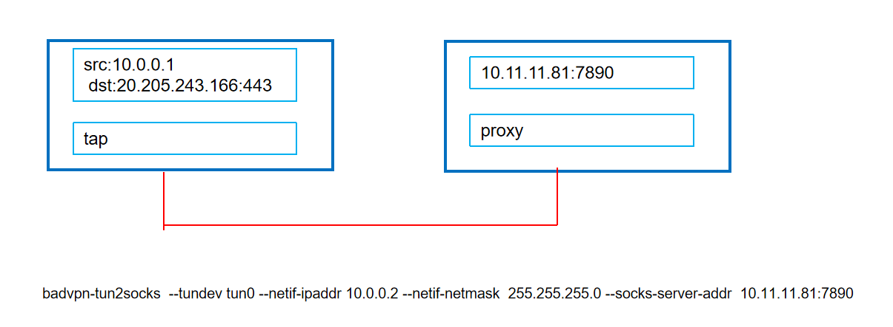
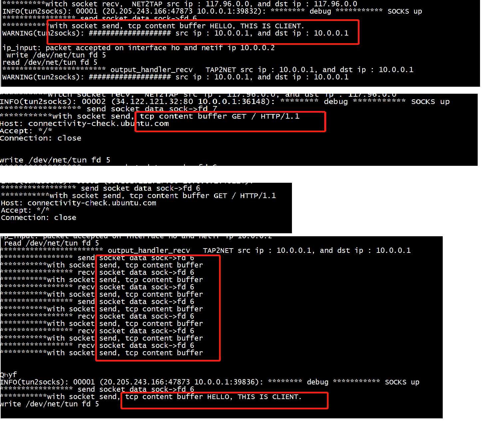
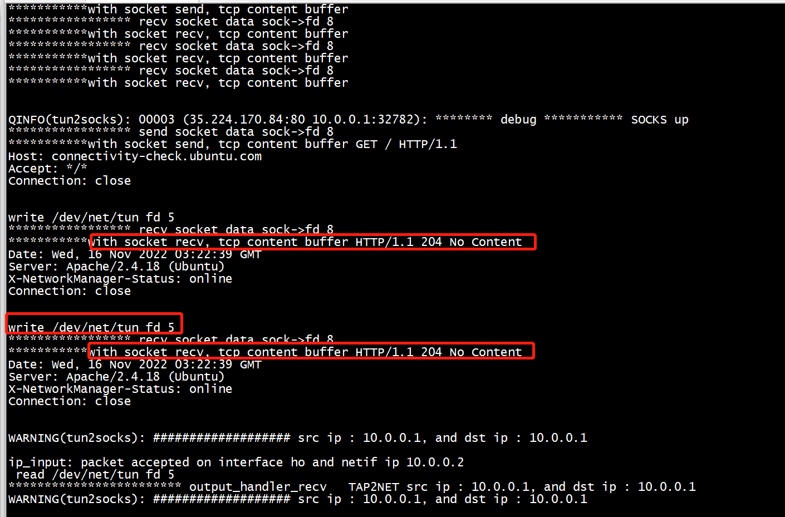
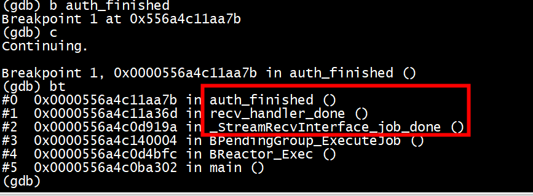

# build

```
[root@centos7 tun2socks]# pwd
/root/programming/kernel/badvpntest1/badvpn/build/tun2socks
[root@centos7 tun2socks]# make install -j16
```

# header file

```
./system/BAddr.h
```

# connect server

```
./install/bin/badvpn-tun2socks  --tundev tun0 --netif-ipaddr 10.0.0.2 --netif-netmask  255.255.255.0 --socks-server-addr  10.10.16.82:7000
```


#  ping 8.8.8.8

```
[root@centos7 ~]# route add  -host 8.8.8.8 gw  10.0.0.2 metric 6
[root@centos7 ~]# ping 8.8.8.8
PING 8.8.8.8 (8.8.8.8) 56(84) bytes of data.
^C
--- 8.8.8.8 ping statistics ---
2 packets transmitted, 0 received, 100% packet loss, time 1075ms

[root@centos7 ~]# ping  10.0.0.2
PING 10.0.0.2 (10.0.0.2) 56(84) bytes of data.
64 bytes from 10.0.0.2: icmp_seq=1 ttl=255 time=0.059 ms
64 bytes from 10.0.0.2: icmp_seq=2 ttl=255 time=0.026 ms
64 bytes from 10.0.0.2: icmp_seq=3 ttl=255 time=0.019 ms
^C
--- 10.0.0.2 ping statistics ---
3 packets transmitted, 3 received, 0% packet loss, time 2053ms
rtt min/avg/max/mdev = 0.019/0.034/0.059/0.018 ms

```

# debug
```
void device_read_handler_send (void *unused, uint8_t *data, int data_len)
{
    ASSERT(!quitting)
    ASSERT(data_len >= 0)

    BLog(BLOG_DEBUG, "device: received packet");
#if 1
    struct iphdr *iph;
    struct sockaddr_in src, dst;
    iph = (struct iphdr *)data;
    src.sin_addr.s_addr = iph->saddr;
    dst.sin_addr.s_addr = iph->daddr;
    BLog(BLOG_WARNING,"################### src ip : %s, and dst ip : %s  \n", inet_ntoa(src.sin_addr),  inet_ntoa(dst.sin_addr));
#endif

    // accept packet
    PacketPassInterface_Done(&device_read_interface);

    // process UDP directly
    if (process_device_udp_packet(data, data_len)) {
        return;
    }

    // obtain pbuf
    if (data_len > UINT16_MAX) {
        BLog(BLOG_WARNING, "device read: packet too large");
        return;
    }
    struct pbuf *p = pbuf_alloc(PBUF_RAW, data_len, PBUF_POOL);
    if (!p) {
        BLog(BLOG_WARNING, "device read: pbuf_alloc failed");
        return;
    }

    // write packet to pbuf
    ASSERT_FORCE(pbuf_take(p, data, data_len) == ERR_OK)

    // pass pbuf to input
    if (netif.input(p, &netif) != ERR_OK) {
        BLog(BLOG_WARNING, "device read: input failed");
        pbuf_free(p);
    }
}
```


```
[root@centos7 badvpn]# ./install/bin/badvpn-tun2socks  --tundev tun0 --netif-ipaddr 10.0.0.2 --netif-netmask  255.255.255.0 --socks-server-addr 127.0.0.1:1080 
NOTICE(tun2socks): initializing BadVPN tun2socks 1.999.128
NOTICE(tun2socks): entering event loop
WARNING(tun2socks): ###################   src ip : 8.8.8.8, and dst ip : 8.8.8.8  

WARNING(tun2socks): ###################   src ip : 8.8.8.8, and dst ip : 8.8.8.8  

WARNING(tun2socks): ###################   src ip : 8.8.8.8, and dst ip : 8.8.8.8  

WARNING(tun2socks): ###################   src ip : 8.8.8.8, and dst ip : 8.8.8.8  

WARNING(tun2socks): ###################   src ip : 8.8.8.8, and dst ip : 8.8.8.8  

^CNOTICE(tun2socks): termination requested
NOTICE(tun2socks): tearing down
NOTICE(tun2socks): exiting
[root@centos7 badvpn]# 
```
## 从tun接收

```
Breakpoint 1, 0x000055d1f3140921 in output_handler_recv ()
(gdb) bt
#0  0x000055d1f3140921 in output_handler_recv ()
#1  0x000055d1f313cf05 in _PacketRecvInterface_job_operation ()
#2  0x000055d1f31a4a5b in BPendingGroup_ExecuteJob ()
#3  0x000055d1f3139a06 in BReactor_Exec ()
#4  0x000055d1f311f2e2 in main ()
(gdb) c
```

```
(gdb) bt
#0  0x00005597b27249f1 in input_handler_done ()
#1  0x00005597b2725f94 in _PacketRecvInterface_job_done ()
#2  0x00005597b278da92 in BPendingGroup_ExecuteJob ()
#3  0x00005597b2722a06 in BReactor_Exec ()
#4  0x00005597b27082e2 in main ()
(gdb) 
```


```
static void output_handler_recv (PacketProtoEncoder *enc, uint8_t *data)
{
    ASSERT(!enc->output_packet)
    ASSERT(data)
    DebugObject_Access(&enc->d_obj);

    // schedule receive
    enc->output_packet = data;
    PacketRecvInterface_Receiver_Recv(enc->input, enc->output_packet + sizeof(struct packetproto_header));
}

static void input_handler_done (PacketProtoEncoder *enc, int in_len)
{
    ASSERT(enc->output_packet)
    DebugObject_Access(&enc->d_obj);

    // write length
    struct packetproto_header pp;
    pp.len = htol16(in_len);
    memcpy(enc->output_packet, &pp, sizeof(pp));

    // finish output packet
    enc->output_packet = NULL;
    PacketRecvInterface_Done(&enc->output, PACKETPROTO_ENCLEN(in_len));
}
```

## netif_add,接收 and 发送给tun

```
 Breakpoint 1, 0x000000000045151c in ip_input ()
(gdb) bt
#0  0x000000000045151c in ip_input ()
#1  0x0000000000414614 in netif_input_func ()
#2  0x0000000000413f24 in device_read_handler_send ()
#3  0x000000000042fcf8 in _PacketPassInterface_job_operation ()
#4  0x000000000049cfac in BPendingGroup_ExecuteJob ()
#5  0x000000000042d250 in BReactor_Exec ()
#6  0x0000000000412328 in main ()
(gdb)
```
##  BTap_Init2

```
(gdb) bt
#0  0x00000000004343c8 in BTap_Init2 ()
#1  0x00000000004343b4 in BTap_Init ()
#2  0x00000000004120cc in main ()
(gdb) 
```

##  BTap_Send

***telnet 8.8.8.8 22***

```
Breakpoint 1, 0x000000000043496c in BTap_Send ()
(gdb) bt
#0  0x000000000043496c in BTap_Send ()
#1  0x00000000004145c0 in common_netif_output ()
#2  0x00000000004144b4 in netif_output_func ()
#3  0x0000000000453774 in ip_output_if ()
#4  0x00000000004538a8 in ip_output ()
#5  0x0000000000442b54 in tcp_output_segment ()
#6  0x0000000000442484 in tcp_output ()
#7  0x000000000044950c in tcp_listen_input () // lwip 作为tcp proxy server ，接收syn 报文，向tun回复syn + ack.                                            
#8  0x0000000000448a58 in tcp_input ()        //同时向 ssr client发起connect
#9  0x00000000004531d8 in ip_input ()
#10 0x0000000000414744 in netif_input_func ()
#11 0x0000000000414054 in device_read_handler_send ()
#12 0x000000000042fe28 in _PacketPassInterface_job_operation ()
#13 0x000000000049f21c in BPendingGroup_ExecuteJob ()
#14 0x000000000042d380 in BReactor_Exec ()
#15 0x0000000000412458 in main ()
(gdb) c
Continuing.
Breakpoint 1, 0x000000000043eec0 in tcp_pcb_purge ()
(gdb) bt
#0  0x000000000043eec0 in tcp_pcb_purge ()
#1  0x000000000043f164 in tcp_pcb_remove ()
#2  0x000000000044a304 in tcp_input ()
#3  0x00000000004544fc in ip_input ()
#4  0x0000000000414744 in netif_input_func ()
#5  0x0000000000414054 in device_read_handler_send ()
#6  0x000000000042fe28 in _PacketPassInterface_job_operation ()
#7  0x00000000004a0540 in BPendingGroup_ExecuteJob ()
#8  0x000000000042d380 in BReactor_Exec ()
#9  0x0000000000412458 in main ()
(gdb) 
```


#  epoll 

```
(gdb) bt
#0  0x0000ffffbe6bfa80 in epoll_ctl () from /lib64/libc.so.6
#1  0x000000000042d954 in BReactor_AddFileDescriptor ()
#2  0x0000000000427c84 in BUnixSignal_Init ()
#3  0x0000000000423504 in BSignal_Init ()
#4  0x0000000000411f4c in main ()
(gdb) c
Continuing.

Breakpoint 1, 0x0000ffffbe6bfa80 in epoll_ctl () from /lib64/libc.so.6
(gdb) bt
#0  0x0000ffffbe6bfa80 in epoll_ctl () from /lib64/libc.so.6
#1  0x000000000042dbb0 in BReactor_SetFileDescriptorEvents ()
#2  0x0000000000427cbc in BUnixSignal_Init ()
#3  0x0000000000423504 in BSignal_Init ()
#4  0x0000000000411f4c in main ()
(gdb) c
Continuing.

Breakpoint 1, 0x0000ffffbe6bfa80 in epoll_ctl () from /lib64/libc.so.6
(gdb) bt
#0  0x0000ffffbe6bfa80 in epoll_ctl () from /lib64/libc.so.6
#1  0x000000000042d954 in BReactor_AddFileDescriptor ()
#2  0x0000000000434678 in BTap_Init2 ()
#3  0x0000000000434284 in BTap_Init ()
#4  0x0000000000411f9c in main ()
(gdb) c
(gdb) bt
#0  0x0000ffffbe6bfa80 in epoll_ctl () from /lib64/libc.so.6
#1  0x000000000042d954 in BReactor_AddFileDescriptor ()
#2  0x000000000048aa30 in BConnector_Init ()
#3  0x0000000000478078 in BSocksClient_Init ()
#4  0x0000000000414a74 in listener_accept_func ()
#5  0x0000000000448f28 in tcp_process ()
#6  0x0000000000447ee4 in tcp_input ()
#7  0x0000000000451994 in ip_input ()
#8  0x0000000000414614 in netif_input_func ()
#9  0x0000000000413f24 in device_read_handler_send ()
#10 0x000000000042fcf8 in _PacketPassInterface_job_operation ()
#11 0x000000000049cfec in BPendingGroup_ExecuteJob ()
#12 0x000000000042d250 in BReactor_Exec ()
#13 0x0000000000412328 in main ()
(gdb) 
```

## client_socks_handler
```
Breakpoint 1, 0x00000000004155e0 in client_socks_handler ()
(gdb) bt
#0  0x00000000004155e0 in client_socks_handler ()
#1  0x0000000000478f88 in report_error ()
#2  0x000000000047953c in connector_handler ()
#3  0x000000000048b884 in connector_fd_handler ()
#4  0x000000000042d648 in BReactor_Exec ()
#5  0x0000000000412458 in main ()
(gdb) 
(gdb) bt
#0  0x00000000004894ac in connector_fd_handler ()
#1  0x000000000042d518 in BReactor_Exec ()
#2  0x0000000000412328 in main ()
(gdb)
```

##  connection_send_if_handler_send

```
 StreamPassInterface_Init(&o->send.iface, (StreamPassInterface_handler_send)connection_send_if_handler_send, o, BReactor_PendingGroup(o->reactor));
```

```
(gdb) bt
#0  0x0000560bda56875f in connection_send_if_handler_send ()
#1  0x0000560bda51470d in _StreamPassInterface_job_operation ()
#2  0x0000560bda57b8b9 in BPendingGroup_ExecuteJob ()
#3  0x0000560bda510a06 in BReactor_Exec ()
#4  0x0000560bda4f62e2 in main ()
(gdb) bt
#0  0x0000559504aa845e in StreamPassInterface_Init ()
#1  0x0000559504aae172 in BConnection_SendAsync_Init ()
#2  0x0000559504a99472 in init_control_io ()
#3  0x0000559504a998a4 in connector_handler ()
#4  0x0000559504aabc40 in connector_fd_handler ()
#5  0x0000559504a54caf in BReactor_Exec ()
#6  0x0000559504a3a2e2 in main ()
(gdb) q
```

## 创建socket and send

```

int BConnector_Init (BConnector *o, BAddr addr, BReactor *reactor, void *user,
                     BConnector_handler handler)
{
    ASSERT(handler)
    BNetwork_Assert();

    // init arguments
    o->reactor = reactor;
    o->user = user;
    o->handler = handler;

    // check address
    if (!BConnection_AddressSupported(addr)) {
        BLog(BLOG_ERROR, "address not supported");
        goto fail0;
    }

    // convert address
    struct sys_addr sysaddr;
    addr_socket_to_sys(&sysaddr, addr);

    // init job
    BPending_Init(&o->job, BReactor_PendingGroup(o->reactor), (BPending_handler)connector_job_handler, o);

    // init fd
    if ((o->fd = socket(sysaddr.addr.generic.sa_family, SOCK_STREAM, 0)) < 0) {
        BLog(BLOG_ERROR, "socket failed");
        goto fail1;
    }

    // set fd non-blocking
    if (!badvpn_set_nonblocking(o->fd)) {
        BLog(BLOG_ERROR, "badvpn_set_nonblocking failed");
        goto fail2;
    }

    // connect fd
    int res = connect(o->fd, &sysaddr.addr.generic, sysaddr.len);
    struct sockaddr_in *mysock = &sysaddr.addr.generic;
    BLog(BLOG_ERROR, "************* connect server %s: %d \n", inet_ntoa(mysock->sin_addr),  ntohs(mysock->sin_port));
```


```
static void connection_send (BConnection *o)
{
    DebugError_AssertNoError(&o->d_err);
    ASSERT(o->send.state == SEND_STATE_BUSY)

    // limit
    if (!o->is_hupd) {
        if (!BReactorLimit_Increment(&o->send.limit)) {
            // wait for fd
            o->wait_events |= BREACTOR_WRITE;
            BReactor_SetFileDescriptorEvents(o->reactor, &o->bfd, o->wait_events);
            return;
        }
    }

    printf("***************** send data sock->fd %d \n", o->fd);
    test_tun_packet(o->send.busy_data);
    // send
    int bytes = write(o->fd, o->send.busy_data, o->send.busy_data_len);
    if (bytes < 0) {
        if (!o->is_hupd && (errno == EAGAIN || errno == EWOULDBLOCK)) {
            // wait for fd
            o->wait_events |= BREACTOR_WRITE;
            BReactor_SetFileDescriptorEvents(o->reactor, &o->bfd, o->wait_events);
            return;
        }

        BLog(BLOG_ERROR, "send failed");
        connection_report_error(o);
        return;
    }

    ASSERT(bytes > 0)
    ASSERT(bytes <= o->send.busy_data_len)

    // set ready
    o->send.state = SEND_STATE_READY;

    // done
    StreamPassInterface_Done(&o->send.iface, bytes);
}
```


### connection_send 



connection_send  发送的是tcp协议层以上的内容

```
root@ubuntux86:/work/test# ./client 
[+]TCP server socket created.
bind interface success 
Connected to the server.
Client: HELLO, THIS IS CLIENT.
Server: 
```



```
(gdb) bt
#0  0x000055ee57329f9a in connection_send ()
#1  0x000055ee5732a83d in connection_send_if_handler_send ()
#2  0x000055ee572d670d in _StreamPassInterface_job_operation ()
#3  0x000055ee5733d8b9 in BPendingGroup_ExecuteJob ()
#4  0x000055ee572d2a06 in BReactor_Exec ()
#5  0x000055ee572b82e2 in main ()
(gdb) b connection_recv
Breakpoint 2 at 0x55ee5732a1d4
(gdb) c
Continuing.

Breakpoint 2, 0x000055ee5732a1d4 in connection_recv ()
(gdb) bt
#0  0x000055ee5732a1d4 in connection_recv ()
#1  0x000055ee5732a91e in connection_recv_if_handler_recv ()
#2  0x000055ee572d6f15 in _StreamRecvInterface_job_operation ()
#3  0x000055ee5733d8b9 in BPendingGroup_ExecuteJob ()
#4  0x000055ee572d2a06 in BReactor_Exec ()
#5  0x000055ee572b82e2 in main ()
(gdb) q
```


***int bytes = write(o->fd, o->send.busy_data, o->send.busy_data_len);***


### connection_recv 

connection_recv  接收送的是tcp协议层以上的内容



### send_handler_done
```
(gdb) c
Continuing.

Breakpoint 1, 0x000055dabc3b7651 in StreamRecvInterface_Receiver_Recv ()
(gdb) bt
#0  0x000055dabc3b7651 in StreamRecvInterface_Receiver_Recv ()
#1  0x000055dabc3ba92d in do_receive ()
#2  0x000055dabc3ba890 in start_receive ()
#3  0x000055dabc3bb4a9 in send_handler_done ()
#4  0x000055dabc378760 in _PacketPassInterface_job_done ()
#5  0x000055dabc3e0a92 in BPendingGroup_ExecuteJob ()
#6  0x000055dabc375a06 in BReactor_Exec ()
#7  0x000055dabc35b2e2 in main ()
(gdb) 


void send_handler_done (BSocksClient *o)
{
    DebugObject_Access(&o->d_obj);
    ASSERT(o->buffer)

    switch (o->state) {
        case STATE_SENDING_HELLO: {
            BLog(BLOG_DEBUG, "sent hello");

            // allocate buffer for receiving hello
            bsize_t size = bsize_fromsize(sizeof(struct socks_server_hello));
            if (!reserve_buffer(o, size)) {
                goto fail;
            }

            // receive hello
            start_receive(o, (uint8_t *)o->buffer, size.value);

            // set state
            o->state = STATE_SENT_HELLO;
        } break;

        case STATE_SENDING_REQUEST: {
            BLog(BLOG_DEBUG, "sent request");

            // allocate buffer for receiving reply
            bsize_t size = bsize_add(
                bsize_fromsize(sizeof(struct socks_reply_header)),
                bsize_max(bsize_fromsize(sizeof(struct socks_addr_ipv4)), bsize_fromsize(sizeof(struct socks_addr_ipv6)))
            );
            if (!reserve_buffer(o, size)) {
                goto fail;
            }

            // receive reply header
            start_receive(o, (uint8_t *)o->buffer, sizeof(struct socks_reply_header));

            // set state
            o->state = STATE_SENT_REQUEST;
        } break;

        case STATE_SENDING_PASSWORD: {
            BLog(BLOG_DEBUG, "send password");

            // allocate buffer for receiving reply
            bsize_t size = bsize_fromsize(2);
            if (!reserve_buffer(o, size)) {
                goto fail;
            }

            // receive reply header
            start_receive(o, (uint8_t *)o->buffer, size.value);

            // set state
            o->state = STATE_SENT_PASSWORD;
        } break;

        default:
            ASSERT(0);
    }

    return;

fail:
    report_error(o, BSOCKSCLIENT_EVENT_ERROR);
}

```

##  udpgw-remote-server-addr
```
[root@centos7 badvpn]#  ./install/bin/badvpn-tun2socks  --tundev tun0 --netif-ipaddr 10.0.0.2 --netif-netmask  255.255.255.0 --socks-server-addr 127.0.0.1:1080  --udpgw-remote-server-addr 10.10.16.82:8700
NOTICE(tun2socks): initializing BadVPN tun2socks 1.999.128
NOTICE(tun2socks): entering event loop
INFO(lwip): netif_set_ipaddr: netif address being changed

INFO(lwip): netif: IP address of interface 
INFO(lwip): netif: netmask of interface 
INFO(lwip): netif: GW address of interface 
INFO(lwip): netif: added interface ho IP addr 
INFO(lwip): 10.0.0.2
INFO(lwip):  netmask 
INFO(lwip): 255.255.255.0
INFO(lwip):  gw 
INFO(lwip): 0.0.0.0
INFO(lwip): 

INFO(lwip): netif: setting default interface ho

ERROR(BConnection): connection failed
ERROR(BSocksClient): connection failed
INFO(SocksUdpGwClient): SOCKS error
ERROR(BConnection): connection failed
ERROR(BSocksClient): connection failed
INFO(SocksUdpGwClient): SOCKS error
^CNOTICE(tun2socks): termination requested
NOTICE(tun2socks): tearing down
INFO(lwip): netif: setting default interface ''

INFO(lwip): netif_remove: removed netif

NOTICE(tun2socks): exiting
[root@centos7 badvpn]# 
```
```
(gdb) bt
#0  0x000000000047a0c8 in BSocksClient_Init ()
#1  0x000000000041ea08 in try_connect ()
#2  0x000000000041ef7c in SocksUdpGwClient_Init ()
#3  0x0000000000412328 in main ()
(gdb) 
```


# tcp send

```
(gdb) bt
#0  0x0000556923856f0d in client_socks_recv_send_out ()
#1  0x0000556923856ee6 in client_socks_recv_handler_done ()
#2  0x0000556923871fc4 in _StreamRecvInterface_job_done ()
#3  0x00005569238d8ca0 in BPendingGroup_ExecuteJob ()
#4  0x000055692386da26 in BReactor_Exec ()
#5  0x0000556923853302 in main ()
(gdb) b  tcp_write
Breakpoint 2 at 0x556923880a07
(gdb) b  tcp_output
Breakpoint 3 at 0x556923881921
(gdb) c
Continuing.

Breakpoint 2, 0x0000556923880a07 in tcp_write ()
(gdb) bt
#0  0x0000556923880a07 in tcp_write ()
#1  0x00005569238570bc in client_socks_recv_send_out ()
#2  0x0000556923856ee6 in client_socks_recv_handler_done ()
#3  0x0000556923871fc4 in _StreamRecvInterface_job_done ()
#4  0x00005569238d8ca0 in BPendingGroup_ExecuteJob ()
#5  0x000055692386da26 in BReactor_Exec ()
#6  0x0000556923853302 in main ()
(gdb) c
Continuing.

Breakpoint 3, 0x0000556923881921 in tcp_output ()
(gdb) bt
#0  0x0000556923881921 in tcp_output ()
#1  0x000055692385716c in client_socks_recv_send_out ()
#2  0x0000556923856ee6 in client_socks_recv_handler_done ()
#3  0x0000556923871fc4 in _StreamRecvInterface_job_done ()
#4  0x00005569238d8ca0 in BPendingGroup_ExecuteJob ()
#5  0x000055692386da26 in BReactor_Exec ()
#6  0x0000556923853302 in main ()
(gdb) c
Continuing.

Breakpoint 3, 0x0000556923881921 in tcp_output ()
(gdb) bt
#0  0x0000556923881921 in tcp_output ()
#1  0x0000556923887680 in tcp_input ()
#2  0x00005569238901cf in ip_input ()
#3  0x00005569238555ad in netif_input_func ()
#4  0x0000556923854d88 in device_read_handler_send ()
#5  0x0000556923870615 in _PacketPassInterface_job_operation ()
#6  0x00005569238d8ca0 in BPendingGroup_ExecuteJob ()
#7  0x000055692386da26 in BReactor_Exec ()
#8  0x0000556923853302 in main ()
(gdb) q
```


# udpgw-remote-server-addr

```
[root@centos7 badvpn]# route add  -host 10.10.16.82 gw  10.0.0.2 metric 6
[root@centos7 badvpn]#  ./install/bin/badvpn-tun2socks  --tundev tun0 --netif-ipaddr 10.0.0.2 --netif-netmask  255.255.255.0 --socks-server-addr 127.0.0.1:1080  --udpgw-remote-server-addr 10.10.16.82:8700
```

badvpn的tun2socks加上了选项***--socks5-udp，以支持直接将tun设备的udp数据包通过sock5代理直接发送。以前是封装为tcp数据包，然后发送给--udpgw-remote-server-addr指定的地址。然后udpgw程序再使用udp发向源服务器，并将接收的包转发回tun设备***。

SocksUdpClient
在main函数中就根据命令行的模式不同，然后调用SocksUdpClient_Init对全局的socks_udp_client进行初使化。

socks_udp_client 使用平衡树来管理与sock5服务器的连接。

udp数据处理流程
在tun2socks.c的process_device_udp_packet函数中对接收到的设备发送的udp数据进行处理转发。
根据udp的模式调用udpgw或udp通道：
```
    // submit packet to udpgw or SOCKS UDP
    if (udp_mode == UdpModeUdpgw) {
        SocksUdpGwClient_SubmitPacket(&udpgw_client, local_addr, remote_addr,
                                      is_dns, data, data_len);
    } else if (udp_mode == UdpModeSocks) {
        SocksUdpClient_SubmitPacket(&socks_udp_client, local_addr, remote_addr, data, data_len);
    }
```
在SocksUdpClient_SubmitPacket中在socks_udp_client 树里根据地址查找连接find_connection(o, local_addr),如果没有查找到就调用 connection_init,查找到了就调用connection_send发送数据。

***connection_init流程***

**1)** 分配SocksUdpClient_connection对象con，并初使化

**2)** 拷贝第一块数据，并设置first_job_handler为第一执行函数。

**3)** BDatagram_Init初使化一个udp socket： con->socket

**4)** 调用BSocksClient_Init分配和初使化socks5连接(con->socks)，并设置状态回调：socks_state_handler

**5)** 添加不活跃监视回调：send_monitor_handler

**6)** 添加接收数据回调：recv_if_handler_send

**7)** 然后在BReactor_Exec执行循环中执行了在connection_init里设置的BPendingGroup_ExecuteJob和first job。即first_job_handler，***在first_job_handler里调用connection_send函数***。

**connection_send流程**

connection_send 组成一个udp socks5数据包。使用BufferWriter_EndPacket写入发送队列。

socks状态回调 socks_state_handler
第一个connection_send调用后，会触发socks_state_handler，在这里进行地址的转换，以及连接错误后释放资源。


## SocksUdpGwClient_SubmitPacket
```
 ./install/bin/badvpn-tun2socks  --tundev tun0 --netif-ipaddr 10.0.0.2 --netif-netmask  255.255.255.0 --socks-server-addr  10.11.11.81:7890   --udpgw-remote-server-addr 10.11.11.81:7890
```

```
(gdb) bt
#0  0x000055cfdaf8fd41 in UdpGwClient_SubmitPacket ()
#1  0x000055cfdaf32f60 in SocksUdpGwClient_SubmitPacket ()
#2  0x000055cfdaf281ff in process_device_udp_packet ()
#3  0x000055cfdaf27c95 in device_read_handler_send ()
#4  0x000055cfdaf435f5 in _PacketPassInterface_job_operation ()
#5  0x000055cfdafabaf8 in BPendingGroup_ExecuteJob ()
#6  0x000055cfdaf40a06 in BReactor_Exec ()
#7  0x000055cfdaf262e2 in main ()
(gdb) q
```

# sock5 协议


 # references

[ANDROID: BADVPN中使用的LWIP的版本及TUN2SOCKS工作原理](https://www.brobwind.com/archives/1401)

[使用 TUN 的模式](https://zu1k.com/posts/coding/tun-mode/)