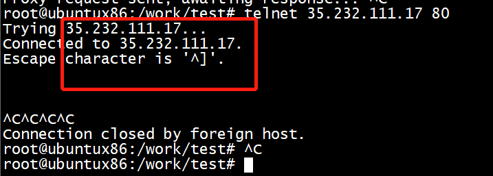

# demo1


## ubuntu

```
root@ubuntux86:/work/test# ip tuntap add dev  tun0 mode tun
root@ubuntux86:/work/test# ifconfig tun0 10.0.0.1 netmask 255.255.255.0
./install/bin/badvpn-tun2socks  --tundev tun0 --netif-ipaddr 10.0.0.2 --netif-netmask  255.255.255.0 --socks-server-addr  10.11.11.81:7890
```


```
root@ubuntux86:/work/test# ping www.github.com
PING github.com (20.205.243.166) 56(84) bytes of data.
^C
--- github.com ping statistics ---
1 packets transmitted, 0 received, 100% packet loss, time 0ms

root@ubuntux86:/work/test# route add -host  20.205.243.166  gw 10.0.0.2 metric 6
root@ubuntux86:/work/test# wget https://github.com/magnate3/linux-riscv-dev/tree/main/exercises/users/badvpn/tun2socks/demo
--2022-11-16 09:59:39--  https://github.com/magnate3/linux-riscv-dev/tree/main/exercises/users/badvpn/tun2socks/demo
Connecting to 10.11.11.81:7890... connected.
Proxy request sent, awaiting response... 200 OK
Length: unspecified [text/html]
Saving to: ‘demo’
```


```
ip_input: packet accepted on interface ho and netif ip 10.0.0.2 
 ********* local addr 35.232.111.17:80 remote addr 10.0.0.1:46098 ********** 
ERROR(BConnection): ************* connect server sock->fd 6,  10.11.11.81: 7890 

INFO(tun2socks): 00001 (35.232.111.17:80 10.0.0.1:46098): accepted
read /dev/net/tun fd 5 
```


tcpdump -i enx00e04c3600d7 tcp and port  7890  -w vpn.pcap


## pc


## result


#  shadowsocks-libev 
shadowsocks-libev 包括服务端和客户端两部分，一共三个模块。

ss-server：服务器端，部署在远程服务器，提供 shadowsocks 服务。

ss-local：客户端，提供本地 socks5 协议代理。

ss-redir：客户端，提供本地透明代理，需要与 NAT 配合使用，具体使用方法参见文档。

*1)* Start a shadowsocks server if you don't have one set already ss-server -p 6276 -k password. The IP address of this server is going to be $server_ip from now on.

*2)* Install the shadowsocks-libev package. This will provide you with all the shadowsocks utilities and will set up your local proxy connected to the shadowsocks server.

*3)* Install badvpn-tun2socks. This application will tunnel all your data using a Tun network interface in Linux. To install it clone their repository https://github.com/ambrop72/badvpn and follow the compile and install instructions here.

*4)* Now, let's create a new tun network interface ip tuntap add dev tun0 mode tun user my_user, add an IP address to it ip a add 10.0.0.1/24 dev tun0, and bring the interface up ip link set dev tun0 up.

*5)* Connect to our shadowsocks server ss-local -s $server_ip -p 6276 -k password -l 1080 and give it a try curl --socks5 socks5://localhost:1080 https://myip.wtf/json. If it shows your server IP address it means it's working.

*6)* Start badvpn-tun2socks to start tunneling the data sent to tun0 to the socks proxy badvpn-tun2socks --tundev tun0 --netif-ipaddr 10.0.0.2 --netif-netmask 255.255.255.0 --socks-server-addr 127.0.0.1:1080. After this point you should be able to ping the virtual gateway ping 10.0.0.2 with successful results.

*7)* Add a network route to guarantee your socks proxy is still going to connect using your default gateway ip r a $server_ip via $default_gateway

*8)* Add a default route with a metric lower than the one provided by NetworkManager for your default gateway ip r a default via 10.0.0.2 metric 10 And this is it. After this point, all the connections on your Linux machine are routed to the tun0 interface and therefore to the socks proxy. Do a quick curl https://myip.wtf/json to check that you are in the location where your shadowsocks server is and enjoy another cup of coffee.

```
{
    "server":"your_server_ip",
    "mode":"tcp_and_udp",
    "server_port":your_server_port,
    "local_port":1080,
    "password":"your_server_password",
    "timeout":300,
    "method":"your_crypt_method"
}
```

## 依赖

```
apt install --no-install-recommends build-essential autoconf libtool libssl-dev gawk debhelper dh-systemd init-system-helpers pkg-config asciidoc xmlto apg libpcre3-dev zlib1g-dev libev-dev libudns-dev libsodium-dev libmbedtls-dev libc-ares-dev automake
```

## 编译


```
sudo apt install git
git clone https://github.com/shadowsocks/shadowsocks-libev.git
cd shadowsocks-libev
git submodule update --init
./autogen.sh && ./configure --disable-documentation && make
sudo make install
```

## 启动 server

```
 cat /etc/shadowsocks-libev/config.json
{
"server":"0.0.0.0",
"server_port":8388,
"local_port":1080,
"password":"mypassword",
"timeout":300,
"method":"aes-256-gcm" ,
"fast_open": false
}

cat /etc/systemd/system/shadowsocks-libev.service
[Unit]
Description=Shadowsocks-libev Server
After=network.target

[Service]
Type=simple
ExecStart=/usr/local/bin/ss-server -c /etc/shadowsocks-libev/config.json -u
Restart=on-abort

[Install]
WantedBy=multi-user.target
```

```
sudo systemctl start shadowsocks-libev
sudo systemctl enable shadowsocks-libev
```

## client


```
cat ss-local-config.json
{
        "server": "45.80.208.61",
        "server_port": 443,
        "local_address": "127.0.0.1",
        "local_port": 1080,
        "password": "5aa4Z4v5f2w",
        "timout": 300,
        "method":"chacha20-ietf-poly1305",
        "fast_open": false
}
```

```
/usr/local/bin/ss-local -c ss-local-config.json 
```

# curl -s --socks5 127.0.0.1:1080 google.com


```
$ curl -s --socks5 127.0.0.1:1080 google.com
<HTML><HEAD><meta http-equiv="content-type" content="text/html;charset=utf-8">
<TITLE>301 Moved</TITLE></HEAD><BODY>
<H1>301 Moved</H1>
The document has moved
<A HREF="http://www.google.com/">here</A>.
</BODY></HTML>

86135@LAPTOP-BA80NAF0 MINGW64 ~
$

```

# references

[CentOS7下编译安装Shadowsocks-libev](https://www.lexsion.com/index.php/archives/168/)

[Tun2socks 的配置与基于 iptables + ipset 的国内流量分流](https://danglingpointer.fun/2022/07/24/Tun2socks/)