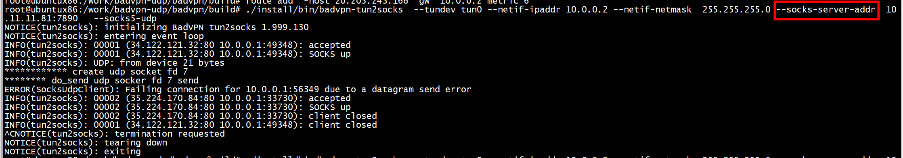
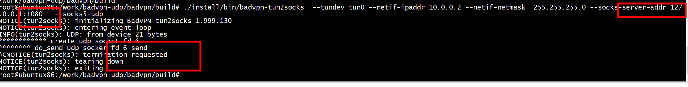
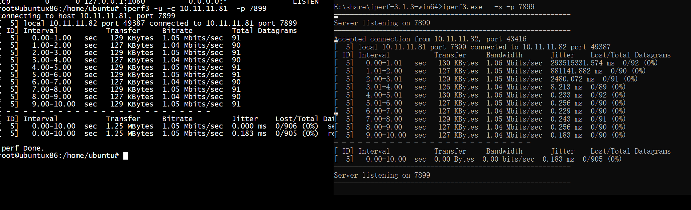
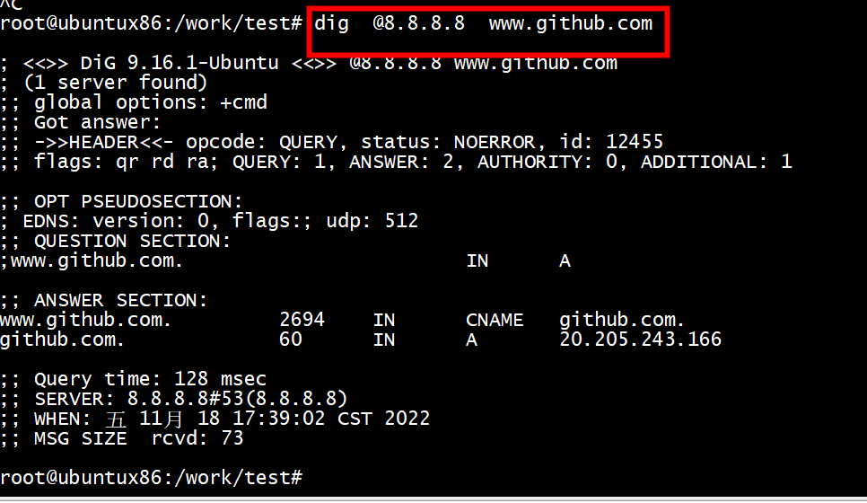

# --socks5-udp

[This change adds a new option](https://github.com/ambrop72/badvpn/pull/71), --socks5-udp. If this option is
present, and no UDP gateway is specified, UDP packets will no
longer be dropped. Instead, the client will use the SOCKS5
UDP ASSOCIATE command to route UDP packets through the proxy
server.

This implementation is intended for use with any UDP data, and it
includes an optimization for packets containing DNS queries.
However, this implementation is currently limited to localhost
SOCKS5 servers. SOCKS5-UDP does not perform well over actual
network links, as it requires several roundtrips to the server and
is not compatible with NAT.

This implementation is currently in use in a fork of tun2socks used
by Outline (https://getoutline.org) and Intra (https://getintra.org).

##  remote  SOCKS5 servers



```
root@ubuntux86:/work/badvpn-udp/badvpn/build# ./install/bin/badvpn-tun2socks  --tundev tun0 --netif-ipaddr 10.0.0.2 --netif-netmask  255.255.255.0 --socks-server-addr  10.11.11.81:7890   --socks5-udp
NOTICE(tun2socks): initializing BadVPN tun2socks 1.999.130
NOTICE(tun2socks): entering event loop
```

```
int process_device_udp_packet (uint8_t *data, int data_len)
{
            // construct addresses
#if 1
            BAddr_InitIPv4(&local_addr, inet_addr("10.11.11.82"), udp_header.source_port);
#else
            BAddr_InitIPv4(&local_addr, ipv4_header.source_address, udp_header.source_port);
#endif
}
static void do_send (BDatagram *o)
{
            memset(cmsg, 0, CMSG_SPACE(sizeof(struct in_pktinfo)));
            cmsg->cmsg_level = IPPROTO_IP;
            cmsg->cmsg_type = IP_PKTINFO;
            cmsg->cmsg_len = CMSG_LEN(sizeof(struct in_pktinfo));
            struct in_pktinfo *pktinfo = (struct in_pktinfo *)CMSG_DATA(cmsg);
            //pktinfo->ipi_spec_dst.s_addr =  inet_addr("10.11.11.81");
            pktinfo->ipi_spec_dst.s_addr = sysaddr.addr.ipv4.sin_addr.s_addr ;
            //pktinfo->ipi_spec_dst.s_addr = o->send.local_addr.ipv4;
            print_in_pktinfo(pktinfo);
            controllen += CMSG_SPACE(sizeof(struct in_pktinfo));
}

```

## localhost  SOCKS5 servers




## iperf



# support udp

```
git clone https://github.com/bemasc/badvpn.git
git branch --all
git checkout remotes/origin/bemasc-udp
```

```
root@ubuntux86:/work/badvpn-udp/badvpn# rm -rf build
root@ubuntux86:/work/badvpn-udp/badvpn# mkdir build
root@ubuntux86:/work/badvpn-udp/badvpn# cd build
root@ubuntux86:/work/badvpn-udp/badvpn/build# cmake .. -DCMAKE_INSTALL_PREFIX=/work/badvpn-udp/badvpn/build/install
```


```
ip tuntap add dev  tun0 mode tun
ifconfig tun0 10.0.0.1 netmask 255.255.255.0
route add  -host 20.205.243.166  gw  10.0.0.2 metric 6

```


## udp datagram_state_handler

```
 Breakpoint 1, 0x000056291e972239 in datagram_state_handler ()
(gdb) bt
#0  0x000056291e972239 in datagram_state_handler ()
#1  0x000056291e98afa1 in report_error ()
#2  0x000056291e98b3e6 in do_send ()
#3  0x000056291e98bd8f in send_job_handler ()
#4  0x000056291e99fe0a in BPendingGroup_ExecuteJob ()
#5  0x000056291e8fbba3 in BReactor_Exec ()
#6  0x000056291e8dcebd in main ()
(gdb) 
 
```

## udp bind socket


```
Breakpoint 2, 0x00005647c715d5bf in BDatagram_Bind ()
(gdb) bt
#0  0x00005647c715d5bf in BDatagram_Bind ()
#1  0x00005647c7143a63 in connection_init ()
#2  0x00005647c71447fc in SocksUdpClient_SubmitPacket ()
#3  0x00005647c70aff5d in process_device_udp_packet ()
#4  0x00005647c70af97b in device_read_handler_send ()
#5  0x00005647c70cf7fc in _PacketPassInterface_job_operation ()
#6  0x00005647c7170ee7 in BPendingGroup_ExecuteJob ()
#7  0x00005647c70ccc0d in BReactor_Exec ()
#8  0x00005647c70adf1d in main ()
(gdb) 
```

## udp connect server
```
Breakpoint 1, __libc_connect (fd=7, addr=..., len=16) at ../sysdeps/unix/sysv/linux/connect.c:24
24      ../sysdeps/unix/sysv/linux/connect.c: No such file or directory.
(gdb) bt
#0  __libc_connect (fd=7, addr=..., len=16) at ../sysdeps/unix/sysv/linux/connect.c:24
#1  0x00005573990c61b0 in BConnector_InitFrom ()
#2  0x00005573990becad in BConnector_Init ()
#3  0x00005573990a17cd in BSocksClient_Init ()
#4  0x00005573990b4bc3 in connection_init ()
#5  0x00005573990b583a in SocksUdpClient_SubmitPacket ()
#6  0x0000557399020f5d in process_device_udp_packet ()
#7  0x000055739902097b in device_read_handler_send ()
#8  0x00005573990407fc in _PacketPassInterface_job_operation ()
#9  0x00005573990e4ba6 in BPendingGroup_ExecuteJob ()
#10 0x000055739903dc0d in BReactor_Exec ()
#11 0x000055739901ef1d in main ()
(gdb) 
```

# dig

```
route add  -host 8.8.8.8  gw  10.0.0.2 metric 6
route add  -host 121.43.154.9  gw  10.0.0.2 metric 6
 
dig  @8.8.8.8  www.github.com
```



# udp test


# references

[create a TUN device to route TCP traffic through a SOCKS server](https://xusheng.org/blog/2019/08/20/create-a-tun-device-to-route-tcp-traffic-through-a-socks-server/)